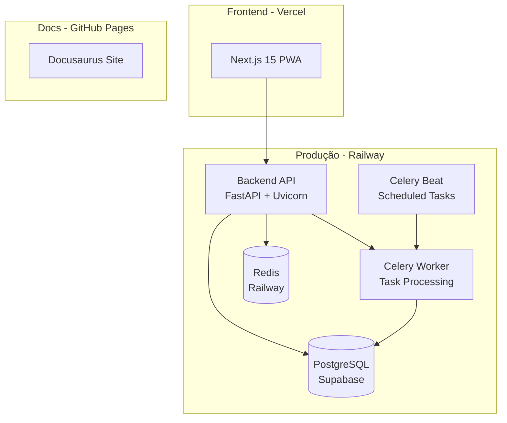
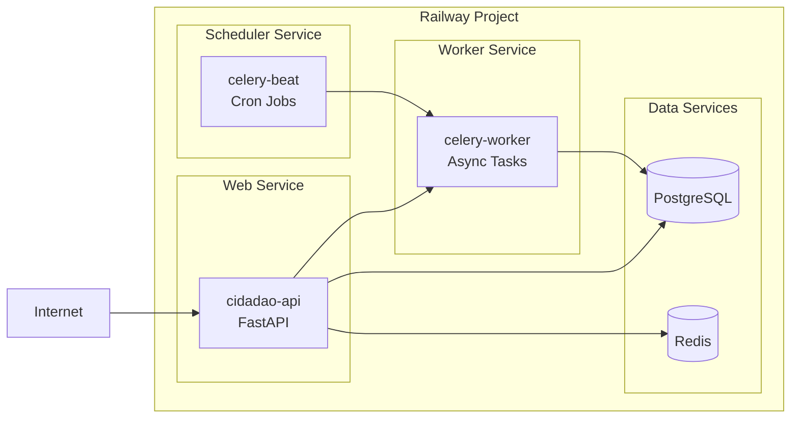
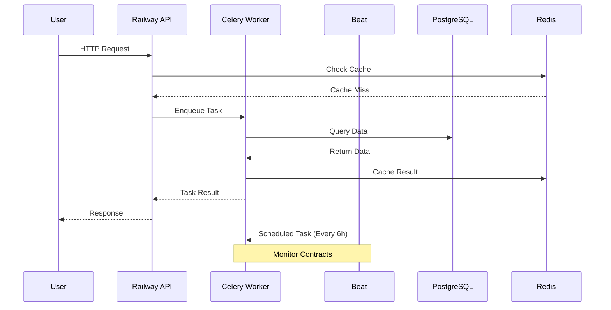
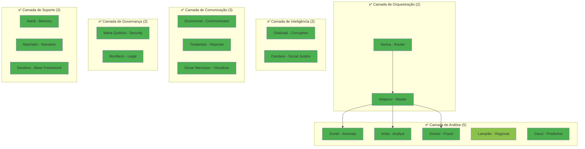

# 🗺️ ROADMAP DE ATUALIZAÇÃO DA DOCUMENTAÇÃO TÉCNICA

**Projeto**: Cidadão.AI Technical Docs (Docusaurus)
**Autor**: Anderson Henrique da Silva
**Deadline**: 30 de Novembro de 2024
**Início**: 15 de Outubro de 2024
**Tempo disponível**: ~45 dias úteis

---

## 📊 RESUMO EXECUTIVO

### Status Atual
- ✅ Backend: **18 agentes** (94.4% operacionais) + Railway deployment
- ❌ Docusaurus: Menciona **17 agentes** (47% funcionais) + HuggingFace deployment
- 📉 Gap total: **~215KB** de documentação faltando ou desatualizada
- 🚨 Crítico: Infraestrutura HuggingFace → Railway não documentada

### Objetivos
1. ✅ Documentar todos os **18 agentes** com detalhes completos
2. ✅ Atualizar arquitetura para **Railway deployment**
3. ✅ Adicionar **20+ diagramas Mermaid** explicativos
4. ✅ Expandir documentação de **85KB → 300KB+**
5. ✅ Criar documentação "próxima da versão final"

---

## 🎯 ORGANIZAÇÃO DO ROADMAP

### FASE 0: CRÍTICO - Infraestrutura & Deployment (Semana 1-2)
**Prioridade**: 🔴 MÁXIMA
**Tempo estimado**: 12-15 horas
**Deadline interno**: 25 de Outubro

### FASE 1: Agentes Ausentes (Semana 2-3)
**Prioridade**: 🟠 ALTA
**Tempo estimado**: 16-20 horas
**Deadline interno**: 5 de Novembro

### FASE 2: Agentes Desatualizados (Semana 3-4)
**Prioridade**: 🟠 ALTA
**Tempo estimado**: 12-15 horas
**Deadline interno**: 15 de Novembro

### FASE 3: Overviews & Navegação (Semana 4-5)
**Prioridade**: 🟡 MÉDIA
**Tempo estimado**: 8-10 horas
**Deadline interno**: 22 de Novembro

### FASE 4: Polimento & Diagramas (Semana 5-6)
**Prioridade**: 🟢 BAIXA
**Tempo estimado**: 10-12 horas
**Deadline interno**: 28 de Novembro

### FASE 5: Revisão Final & QA (Semana 6)
**Prioridade**: 🟡 MÉDIA
**Tempo estimado**: 4-6 horas
**Deadline interno**: 30 de Novembro

**Total estimado**: **62-78 horas** (~1.5-2 horas/dia)

---

## 📋 FASE 0: INFRAESTRUTURA & DEPLOYMENT (CRÍTICO)

### 🎯 Objetivo
Atualizar toda referência de HuggingFace → Railway e documentar nova arquitetura.

### 📝 Tarefas

#### 0.1 Atualizar `docs/intro.md` (2h)
- [ ] **Linha 32**: "17 agentes" → "**18 agentes (94.4% operacionais)**"
- [ ] **Linha 107**: Remover link HuggingFace, adicionar Railway
- [ ] **Linha 125**: "Deploy: ~~Hugging Face Spaces~~ **Railway Platform**"
- [ ] **Seção "Stack Tecnológica"**: Adicionar Celery + Beat + Railway
- [ ] Adicionar diagrama Mermaid: Arquitetura geral do ecossistema
- [ ] Atualizar métricas de performance (baseadas em Railway)

**Diagrama Mermaid a adicionar:**


---

#### 0.2 Reescrever `docs/deployment/deployment-guide.md` (4-5h)
- [ ] **Remover**: Seção HuggingFace Spaces (linhas 167-256) - 89 linhas
- [ ] **Adicionar**: Seção Railway deployment (portar do backend)
- [ ] **Adicionar**: Diagrama de arquitetura Railway multi-service
- [ ] **Manter**: Docker, AWS, GCP, Azure (já estão OK)
- [ ] **Adicionar**: Seção troubleshooting Railway-specific

**Estrutura nova:**
```markdown
## 🚂 Deploy no Railway (Produção Atual)

### 1. Setup Inicial Railway
### 2. Configurar Serviços
### 3. PostgreSQL + Redis Setup
### 4. Celery Worker + Beat
### 5. Variáveis de Ambiente
### 6. Deploy e Monitoramento
```

**Diagrama Mermaid a adicionar:**


---

#### 0.3 Criar `docs/deployment/railway-deployment.md` (NOVO!) (3-4h)
Portar conteúdo de `/backend/docs/deployment/migration-hf-to-railway.md`

**Estrutura:**
```markdown
# 🚂 Railway Deployment Guide

## Overview
## Prerequisites
## Quick Start
## Service Configuration
  - Web Service (API)
  - Worker Service (Celery)
  - Beat Service (Scheduler)
## Database Setup (PostgreSQL)
## Cache Setup (Redis)
## Environment Variables
## Monitoring & Logs
## Troubleshooting
## Cost Optimization
```

**Diagramas Mermaid a adicionar (3x):**
1. Service communication flow
2. Environment variables flow
3. Deployment pipeline

---

#### 0.4 Atualizar `docs/architecture/system-design.md` (2-3h)
- [ ] **Substituir**: "Kubernetes" → "Railway Platform"
- [ ] **Adicionar**: Seção "9.3 Railway Production Architecture"
- [ ] **Atualizar**: Deployment diagrams (linha 522+)
- [ ] **Adicionar**: Celery architecture diagram

**Diagrama Mermaid a adicionar:**


---

#### 0.5 Atualizar `docs/architecture/overview.md` (1h)
- [ ] Atualizar stack tecnológica
- [ ] Adicionar Railway como platform
- [ ] Mencionar Celery + Beat

---

#### 0.6 Buscar/Substituir Global (1h)
Substituir em TODOS os arquivos:
- [ ] `https://neural-thinker-cidadao-ai-backend.hf.space` → `https://cidadao-api-production.up.railway.app`
- [ ] "HuggingFace Spaces" → "Railway Platform"
- [ ] "Docker SDK" → "Railway Services" (onde aplicável)

**Script de busca:**
```bash
# Encontrar todas as menções
grep -r "huggingface\|hf\.space" docs/
grep -r "neural-thinker" docs/
```

---

### ✅ Checklist FASE 0
- [ ] `docs/intro.md` atualizado (18 agentes, Railway)
- [ ] `docs/deployment/deployment-guide.md` reescrito
- [ ] `docs/deployment/railway-deployment.md` criado
- [ ] `docs/architecture/system-design.md` atualizado
- [ ] `docs/architecture/overview.md` atualizado
- [ ] Buscar/substituir global executado
- [ ] **5+ diagramas Mermaid** adicionados

---

## 📋 FASE 1: AGENTES AUSENTES (ALTA PRIORIDADE)

### 🎯 Objetivo
Criar documentação completa para os 7 agentes que faltam.

### 📂 Fonte
`/home/anderson-henrique/Documentos/cidadao.ai/cidadao.ai-backend/docs/agents/`

### 📝 Tarefas

#### 1.1 Criar `docs/agents/deodoro.md` (2h)
**Fonte**: `backend/docs/agents/deodoro.md` (17KB)

**Estrutura:**
```markdown
---
title: "Deodoro - Base Agent Architecture"
sidebar_position: 2
---

# 🏗️ Deodoro - Base Agent Architecture

## Visão Geral
## Persona Histórica: Marechal Deodoro da Fonseca
## Arquitetura Base
## Classes Principais
  - BaseAgent
  - ReflectiveAgent
  - StatefulAgent
## Padrões de Design
  - Factory Pattern
  - State Pattern
  - Observer Pattern
## Lifecycle Management
## Comunicação entre Agentes
## Métricas e Monitoramento
## Exemplos de Uso
```

**Diagramas Mermaid a adicionar (2x):**
1. Agent lifecycle state machine
2. Agent communication protocol

---

#### 1.2 Criar `docs/agents/ceuci.md` (3h)
**Fonte**: `backend/docs/agents/ceuci.md` (16KB)

**Estrutura:**
```markdown
---
title: "Ceuci - Predictive AI & ETL Pipeline"
sidebar_position: 10
---

# 🔮 Ceuci - Predictive AI & ETL Pipeline

## Visão Geral
## Persona Cultural: Deusa Indígena Ceuci
## Capacidades Preditivas
  - Time Series Forecasting (ARIMA, SARIMA, Prophet)
  - ML Model Training (Linear, Polynomial, Random Forest)
  - Feature Engineering
## ETL Pipeline
  - Extract
  - Transform
  - Load
  - Validation
## Modelos Implementados
## Exemplo de Predição
## Performance Metrics
```

**Diagramas Mermaid a adicionar (2x):**
1. ETL pipeline flow
2. ML training pipeline

---

#### 1.3 Criar `docs/agents/oxossi.md` (2-3h)
**Fonte**: `backend/docs/agents/oxossi.md` (13KB + OXOSSI.md 17KB)

**Estrutura:**
```markdown
---
title: "Oxóssi - Fraud Hunter"
sidebar_position: 11
---

# 🏹 Oxóssi - Fraud Hunter

## Visão Geral
## Persona Cultural: Orixá Oxóssi (Caçador)
## 7+ Algoritmos de Detecção de Fraude
  - Bid Rigging Detection (85% similarity threshold)
  - Price Fixing Detection (variance <5%)
  - Phantom Vendor Detection
  - Invoice Fraud Detection
  - Money Laundering Detection (<R$10k structuring)
  - Kickback Schemes Detection
  - Complex Fraud Schemes
## Thresholds e Configurações
## Exemplos de Uso
## Casos Reais Detectados
```

**Diagramas Mermaid a adicionar (2x):**
1. Fraud detection pipeline
2. Multi-algorithm decision tree

---

#### 1.4 Criar `docs/agents/obaluaie.md` (2h)
**Fonte**: `backend/docs/agents/obaluaie.md` (15KB)

**Estrutura:**
```markdown
---
title: "Obaluaiê - Corruption Detector"
sidebar_position: 12
---

# 🕵️ Obaluaiê - Corruption Detector

## Visão Geral
## Persona Cultural: Orixá Obaluaiê (Cura e Detecção)
## 5 Algoritmos de Detecção de Corrupção
  - Lei de Benford (P(d) = log₁₀(1 + 1/d))
  - Cartel Detection (Louvain Algorithm)
  - Money Laundering (Structuring + Layering + Integration)
  - Nepotism Analysis (Relationship graphs)
  - Corruption Severity Classification (5 níveis)
## Thresholds
  - Chi-square >15.5 (Benford)
  - Density >0.7 (cartel)
  - Structuring <R$50k
  - Layering >5 transfers
## Exemplos de Uso
```

**Diagramas Mermaid a adicionar (2x):**
1. Benford's Law distribution
2. Corruption detection pipeline

---

#### 1.5 Criar `docs/agents/maria-quiteria.md` (3-4h)
**Fonte**: `backend/docs/agents/maria_quiteria.md` (15KB)

**Estrutura:**
```markdown
---
title: "Maria Quitéria - Security Guardian"
sidebar_position: 13
---

# 🛡️ Maria Quitéria - Security Guardian

## Visão Geral
## Persona Histórica: Maria Quitéria (Primeira Mulher Soldado)
## 15 Métodos de Segurança Implementados
  - UEBA (User Entity Behavior Analytics) - 7 risk factors
  - MITRE ATT&CK Framework - 56 techniques
  - Multi-Factor Risk Scoring
  - Threat Intelligence Integration
  - Intrusion Detection System (IDS)
  - Vulnerability Assessment
  - Security Posture Evaluation
  - Compliance Audit (LGPD 85%, GDPR 80%, ISO27001 90%)
  - Incident Response Workflow
  - Threat Hunting
  - Security Event Correlation
  - Access Control Analysis
  - Data Loss Prevention (DLP)
  - Network Traffic Analysis
  - Security Metrics Dashboard
## MITRE ATT&CK Mapping
## Compliance Frameworks
## Exemplos de Uso
```

**Diagramas Mermaid a adicionar (3x):**
1. Security layers (defense in depth)
2. UEBA risk scoring
3. Incident response workflow

---

#### 1.6 Criar `docs/agents/lampiao.md` (2h)
**Fonte**: `backend/docs/agents/lampiao.md` (16KB)

**Estrutura:**
```markdown
---
title: "Lampião - Regional Analyst"
sidebar_position: 14
---

# 🗺️ Lampião - Regional Analyst

## Visão Geral
## Persona Histórica: Lampião (Conhecedor do Nordeste)
## Análise Espacial
  - Spatial Autocorrelation (Moran's I, LISA)
  - Hotspot Analysis (Getis-Ord G*)
  - Geographic Disparities Detection
  - Regional Inequality Metrics (Gini regional, Williamson coefficient)
## Análise por Região
  - Norte
  - Nordeste
  - Centro-Oeste
  - Sudeste
  - Sul
## Exemplos de Uso
## Mapas Interativos
```

**Diagramas Mermaid a adicionar (2x):**
1. Regional analysis pipeline
2. Geographic clustering algorithm

---

#### 1.7 Criar `docs/agents/oscar-niemeyer.md` (3h)
**Fonte**: `backend/docs/agents/oscar_niemeyer.md` (25KB)

**Estrutura:**
```markdown
---
title: "Oscar Niemeyer - Visualization Architect"
sidebar_position: 15
---

# 🎨 Oscar Niemeyer - Visualization Architect

## Visão Geral
## Persona Histórica: Oscar Niemeyer (Arquiteto)
## 8 Algoritmos de Visualização
  - Fruchterman-Reingold Force-Directed Layouts (k=0.5, iterations=50)
  - Cartographic Projections (Mercator & Albers)
  - Network Graphs (Louvain Community Detection)
  - Dashboard Creation
  - Choropleth Maps (GeoJSON IBGE)
  - Time Series Aggregation (decomposition)
  - Geographic Aggregation
  - Interactive Plotly Graphs
## Performance
  - <100ms aggregation
  - 70% data transfer reduction
  - 10,000 max data points per viz
## Exemplos de Uso
## Galeria de Visualizações
```

**Diagramas Mermaid a adicionar (2x):**
1. Visualization pipeline
2. Data aggregation flow

---

### ✅ Checklist FASE 1
- [ ] `docs/agents/deodoro.md` criado (2h)
- [ ] `docs/agents/ceuci.md` criado (3h)
- [ ] `docs/agents/oxossi.md` criado (2-3h)
- [ ] `docs/agents/obaluaie.md` criado (2h)
- [ ] `docs/agents/maria-quiteria.md` criado (3-4h)
- [ ] `docs/agents/lampiao.md` criado (2h)
- [ ] `docs/agents/oscar-niemeyer.md` criado (3h)
- [ ] **14+ diagramas Mermaid** adicionados

**Total**: 16-20 horas

---

## 📋 FASE 2: AGENTES DESATUALIZADOS (ALTA PRIORIDADE)

### 🎯 Objetivo
Expandir 6 arquivos existentes de 1-8KB para 10-25KB.

### 📝 Tarefas

#### 2.1 Expandir `docs/agents/anita.md` (3h)
**Atual**: 1.4KB | **Backend**: 24KB | **Gap**: 94%

**Adicionar:**
- [ ] Seção de capacidades detalhadas
- [ ] Algoritmos de análise de padrões
- [ ] Time series analysis
- [ ] Exemplos de código
- [ ] Casos de uso reais
- [ ] Diagrama Mermaid: Pattern analysis pipeline

---

#### 2.2 Expandir `docs/agents/drummond.md` (2-3h)
**Atual**: 1.4KB | **Backend**: 10KB | **Gap**: 86%

**Adicionar:**
- [ ] 9 métodos de comunicação implementados
- [ ] 10 canais de comunicação (Email, SMS, WhatsApp, etc.)
- [ ] Portuguese poetry style autêntico mineiro
- [ ] Message templates
- [ ] User segmentation
- [ ] A/B testing capabilities
- [ ] Exemplo de conversação poética
- [ ] Diagrama Mermaid: Multi-channel orchestration

---

#### 2.3 Expandir `docs/agents/tiradentes.md` (3h)
**Atual**: 1.4KB | **Backend**: 24KB | **Gap**: 94%

**Adicionar:**
- [ ] Tipos de relatórios (Executive, Technical, Audit, Public)
- [ ] Multi-format export (PDF, HTML, JSON, Markdown)
- [ ] Audit trails com SHA-256 hashing
- [ ] Template system
- [ ] Audience adaptation
- [ ] Multilingual support (PT-BR, EN-US)
- [ ] Exemplos de relatórios
- [ ] Diagrama Mermaid: Report generation pipeline

---

#### 2.4 Renomear e Expandir `docs/agents/niemeyer.md` → `oscar-niemeyer.md` (2h)
**Atual**: 1.4KB | **Backend**: 25KB | **Gap**: 95%

**Ações:**
- [ ] Renomear arquivo
- [ ] Adicionar conteúdo de `oscar_niemeyer.md` do backend
- [ ] Merge com conteúdo de `niemeyer.md` do backend (2,270 linhas!)
- [ ] Já está coberto em FASE 1.7 acima

---

#### 2.5 Expandir `docs/agents/bonifacio.md` (2h)
**Atual**: 8KB | **Backend**: 25KB | **Gap**: 67%

**Adicionar:**
- [ ] Policy evaluation frameworks (Logic Model, Theory of Change)
- [ ] Efficacy vs Efficiency vs Effectiveness
- [ ] Social Return on Investment (SROI)
- [ ] Beneficiary impact analysis
- [ ] Sustainability scoring
- [ ] Exemplos de análise de políticas
- [ ] Diagrama Mermaid: Policy analysis framework

---

#### 2.6 Expandir `docs/agents/senna.md` (1-2h)
**Atual**: 8.6KB | **Backend**: 14KB | **Gap**: 38%

**Adicionar:**
- [ ] Intent detection algorithms (NLP Portuguese)
- [ ] Routing strategies (Rule-based, Semantic, Fallback)
- [ ] Load balancing entre agentes
- [ ] Fallback automático
- [ ] Performance metrics
- [ ] Diagrama Mermaid: Routing decision tree

---

### ✅ Checklist FASE 2
- [ ] `docs/agents/anita.md` expandido (3h)
- [ ] `docs/agents/drummond.md` expandido (2-3h)
- [ ] `docs/agents/tiradentes.md` expandido (3h)
- [ ] `docs/agents/bonifacio.md` expandido (2h)
- [ ] `docs/agents/senna.md` expandido (1-2h)
- [ ] **6+ diagramas Mermaid** adicionados

**Total**: 11-13 horas

---

## 📋 FASE 3: OVERVIEWS & NAVEGAÇÃO (MÉDIA PRIORIDADE)

### 🎯 Objetivo
Atualizar arquivos de visão geral com estatísticas corretas.

### 📝 Tarefas

#### 3.1 Atualizar `docs/agents/overview.md` (2h)
- [ ] **Linha 10**: "17 agentes (47%)" → "**18 agentes (94.4% operacionais)**"
- [ ] **Tabela (linhas 23-40)**: Adicionar 7 agentes novos
  - Deodoro - Base Architecture - ✅ 100%
  - Ceuci - Predictive AI - ✅ 100%
  - Oxóssi - Fraud Hunter - ✅ 100%
  - Obaluaiê - Corruption Detector - ✅ 100%
  - Maria Quitéria - Security Guardian - ✅ 100%
  - Lampião - Regional Analyst - ✅ 95%
  - Oscar Niemeyer - Visualization - ✅ 100%
- [ ] **Diagrama Mermaid (linhas 44-91)**: Expandir para 18 agentes
- [ ] **Seção "Agentes Funcionais"**: Adicionar 7 novos
- [ ] **Remover**: Seção "Agentes em Desenvolvimento" (já estão prontos!)
- [ ] **Atualizar**: Roadmap Q1-Q3 2025

**Novo diagrama Mermaid:**


---

#### 3.2 Atualizar `docs/agents/multi-agent-overview.md` (2h)
- [ ] Incluir 7 novos agentes nas seções apropriadas
- [ ] Atualizar estatísticas gerais
- [ ] Adicionar diagramas de comunicação entre agentes
- [ ] Exemplos de investigações multi-agente

---

#### 3.3 Atualizar `docs/getting-started.md` (1h)
- [ ] Verificar se menciona todos os 18 agentes
- [ ] Atualizar quick start guide
- [ ] Links para novos agentes

---

#### 3.4 Atualizar `sidebars.ts` (30min)
- [ ] Adicionar 7 novos agentes na sidebar
- [ ] Organizar por categorias (Orquestração, Análise, etc.)
- [ ] Garantir ordem lógica

---

### ✅ Checklist FASE 3
- [ ] `docs/agents/overview.md` atualizado (2h)
- [ ] `docs/agents/multi-agent-overview.md` atualizado (2h)
- [ ] `docs/getting-started.md` atualizado (1h)
- [ ] `sidebars.ts` atualizado (30min)
- [ ] **2+ diagramas Mermaid** adicionados

**Total**: 5.5 horas

---

## 📋 FASE 4: POLIMENTO & DIAGRAMAS EXTRAS (BAIXA PRIORIDADE)

### 🎯 Objetivo
Adicionar diagramas explicativos em TODAS as seções principais.

### 📝 Tarefas

#### 4.1 `docs/architecture/` (4-5h)
- [ ] `multi-agent-system.md`: Adicionar 3+ diagramas
  - Agent communication patterns
  - Message passing protocol
  - State synchronization
- [ ] `data-pipeline.md`: Adicionar 2+ diagramas
  - ETL pipeline
  - Data flow from Portal da Transparência
- [ ] `overview.md`: Adicionar diagrama geral de arquitetura

---

#### 4.2 `docs/api/` (2h)
- [ ] `overview.md`: Adicionar diagrama de endpoints
- [ ] Verificar se todos os agentes têm endpoints documentados
- [ ] Exemplos de chamadas para cada agente novo

---

#### 4.3 `docs/monitoring/` (1-2h)
- [ ] `overview.md`: Atualizar com métricas dos novos agentes
- [ ] `grafana-dashboards.md`: Adicionar dashboards para Railway
- [ ] Diagrama Mermaid: Monitoring stack

---

#### 4.4 `docs/security/` (1h)
- [ ] Verificar cobertura de segurança
- [ ] Adicionar seção sobre Maria Quitéria agent
- [ ] Compliance frameworks (LGPD, GDPR, ISO27001)

---

#### 4.5 `docs/math/` (2h)
- [ ] Verificar algoritmos matemáticos dos novos agentes
- [ ] Adicionar fórmulas LaTeX (Benford, Gini, etc.)
- [ ] Exemplos de cálculos

---

### ✅ Checklist FASE 4
- [ ] `docs/architecture/` polido (4-5h)
- [ ] `docs/api/` verificado (2h)
- [ ] `docs/monitoring/` atualizado (1-2h)
- [ ] `docs/security/` expandido (1h)
- [ ] `docs/math/` revisado (2h)
- [ ] **8+ diagramas Mermaid** adicionados

**Total**: 10-12 horas

---

## 📋 FASE 5: REVISÃO FINAL & QA (MÉDIA PRIORIDADE)

### 🎯 Objetivo
Garantir qualidade, consistência e completude.

### 📝 Tarefas

#### 5.1 Revisão de Consistência (2h)
- [ ] Verificar todos os links internos funcionam
- [ ] Verificar sidebar_position está correto
- [ ] Garantir formato Docusaurus em todos os arquivos
- [ ] Verificar todas as imagens carregam

---

#### 5.2 Build & Test (1h)
- [ ] `npm run build` sem erros
- [ ] `npm run typecheck` sem erros
- [ ] Verificar todos os diagramas Mermaid renderizam
- [ ] Testar navegação completa

---

#### 5.3 Spell Check & Grammar (1h)
- [ ] Revisar português
- [ ] Revisar inglês (se houver)
- [ ] Consistência de termos técnicos

---

#### 5.4 Checklist Final (1h)
- [ ] **18 agentes** documentados ✅
- [ ] **Railway deployment** documentado ✅
- [ ] **30+ diagramas Mermaid** adicionados ✅
- [ ] **300KB+** de documentação total ✅
- [ ] **Todas as referências HuggingFace** removidas ✅
- [ ] **Links** funcionando ✅
- [ ] **Build** sem erros ✅

---

### ✅ Checklist FASE 5
- [ ] Revisão de consistência (2h)
- [ ] Build & Test (1h)
- [ ] Spell check & grammar (1h)
- [ ] Checklist final (1h)

**Total**: 5 horas

---

## 📊 RESUMO GERAL

### Tempo Total por Fase
| Fase | Descrição | Tempo | Deadline |
|------|-----------|-------|----------|
| **0** | Infraestrutura & Deployment | 12-15h | 25 Out |
| **1** | Agentes Ausentes (7x) | 16-20h | 5 Nov |
| **2** | Agentes Desatualizados (6x) | 11-13h | 15 Nov |
| **3** | Overviews & Navegação | 5-6h | 22 Nov |
| **4** | Polimento & Diagramas | 10-12h | 28 Nov |
| **5** | Revisão Final & QA | 5h | 30 Nov |
| **TOTAL** | | **59-71h** | |

### Diagramas Mermaid a Adicionar
- **FASE 0**: 5+ diagramas (infraestrutura)
- **FASE 1**: 14+ diagramas (7 agentes novos)
- **FASE 2**: 6+ diagramas (6 agentes expandidos)
- **FASE 3**: 2+ diagramas (overviews)
- **FASE 4**: 8+ diagramas (seções extras)
- **TOTAL**: **35+ diagramas Mermaid**

### Arquivos a Modificar/Criar
- **Criar**: 7 arquivos novos (agentes)
- **Criar**: 1 arquivo novo (railway-deployment.md)
- **Expandir**: 6 arquivos existentes (agentes)
- **Atualizar**: 10+ arquivos (intro, deployment, architecture, etc.)
- **TOTAL**: **~24 arquivos**

---

## 🎯 ESTRATÉGIA DE EXECUÇÃO RECOMENDADA

### Semana 1-2 (15-25 Out) - CRÍTICO
**Foco**: FASE 0 (Infraestrutura)
- **Segunda a Quarta**: Deployment guide + Railway docs
- **Quinta a Sexta**: Architecture updates + Diagramas
- **Meta**: 12-15 horas

### Semana 2-3 (28 Out - 5 Nov) - ALTA
**Foco**: FASE 1 (Agentes Ausentes)
- **Segunda a Terça**: Deodoro + Ceuci
- **Quarta a Quinta**: Oxóssi + Obaluaiê
- **Sexta**: Maria Quitéria
- **Meta**: 16-20 horas

### Semana 3-4 (6-15 Nov) - ALTA
**Foco**: FASE 1 continuação + FASE 2
- **Segunda**: Lampião + Oscar Niemeyer
- **Terça a Quinta**: Expandir Anita, Drummond, Tiradentes
- **Sexta**: Bonifácio + Senna
- **Meta**: 11-13 horas

### Semana 4-5 (18-22 Nov) - MÉDIA
**Foco**: FASE 3 (Overviews)
- **Segunda a Terça**: Overview + Multi-agent
- **Quarta**: Getting started + Sidebars
- **Meta**: 5-6 horas

### Semana 5-6 (25-28 Nov) - BAIXA
**Foco**: FASE 4 (Polimento)
- **Segunda a Terça**: Architecture + API
- **Quarta**: Monitoring + Security
- **Quinta**: Math + Diagramas extras
- **Meta**: 10-12 horas

### Semana 6 (29-30 Nov) - FINAL
**Foco**: FASE 5 (Revisão)
- **Sexta**: Build, test, checklist final
- **Meta**: 5 horas

---

## 🔧 FERRAMENTAS E RECURSOS

### Scripts Úteis
```bash
# Buscar HuggingFace mentions
grep -r "huggingface\|hf\.space" docs/ | wc -l

# Contar palavras total
find docs/ -name "*.md" -exec wc -w {} + | tail -1

# Verificar diagramas Mermaid
grep -r "```mermaid" docs/ | wc -l

# Build local
npm run build

# Type check
npm run typecheck
```

### Checklist de Qualidade por Arquivo
```markdown
- [ ] Frontmatter correto (title, sidebar_position, description)
- [ ] Seções bem estruturadas (H2, H3)
- [ ] Exemplos de código com syntax highlighting
- [ ] Pelo menos 1 diagrama Mermaid
- [ ] Links internos funcionando
- [ ] Imagens carregando (se houver)
- [ ] Português/Inglês correto
- [ ] Mínimo 2000 palavras (arquivos principais)
```

---

## 🎉 RESULTADO ESPERADO

### Documentação Final
- ✅ **300KB+** de conteúdo técnico
- ✅ **18 agentes** completamente documentados
- ✅ **35+ diagramas Mermaid** explicativos
- ✅ **Railway deployment** totalmente coberto
- ✅ **Zero referências** a HuggingFace deployment antigo
- ✅ Navegação intuitiva e completa
- ✅ Pronta para apresentação final em 30/11

### Diferencial Competitivo
Esta será a documentação **MAIS COMPLETA** de um sistema multi-agente em português:
- 📚 Profundidade técnica de nível acadêmico
- 🎨 Visual atraente com diagramas interativos
- 🚀 Exemplos práticos e casos de uso reais
- 🧠 Fundamentação matemática rigorosa
- 🏛️ Identidade cultural brasileira forte

---

**Criado em**: 15 de Outubro de 2024
**Última atualização**: 15 de Outubro de 2024
**Versão**: 1.0
**Status**: 🟢 Roadmap Aprovado - Pronto para Execução
