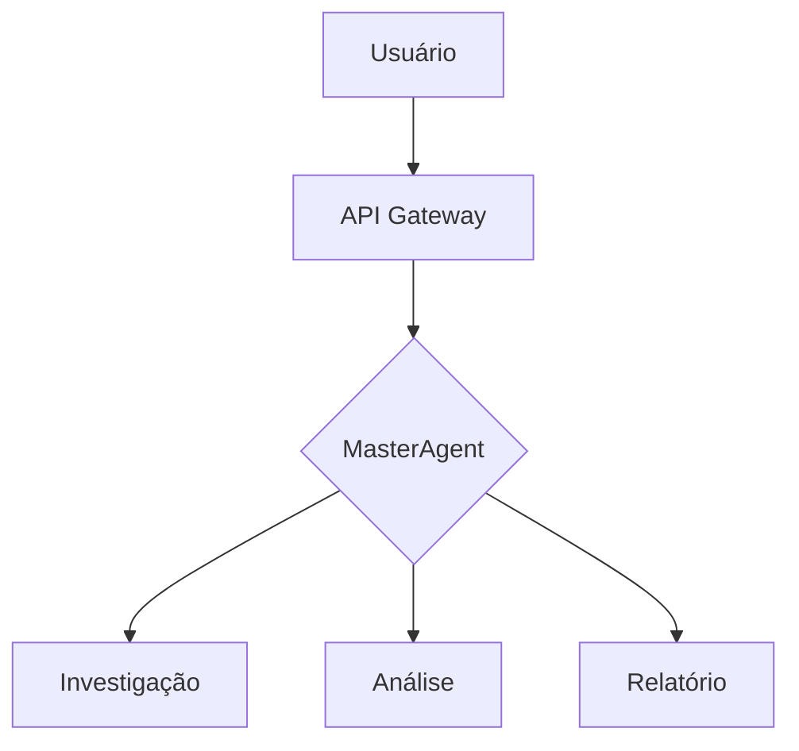
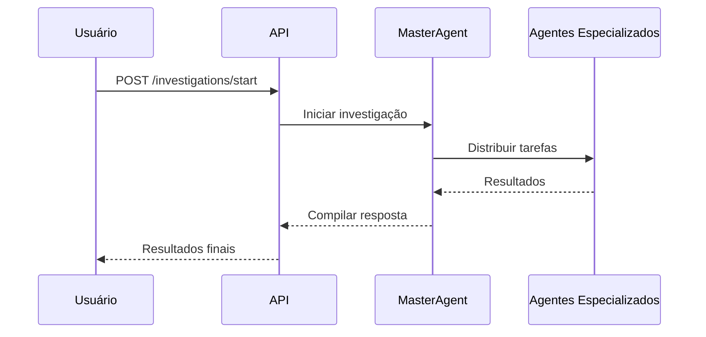

# 📚 Cidadão.AI Backend — Documentação Técnica

> **Documentação técnica oficial** do sistema multi-agente Cidadão.AI para análise de transparência pública brasileira.

[](https://docusaurus.io/)
[](https://www.typescriptlang.org/)
[](https://katex.org/)
[](https://opensource.org/licenses/MIT)

---

## 🎯 Sobre Esta Documentação

Esta documentação foi **completamente refatorada** usando **Docusaurus v3** para oferecer:

- ✅ **Bilíngue** (Português + Inglês) com i18n nativo
- ✅ **Fórmulas matemáticas** com KaTeX/LaTeX
- ✅ **Responsiva** e otimizada para mobile
- ✅ **Versionamento** via GitHub Pages
- ✅ **Busca avançada** (Algolia ready)
- ✅ **Diagramas** com Mermaid
- ✅ **Tipografia técnica** otimizada

---

## 🚀 Desenvolvimento Local

### **Pré-requisitos**
- Node.js 18+
- npm ou yarn

### **Instalação**

```bash
# Clone o repositório principal
git clone https://github.com/anderson-ufrj/cidadao.ai-backend.git
cd cidadao.ai-backend/docs_new

# Instale dependências
npm install

# Desenvolvimento local
npm start

# Build para produção
npm run build
```

### **Scripts Disponíveis**

| Comando | Descrição |
|---------|-----------|
| `npm start` | Servidor de desenvolvimento (http://localhost:3000) |
| `npm run build` | Build para produção |
| `npm run serve` | Serve build localmente |
| `npm run clear` | Limpa cache do Docusaurus |
| `npm run typecheck` | Verificação TypeScript |
| `npm run lint` | ESLint nos arquivos |

---

## 📖 Estrutura da Documentação

```
docs/
├── 🏠 intro.md                    # Introdução geral
├── ⚡ getting-started.md          # Guia de início rápido
├── 🏗️ architecture/               # Arquitetura do sistema
│   ├── overview.md               # Visão geral arquitetural
│   ├── multi-agent-system.md    # Sistema multi-agente
│   ├── data-pipeline.md          # Pipeline de dados
│   └── security.md               # Segurança
├── 🧮 math/                       # Fundamentos matemáticos
│   ├── overview.md               # Visão geral matemática
│   ├── theorems.md               # Teoremas e provas
│   ├── spectral-analysis.md      # Análise espectral (FFT)
│   ├── anomaly-detection.md      # Detecção de anomalias
│   └── machine-learning.md       # ML e estatística
├── 🤖 agents/                     # Agentes especializados
│   ├── overview.md               # Visão geral dos agentes
│   ├── master-agent.md           # MasterAgent (Abaporu)
│   ├── investigator-agent.md     # InvestigatorAgent (Zumbi)
│   └── specialized-agents.md     # Demais agentes
├── 🔌 api/                        # Documentação da API
│   ├── overview.md               # Visão geral da API
│   ├── endpoints.md              # Endpoints detalhados
│   ├── authentication.md         # Autenticação JWT
│   └── examples.md               # Exemplos práticos
├── 💾 infrastructure/             # Infraestrutura
│   ├── docker-compose.md         # Docker Compose
│   ├── kubernetes.md             # Deploy Kubernetes
│   └── monitoring.md             # Observabilidade
└── 🤝 contributing/               # Contribuição
    ├── overview.md               # Como contribuir
    ├── development-guide.md      # Guia de desenvolvimento
    └── documentation.md          # Como documentar
```

---

## 🌍 Internacionalização (i18n)

### **Idiomas Suportados**
- 🇧🇷 **Português (pt-BR)** — Idioma padrão
- 🇺🇸 **English (en-US)** — Tradução completa

### **Comandos de Tradução**

```bash
# Gerar arquivos de tradução
npm run write-translations -- --locale en-US

# Executar em idioma específico
npm start -- --locale en-US

# Build multilíngue
npm run build
```

### **Estrutura i18n**

```
i18n/
├── en-US/                        # English translations
│   ├── docusaurus-theme-classic/
│   ├── docusaurus-plugin-content-docs/
│   └── code.json                 # UI translations
└── pt-BR/                        # Português (default)
    ├── docusaurus-theme-classic/
    ├── docusaurus-plugin-content-docs/
    └── code.json
```

---

## 🧮 Suporte Matemático

### **KaTeX Integrado**

Suporte completo para fórmulas LaTeX:

#### **Inline Math**
```markdown
A entropia de Shannon é definida como $H(X) = -\sum P(x_i) \log P(x_i)$.
```

#### **Display Math**
```markdown
$$
\text{PSD}(f) = \frac{|X(f)|^2}{N \cdot f_s}
$$
```

#### **Teoremas e Provas**
```markdown
:::theorem Teorema de Shannon
Para um canal com capacidade $C$ e ruído gaussiano:

$$C = B \log_2\left(1 + \frac{S}{N}\right)$$

onde $B$ é a largura de banda, $S$ é a potência do sinal, e $N$ é a potência do ruído.
:::
```

---

## 📊 Diagramas com Mermaid

### **Fluxogramas**


### **Diagramas de Sequência**


---

## 🎨 Customização Visual

### **Variáveis CSS**

O sistema utiliza **CSS Custom Properties** para personalização:

```css
:root {
  --cidadao-primary: #2E8B57;
  --cidadao-primary-light: #4db371;
  --cidadao-accent: #FFD700;
  --cidadao-font-family: 'Inter', sans-serif;
  --cidadao-font-mono: 'JetBrains Mono', monospace;
}
```

### **Temas**
- 🌞 **Light Theme**: Tema padrão com cores brasileiras
- 🌙 **Dark Theme**: Modo escuro automático
- 📱 **Mobile Responsive**: Design adaptativo

---

## 🔍 Busca e Navegação

### **Algolia Search (Configurável)**

```javascript
// docusaurus.config.ts
algolia: {
  appId: 'YOUR_APP_ID',
  apiKey: 'YOUR_SEARCH_API_KEY', 
  indexName: 'cidadao-ai-docs',
  contextualSearch: true,
}
```

### **Navegação Hierárquica**

Sidebar inteligente com:
- ✅ Categorias colapsáveis
- ✅ Progresso de leitura
- ✅ Links ativos destacados
- ✅ Breadcrumbs automáticos

---

## 🚀 Deploy e CI/CD

### **GitHub Pages**

```yaml
# .github/workflows/deploy.yml
name: Deploy to GitHub Pages

on:
  push:
    branches: [main]
    paths: ['docs_new/**']

jobs:
  deploy:
    name: Deploy to GitHub Pages
    runs-on: ubuntu-latest
    steps:
      - uses: actions/checkout@v3
      - uses: actions/setup-node@v3
        with:
          node-version: 18
          cache: npm
          cache-dependency-path: docs_new/package-lock.json
      
      - name: Install dependencies
        working-directory: docs_new
        run: npm ci
      
      - name: Build website
        working-directory: docs_new
        run: npm run build
      
      - name: Deploy to GitHub Pages
        uses: peaceiris/actions-gh-pages@v3
        with:
          github_token: ${{ secrets.GITHUB_TOKEN }}
          publish_dir: docs_new/build
```

### **Ambientes de Deploy**

| Ambiente | URL | Branch | Status |
|----------|-----|--------|--------|
| **Production** | https://anderson-ufrj.github.io/cidadao.ai-docs/ | `main` | 🟢 |
| **Staging** | https://staging-docs.cidadao.ai | `develop` | 🟡 |
| **Preview** | Netlify Deploy Previews | PRs | 🔵 |

---

## 🤝 Contribuindo com a Documentação

### **Fluxo de Contribuição**

1. **Fork** o repositório
2. **Clone** localmente
3. **Branch** para nova feature: `git checkout -b docs/nova-secao`
4. **Edite** os arquivos Markdown
5. **Teste** localmente: `npm start`
6. **Commit** seguindo Conventional Commits
7. **Push** e abra **Pull Request**

### **Convenções de Escrita**

#### **Títulos**
```markdown
# 🏠 Título Principal (H1)
## 🎯 Seção Principal (H2)  
### **Subseção** (H3)
#### Detalhes (H4)
```

#### **Admonitions**
```markdown
:::tip Dica Prática
Conteúdo da dica
:::

:::info Informação
Informação importante
:::

:::warning Atenção
Cuidado com este aspecto
:::

:::danger Perigo
Ação que pode causar problemas
:::
```

#### **Code Blocks**
```markdown
```python title="exemplo.py"
def funcao_exemplo():
    return "Hello World"
```

```bash title="Terminal"
npm install
npm start
```
```

---

## 📈 Métricas de Qualidade

### **Lighthouse Scores (Target)**
- 🎯 **Performance**: 95+
- 🎯 **Accessibility**: 100
- 🎯 **Best Practices**: 95+
- 🎯 **SEO**: 100

### **Core Web Vitals**
- 🎯 **LCP** (Largest Contentful Paint): < 2.5s
- 🎯 **FID** (First Input Delay): < 100ms  
- 🎯 **CLS** (Cumulative Layout Shift): < 0.1

---

## 📚 Recursos Técnicos

### **Dependências Principais**

| Pacote | Versão | Propósito |
|--------|--------|-----------|
| `@docusaurus/core` | 3.6.3 | Framework base |
| `@docusaurus/preset-classic` | 3.6.3 | Preset padrão |
| `@docusaurus/theme-mermaid` | 3.6.3 | Diagramas |
| `remark-math` | 6.0.0 | Processamento LaTeX |
| `rehype-katex` | 7.0.0 | Renderização matemática |

### **Ferramentas de Desenvolvimento**

| Ferramenta | Propósito |
|------------|-----------|
| **TypeScript** | Type safety |
| **ESLint** | Code linting |
| **Prettier** | Code formatting |
| **Husky** | Git hooks |
| **lint-staged** | Pre-commit checks |

---

## 🏛️ Créditos

### **Desenvolvimento**
- **Autor**: Anderson Henrique da Silva
- **Orientação**: Profa. Dra. Aracele Garcia de Oliveira Fassbinder
- **Instituição**: Instituto Federal do Sul de Minas Gerais

### **Tecnologias**
- **Docusaurus**: Meta Open Source
- **KaTeX**: Khan Academy
- **Mermaid**: Mermaid.js Team
- **Inter Font**: Google Fonts
- **JetBrains Mono**: JetBrains

---

## 📄 Licença

Este projeto está licenciado sob **MIT License**. Veja o arquivo [LICENSE](../LICENSE) para detalhes.

---

## 📞 Suporte

- 📧 **Email**: [andersonhs27@gmail.com](mailto:andersonhs27@gmail.com)
- 🔗 **GitHub**: [Issues](https://github.com/anderson-ufrj/cidadao.ai-backend/issues)
- 💬 **Discussões**: [GitHub Discussions](https://github.com/anderson-ufrj/cidadao.ai-backend/discussions)
- 🌐 **Website**: [cidadao-ai-frontend.vercel.app](https://cidadao-ai-frontend.vercel.app)

---

**Construído com ❤️ e ☕ no Brasil** 🇧🇷