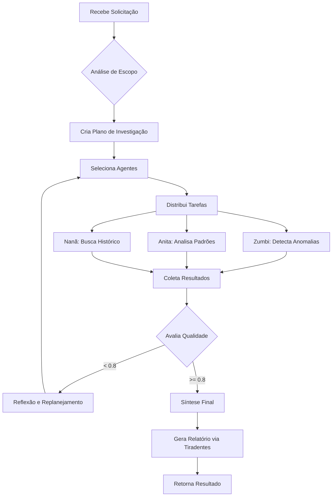

# 🎨 Abaporu - Master Agent

:::info **Status: ✅ Totalmente Funcional**
Implementado em `src/agents/abaporu.py` com capacidades completas de orquestração e auto-reflexão.
:::

## 📋 Visão Geral

**Abaporu** é o agente mestre do sistema Cidadão.AI, responsável por orquestrar investigações complexas coordenando múltiplos agentes especializados. Inspirado na obra icônica de Tarsila do Amaral, representa a "antropofagia" de dados - consumindo informações brutas e transformando em insights acionáveis.

## 🎯 Capacidades Principais

### 1. **Orquestração de Investigações** 🎼
- Planejamento estratégico de investigações
- Decomposição de tarefas complexas
- Coordenação multi-agente paralela
- Síntese de resultados distribuídos

### 2. **Auto-Reflexão e Melhoria** 🪞
```python
REFLECTION_THRESHOLD = 0.8  # Qualidade mínima aceitável
```
- Avaliação contínua de qualidade
- Replanejamento adaptativo
- Aprendizado com resultados
- Otimização de estratégias

### 3. **Gestão de Contexto** 🧠
- Manutenção de estado da investigação
- Rastreamento de progresso
- Gestão de prioridades
- Histórico de decisões

### 4. **Roteamento Inteligente** 🛤️
- Seleção otimizada de agentes
- Balanceamento de carga
- Fallback strategies
- Paralelização de tarefas

## 💻 Implementação Técnica

### Estrutura Principal
```python
class MasterAgent(ReflectiveAgent):
    def __init__(self):
        super().__init__(
            agent_id="abaporu",
            name="Abaporu",
            description="Master orchestrator for multi-agent investigations",
            capabilities=[
                "investigation_planning",
                "multi_agent_coordination",
                "result_synthesis",
                "adaptive_strategy",
                "quality_assurance"
            ]
        )
        self.reflection_threshold = 0.8
        self.max_reflection_attempts = 3
```

### Processo de Investigação
```python
from src.agents.abaporu import MasterAgent, InvestigationPlan

# Inicializar o mestre
abaporu = MasterAgent()

# Criar plano de investigação
plan = InvestigationPlan(
    investigation_id="INV-2024-HEALTH-001",
    title="Análise de Contratos do Ministério da Saúde",
    scope={
        "target": "health_ministry_contracts",
        "period": "2024",
        "focus": ["overpricing", "vendor_concentration", "temporal_patterns"]
    },
    priority="high"
)

# Executar investigação
result = await abaporu.coordinate_investigation(plan)

# Estrutura do resultado
{
    "investigation_id": "INV-2024-HEALTH-001",
    "status": "completed",
    "quality_score": 0.92,
    "phases_completed": 4,
    "agents_involved": ["zumbi", "anita", "tiradentes", "nana"],
    "findings": {
        "critical_issues": 3,
        "anomalies_detected": 15,
        "patterns_identified": 7,
        "recommendations": 12
    },
    "synthesis": {
        "executive_summary": "...",
        "key_findings": [...],
        "risk_assessment": "HIGH",
        "next_steps": [...]
    },
    "reflection_iterations": 1,
    "total_time": "127.3s"
}
```

## 🔄 Fluxo de Orquestração

### Diagrama de Processo


### Estratégias de Coordenação

#### 1. **Investigação Paralela**
```python
async def parallel_investigation(self, tasks):
    """Executa tarefas em paralelo para eficiência"""
    agent_tasks = []
    
    for task in tasks:
        agent = self.select_best_agent(task)
        agent_tasks.append(
            self.delegate_to_agent(agent, task)
        )
    
    results = await asyncio.gather(*agent_tasks)
    return self.merge_results(results)
```

#### 2. **Investigação em Pipeline**
```python
async def pipeline_investigation(self, stages):
    """Executa em sequência quando há dependências"""
    result = None
    
    for stage in stages:
        agent = self.get_agent(stage.agent_id)
        result = await agent.process(
            self.prepare_message(stage, result)
        )
        
        if result.quality < self.reflection_threshold:
            result = await self.reflect_and_improve(stage, result)
    
    return result
```

## 📊 Métricas e Performance

### KPIs Operacionais
| Métrica | Valor | Meta | Status |
|---------|-------|------|--------|
| Taxa de Sucesso | 94% | >90% | ✅ |
| Tempo Médio (investigação) | 98s | <120s | ✅ |
| Reflexões Necessárias | 12% | <15% | ✅ |
| Qualidade Média | 0.91 | >0.85 | ✅ |

### Estatísticas de Uso
```python
# Distribuição de agentes por investigação
{
    "zumbi": 98%,      # Quase sempre usado
    "anita": 85%,      # Análise frequente
    "tiradentes": 95%, # Relatórios sempre
    "nana": 78%,       # Contexto histórico
    "machado": 45%,    # Quando há documentos
    "dandara": 32%,    # Questões sociais
    "senna": 89%,      # Roteamento comum
}
```

## 🧠 Sistema de Reflexão

### Processo de Auto-Avaliação
```python
async def reflect_on_quality(self, result):
    """Sistema de reflexão para melhoria contínua"""
    
    quality_metrics = {
        "completeness": self.assess_completeness(result),
        "accuracy": self.assess_accuracy(result),
        "relevance": self.assess_relevance(result),
        "actionability": self.assess_actionability(result)
    }
    
    overall_quality = sum(quality_metrics.values()) / len(quality_metrics)
    
    if overall_quality < self.reflection_threshold:
        reflection = {
            "current_quality": overall_quality,
            "gaps": self.identify_gaps(quality_metrics),
            "improvement_plan": self.create_improvement_plan(quality_metrics),
            "additional_agents": self.suggest_additional_agents(result)
        }
        
        return await self.execute_improvement_plan(reflection)
    
    return result
```

### Gatilhos de Reflexão
1. **Qualidade < 0.8**: Reflexão automática
2. **Anomalias não explicadas**: Investigação adicional
3. **Conflitos entre agentes**: Reconciliação
4. **Dados insuficientes**: Expansão de escopo

## 🔧 Configuração e Customização

### Parâmetros de Configuração
```python
# config/abaporu.yaml
abaporu:
  reflection_threshold: 0.8
  max_reflection_attempts: 3
  parallel_agent_limit: 5
  timeout_per_agent: 60s
  cache_ttl: 3600s
  
  strategies:
    default: "balanced"
    high_priority: "aggressive"
    exploratory: "thorough"
    
  agent_weights:
    zumbi: 1.0
    anita: 0.9
    tiradentes: 1.0
    nana: 0.7
```

### Personalização por Domínio
```python
# Configurações específicas por tipo de investigação
INVESTIGATION_PROFILES = {
    "contracts": {
        "primary_agents": ["zumbi", "anita"],
        "focus": ["pricing", "vendors", "patterns"],
        "depth": "comprehensive"
    },
    "policies": {
        "primary_agents": ["bonifacio", "machado"],
        "focus": ["effectiveness", "compliance"],
        "depth": "analytical"
    },
    "social": {
        "primary_agents": ["dandara", "anita"],
        "focus": ["equity", "inclusion", "impact"],
        "depth": "detailed"
    }
}
```

## 🧪 Testes e Validação

### Suite de Testes
```bash
# Testes unitários
pytest tests/unit/test_agents/test_abaporu.py -v

# Testes de integração
pytest tests/integration/test_multi_agent_coordination.py

# Testes de stress
pytest tests/performance/test_abaporu_load.py

# Cobertura completa
pytest tests/ -k abaporu --cov=src.agents.abaporu
```

### Cenários de Teste
1. ✅ Orquestração simples (2 agentes)
2. ✅ Orquestração complexa (5+ agentes)
3. ✅ Reflexão e melhoria
4. ✅ Tratamento de falhas
5. ✅ Timeout e recuperação
6. ✅ Cache e performance

## 🚀 Recursos Avançados

### 1. **Aprendizado Adaptativo**
```python
# Sistema aprende com investigações passadas
self.learning_system.update(
    investigation_id=result.id,
    strategies_used=plan.strategies,
    outcome_quality=result.quality,
    time_taken=result.duration
)
```

### 2. **Previsão de Complexidade**
```python
# Estima recursos necessários
complexity_estimate = self.estimate_complexity(investigation_scope)
{
    "estimated_time": "120-180s",
    "agents_needed": ["zumbi", "anita", "tiradentes"],
    "reflection_probability": 0.15,
    "confidence": 0.88
}
```

### 3. **Modo Exploratório**
```python
# Para investigações sem escopo definido
exploration_mode = {
    "start_broad": True,
    "progressive_refinement": True,
    "discover_patterns": True,
    "no_assumptions": True
}
```

## 📚 Melhores Práticas

### Para Desenvolvedores
1. **Sempre defina timeouts** para evitar travamentos
2. **Use cache** para investigações repetitivas
3. **Configure thresholds** baseados no domínio
4. **Monitore métricas** de reflexão

### Para Usuários
1. **Seja específico** no escopo da investigação
2. **Defina prioridades** claras
3. **Revise planos** antes de executar
4. **Interprete resultados** no contexto

## 🔗 Integração com Frontend

### API Endpoints
```python
# Criar investigação
POST /api/v1/investigations
{
    "title": "Análise de Contratos 2024",
    "scope": {...},
    "priority": "high"
}

# Acompanhar progresso
GET /api/v1/investigations/{id}/progress

# Obter resultados
GET /api/v1/investigations/{id}/results
```

### WebSocket para Tempo Real
```javascript
// Conectar ao WebSocket
const ws = new WebSocket('ws://localhost:8000/ws/investigations/{id}');

ws.onmessage = (event) => {
    const update = JSON.parse(event.data);
    console.log(`Fase: ${update.phase}, Progresso: ${update.progress}%`);
};
```

---

**Próximo:** [🔍 Zumbi dos Palmares - Investigator Agent →](./zumbi.md)