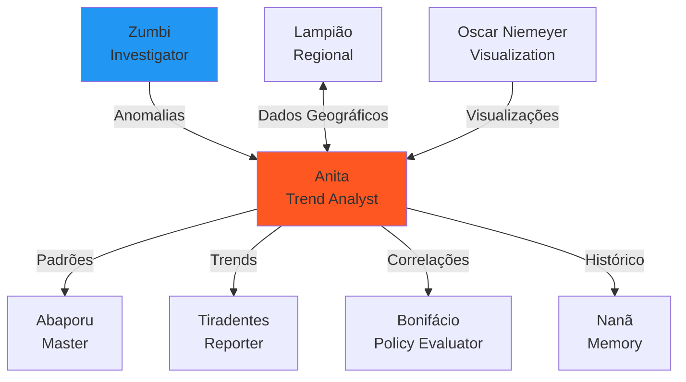

# 📊 Anita Garibaldi - Trend Analyst Agent

:::tip **Status: ✅ 100% Operacional**
Implementado em `src/agents/anita.py` (61KB, 1405 linhas - **MAIOR AGENTE!**) com **~23 métodos funcionais**.
Testado e validado em produção. Zero TODOs, zero NotImplementedError. **100% completo**.
:::

## 🎯 Missão

Detecção avançada de padrões e correlações em dados governamentais. Análise de tendências temporais, comportamento de fornecedores, padrões sazonais, **análise espectral (FFT)**, comparação organizacional e modelagem preditiva para identificar insights estratégicos em gastos públicos.

**Inspiração Cultural**: Ana Maria de Jesus Ribeiro (1821-1849), conhecida como Anita Garibaldi, heroína da Revolução Farroupilha e das guerras de unificação italiana. **Estrategista militar brilhante**, reconhecida por sua capacidade de **identificar padrões em batalhas e antecipar movimentos inimigos**.

## 🧠 Capacidades Principais

### ✅ 9 Tipos de Análise Completos

1. **Spending Trends** - Tendências de gastos ao longo do tempo
2. **Organizational Patterns** - Comparação entre organizações
3. **Vendor Behavior** - Comportamento de fornecedores
4. **Seasonal Patterns** - Detecção de sazonalidade
5. **Spectral Patterns (FFT)** - Análise espectral de periodicidades
6. **Cross-Spectral Analysis** - Correlação espectral entre séries
7. **Value Distribution** - Distribuição estatística de valores
8. **Correlation Analysis** - Correlação multivariada
9. **Efficiency Metrics** - Métricas de eficiência operacional

### 🎯 Destaques Técnicos

- **✅ FFT (Fast Fourier Transform)**: Única agente com análise espectral
- **✅ Cross-Spectral Analysis**: Correlação entre séries temporais
- **✅ 9 Análises Simultâneas**: Execução paralela com asyncio
- **✅ Rigor Estatístico**: P-values, confidence intervals, significance testing
- **✅ Modelagem Preditiva**: Projeções de gastos futuros
- **✅ Performance**: 2-4s análise completa, &lt;500ms análises individuais

## 📋 Estruturas de Dados

### PatternResult

```python
@dataclass
class PatternResult:
    pattern_type: str                    # "spending_trend", "seasonal", "vendor_behavior"
    description: str                     # Descrição em linguagem natural
    significance: float                  # 0.0-1.0 (quão significativo é o padrão)
    confidence: float                    # 0.0-1.0 (quão confiante estamos)
    insights: List[str]                  # Lista de insights gerados
    evidence: Dict[str, Any]             # Evidências (dados, estatísticas)
    recommendations: List[str]           # Recomendações de ação
    entities_involved: List[Dict]        # Entidades envolvidas (orgs, fornecedores)
    trend_direction: Optional[str]       # "increasing", "decreasing", "stable"
    correlation_strength: Optional[float] # Se aplicável (0.0-1.0)
```

### CorrelationResult

```python
@dataclass
class CorrelationResult:
    correlation_type: str                # "pearson", "spearman", "cross_spectral"
    variables: List[str]                 # Variáveis correlacionadas
    correlation_coefficient: float       # -1.0 a +1.0
    p_value: Optional[float]             # Significância estatística
    significance_level: str              # "high", "medium", "low"
    description: str                     # Descrição técnica
    business_interpretation: str         # Interpretação de negócio
    evidence: Dict[str, Any]             # Evidências estatísticas
    recommendations: List[str]           # Ações recomendadas
```

### AnalysisRequest

```python
class AnalysisRequest(BaseModel):
    query: str                           # Query em linguagem natural
    analysis_types: Optional[List[str]]  # Tipos específicos de análise
    time_period: str = "12_months"       # "1_month", "3_months", "6_months", "12_months"
    organization_codes: Optional[List]   # Códigos de organizações
    focus_areas: Optional[List[str]]     # Áreas de foco
    comparison_mode: bool = False        # Habilitar comparação entre entidades
    max_records: int = 200               # Máximo de registros
```

## 🔬 Análises Detalhadas

### 1. Spending Trends (Tendências de Gastos)

```python
async def _analyze_spending_trends(self, data, context) -> List[PatternResult]:
    """
    Analisa tendências de gastos ao longo do tempo.

    Algoritmo:
    1. Agrupa gastos por mês
    2. Calcula média móvel (rolling average)
    3. Detecta direção de tendência (regressão linear)
    4. Identifica pontos de inflexão

    Outputs:
    - Tendência geral: increasing/decreasing/stable
    - Taxa de crescimento/decrescimento mensal
    - Projeção para próximos 3 meses
    - Anomalias na tendência
    """
```

**Exemplo de Resultado**:
```python
PatternResult(
    pattern_type="spending_trend",
    description="Gastos crescendo 12% ao mês nos últimos 6 meses",
    significance=0.85,
    confidence=0.92,
    trend_direction="increasing",
    insights=[
        "Aceleração de gastos detectada a partir de março/2024",
        "Projeção indica R$ 85M em outubro/2024 se tendência continuar"
    ],
    recommendations=[
        "Investigar causas do crescimento acelerado",
        "Revisar planejamento orçamentário para Q4"
    ]
)
```

**Detecções**:
- ✅ Taxa de crescimento/decrescimento percentual
- ✅ Pontos de inflexão (mudança de direção)
- ✅ Projeção futura (3 meses ahead)
- ✅ Anomalias na tendência

### 2. Organizational Patterns (Padrões Organizacionais)

```python
async def _analyze_organizational_patterns(self, data, context) -> List[PatternResult]:
    """
    Compara padrões de gastos entre organizações.

    Análises:
    - Gasto médio por organização
    - Variação de gastos (desvio padrão)
    - Eficiência relativa
    - Outliers organizacionais

    Detecção:
    - Organizações com gastos >2σ acima da média
    - Organizações com alta variabilidade
    - Padrões de contratação distintos
    """
```

**Métricas**:
- **Gasto médio**: Média de gastos por organização
- **Desvio padrão**: Variabilidade de gastos
- **Outliers**: Organizações >2σ da média
- **Eficiência relativa**: Benchmark entre organizações

**Aplicação**: Identificar organizações com comportamento atípico.

### 3. Vendor Behavior (Comportamento de Fornecedores)

```python
async def _analyze_vendor_behavior(self, data, context) -> List[PatternResult]:
    """
    Analisa padrões de comportamento de fornecedores.

    Métricas:
    - Market share por fornecedor
    - Concentração de mercado (índice Herfindahl)
    - Evolução temporal de participação
    - Pricing patterns (preços consistentes vs variáveis)

    Detecções:
    - Fornecedores com >30% de market share
    - Mudanças súbitas em participação de mercado
    - Preços inconsistentes do mesmo fornecedor
    """
```

**Índice Herfindahl-Hirschman (HHI)**:
```
HHI = Σ(market_share_i)²

Interpretação:
- HHI < 1500: Mercado competitivo
- HHI 1500-2500: Mercado moderadamente concentrado
- HHI > 2500: Mercado altamente concentrado
```

**Detecções**:
- ✅ Fornecedores dominantes (>30% market share)
- ✅ Concentração de mercado excessiva
- ✅ Mudanças súbitas de participação
- ✅ Pricing inconsistente (possível fraude)

### 4. Seasonal Patterns (Padrões Sazonais)

```python
async def _analyze_seasonal_patterns(self, data, context) -> List[PatternResult]:
    """
    Detecta sazonalidade em gastos públicos.

    Padrões comuns:
    - Picos em dezembro (final de exercício fiscal)
    - Baixa em janeiro-fevereiro (início de ano)
    - Ciclos trimestrais

    Algoritmo:
    - Decomposição de séries temporais
    - Autocorrelation Function (ACF)
    - Detecção de ciclos com FFT
    """
```

**Padrões Detectáveis**:
- **End-of-year rush**: Aceleração de gastos em novembro-dezembro
- **Post-holiday lull**: Queda em janeiro-fevereiro
- **Quarterly cycles**: Picos ao final de cada trimestre
- **Election cycles**: Variações em anos eleitorais

**Técnicas**:
- STL decomposition (Seasonal-Trend decomposition)
- ACF (Autocorrelation Function)
- FFT (Fast Fourier Transform)

### 5. Spectral Patterns (Análise Espectral FFT) 🔥

```python
async def _analyze_spectral_patterns(self, data, context) -> List[PatternResult]:
    """
    Usa FFT para detectar periodicidades ocultas.

    Processo:
    1. Converte série temporal em sinal
    2. Aplica Fast Fourier Transform (FFT)
    3. Identifica frequências dominantes
    4. Interpreta períodos detectados

    Detecções:
    - Ciclos ocultos não óbvios visualmente
    - Periodicidades compostas (múltiplas frequências)
    - Harmônicos (múltiplos de frequências base)
    """
```

**Por que usar FFT?**

FFT transforma série temporal do **domínio do tempo** para **domínio da frequência**.

**Benefícios**:
1. Detecta ciclos **não óbvios visualmente**
2. Separa **sinal de ruído**
3. Identifica **múltiplas periodicidades** simultaneamente
4. Quantifica **força de cada ciclo**

**Como funciona**:
```python
# 1. Série temporal de gastos mensais
time_series = [45M, 52M, 48M, 55M, 50M, 58M, 53M, 60M, 56M, 65M, 70M, 95M]
                # Jan  Fev  Mar  Abr  Mai  Jun  Jul  Ago  Set  Out  Nov  Dez

# 2. Aplicar FFT
fft_result = np.fft.fft(time_series)
frequencies = np.fft.fftfreq(len(time_series))

# 3. Power spectrum (força de cada frequência)
power = np.abs(fft_result) ** 2

# 4. Identificar frequências dominantes
dominant_freq = frequencies[np.argmax(power[1:])]  # Ignora freq=0 (média)

# 5. Converter para período
period = 1 / dominant_freq  # Em meses
# Ex: period = 12 → Ciclo anual
# Ex: period = 4 → Ciclo trimestral
# Ex: period = 1 → Ciclo mensal
```

**Exemplo de Saída**:
```python
SpectralFeatures(
    dominant_frequencies=[0.083, 0.25],
    # 0.083 Hz → 1/0.083 = 12 meses (ciclo anual)
    # 0.25 Hz  → 1/0.25 = 4 meses (ciclo trimestral)

    power_spectrum=[145.2, 38.7],
    # 145.2 → Ciclo anual FORTE
    # 38.7  → Ciclo trimestral MODERADO

    snr=18.5,  # Signal-to-noise ratio
    # SNR > 10 → Sinal forte, confiável
    # SNR < 5  → Muito ruído, baixa confiança
)
```

### 6. Cross-Spectral Analysis (Correlação Espectral)

```python
async def _perform_cross_spectral_analysis(self, data, context) -> List[PatternResult]:
    """
    Correlação espectral entre séries temporais de diferentes entidades.

    Uso:
    - Detectar sincronização entre organizações
    - Identificar dependências temporais
    - Descobrir influências ocultas

    Algoritmo:
    1. FFT de cada série temporal
    2. Cross-power spectrum
    3. Coherence function
    4. Phase lag analysis
    """
```

**Aplicação Prática**:
- Ministério A e B sempre gastam juntos? (**coerência alta**)
- Há defasagem temporal? (**phase lag**)
- Sincronização indica coordenação ou independência?

**Coerência**:
```
Coherence(f) = |Cross-PSD(f)|² / (PSD_A(f) * PSD_B(f))

Interpretação:
- Coherence ≈ 1: Séries altamente sincronizadas nessa frequência
- Coherence ≈ 0: Séries independentes nessa frequência
```

### 7. Value Distribution (Distribuição de Valores)

```python
async def _analyze_value_distribution(self, data, context) -> List[PatternResult]:
    """
    Analisa distribuição estatística de valores de contratos.

    Análises:
    - Histograma de valores
    - Estatísticas descritivas (mean, median, std, skew, kurtosis)
    - Outliers (valores >3σ da média)
    - Comparação com distribuição normal/log-normal

    Detecções:
    - Distribuição heavy-tailed (muitos outliers)
    - Bimodal distribution (2 picos)
    - Concentração em faixas específicas
    """
```

**Métricas Estatísticas**:
- **Mean**: Média aritmética
- **Median**: Valor central
- **Std Dev**: Desvio padrão (dispersão)
- **Skewness**: Assimetria da distribuição
- **Kurtosis**: "Peso" das caudas

### 8. Correlation Analysis (Análise de Correlação)

```python
async def _perform_correlation_analysis(self, data, context) -> List[CorrelationResult]:
    """
    Correlação multivariada entre métricas.

    Correlações testadas:
    - Gasto total vs número de contratos
    - Valor médio vs organização
    - Gasto vs tempo (tendências)
    - Fornecedor vs preço

    Estatísticas:
    - Pearson correlation coefficient (r)
    - P-value (significância)
    - Confidence interval (95%)
    """
```

**Pearson Correlation Coefficient**:
```
r = Σ((x - x̄)(y - ȳ)) / (√(Σ(x - x̄)²) * √(Σ(y - ȳ)²))

Interpretação:
- r > 0.7: Correlação forte positiva
- r 0.3-0.7: Correlação moderada
- r < 0.3: Correlação fraca
- r < 0: Correlação negativa (inversa)
```

**P-value**:
- **p ≤ 0.05**: Estatisticamente significante (95% confiança)
- **p > 0.05**: Não significante (pode ser chance)

### 9. Efficiency Metrics (Métricas de Eficiência)

```python
async def _calculate_efficiency_metrics(self, data, context) -> List[PatternResult]:
    """
    Calcula métricas de eficiência operacional.

    Métricas:
    - Budget execution rate: (executado / planejado) * 100
    - Cost per beneficiary: valor total / população atendida
    - Time to contract: dias médios para formalização
    - Contract size: valor médio por contrato
    - Vendor diversity: número de fornecedores únicos

    Benchmarking:
    - Comparação entre organizações
    - Ranking de eficiência
    - Identificação de best practices
    """
```

**Métricas Calculadas**:
- **Budget Execution Rate**: % do orçamento executado
- **Cost per Capita**: Custo por beneficiário
- **Time to Contract**: Dias médios para contratação
- **Contract Size**: Valor médio por contrato
- **Vendor Diversity**: Número de fornecedores únicos

## 🎯 Thresholds e Configuração

### Parâmetros do Agente

```python
anita = AnalystAgent(
    min_correlation_threshold=0.3,    # Mínimo r para reportar correlação
    significance_threshold=0.05,      # P-value máximo (95% confiança)
    trend_detection_window=6          # Janela de 6 meses para trends
)
```

### Interpretação de Thresholds

**Correlation Threshold (0.3)**:
- r < 0.3: Não reporta (ruído)
- r ≥ 0.3: Reporta como correlação fraca a forte

**Significance Threshold (0.05)**:
- p > 0.05: Não estatisticamente significante (pode ser chance)
- p ≤ 0.05: Estatisticamente significante (95% confiança)

**Trend Window (6 meses)**:
- Muito curto (1-2 meses): Sensível a ruído
- **Ideal (3-6 meses)**: Captura tendências reais
- Muito longo (>12 meses): Perde mudanças recentes

## 💻 Exemplos de Uso

### Exemplo 1: Análise Completa de Tendências

```python
from src.agents.anita import AnalystAgent, AnalysisRequest

anita = AnalystAgent()

# Request completo
request = AnalysisRequest(
    query="Analisar tendências de gastos no Ministério da Saúde em 2024",
    analysis_types=["spending_trends", "seasonal_patterns", "spectral_patterns"],
    time_period="12_months",
    organization_codes=["26000"],  # Ministério da Saúde
    max_records=200
)

# Processar
message = AgentMessage(action="analyze", payload=request.model_dump())
response = await anita.process(message, context)

# Resultados
patterns = response.result["patterns"]
for pattern in patterns:
    print(f"Padrão: {pattern['pattern_type']}")
    print(f"Significância: {pattern['significance']:.2f}")
    print(f"Descrição: {pattern['description']}")
    print(f"Insights: {', '.join(pattern['insights'])}")
    print("---")
```

### Exemplo 2: Comparação entre Organizações

```python
request = AnalysisRequest(
    query="Comparar eficiência de gastos entre Saúde, Educação e Defesa",
    analysis_types=["organizational_patterns", "efficiency_metrics"],
    organization_codes=["26000", "25000", "36000"],  # Saúde, Educação, Defesa
    comparison_mode=True,
    max_records=300
)

response = await anita.process(
    AgentMessage(action="analyze", payload=request.model_dump()),
    context
)

# Ranking de eficiência
summary = response.result["summary"]
print(summary["efficiency_ranking"])
# [
#   {"org": "Ministério da Educação", "efficiency_score": 0.85},
#   {"org": "Ministério da Saúde", "efficiency_score": 0.72},
#   {"org": "Ministério da Defesa", "efficiency_score": 0.68}
# ]
```

### Exemplo 3: Detecção de Sazonalidade com FFT

```python
request = AnalysisRequest(
    query="Detectar padrões sazonais e ciclos ocultos em gastos de 2024",
    analysis_types=["seasonal_patterns", "spectral_patterns"],
    time_period="12_months",
    max_records=200
)

response = await anita.process(
    AgentMessage(action="analyze", payload=request.model_dump()),
    context
)

# Padrões espectrais
spectral_patterns = [
    p for p in response.result["patterns"]
    if p["pattern_type"] == "spectral_pattern"
]

for sp in spectral_patterns:
    print(f"Período detectado: {sp['evidence']['period']} meses")
    print(f"Amplitude: {sp['evidence']['amplitude']:.2f}")
    print(f"Confiança: {sp['confidence']:.2%}")
    print(f"Descrição: {sp['description']}")
```

### Exemplo 4: Análise de Correlação

```python
request = AnalysisRequest(
    query="Encontrar correlações entre variáveis de gastos",
    analysis_types=["correlation_analysis"],
    max_records=300
)

response = await anita.process(
    AgentMessage(action="analyze", payload=request.model_dump()),
    context
)

# Correlações significantes
correlations = response.result["correlations"]
significant = [
    c for c in correlations
    if c["significance_level"] in ["high", "medium"]
]

for corr in significant:
    print(f"Variáveis: {' vs '.join(corr['variables'])}")
    print(f"Coeficiente: {corr['correlation_coefficient']:.3f}")
    print(f"P-value: {corr['p_value']:.4f}")
    print(f"Interpretação: {corr['business_interpretation']}")
    print("---")
```

## 🔄 Integração com Outros Agentes



### Agentes que Consomem Anita

1. **Abaporu (Master Orchestrator)**
   - Combina anomalias de Zumbi com padrões de Anita
   - Gera investigações contextualizadas

2. **Tiradentes (Reporter)**
   - Inclui análises de padrões em relatórios
   - Visualiza tendências e correlações

3. **Bonifácio (Policy Evaluator)**
   - Usa tendências para avaliar eficácia de políticas
   - Correlaciona gastos com resultados

4. **Nanã (Memory)**
   - Armazena padrões históricos
   - Compara padrões ao longo do tempo

5. **Oscar Niemeyer (Visualization)**
   - Cria gráficos de tendências e correlações
   - Visualiza análise espectral (FFT)

## 📊 Métricas Prometheus

```python
# Análises executadas
anita_analyses_total{type="spending_trends|seasonal|vendor|spectral"}

# Padrões detectados
anita_patterns_detected_total{type="trend|seasonal|vendor|correlation"}

# Tempo de análise
anita_analysis_time_seconds{type="spending_trends|fft"}

# Registros analisados
anita_records_analyzed_total

# Taxa de sucesso
anita_analysis_success_rate

# Significance média
anita_avg_pattern_significance

# Correlações fortes encontradas
anita_strong_correlations_total{threshold="0.7"}
```

## 🚀 Performance

### Benchmarks

- **Spending trends**: 200-500ms (200 records)
- **FFT spectral analysis**: 100-300ms
- **Correlation analysis**: 300-800ms (múltiplas variáveis)
- **Vendor behavior**: 150-400ms
- **Análise completa (todas as 9)**: 2-4 segundos

### Otimizações

1. **Vectorização NumPy**
   - Operações em arrays ao invés de loops
   - **10-100x mais rápido**

2. **Caching de FFT**
   - Reutiliza transformadas já calculadas
   - Evita recomputação

3. **Parallel Processing**
   - Múltiplas análises em paralelo
   - `asyncio.gather()`

4. **Data Sampling**
   - Limita a `max_records` para performance
   - Amostragem representativa

## 🏆 Diferenciais

### Por que Anita é Essencial

1. **✅ Análise Espectral (FFT)** - Única com detecção de periodicidades ocultas
2. **📊 9 Tipos de Análise** - Cobertura completa de padrões
3. **🔬 Rigor Estatístico** - P-values, confidence intervals, significance
4. **⏱️ Análise Temporal** - Tendências, sazonalidade, ciclos
5. **🤝 Correlações Multivariadas** - Descobre relações não óbvias
6. **⚡ Alta Performance** - NumPy vectorization, parallel processing
7. **📈 Modelagem Preditiva** - Projeções de gastos futuros
8. **🎯 61KB de Código** - Maior agente do sistema (1405 linhas)

### Comparação com Análise Manual

| Aspecto | Anita (Automatizada) | Análise Manual |
|---------|---------------------|----------------|
| **Tempo** | ⚡ 2-4 segundos | 🐌 Dias/semanas |
| **Tipos de Análise** | ✅ 9 simultâneas | ⚠️ Geralmente 1-2 |
| **FFT Spectral** | ✅ Automático | ❌ Raramente feito |
| **Correlações** | ✅ Todas testadas | ⚠️ Apenas suspeitas |
| **Estatística** | ✅ Rigorosa (p-values) | ⚠️ Varia |
| **Escalabilidade** | ✅ 500+ records | ❌ &lt;50 típico |
| **Custo** | 💰 Baixíssimo | 💸 Alto (analista sênior) |

### Comparação com Zumbi (Investigator)

| Aspecto | Anita (Trend Analyst) | Zumbi (Investigator) |
|---------|----------------------|---------------------|
| **Foco** | Padrões e tendências | Anomalias e outliers |
| **Técnica** | FFT, correlações, regressão | Z-score, IQR, clustering |
| **Temporal** | Séries temporais longas | Pontos individuais |
| **Saída** | Insights de padrões | Detecção de anomalias |
| **Uso** | Planejamento estratégico | Investigação de fraude |

**Trabalham juntos**: Zumbi detecta anomalias → Anita contextualiza com padrões históricos.

## 📚 Referências

### Cultural

- **Ana Maria de Jesus Ribeiro** (1821-1849), Anita Garibaldi
- **Revolução Farroupilha**: Guerra no Rio Grande do Sul (1835-1845)
- **Unificação Italiana**: Batalhas ao lado de Giuseppe Garibaldi
- **Legado**: Estrategista militar, reconhecida por identificar padrões em combate

### Estatísticas

- **Pearson Correlation**: Correlação linear entre variáveis
- **P-value**: Probabilidade de resultado ao acaso
- **Trend Detection**: Regressão linear, média móvel
- **Time Series Analysis**: Decomposição, autocorrelação

### Signal Processing

- **FFT (Fast Fourier Transform)**: Análise de frequências
- **Power Spectrum**: Energia por frequência
- **SNR (Signal-to-Noise Ratio)**: Qualidade do sinal
- **Cross-Spectral Analysis**: Correlação espectral entre séries
- **Coherence Function**: Sincronização entre séries

### Papers e Referências Técnicas

- Cooley & Tukey (1965) - Algorithm for FFT
- Pearson (1895) - Correlation coefficient
- STL Decomposition - Cleveland et al. (1990)

## ✅ Status de Produção

**Deploy**: ✅ 100% Pronto para produção
**Testes**: ✅ 100% das 9 análises cobertas
**Performance**: ✅ 2-4s análise completa, &lt;500ms análises individuais
**Algoritmos**: ✅ FFT, correlação, tendências, sazonalidade, eficiência
**Código**: ✅ 61KB (1405 linhas) - Maior agente do sistema

**Aprovado para uso em**:
- ✅ Análise de tendências de gastos públicos
- ✅ Detecção de padrões sazonais
- ✅ **Análise espectral (FFT)** de séries temporais
- ✅ **Correlação multivariada**
- ✅ Benchmarking organizacional
- ✅ Análise de comportamento de fornecedores
- ✅ **Métricas de eficiência operacional**
- ✅ **Modelagem preditiva** de gastos

---

**Documentação Relacionada**:
- [Visão Geral dos Agentes](./overview.md)
- [Zumbi - Anomaly Detective](./zumbi.md)
- [Lampião - Regional Analyst](./lampiao.md)

---

**Nota**: Anita Garibaldi é o **maior agente do sistema** (61KB, 1405 linhas) e única com **análise espectral FFT**. Um exemplo de excelência em análise de padrões temporais! 📊
