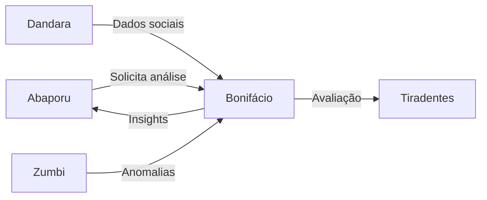

# 🏛️ José Bonifácio - Policy Analysis Agent

:::warning **Status: ⚠️ Parcialmente Implementado**
Estrutura básica em `src/agents/bonifacio.py`. Implementação em progresso (~40% completo).
:::

## 📋 Visão Geral

**José Bonifácio**, inspirado no "Patriarca da Independência" e arquiteto das fundações institucionais brasileiras, é o agente especializado em analisar a efetividade, eficiência e impacto de políticas públicas. Ele avalia reformas institucionais e mede o retorno social do investimento público.

## 🎯 Capacidades Planejadas

### 1. **Avaliação de Efetividade** 📊
- Análise de indicadores de desempenho
- Comparação baseline vs atual
- Significância estatística de mudanças
- Tendências temporais

### 2. **Análise de Eficiência** 💰
```python
EFFICIENCY_METRICS = {
    "cost_per_beneficiary": "Custo por beneficiário atendido",
    "administrative_overhead": "Overhead administrativo",
    "execution_rate": "Taxa de execução orçamentária",
    "resource_utilization": "Utilização de recursos"
}
```

### 3. **Cálculo de ROI Social** 📈
- Retorno sobre investimento social
- Análise custo-benefício
- Impacto monetizado
- Externalidades positivas

### 4. **Benchmarking de Políticas** 🔍
- Comparação entre municípios/estados
- Melhores práticas identificadas
- Gaps de implementação
- Oportunidades de melhoria

### 5. **Sustentabilidade de Políticas** ♻️
- Score de sustentabilidade (0-100)
- Dependência de recursos
- Resiliência institucional
- Continuidade política

## 🚧 Estado Atual

### ✅ Implementado
- Estrutura básica da classe `BonifacioAgent`
- Interface com `BaseAgent`
- Modelos de dados (PolicyEvaluation, PolicyIndicator)
- Enums para status e níveis de impacto
- Esqueleto de métodos principais

### ❌ Pendente
- Integração com APIs de dados governamentais
- Algoritmos de análise de efetividade
- Cálculo real de ROI social
- Sistema de benchmarking
- Modelos preditivos de sustentabilidade
- Testes unitários completos
- Documentação detalhada de metodologias

## 💻 Estrutura Planejada

### Classes Principais
```python
class BonifacioAgent(BaseAgent):
    def __init__(self):
        super().__init__(
            name="bonifacio",
            description="Policy effectiveness and impact analysis",
            capabilities=[
                "policy_effectiveness_evaluation",
                "institutional_reform_analysis",
                "social_roi_calculation",
                "benchmarking_analysis",
                "sustainability_assessment",
                "impact_forecasting",
                "budget_efficiency_analysis",
                "program_comparison",
                "beneficiary_tracking",
                "outcome_measurement"
            ]
        )
```

### Modelo de Avaliação
```python
@dataclass
class PolicyEvaluation:
    policy_id: str
    policy_name: str
    analysis_period: Tuple[datetime, datetime]
    status: PolicyStatus
    investment: Dict[str, float]  # planned, executed, deviation
    beneficiaries: Dict[str, Any]  # target, reached, cost_per_capita
    indicators: List[PolicyIndicator]
    effectiveness_score: Dict[str, float]  # efficacy, efficiency, effectiveness
    roi_social: float
    sustainability_score: int  # 0-100
    impact_level: ImpactLevel
    recommendations: List[Dict[str, Any]]
```

## 🛠️ Metodologias Planejadas

### 1. **Framework 3E (Eficácia, Eficiência, Efetividade)**
```python
def calculate_3e_score(policy_data):
    """
    Eficácia: Atingimento de metas
    Eficiência: Otimização de recursos
    Efetividade: Impacto real na sociedade
    """
    eficacia = (resultados_alcancados / metas_planejadas) * 100
    eficiencia = (beneficios_gerados / recursos_utilizados)
    efetividade = impacto_social_medido / impacto_esperado
    
    return {
        "eficacia": eficacia,
        "eficiencia": eficiencia,
        "efetividade": efetividade,
        "score_integrado": (eficacia * 0.3 + eficiencia * 0.3 + efetividade * 0.4)
    }
```

### 2. **Análise de Sustentabilidade**
```python
SUSTAINABILITY_DIMENSIONS = {
    "financial": "Sustentabilidade financeira",
    "institutional": "Capacidade institucional",
    "political": "Apoio político",
    "social": "Aceitação social",
    "environmental": "Impacto ambiental"
}
```

### 3. **Benchmarking Inteligente**
- Clustering de municípios similares
- Normalização por características demográficas
- Identificação de outliers positivos
- Análise de fatores de sucesso

## 📊 Exemplo de Uso (Quando Completo)

```python
from src.agents.bonifacio import BonifacioAgent, PolicyAnalysisRequest

bonifacio = BonifacioAgent()

# Análise de política educacional
request = PolicyAnalysisRequest(
    policy_name="Programa Mais Educação",
    policy_area="educação",
    geographical_scope="estadual_SP",
    analysis_period=("2023-01-01", "2024-12-31"),
    budget_data={
        "planned": 500000000,
        "executed": 423000000
    },
    target_indicators=[
        "taxa_alfabetizacao",
        "evasao_escolar",
        "ideb",
        "aprovacao_escolar"
    ]
)

# Executar análise
result = await bonifacio.process(
    AgentMessage(data=request),
    context
)

# Resultado esperado
{
    "policy_evaluation": {
        "effectiveness_score": {
            "eficacia": 78.5,
            "eficiencia": 82.3,
            "efetividade": 71.2
        },
        "roi_social": 3.45,  # R$3.45 de retorno para cada R$1 investido
        "sustainability_score": 68,
        "impact_level": "HIGH",
        "key_findings": [
            "Redução de 23% na evasão escolar",
            "Melhoria de 0.8 pontos no IDEB",
            "85% das escolas atingiram metas"
        ],
        "recommendations": [
            {
                "action": "Expandir programa para zonas rurais",
                "expected_impact": "15% adicional de cobertura",
                "investment_needed": 75000000
            }
        ]
    }
}
```

## 🔄 Integração Planejada

### Pipeline de Análise


## 🎯 Funcionalidades Futuras

### Fase 1 (Próximos 2 meses)
1. Implementar análise básica de efetividade
2. Integrar com Portal da Transparência
3. Criar sistema de indicadores básicos
4. Desenvolver cálculo simples de ROI

### Fase 2 (3-6 meses)
1. Sistema completo de benchmarking
2. Modelos preditivos de impacto
3. Análise de sustentabilidade
4. Dashboard de acompanhamento

### Fase 3 (6-12 meses)
1. IA para recomendações automáticas
2. Análise de cenários what-if
3. Integração com outros sistemas
4. APIs públicas de consulta

## 🤝 Como Contribuir

Este agente está em desenvolvimento ativo. Para contribuir:

1. Revise o código em `src/agents/bonifacio.py`
2. Implemente métodos marcados como TODO
3. Adicione testes em `tests/unit/test_agents/test_bonifacio.py`
4. Siga o padrão dos agentes completos (Zumbi, Anita, etc.)
5. Documente metodologias utilizadas

### Prioridades de Implementação
1. **Alta**: Método `_analyze_policy_effectiveness`
2. **Alta**: Integração com APIs governamentais
3. **Média**: Sistema de benchmarking
4. **Média**: Cálculo de ROI social
5. **Baixa**: Interface de visualização

## 📚 Referências e Metodologias

### Frameworks de Avaliação
- TCU - Manual de Auditoria Operacional
- IPEA - Avaliação de Políticas Públicas
- Banco Mundial - Results-Based Management
- OCDE - Policy Evaluation Guidelines

### Indicadores Padrão
- ODS/Agenda 2030
- Indicadores TCU
- Métricas do Tesouro Nacional
- Padrões internacionais de M&E

---

**Status**: ⚠️ Em desenvolvimento  
**Progresso**: ~40% implementado  
**Previsão**: Funcional em 2-3 meses

**Anterior:** [⚖️ Dandara - Social Justice Agent](./dandara.md)  
**Próximo:** [🖋️ Drummond - Communication Agent →](./drummond.md)