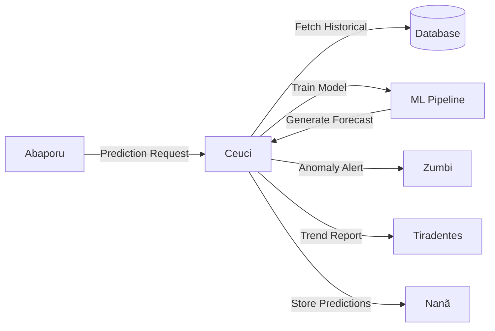

# 🔮 Ceuci - Predictive Analysis Agent

:::warning **Status: 🚧 10% Em Desenvolvimento**
Implementado em `src/agents/ceuci.py` (595 linhas) com **documentação inline excepcional** mas todos os métodos principais são TODOs.
Framework completo, algoritmos matematicamente documentados, zero implementação prática. Zero testes.
:::

## 📋 Visão Geral

O agente **Ceuci** é o oráculo preditivo do sistema, especializado em análise de séries temporais, previsão de tendências e detecção antecipada de anomalias. Inspirado na cultura indígena brasileira de leitura dos sinais da natureza, este agente "prevê" padrões futuros através de algoritmos de ML.

### Identidade Cultural

Ceuci representa a sabedoria preditiva das culturas indígenas brasileiras, que liam sinais da natureza para antecipar eventos. Nome de origem tupi, representa a capacidade de ver além do presente.

## 🎯 Capacidades Planejadas (Documentadas)

### 1. **Análise de Séries Temporais** 📈

#### ARIMA (AutoRegressive Integrated Moving Average)
```python
# Fórmula matemática documentada
ARIMA(p,d,q): (1-φ₁L-...-φₚLᵖ)(1-L)ᵈXₜ = (1+θ₁L+...+θₑLᵠ)εₜ

# Configuração
model_config["arima"] = {
    "max_p": 5,  # Ordem autoregressiva máxima
    "max_d": 2,  # Ordem de diferenciação
    "max_q": 5   # Ordem de média móvel
}
```
**Aplicação**: Previsão de gastos públicos, receitas
**Status**: 🔴 TODO (linha 469)

#### SARIMA (Seasonal ARIMA)
```python
# Extensão sazonal
SARIMA(p,d,q)(P,D,Q)s

# Para dados orçamentários com ciclo anual
```
**Aplicação**: Dados com sazonalidade (orçamentos anuais)
**Status**: 🔴 TODO

#### Prophet (Facebook Algorithm)
```python
# Modelo aditivo documentado
y(t) = g(t) + s(t) + h(t) + εₜ

# Componentes:
# g(t): tendência (growth)
# s(t): sazonalidade (seasonality)
# h(t): feriados (holidays)
# εₜ: erro

model_config["prophet"] = {
    "yearly_seasonality": True,
    "weekly_seasonality": False
}
```
**Aplicação**: Previsões robustas com feriados brasileiros
**Status**: 🔴 TODO

### 2. **Redes Neurais para Previsão** 🧠

#### LSTM (Long Short-Term Memory)
```python
# Arquitetura documentada:
# - Input Gate: iₜ = σ(Wi·[hₜ₋₁,xₜ] + bi)
# - Forget Gate: fₜ = σ(Wf·[hₜ₋₁,xₜ] + bf)
# - Output Gate: oₜ = σ(Wo·[hₜ₋₁,xₜ] + bo)

model_config["lstm"] = {
    "hidden_size": 128,
    "num_layers": 2,
    "dropout": 0.2
}
```
**Aplicação**: Padrões complexos em séries longas
**Status**: 🔴 TODO (TensorFlow/PyTorch)

#### GRU (Gated Recurrent Unit)
```python
# Versão simplificada do LSTM
# Menos parâmetros, mais rápido
```
**Aplicação**: Previsões com menos dados históricos
**Status**: 🔴 Não mencionado em código

#### Transformer Networks
```python
# Attention mechanism para dependências longas
```
**Aplicação**: Análise de múltiplas séries relacionadas
**Status**: 🔴 Não mencionado em código

### 3. **Machine Learning Supervisionado** 🤖

#### Random Forest
```python
# Ensemble de árvores de decisão
model_config["random_forest"] = {
    "n_estimators": 100,
    "max_depth": 10
}
```
**Status**: 🔴 TODO (Scikit-learn)

#### XGBoost
```python
# Objective function documentada:
# L(θ) = Σᵢl(yᵢ,ŷᵢ) + Σₖ Ω(fₖ)

model_config["xgboost"] = {
    "max_depth": 6,
    "learning_rate": 0.1,
    "n_estimators": 100
}
```
**Status**: 🔴 TODO (XGBoost library)

#### Support Vector Regression (SVR)
```python
# Kernel trick para relações não-lineares
```
**Status**: 🔴 Não implementado

### 4. **Decomposição Sazonal** 🌡️

#### STL (Seasonal-Trend decomposition using Loess)
```python
# Fórmula documentada:
Xₜ = Trendₜ + Seasonalₜ + Remainderₜ

# Separação de componentes temporais
```
**Status**: 🔴 TODO (linha 567)

#### X-13ARIMA-SEATS
```python
# Método oficial do US Census Bureau
# Ajuste sazonal robusto
```
**Status**: 🔴 Não mencionado em código

### 5. **Detecção de Anomalias Futuras** ⚠️

#### Isolation Forest Temporal
```python
# Extensão para séries temporais
```
**Status**: 🔴 TODO (linha 575)

#### One-Class SVM
```python
# Classificação normalidade vs anomalia
```
**Status**: 🔴 Não implementado

#### LSTM Autoencoder
```python
# Reconstrução de padrões normais
# Detecção de desvios futuros
```
**Status**: 🔴 Não implementado

## 💻 Implementação Técnica

### Estrutura da Classe
```python
class PredictiveAgent(BaseAgent):
    """
    Ceuci - Agente Preditivo

    DOCUMENTAÇÃO INLINE EXCEPCIONAL:
    - 8 modelos de ML documentados matematicamente
    - 6 métricas de avaliação explicadas
    - 4 aplicações específicas detalhadas
    - Performance targets definidos
    """

    def __init__(self, config: Optional[Dict[str, Any]] = None):
        super().__init__(
            name="PredictiveAgent",
            description="Ceuci - Agente especializado em análise preditiva"
        )

        # Configurações de modelos (TODAS definidas!)
        self.model_config = {
            "arima": {"max_p": 5, "max_d": 2, "max_q": 5},
            "lstm": {"hidden_size": 128, "num_layers": 2, "dropout": 0.2},
            "prophet": {"yearly_seasonality": True, "weekly_seasonality": False},
            "random_forest": {"n_estimators": 100, "max_depth": 10},
            "xgboost": {"max_depth": 6, "learning_rate": 0.1, "n_estimators": 100}
        }

        # Cache de modelos treinados
        self.trained_models = {}

        # Histórico de previsões
        self.prediction_history = []
```

### Tipos de Previsão Suportados
```python
class PredictionType(Enum):
    TIME_SERIES = "time_series"                  # Série temporal clássica
    CLASSIFICATION = "classification"            # Classificação categórica
    REGRESSION = "regression"                    # Regressão contínua
    ANOMALY_FORECAST = "anomaly_forecast"        # Previsão de anomalias
    TREND_ANALYSIS = "trend_analysis"            # Análise de tendências
    SEASONAL_DECOMPOSITION = "seasonal_decomposition"  # Decomposição
```

### Modelos Disponíveis
```python
class ModelType(Enum):
    ARIMA = "arima"
    LSTM = "lstm"
    PROPHET = "prophet"
    RANDOM_FOREST = "random_forest"
    XG_BOOST = "xgboost"
    LINEAR_REGRESSION = "linear_regression"
    POLYNOMIAL_REGRESSION = "polynomial_regression"
    SARIMA = "sarima"
```

### Exemplo de Uso (Planejado)
```python
from src.agents.ceuci import PredictiveAgent, PredictionRequest, PredictionType, ModelType
from src.agents.deodoro import AgentMessage, AgentContext

# ==========================================
# 1. INICIALIZAR AGENTE
# ==========================================
# Cria instância do agente preditivo Ceuci
# Carrega modelos pré-treinados e pipelines de pré-processamento
ceuci = PredictiveAgent()
await ceuci.initialize()  # Async initialization para carregar modelos pesados

# ==========================================
# 2. PREPARAR REQUEST DE PREVISÃO
# ==========================================
message = AgentMessage(
    content={
        "action": "predict_time_series",  # Tipo de predição: série temporal

        "prediction_request": {
            # Identificador único da requisição (rastreamento)
            "request_id": "PRED-2024-001",

            # Tipo de predição: "time_series", "classification", "regression"
            "prediction_type": "time_series",

            # Modelo de ML a usar: "arima", "prophet", "lstm", "xgboost", etc.
            "model_type": "arima",

            # DADOS HISTÓRICOS: Mínimo 36 pontos para ARIMA funcionar bem
            # Formato: lista de dicts com timestamp + valor
            "data": [
                {"date": "2023-01", "value": 1000000},  # Janeiro 2023
                {"date": "2023-02", "value": 1050000},  # Fevereiro 2023
                # ... total de 36 meses de histórico (3 anos)
            ],

            # Variável a ser prevista (target)
            "target_variable": "value",

            # Variáveis features (preditoras) - neste caso, apenas temporal
            "feature_variables": ["date"],

            # HORIZONTE DE PREVISÃO: quantos períodos à frente prever
            # 12 meses = previsão para 1 ano futuro
            "prediction_horizon": 12,

            # Nível de confiança para intervalos (95% = 2σ)
            "confidence_level": 0.95,

            # Parâmetros adicionais específicos do modelo ARIMA
            "additional_params": {
                "auto_arima": True,    # Auto-selecionar p,d,q ótimos
                "seasonal": True       # Considerar sazonalidade (ciclos anuais)
            }
        }
    },
    sender="abaporu",  # Quem solicitou a previsão
    context=AgentContext(investigation_id="INV-PRED-001")  # Contexto da investigação
)

# ==========================================
# 3. EXECUTAR PREVISÃO
# ==========================================
# Processa assincronamente: treina modelo + gera forecast
response = await ceuci.process_message(message, context)

# ==========================================
# 4. ESTRUTURA DA RESPOSTA (PLANEJADA)
# ==========================================
{
    "prediction_result": {
        # Mesmo request_id para rastreabilidade
        "request_id": "PRED-2024-001",

        # ARRAY DE PREVISÕES: 12 períodos (1 ano)
        "predictions": [
            {
                "period": 1,                    # Período 1 (próximo mês)
                "predicted_value": 1100000,     # Valor previsto central
                "lower_bound": 1050000,         # Limite inferior (95% CI)
                "upper_bound": 1150000,         # Limite superior (95% CI)
                "confidence": 0.95              # Nível de confiança
            },
            # ... mais 11 períodos (total 12 meses)
        ],

        # MÉTRICAS DE PERFORMANCE DO MODELO (validação cruzada)
        "model_performance": {
            "mae": 25000,      # Mean Absolute Error: erro médio em reais
            "rmse": 35000,     # Root Mean Square Error: penaliza erros grandes
            "mape": 2.3,       # Mean Absolute Percentage Error: 2.3% de erro
            "r2_score": 0.92,  # R²: 92% da variância explicada (excelente!)
            "aic": 450.2,      # Akaike Information Criterion (menor = melhor)
            "bic": 465.8,      # Bayesian Information Criterion (penaliza complexidade)
            "confidence": 0.88 # Confiança geral do modelo
        },

        # ANÁLISES ADICIONAIS
        "trend_direction": "upward",     # Tendência: "upward", "downward", "stable"
        "seasonal_strength": 0.65,       # Força da sazonalidade (0-1)
        "anomaly_alerts": 0              # Número de anomalias previstas
    },

    # Status da operação
    "status": "prediction_completed",  # "completed", "failed", "partial"

    # Confiança geral da previsão (0-1)
    "confidence": 0.88,

    # METADADOS DO MODELO
    "metadata": {
        "model_version": "1.0",         # Versão do modelo treinado
        "training_samples": 36,         # Quantidade de dados usados no treino
        "model_type": "arima",          # Modelo selecionado
        "parameters": {                 # Parâmetros finais do ARIMA
            "p": 2,  # Ordem autoregressiva (AR)
            "d": 1,  # Ordem de diferenciação (I)
            "q": 1   # Ordem de média móvel (MA)
        }
    }
}
```

## 📊 Métricas de Avaliação (Documentadas)

### Mean Absolute Error (MAE)
```python
MAE = (1/n) Σᵢ|yᵢ - ŷᵢ|

# Interpretação: Erro médio absoluto em unidades originais
# Vantagem: Fácil interpretação
```

### Root Mean Square Error (RMSE)
```python
RMSE = √((1/n) Σᵢ(yᵢ - ŷᵢ)²)

# Interpretação: Penaliza erros grandes
# Vantagem: Mesmas unidades que variável original
```

### Mean Absolute Percentage Error (MAPE)
```python
MAPE = (100/n) Σᵢ|(yᵢ - ŷᵢ)/yᵢ|

# Interpretação: Erro percentual médio
# Vantagem: Independente de escala
# Limitação: Não funciona com valores zero
```

### Symmetric MAPE (sMAPE)
```python
# Reduz bias para valores pequenos
sMAPE = (100/n) Σᵢ|yᵢ - ŷᵢ| / ((|yᵢ| + |ŷᵢ|)/2)
```

### Theil's U Statistic
```python
# Compara com modelo naive (última observação)
# U < 1: Modelo melhor que naive
# U = 1: Igual ao naive
# U > 1: Pior que naive
```

## 🔧 Estado de Implementação

### ✅ O Que Funciona
1. **Framework Completo**: Classes, enums, data structures
2. **Message Processing**: Pipeline de mensagens
3. **Configurações**: Todos os modelos têm configs definidos
4. **Logging**: Sistema de logs implementado
5. **Data Models**: Pydantic models completos
6. **Documentação Inline**: **EXCEPCIONAL** - 200+ linhas de teoria

### 🔴 O Que NÃO Funciona (TODO)
1. **_preprocess_time_series** (linha 453): Só placeholder
2. **_train_model** (linha 468): TODO para TODOS os modelos
3. **_generate_predictions** (linha 485): Valores fake (100.0 + i*5)
4. **_evaluate_model_performance** (linha 508): Métricas hardcoded
5. **_analyze_trends** (linha 529): Retorna placeholders
6. **_detect_seasonal_patterns** (linha 565): TODO
7. **_detect_future_anomalies** (linha 575): Retorna lista vazia
8. **analyze_trends** (linha 308): TODO completo
9. **detect_seasonal_patterns** (linha 316): TODO completo
10. **forecast_anomalies** (linha 330): TODO completo
11. **compare_models** (linha 343): TODO com zeros
12. **_load_pretrained_models** (linha 583): pass
13. **_setup_preprocessing_pipelines** (linha 588): pass
14. **_setup_evaluation_metrics** (linha 593): pass

### 📊 Resumo: 10% Implementado
- **Classes e estruturas**: 100% ✅
- **Documentação**: 100% ✅ (excelente!)
- **Algoritmos**: 0% ❌
- **Testes**: 0% ❌

## 🔄 Integração no Sistema

### Fluxo de Dados


### Casos de Uso

#### Caso 1: Previsão Orçamentária
```python
# Prever receitas federais próximos 12 meses
request = {
    "model_type": "arima",
    "data": historical_revenues,
    "target_variable": "receita_total",
    "prediction_horizon": 12
}
```

#### Caso 2: Detecção Antecipada de Anomalias
```python
# Prever possíveis gastos anômalos
request = {
    "model_type": "lstm",
    "prediction_type": "anomaly_forecast",
    "data": spending_history,
    "prediction_horizon": 6
}
```

#### Caso 3: Análise de Tendências
```python
# Analisar tendência de licitações
request = {
    "action": "analyze_trends",
    "data": bidding_volumes,
    "target_variable": "numero_licitacoes"
}
```

## 📚 Aplicações Específicas (Documentadas)

### 1. Previsão Orçamentária
- Receitas federais, estaduais, municipais
- Despesas por categoria e órgão
- Déficit/superávit fiscal

### 2. Análise de Licitações
- Volume de licitações por período
- Valores médios de contratos
- Detecção de padrões suspeitos

### 3. Monitoramento de Políticas
- Impacto de mudanças regulatórias
- Efetividade de programas sociais
- ROI de investimentos públicos

### 4. Alertas Preventivos
- Riscos de estouro orçamentário
- Anomalias em gastos específicos
- Padrões indicativos de fraude

## 🎯 Performance Targets (Documentados)

| Métrica | Target | Status |
|---------|--------|--------|
| **Processamento** | >1M pontos em &lt;30s | 🔴 N/A |
| **Modelos Simultâneos** | 50+ | 🔴 N/A |
| **Precisão MAPE** | &lt;5% curto prazo | 🔴 N/A |
| **Latência** | &lt;2s online | 🔴 N/A |
| **Memória** | Até 10GB datasets | 🔴 N/A |

## 🚀 Roadmap de Implementação

### Fase 1: Modelos Básicos (4-6 semanas)
```python
# Prioridade ALTA
- [ ] Implementar ARIMA (statsmodels/pmdarima)
- [ ] Implementar Prophet (Facebook Prophet)
- [ ] Implementar Linear/Polynomial Regression (scikit-learn)
- [ ] Criar preprocessing pipeline completo
- [ ] Implementar métricas de avaliação reais
```

### Fase 2: Machine Learning (6-8 semanas)
```python
# Modelos avançados
- [ ] LSTM com TensorFlow/PyTorch
- [ ] Random Forest (scikit-learn)
- [ ] XGBoost (xgboost library)
- [ ] Cross-validation temporal
- [ ] Feature engineering
```

### Fase 3: Análises Avançadas (4-6 semanas)
```python
# Funcionalidades adicionais
- [ ] STL decomposition (statsmodels)
- [ ] Change point detection (ruptures library)
- [ ] Anomaly forecasting (PyOD)
- [ ] Model comparison framework
- [ ] Hyperparameter tuning (Optuna)
```

### Fase 4: Produção (2-3 semanas)
```python
# Preparar para produção
- [ ] Model serialization (joblib/pickle)
- [ ] Model versioning
- [ ] A/B testing framework
- [ ] Performance monitoring
- [ ] Testes completos (80% coverage)
```

## 🐛 Limitações Conhecidas

1. **Zero Algoritmos Implementados**
   - Todos os métodos são TODOs
   - **Solução**: Implementar conforme roadmap

2. **Sem Modelos Treinados**
   - Nenhum modelo disponível
   - **Solução**: Treinar com dados históricos brasileiros

3. **Sem Testes**
   - Zero cobertura
   - **Solução**: TDD para cada modelo

4. **Sem Persistência**
   - Modelos não são salvos
   - **Solução**: Model registry (MLflow/DVC)

## 📞 Próximas Ações Imediatas

### 🔥 Urgente (Esta Semana)
1. **Implementar ARIMA básico** - Mais simples de começar
2. **Criar preprocessing pipeline** - Fundamental para todos modelos
3. **Implementar métricas de avaliação** - MAE, RMSE, MAPE

### 📈 Curto Prazo (2 Semanas)
4. **Implementar Prophet** - Ótimo para dados governamentais
5. **Validar com dados reais** - Portal da Transparência
6. **Criar testes unitários** (50% coverage)

---

**Documentação Relacionada**:
- [Visão Geral dos Agentes](./overview.md)
- [Deodoro - Base Architecture](./deodoro.md)
- [ML Pipeline Overview](../ml/pipeline-overview.md)

---

**Nota Especial**: Este agente possui a MELHOR documentação inline do projeto (200+ linhas de teoria matemática), mas 0% de implementação prática. Um excelente blueprint esperando implementação! 📐→💻
