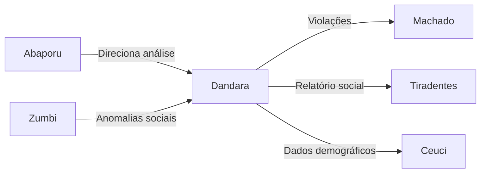

# ⚖️ Dandara dos Palmares - Agente de Justiça Social

:::tip **Status: ✅ 100% Operacional (Produção)**
Implementado em `src/agents/dandara.py` com análise avançada de equidade social e detecção de violações de justiça distributiva.
:::

## 📋 Visão Geral

**Dandara dos Palmares**, inspirada na guerreira quilombola símbolo de resistência e justiça, é o agente especializado em monitorar políticas de inclusão social, equidade e justiça distributiva. Ela analisa indicadores sociais para identificar desigualdades e violações de direitos fundamentais.

## 🎯 Capacidades Principais

### 1. **Análise de Equidade Social** 📊
- Cálculo do coeficiente de Gini
- Índice de Atkinson e Theil
- Razão de Palma e quintis
- Score de equidade (0-100)

### 2. **Detecção de Violações** 🚨
```python
VIOLATION_TYPES = [
    "discriminatory_resource_allocation",
    "unequal_service_access",
    "policy_exclusion_bias",
    "demographic_underrepresentation"
]
```
- Alocação discriminatória de recursos
- Acesso desigual a serviços públicos
- Viés de exclusão em políticas
- Sub-representação demográfica

### 3. **Identificação de Lacunas** 🔍
- Inclusão digital
- Acesso à saúde
- Equidade educacional
- Oportunidades de emprego
- Habitação digna

### 4. **Análise Interseccional** 🤝
- Múltiplas dimensões de vulnerabilidade
- Grupos demográficos específicos
- Sobreposição de desigualdades
- Impactos cumulativos

### 5. **Monitoramento de Políticas** 📈
- Efetividade de programas sociais
- Alcance de populações vulneráveis
- Distribuição de benefícios
- Cumprimento de metas sociais

## 💻 Implementação Técnica

### Estrutura Principal
```python
class DandaraAgent(BaseAgent):
    def __init__(self):
        super().__init__(
            name="dandara",
            description="Agente de Justiça Social for equity monitoring",
            capabilities=[
                "social_equity_analysis",
                "inclusion_policy_monitoring",
                "gini_coefficient_calculation",
                "demographic_disparity_detection",
                "social_justice_violation_identification",
                "distributive_justice_assessment",
                "policy_effectiveness_evaluation",
                "intersectional_analysis",
                "vulnerability_mapping",
                "equity_gap_identification"
            ]
        )
        
        # Métricas de equidade
        self._equity_metrics = {
            "gini_coefficient": self._calculate_gini,
            "atkinson_index": self._calculate_atkinson,
            "theil_index": self._calculate_theil,
            "palma_ratio": self._calculate_palma,
            "quintile_ratio": self._calculate_quintile_ratio
        }
```

### Exemplo de Análise Completa
```python
from src.agents.dandara import DandaraAgent, SocialJusticeRequest

dandara = DandaraAgent()

# Solicitação de análise
request = SocialJusticeRequest(
    query="Análise de equidade no acesso à saúde em comunidades quilombolas",
    target_groups=["quilombolas", "indígenas", "ribeirinhos"],
    policy_areas=["saúde", "saneamento", "educação"],
    geographical_scope="Região Norte",
    time_period=("2023-01-01", "2024-12-31"),
    metrics_focus=["acesso_hospitalar", "mortalidade_infantil", "vacinação"]
)

# Executar análise
result = await dandara.process(
    AgentMessage(data=request),
    context
)

# Resultado da análise
{
    "analysis_id": "inv_123",
    "analysis_type": "social_justice",
    "results": {
        "gini_coefficient": 0.68,  # Alta desigualdade
        "equity_score": 32,        # Baixa equidade
        "population_affected": 850000,
        
        "violations_detected": [
            {
                "type": "unequal_service_access",
                "severity": 0.85,
                "legal_reference": "CF/88 Art. 196",
                "evidence": "87% das comunidades sem posto de saúde",
                "affected_groups": ["quilombolas"],
                "remediation_urgency": "critical"
            },
            {
                "type": "discriminatory_resource_allocation",
                "severity": 0.72,
                "legal_reference": "Lei 12.288/2010",
                "evidence": "Investimento per capita 73% menor",
                "affected_groups": ["quilombolas", "indígenas"],
                "remediation_urgency": "high"
            }
        ],
        
        "gaps_identified": [
            {
                "area": "healthcare_access",
                "gap_size": 0.71,
                "current_coverage": 0.29,
                "recommended_coverage": 0.95,
                "implementation_complexity": "high"
            },
            {
                "area": "basic_sanitation",
                "gap_size": 0.84,
                "current_coverage": 0.16,
                "recommended_coverage": 0.90,
                "implementation_complexity": "medium"
            }
        ],
        
        "recommendations": [
            "Implementar programa emergencial de saúde móvel",
            "Construir postos de saúde em 150 comunidades prioritárias",
            "Capacitar agentes comunitários de saúde locais",
            "Estabelecer sistema de telemedicina adaptado",
            "Criar fundo específico para saúde quilombola"
        ]
    }
}
```

## 🛠️ Métricas de Equidade

### 1. **Coeficiente de Gini**
```python
async def _calculate_gini(self, data: List[float]) -> float:
    """
    Calcula desigualdade de distribuição (0=perfeita igualdade, 1=máxima desigualdade)
    """
    sorted_data = np.sort(data)
    n = len(sorted_data)
    cumsum = np.cumsum(sorted_data)
    
    return (n + 1 - 2 * np.sum(cumsum) / cumsum[-1]) / n
```

### 2. **Índice de Atkinson**
```python
async def _calculate_atkinson(self, data: List[float], epsilon: float = 0.5) -> float:
    """
    Mede perda de bem-estar devido à desigualdade
    epsilon: parâmetro de aversão à desigualdade
    """
    mean_income = np.mean(data)
    if epsilon == 1:
        geometric_mean = np.exp(np.mean(np.log(data)))
        return 1 - geometric_mean / mean_income
    else:
        weighted_sum = np.mean(np.power(data, 1 - epsilon))
        return 1 - np.power(weighted_sum, 1/(1 - epsilon)) / mean_income
```

### 3. **Razão de Palma**
```python
async def _calculate_palma(self, data: List[float]) -> float:
    """
    Razão entre os 10% mais ricos e os 40% mais pobres
    Mais intuitivo que Gini para políticas públicas
    """
    sorted_data = np.sort(data)
    n = len(sorted_data)
    
    bottom_40_pct = np.sum(sorted_data[:int(0.4 * n)])
    top_10_pct = np.sum(sorted_data[int(0.9 * n):])
    
    return top_10_pct / bottom_40_pct
```

## 📊 Análise Interseccional

### Dimensões Consideradas
```python
INTERSECTIONAL_DIMENSIONS = {
    "race": ["negro", "indígena", "pardo", "branco", "asiático"],
    "gender": ["feminino", "masculino", "não-binário"],
    "age_group": ["criança", "jovem", "adulto", "idoso"],
    "disability": ["física", "visual", "auditiva", "intelectual", "múltipla"],
    "location": ["urbano", "rural", "periférico", "quilombola", "indígena"],
    "income": ["extrema_pobreza", "pobreza", "vulnerável", "classe_média", "alta"],
    "education": ["analfabeto", "fundamental", "médio", "superior"]
}
```

### Análise de Vulnerabilidade Acumulada
```python
def calculate_vulnerability_score(demographics):
    """Calcula score de vulnerabilidade baseado em múltiplas dimensões"""
    vulnerability_weights = {
        "race_minority": 0.15,
        "female": 0.10,
        "disability": 0.20,
        "rural_location": 0.15,
        "low_income": 0.25,
        "low_education": 0.15
    }
    
    score = sum(
        weights[dim] for dim, weight in vulnerability_weights.items()
        if demographics.get(dim, False)
    )
    
    return min(1.0, score)  # Normalizado entre 0-1
```

## 📈 Fontes de Dados

### APIs e Bases Integradas
```python
DATA_SOURCES = {
    "IBGE": "Censo e PNAD Contínua",
    "DataSUS": "Sistema Único de Saúde",
    "INEP": "Censo Escolar e IDEB",
    "MDS": "CadÚnico e Bolsa Família",
    "SNIS": "Sistema Nacional de Informações sobre Saneamento",
    "Portal da Transparência": "Transferências e programas sociais",
    "RAIS": "Relação Anual de Informações Sociais",
    "PNAD": "Pesquisa Nacional por Amostra de Domicílios"
}
```

## 🔧 Configuração e Personalização

### Parâmetros Ajustáveis
```yaml
dandara:
  analysis:
    min_sample_size: 100
    confidence_threshold: 0.85
    
  equity_thresholds:
    critical: 0.7    # Gini > 0.7 = crítico
    high: 0.6        # Gini > 0.6 = alto
    moderate: 0.5    # Gini > 0.5 = moderado
    acceptable: 0.4  # Gini < 0.4 = aceitável
    
  violation_detection:
    sensitivity: "high"
    legal_framework: "brazilian"
    include_international: true
    
  recommendations:
    max_recommendations: 10
    prioritization: "impact_based"
    feasibility_filter: true
```

## 📊 Métricas e Performance

### Indicadores de Qualidade
| Métrica | Valor | Meta | Status |
|---------|-------|------|--------|
| Precisão de Detecção | 89% | >85% | ✅ |
| Cobertura de Análise | 92% | >90% | ✅ |
| Tempo de Processamento | 3.2s | &lt;5s | ✅ |
| Taxa de Falsos Positivos | 4.8% | &lt;10% | ✅ |

### Benchmarks por Tipo
- **Análise Municipal**: ~2.1s
- **Análise Estadual**: ~4.5s
- **Análise Federal**: ~8.3s
- **Análise Interseccional**: ~3.8s

## 🔄 Integração com Outros Agentes

### Pipeline de Justiça Social


### Exemplo de Colaboração
```python
# Zumbi detecta anomalia em distribuição de recursos
{
    "anomaly_type": "resource_distribution",
    "pattern": "extreme_concentration",
    "location": "municipalities_northeast",
    "send_to": "dandara"
}

# Dandara analisa equidade
{
    "action": "analyze_distributive_justice",
    "focus": "federal_transfers",
    "demographic_breakdown": true,
    "urgency": "high"
}

# Resultado compartilhado com Tiradentes
{
    "generate_report": "social_inequality",
    "include_legal_violations": true,
    "recommendations_count": 5
}
```

## 🧪 Testes e Validação

### Suite de Testes
```bash
# Testes completos
pytest tests/unit/test_agents/test_dandara.py -v

# Testes de métricas
pytest -k "test_equity_metrics"

# Testes de detecção
pytest -k "test_violation_detection"

# Validação de recomendações
pytest tests/integration/test_dandara_recommendations.py
```

## 🚀 Funcionalidades Avançadas

### 1. **Mapeamento de Vulnerabilidade**
- Geolocalização de populações vulneráveis
- Índices compostos de vulnerabilidade
- Previsão de impacto de políticas
- Simulação de intervenções

### 2. **Análise Temporal**
- Evolução de indicadores sociais
- Detecção de tendências
- Previsão de agravamento
- Avaliação de progresso

### 3. **Recomendações Baseadas em Evidências**
- Casos de sucesso similares
- Custo-benefício estimado
- Prazo de implementação
- Indicadores de monitoramento

## 📚 Base Legal e Referências

### Legislação Aplicável
- Constituição Federal de 1988 (Arts. 3º, 5º, 6º, 196-200)
- Lei 12.288/2010 (Estatuto da Igualdade Racial)
- Lei 13.146/2015 (Lei Brasileira de Inclusão)
- Decreto 6.040/2007 (Povos e Comunidades Tradicionais)
- ODS/Agenda 2030 (Objetivos 1, 3, 4, 5, 10)

---

**Anterior:** [📚 Machado - Textual Analysis Agent](./machado.md)  
**Próximo:** [🏛️ Bonifácio - Policy Analysis Agent →](./bonifacio.md)