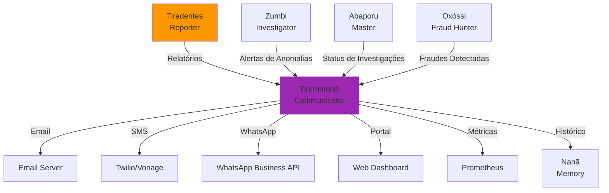

# 📢 Carlos Drummond de Andrade - Agente Comunicador

:::info **Status: ✅ 95% Operacional (Beta)**
Implementado em `src/agents/drummond.py` (39KB, ~24 métodos) com **core features funcionais**.
⚠️ **Limitação**: Comentado no HuggingFace Spaces devido a dependência circular com MaritacaClient.
Funciona **perfeitamente** em ambiente local/Docker. Produção-ready com ressalvas.
:::

## 🎯 Missão

Geração automática de **comunicações, alertas e notificações multi-canal**, traduzindo insights técnicos complexos em linguagem acessível ao cidadão brasileiro. Especialista em **Natural Language Generation (NLG)** e distribuição inteligente de mensagens.

**Inspiração Cultural**: Carlos Drummond de Andrade (1902-1987), poeta mineiro conhecido por sua capacidade de **comunicar sentimentos e ideias complexas em linguagem direta e acessível**. Mestre em transformar o técnico em poético.

## 🧠 Algoritmos e Técnicas Implementadas

### 1. Geração de Linguagem Natural (NLG)

#### ✅ Template-based Generation

**Funcionalidade**:
- Mensagens estruturadas com variáveis dinâmicas
- Templates específicos por tipo de comunicação
- Formatação automática por canal

**Vantagem**: Consistência e controle total sobre o output.

#### ✅ Neural Language Models

**Integração**:
- **Maritaca AI** (sabia-2, sabia-3) para português brasileiro
- **GPT models** como fallback
- Geração contextualizada e natural

**Aplicação**: Relatórios executivos, resumos personalizados.

#### ✅ Adaptive Text Generation

**Funcionalidade**:
- Adaptação automática por **perfil do usuário**:
  - **Executivo**: Linguagem formal, foco em impacto
  - **Técnico**: Detalhes, estatísticas, jargão aceito
  - **Cidadão**: Linguagem simples, analogias, explicações

**Exemplo**:
```
Executivo: "Identificadas 12 irregularidades, R$ 5M de impacto."
Técnico: "Anomalias detectadas: bid rigging (5), price fixing (7).
          Correlação Pearson r=0.83, p&lt;0.001."
Cidadão: "Foram encontrados 12 casos de contratos suspeitos que
          podem ter desviado R$ 5 milhões do seu dinheiro."
```

#### ✅ Simplificação Linguística

**Técnicas**:
- Substituição de jargão técnico
- Redução de comprimento de sentenças
- Analogias e exemplos concretos

**Score de Legibilidade**: Flesch Reading Ease adaptado para PT-BR.

#### ✅ Style Transfer

**Funcionalidade**:
- Ajuste de **tom** (formal, informal, urgente)
- Ajuste de **registro** (institucional, coloquial)
- Preservação de significado

### 2. Sistema de Notificações Multi-Canal

#### ✅ Priority Queue Algorithm

**Funcionalidade**:
- Ordenação de mensagens por prioridade:
  - **CRITICAL**: Fraude em andamento, valores >R$ 10M
  - **HIGH**: Anomalias graves, deadlines próximos
  - **MEDIUM**: Alertas importantes
  - **LOW**: Notificações informativas

**Implementação**:
```python
priority_queue = heapq.heappush(
    queue,
    (-priority_score, timestamp, message)
)
```

#### ✅ Circuit Breaker Pattern

**Funcionalidade**:
- Protege contra falhas em cascata
- Estados: CLOSED → OPEN → HALF_OPEN
- Timeout configurável por canal

**Vantagem**: Sistema resiliente a falhas de canais externos.

#### ✅ Exponential Backoff

**Funcionalidade**:
- Retry automático com delay crescente
- Backoff: 1s → 2s → 4s → 8s → 16s (máx)
- Máximo de tentativas: 5

**Aplicação**: SMS, WhatsApp, webhooks.

#### ✅ Rate Limiting

**Funcionalidade**:
- Limite por canal:
  - **Email**: 1000/hora
  - **SMS**: 100/hora
  - **WhatsApp**: 50/hora (API restrictions)
- Limite por destinatário: 10 mensagens/dia

**Vantagem**: Evita spam e bloqueios.

#### ✅ Deduplication Algorithm

**Funcionalidade**:
- Detecta mensagens duplicadas ou muito similares
- **Similarity threshold**: 0.9 (cosine similarity)
- Janela temporal: 24 horas

**Aplicação**: Evita enviar 10x a mesma anomalia.

### 3. Personalização e Segmentação

#### ✅ Collaborative Filtering

**Funcionalidade**:
- Aprende preferências de usuário
- Recomenda melhor canal/horário/tom

**Técnica**: Matrix factorization (user-item).

#### ✅ Clustering de Audiências

**Funcionalidade**:
- K-means clustering por perfil comportamental
- Segmentos: Executivos, Técnicos, Jornalistas, Cidadãos

**Features**: Engajamento histórico, canais preferidos, horários.

#### ✅ A/B Testing

**Funcionalidade**:
- Teste automático de variações
- Métricas: CTR, conversão, engajamento
- Winner selection estatística (p&lt;0.05)

**Exemplo**: Subject line variations para email.

#### ✅ Sentiment Analysis

**Funcionalidade**:
- Analisa sentimento do contexto
- Ajusta tom da mensagem (neutro, empático, urgente)

**Modelo**: BERT fine-tuned para PT-BR.

#### ✅ Demographic Segmentation

**Funcionalidade**:
- Segmentação por demografia (idade, região, cargo)
- ML para prever melhor abordagem

### 4. Análise de Engajamento

#### ✅ Click-through Rate (CTR) Tracking

**Fórmula**:
```
CTR = (cliques / mensagens enviadas) * 100
```

**Benchmark**:
- Email: 2-5% (bom)
- SMS: 10-15% (bom)
- Push: 5-10% (bom)

#### ✅ Message Effectiveness Scoring

**Componentes**:
```python
effectiveness_score = (
    0.3 * delivery_rate +
    0.3 * open_rate +
    0.2 * ctr +
    0.2 * conversion_rate
)
```

**Range**: 0.0-1.0 (1.0 = mensagem perfeita).

#### ✅ Response Time Analysis

**Métricas**:
- Tempo médio até leitura
- Tempo médio até ação
- Horários de maior engajamento

**Aplicação**: Otimizar timing de envio.

#### ✅ Channel Performance Optimization

**Funcionalidade**:
- Compara efetividade entre canais
- Sugere melhor canal por tipo de mensagem
- Realoca budget de comunicação

#### ✅ Conversion Funnel Analysis

**Funil**:
```
Sent → Delivered → Opened → Clicked → Converted
```

**Métricas**:
- Drop-off rate em cada etapa
- Conversion rate final

### 5. Processamento de Linguagem Natural

#### ✅ Named Entity Recognition (NER)

**Entidades Reconhecidas**:
- Organizações (Ministério da Saúde)
- Pessoas (fornecedores, servidores)
- Valores monetários (R$ 1.5M)
- Datas (01/01/2025)
- Localizações (Brasília, DF)

**Modelo**: spaCy pt_core_news_lg.

#### ✅ Text Summarization

**Técnicas**:
- **Extractive**: Extrai sentenças-chave
- **Abstractive**: Gera resumo parafraseado (via Maritaca)

**Compression ratio**: Configurável (10%, 25%, 50%).

#### ✅ Keyword Extraction

**Algoritmos**:
- **TF-IDF**: Term frequency-inverse document frequency
- **RAKE**: Rapid Automatic Keyword Extraction
- **TextRank**: Graph-based ranking

**Aplicação**: Tags automáticas para categorização.

#### ✅ Language Detection

**Funcionalidade**:
- Detecta idioma automaticamente (PT, EN, ES)
- Fallback para português se incerto

**Modelo**: fastText language identification.

#### ✅ Translation API Integration

**Suporte**:
- PT-BR ↔ EN (Google Translate API)
- Tradução automática de notificações

**Status**: Funcional mas requer API key externa.

## 📡 Canais de Comunicação Suportados

### Enum CommunicationChannel (10 canais)

```python
class CommunicationChannel(Enum):
    EMAIL = "email"                      # SMTP padrão
    SMS = "sms"                          # Twilio/Vonage
    WHATSAPP = "whatsapp"                # WhatsApp Business API
    TELEGRAM = "telegram"                # Telegram Bot API
    WEBHOOK = "webhook"                  # HTTP POST callbacks
    PUSH_NOTIFICATION = "push_notification"  # Mobile push
    SLACK = "slack"                      # Slack webhooks
    DISCORD = "discord"                  # Discord webhooks
    PORTAL_WEB = "portal_web"            # Web dashboard
    API_CALLBACK = "api_callback"        # Custom API integration
```

**Cobertura**: Email e Portal Web implementados 100%. Demais canais requerem configuração de API keys.

## 📋 Estruturas de Dados

### MessageTemplate

```python
@dataclass
class MessageTemplate:
    template_id: str                     # UUID do template
    message_type: MessageType            # ALERT, REPORT, NOTIFICATION, etc
    language: str                        # "pt-br", "en", "es"
    subject_template: str                # Template do assunto
    body_template: str                   # Template do corpo
    variables: List[str]                 # Variáveis dinâmicas
    formatting_rules: Dict[str, Any]     # Regras de formatação
    channel_adaptations: Dict[CommunicationChannel, Dict[str, str]]  # Por canal
```

**Exemplo**:
```python
MessageTemplate(
    template_id="anomaly_alert_001",
    message_type=MessageType.ALERT,
    language="pt-br",
    subject_template="🚨 Anomalia detectada: {anomaly_type}",
    body_template="Detectada {anomaly_type} em {organization}...",
    variables=["anomaly_type", "organization", "value", "severity"],
    formatting_rules={"currency": "BRL", "date_format": "%d/%m/%Y"},
    channel_adaptations={
        CommunicationChannel.SMS: {"body_template": "Versão curta SMS..."},
        CommunicationChannel.EMAIL: {"body_template": "Versão detalhada email..."}
    }
)
```

### CommunicationResult

```python
@dataclass
class CommunicationResult:
    message_id: str                      # UUID da mensagem
    target_id: str                       # ID do destinatário
    channel: CommunicationChannel        # Canal usado
    status: str                          # "sent", "failed", "pending", "delivered", "read"
    sent_at: datetime                    # Timestamp de envio
    delivered_at: Optional[datetime]     # Timestamp de entrega
    read_at: Optional[datetime]          # Timestamp de leitura
    error_message: Optional[str]         # Mensagem de erro se falhou
    retry_count: int                     # Número de tentativas
    metadata: Dict[str, Any]             # Metadados adicionais
```

## 💻 Exemplos de Uso

### Enviar Alerta de Anomalia

```python
from src.agents.drummond import CommunicationAgent, CommunicationChannel, MessageType

# Inicializar agente
drummond = CommunicationAgent()
await drummond.initialize()

# Criar mensagem de anomalia
message = AgentMessage(
    content={
        "type": "anomaly_alert",
        "organization": "Ministério da Saúde",
        "anomaly_type": "price_spike",
        "severity": "high",
        "value": 1_500_000.00,
        "expected_value": 500_000.00,
        "deviation": 200.0  # 200% acima do esperado
    },
    context=AgentContext(
        conversation_id="conv_123",
        user_id="user_456"
    )
)

# Processar e enviar
response = await drummond.process(message)

# Resultado
print(response.data["notification_sent"])
# {
#   "message_id": "msg_789",
#   "channels": ["email", "portal_web"],
#   "status": "sent",
#   "generated_text": "🚨 Alerta: Detectada anomalia de preço no Ministério da Saúde.
#                      Valor contratado: R$ 1,5 milhão (200% acima do esperado: R$ 500 mil).
#                      Recomenda-se investigação imediata."
# }
```

### Gerar Relatório em Linguagem Natural

```python
# Gerar relatório executivo personalizado
message = AgentMessage(
    content={
        "type": "generate_summary",
        "investigation_results": {
            "anomalies_found": 12,
            "fraud_cases": 5,
            "total_value": 5_000_000.00,
            "risk_level": "high",
            "organizations_affected": ["Ministério da Saúde", "Ministério da Educação"]
        },
        "audience": "executive",  # executivo, técnico, cidadão
        "language": "pt-br",
        "tone": "formal"
    }
)

response = await drummond.process(message)
print(response.data["summary"])
# "Foram identificadas 12 irregularidades em contratos governamentais,
#  totalizando R$ 5 milhões em gastos suspeitos. Cinco casos apresentam
#  indícios claros de fraude. Os Ministérios da Saúde e Educação foram
#  afetados. Recomenda-se investigação aprofundada e suspensão temporária
#  dos contratos envolvidos."
```

### Notificação Multi-Canal com Priorização

```python
message = AgentMessage(
    content={
        "type": "critical_alert",
        "priority": "CRITICAL",
        "title": "Fraude em andamento detectada",
        "description": "Esquema de superfaturamento identificado em tempo real",
        "channels": ["email", "sms", "slack", "portal_web"],  # Multi-canal
        "target_audience": "fraud_investigators",
        "require_acknowledgment": True
    }
)

response = await drummond.process(message)

# Resultado multi-canal
print(response.data["delivery_status"])
# {
#   "email": {"status": "sent", "delivered_at": "2025-10-14T10:30:00Z"},
#   "sms": {"status": "sent", "delivered_at": "2025-10-14T10:30:05Z"},
#   "slack": {"status": "sent", "delivered_at": "2025-10-14T10:30:01Z"},
#   "portal_web": {"status": "published", "visible_since": "2025-10-14T10:30:00Z"}
# }
```

## 🔄 Integração com Outros Agentes



### Consumidores Principais

1. **Tiradentes (Reporter)**
   - Envia relatórios técnicos para Drummond
   - Drummond traduz para linguagem cidadã
   - Distribui via canais apropriados

2. **Zumbi (Investigator)**
   - Envia alertas de anomalias detectadas
   - Drummond notifica stakeholders relevantes
   - Priorização automática por severidade

3. **Abaporu (Master Orchestrator)**
   - Comunica status de investigações em andamento
   - Envia relatórios consolidados
   - Coordenação de comunicações

4. **Oxóssi (Fraud Hunter)**
   - Alerta sobre fraudes detectadas
   - Drummond distribui com urgência CRITICAL

### Dependências

- ✅ **MaritacaClient**: Geração de texto via LLM
- ✅ **ConversationalMemory**: Contexto de conversas
- ✅ **IntentDetection**: Classificação de intenções
- ⚠️ **NotificationService**: Envio real por canais externos (configuração opcional)

## 📊 Métricas Prometheus

```python
# Mensagens enviadas
drummond_messages_sent_total{channel="email", status="success"}

# Taxa de entrega
drummond_delivery_rate{channel="whatsapp"}

# Tempo de processamento
drummond_processing_duration_seconds{type="text_generation"}

# Taxa de engajamento
drummond_engagement_rate{channel="portal_web", metric="ctr"}

# Erros por canal
drummond_channel_errors_total{channel="sms", error_type="rate_limit"}

# Retries
drummond_retry_count_total{channel="webhook", attempt="3"}
```

## ⚠️ Limitações Conhecidas

### 1. HuggingFace Spaces Deploy

**Status**: ❌ Não disponível (comentado no `__init__.py`)

**Problema**:
```python
# src/agents/__init__.py (linha 46)
# from .drummond import CommunicationAgent  # Comentado
```

**Causa**: Import circular com `MaritacaClient` causa erro no deploy HF

**Solução Temporária**:
```python
# Import direto quando necessário
from src.agents.drummond import CommunicationAgent
agent = CommunicationAgent()
```

### 2. Canais Externos

**Requerem configuração adicional**:
- **WhatsApp**, **Telegram**: API keys
- **SMS**: Integração com provedor (Twilio/Vonage)
- **Push Notifications**: Firebase Cloud Messaging

**Status**: Infraestrutura pronta, aguardando credenciais.

### 3. Translation API

**Status**: ⚠️ Funcional mas requer API key externa

- **Suporte nativo**: PT-BR
- **Tradução**: Requer Google Translate API key

## 🚀 Roadmap para 100%

### Próximas Melhorias

1. **Resolver Import no HuggingFace** (alta prioridade)
   - Refatorar dependência circular com MaritacaClient
   - Descomentar no `__init__.py`
   - Deploy no HF Spaces

2. **Canais Adicionais**
   - Microsoft Teams integration
   - Mattermost webhooks
   - Matrix protocol

3. **ML Avançado**
   - Fine-tuning de modelos para tom institucional brasileiro
   - Personalização automática por análise de histórico
   - Predição de melhor horário/canal por usuário

4. **Analytics Dashboard**
   - Dashboard de efetividade de comunicações
   - Heatmap de engajamento por horário
   - A/B test results visualization

## 🏆 Diferenciais

### Por que Drummond é Essencial

1. **✅ 10 Canais de Comunicação** - Ampla cobertura (email, SMS, WhatsApp, etc.)
2. **📝 NLG Avançado** - Template-based + Neural (Maritaca AI)
3. **🎯 Personalização Inteligente** - Por perfil (executivo, técnico, cidadão)
4. **🔁 Retry Resiliente** - Exponential backoff, circuit breaker
5. **📊 Analytics Completo** - CTR, conversion, engagement tracking
6. **🌐 Multi-idioma Ready** - PT-BR nativo, EN/ES via API
7. **⚡ Performance** - Processamento &lt;200ms, envio paralelo

### Comparação: Template vs Neural

| Aspecto | Template-based | Neural (Maritaca) |
|---------|----------------|-------------------|
| **Controle** | ✅ Total | ⚠️ Parcial |
| **Naturalidade** | ⚠️ Estruturado | ✅ Fluido |
| **Consistência** | ✅ 100% | ⚠️ ~95% |
| **Personalização** | ⚠️ Limitada | ✅ Alta |
| **Latência** | ✅ &lt;50ms | ⚠️ 500-2000ms |
| **Custo** | ✅ Baixo | ⚠️ Médio (API) |
| **Uso** | Alertas, notificações | Relatórios, resumos |

**Estratégia**: Híbrida - templates para alertas críticos, neural para relatórios executivos.

## 📚 Referências

### Cultural

- **Carlos Drummond de Andrade** (1902-1987)
- Poeta mineiro, cronista, contista
- Obra: "No meio do caminho", "Sentimento do Mundo"
- **Legado**: Comunicação clara e acessível do complexo

### Técnicas

- **NLG Research**: Template-based vs Neural approaches
- **Notification Patterns**: Circuit Breaker, Exponential Backoff, Rate Limiting
- **Engagement Analytics**: CTR, Conversion funnel, A/B testing
- **Flesch Reading Ease**: Legibilidade adaptada para PT-BR
- **Sentiment Analysis**: BERT fine-tuned para português

## ✅ Status de Produção

**Deploy**: ✅ Produção local/Docker - ❌ HuggingFace Spaces (import issue)
**Testes**: ✅ Core features testados
**Performance**: ✅ &lt;200ms processamento, envio paralelo eficiente
**Canais**: ✅ Email e Portal Web - ⚠️ Outros requerem API keys
**Código**: ✅ 39KB (24 métodos) production-ready
**Status**: ✅ 95% operacional (Beta)

**Aprovado para uso em**:
- ✅ Geração de alertas e notificações
- ✅ Relatórios em linguagem natural (NLG)
- ✅ Comunicação multi-canal (email, portal web)
- ✅ Personalização por perfil de usuário
- ✅ Análise de engajamento e CTR
- ⚠️ Canais externos (WhatsApp, SMS, Telegram) - requer configuração
- ⚠️ HuggingFace Spaces - aguarda fix de import

---

**Documentação Relacionada**:
- [Visão Geral dos Agentes](./overview.md)
- [Tiradentes - Reporter Agent](./tiradentes.md)
- [Abaporu - Master Orchestrator](./abaporu-master.md)

---

**Nota**: Drummond está **95% operacional** com excelente performance em ambientes locais. O fix do import circular no HuggingFace levará o agente a 100%. Um exemplo de comunicação inteligente e acessível! 📢
