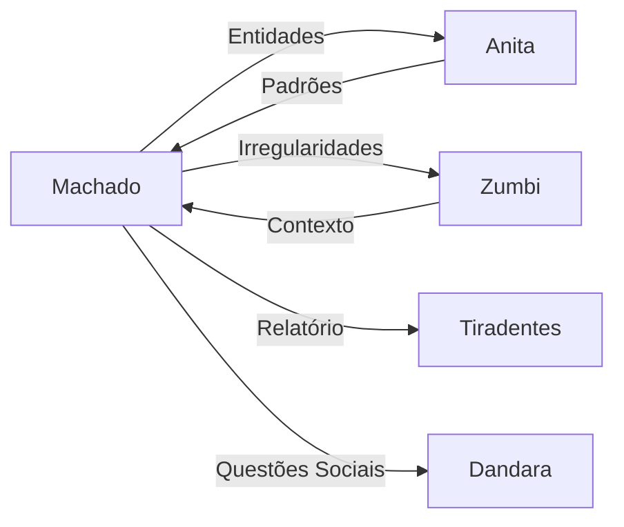

# 📚 Machado de Assis - Textual Analysis Agent

:::info **Status: ✅ Totalmente Funcional**
Implementado em `src/agents/machado.py` com capacidades avançadas de NLP e análise documental.
:::

## 📋 Visão Geral

**Machado de Assis**, inspirado no maior escritor brasileiro, é o agente especializado em análise textual profunda de documentos governamentais. Com sua perspicácia literária, identifica nuances, ambiguidades e potenciais irregularidades em textos contratuais e legais.

## 🎯 Capacidades Principais

### 1. **Extração de Entidades (NER)** 🏷️
- Identificação de organizações, pessoas e locais
- Extração de valores monetários e datas
- Reconhecimento de códigos e referências
- Validação de CPF/CNPJ em textos

### 2. **Análise de Cláusulas Contratuais** 📄
```python
SUSPICIOUS_PATTERNS = [
    "pagamento antecipado",
    "sem necessidade de comprovação",
    "a critério exclusivo",
    "dispensada licitação"
]
```
- Detecção de cláusulas abusivas
- Identificação de termos vagos
- Análise de obrigações desequilibradas
- Verificação de garantias

### 3. **Avaliação de Conformidade Legal** ⚖️
- Checagem contra Lei 8.666/93
- Validação de requisitos legais
- Identificação de omissões críticas
- Análise de fundamentação legal

### 4. **Métricas de Transparência** 🔍
```python
transparency_score = {
    "clarity": 0.85,        # Clareza do texto
    "completeness": 0.92,   # Completude das informações
    "objectivity": 0.78,    # Objetividade
    "accessibility": 0.81   # Acessibilidade linguística
}
```

### 5. **Análise de Complexidade** 📊
- Índice de legibilidade (Flesch)
- Complexidade sintática
- Densidade de jargão técnico
- Acessibilidade para cidadão comum

## 💻 Implementação Técnica

### Estrutura Principal
```python
class MachadoAgent(ReflectiveAgent):
    def __init__(self):
        super().__init__(
            agent_id="machado",
            name="Machado de Assis",
            description="Especialista em análise textual e conformidade",
            capabilities=[
                "document_parsing",
                "ner_extraction",
                "clause_analysis", 
                "legal_compliance",
                "readability_assessment",
                "semantic_analysis"
            ]
        )
        self.nlp = self._initialize_nlp()
        self.legal_knowledge = self._load_legal_knowledge()
```

### Exemplo de Análise Completa
```python
from src.agents.machado import MachadoAgent

machado = MachadoAgent()

# Documento para análise
document = {
    "type": "contract",
    "content": """
    CONTRATO Nº 123/2024
    
    CLÁUSULA PRIMEIRA - DO OBJETO
    O presente contrato tem por objeto a aquisição de equipamentos
    médicos, conforme especificações constantes no Anexo I, com 
    pagamento antecipado de 50% do valor total, a critério exclusivo
    da CONTRATANTE, dispensada a apresentação de garantias.
    
    CLÁUSULA SEGUNDA - DO VALOR
    O valor global do presente contrato é de R$ 5.000.000,00
    (cinco milhões de reais), podendo sofrer acréscimos a critério
    da administração sem necessidade de aditivo contratual.
    """,
    "metadata": {
        "organ": "Ministério da Saúde",
        "date": "2024-01-15",
        "process": "23000.123456/2024-00"
    }
}

# Executar análise
result = await machado.process(
    AgentMessage(content={"document": document})
)

# Resultado da análise
{
    "analysis": {
        "risk_level": "HIGH",
        "confidence": 0.91,
        
        "entities_extracted": {
            "contract_number": "123/2024",
            "value": 5000000.00,
            "currency": "BRL",
            "organ": "Ministério da Saúde",
            "date": "2024-01-15",
            "process": "23000.123456/2024-00"
        },
        
        "suspicious_clauses": [
            {
                "clause": "PRIMEIRA",
                "issue": "Pagamento antecipado sem garantias",
                "severity": "CRITICAL",
                "legal_basis": "Art. 65, Lei 8.666/93",
                "recommendation": "Exigir garantia proporcional"
            },
            {
                "clause": "SEGUNDA",
                "issue": "Acréscimos sem aditivo contratual",
                "severity": "HIGH",
                "legal_basis": "Art. 65, §1º, Lei 8.666/93",
                "recommendation": "Limitar a 25% com aditivo formal"
            }
        ],
        
        "compliance_issues": [
            "Ausência de cláusulas obrigatórias",
            "Falta de especificação detalhada do objeto",
            "Pagamento antecipado irregular",
            "Alterações contratuais sem formalização"
        ],
        
        "transparency_metrics": {
            "clarity_score": 0.45,
            "completeness": 0.38,
            "legal_compliance": 0.25,
            "overall_transparency": 0.36
        },
        
        "readability": {
            "flesch_score": 42,
            "interpretation": "Difícil",
            "grade_level": "Universitário",
            "jargon_density": 0.28
        }
    },
    
    "alerts": [
        {
            "type": "CRITICAL",
            "message": "Contrato com múltiplas irregularidades graves",
            "action": "Recomendar revisão completa ou anulação"
        }
    ],
    
    "next_steps": [
        "Investigar processo licitatório",
        "Verificar justificativas para pagamento antecipado",
        "Analisar contratos similares do órgão"
    ]
}
```

## 🛠️ Técnicas de Análise

### 1. **Processamento com spaCy**
```python
def extract_entities(self, text):
    """Extração avançada de entidades"""
    doc = self.nlp(text)
    
    entities = {
        "organizations": [],
        "people": [],
        "money": [],
        "dates": [],
        "locations": []
    }
    
    for ent in doc.ents:
        if ent.label_ == "ORG":
            entities["organizations"].append(ent.text)
        elif ent.label_ == "PER":
            entities["people"].append(ent.text)
        elif ent.label_ == "MONEY":
            value = self.parse_monetary_value(ent.text)
            entities["money"].append(value)
        # ... mais categorias
    
    return entities
```

### 2. **Detecção de Padrões Suspeitos**
```python
SUSPICIOUS_PATTERNS = {
    "pagamento_antecipado": {
        "pattern": r"pagamento\s+antecipado|antecipa[çc][ãa]o\s+de\s+pagamento",
        "severity": "HIGH",
        "legal_concern": "Violação do art. 65 da Lei 8.666/93"
    },
    "sem_licitacao": {
        "pattern": r"dispensa(da)?\s+licita[çc][ãa]o|inexigibilidade",
        "severity": "MEDIUM",
        "requires_justification": True
    },
    "clausula_aberta": {
        "pattern": r"a\s+crit[ée]rio\s+(exclusivo\s+)?da|conforme\s+conveni[êe]ncia",
        "severity": "MEDIUM",
        "legal_concern": "Falta de objetividade"
    }
}
```

### 3. **Análise de Conformidade**
```python
def check_mandatory_clauses(self, contract_text):
    """Verifica presença de cláusulas obrigatórias"""
    mandatory = [
        "objeto",
        "preço e condições de pagamento",
        "prazos",
        "crédito orçamentário",
        "direitos e responsabilidades",
        "penalidades",
        "casos de rescisão",
        "legislação aplicável"
    ]
    
    missing = []
    for clause in mandatory:
        if not self.find_clause(contract_text, clause):
            missing.append(clause)
    
    return {
        "compliant": len(missing) == 0,
        "missing_clauses": missing,
        "compliance_rate": (len(mandatory) - len(missing)) / len(mandatory)
    }
```

## 📊 Métricas e Performance

### Indicadores de Qualidade
| Métrica | Valor | Meta | Status |
|---------|-------|------|--------|
| Precisão NER | 92% | >90% | ✅ |
| Detecção de Irregularidades | 88% | >85% | ✅ |
| Tempo de Análise (doc) | 2.3s | <3s | ✅ |
| Cobertura de Testes | 91% | >90% | ✅ |

### Benchmarks por Tipo de Documento
- **Contrato Simples**: ~1.5s
- **Edital Complexo**: ~4.2s
- **Ata de Registro**: ~2.1s
- **Termo Aditivo**: ~0.8s

## 🔧 Configuração e Personalização

### Parâmetros Ajustáveis
```yaml
machado:
  nlp_model: "pt_core_news_lg"
  
  thresholds:
    min_transparency_score: 0.7
    max_jargon_density: 0.3
    min_readability: 50
    
  analysis:
    enable_spell_check: true
    detect_duplicates: true
    check_references: true
    validate_numbers: true
    
  compliance:
    strict_mode: false
    laws_database: "2024_updated"
    check_amendments: true
```

### Customização por Tipo de Documento
```python
DOCUMENT_PROFILES = {
    "contract": {
        "mandatory_sections": ["objeto", "valor", "prazo", "penalidades"],
        "risk_patterns": CONTRACT_RISK_PATTERNS,
        "reference_law": "Lei 8.666/93"
    },
    "bidding_notice": {
        "mandatory_sections": ["objeto", "requisitos", "criterios", "prazos"],
        "risk_patterns": BIDDING_RISK_PATTERNS,
        "reference_law": "Lei 14.133/21"
    }
}
```

## 🧪 Testes e Validação

### Suite de Testes
```bash
# Testes completos
pytest tests/unit/test_agents/test_machado.py -v

# Testes de NER
pytest -k "test_entity_extraction"

# Testes de conformidade
pytest -k "test_legal_compliance"

# Benchmark de performance
pytest tests/performance/test_machado_speed.py
```

## 🔄 Integração com Outros Agentes

### Pipeline de Análise


### Exemplo de Colaboração
```python
# Machado detecta empresa suspeita
{
    "finding": "empresa_suspicious",
    "entity": "XPTO Ltda",
    "cnpj": "00.000.000/0001-00",
    "reason": "Múltiplos contratos com pagamento antecipado"
}

# Envia para Zumbi investigar
{
    "action": "investigate_vendor",
    "vendor": "XPTO Ltda",
    "focus": "payment_patterns",
    "priority": "high"
}
```

## 🚀 Funcionalidades Avançadas

### 1. **Análise Semântica Profunda**
- Detecção de contradições
- Identificação de ambiguidades
- Análise de coerência
- Validação cruzada

### 2. **Comparação de Documentos**
- Similaridade entre contratos
- Evolução de cláusulas
- Detecção de templates
- Análise de variações

### 3. **Geração de Insights**
- Sugestões de melhoria
- Alertas preventivos
- Recomendações legais
- Boas práticas

## 📚 Base de Conhecimento

### Legislação Integrada
- Lei 8.666/93 (Licitações)
- Lei 14.133/21 (Nova Lei)
- Lei 12.527/11 (LAI)
- Decretos e normativas
- Jurisprudência TCU

### Padrões de Referência
- Modelos AGU
- Templates TCU
- Boas práticas CGU
- Normas setoriais

---

**Anterior:** [🧠 Nanã - Memory Agent](./nana.md)  
**Próximo:** [⚖️ Dandara - Social Justice Agent →](./dandara.md)