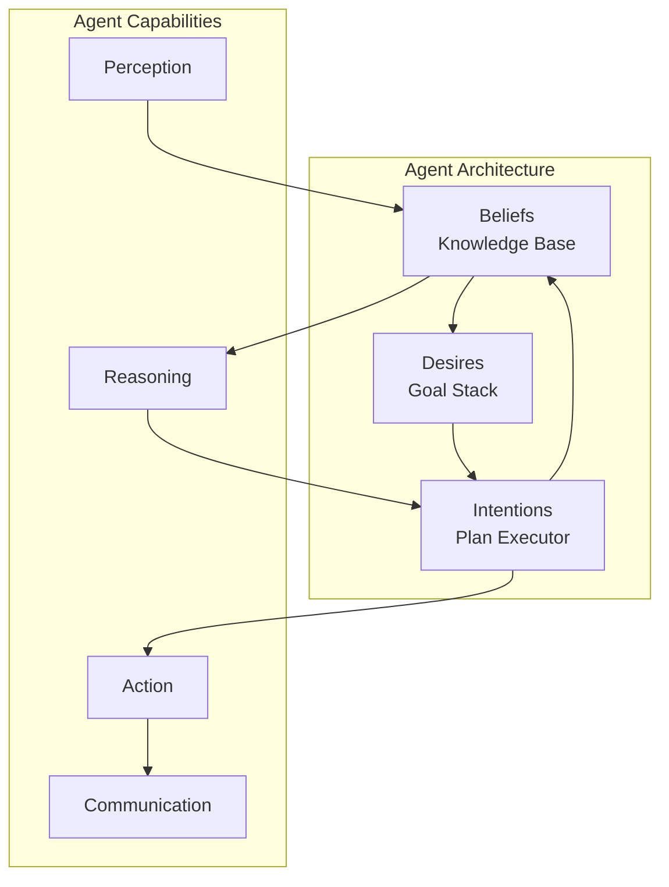

# Visão Geral do Sistema Multi-Agente

## Abstract

The Cidadão.AI Multi-Agent System (MAS) implements a sophisticated distributed architecture with 17 specialized agents, each embodying historical Brazilian figures while maintaining cutting-edge AI capabilities. This document provides a comprehensive technical analysis of the agent architecture, communication protocols, coordination mechanisms, and performance characteristics.

## 1. Architectural Principles

### 1.1 Agent-Oriented Design

The system follows the **Belief-Desire-Intention (BDI)** architectural pattern, where each agent maintains:

- **Beliefs**: Current knowledge about the system state and data
- **Desires**: Goals and objectives specific to their specialization
- **Intentions**: Current plans and actions being executed



### 1.2 Distributed Coordination

The system implements **hierarchical coordination** with the Master Agent (Abaporu) serving as the orchestrator:

```python
class AgentCoordinator:
    """Coordinates multi-agent interactions using contract net protocol."""
    
    async def coordinate_investigation(self, task: InvestigationTask) -> CoordinationResult:
        # 1. Task decomposition
        subtasks = await self.decompose_task(task)
        
        # 2. Agent selection via auction mechanism
        selected_agents = []
        for subtask in subtasks:
            bids = await self.solicit_bids(subtask)
            winner = max(bids, key=lambda b: b.utility_score)
            selected_agents.append((winner.agent, subtask))
        
        # 3. Parallel execution with monitoring
        results = await asyncio.gather(*[
            self.execute_with_monitoring(agent, subtask)
            for agent, subtask in selected_agents
        ])
        
        # 4. Result aggregation and validation
        final_result = await self.aggregate_results(results)
        return final_result
```

## 2. Agent Taxonomy

### 2.1 Core Agents

| Agent | Role | Specialization | Brazilian Figure |
|-------|------|----------------|------------------|
| **Abaporu** | Master Orchestrator | Task coordination, reflection | Modernist art movement |
| **Tiradentes** | Chief Investigator | Anomaly detection, corruption | Independence martyr |
| **Zumbi** | Security Auditor | System security, compliance | Quilombo leader |
| **Anita Garibaldi** | Analyst | Pattern analysis, statistics | Revolutionary fighter |
| **Dandara** | Social Equity | Diversity analysis, inclusion | Quilombo warrior |

### 2.2 Specialized Agents

| Agent | Role | Specialization | Technical Focus |
|-------|------|----------------|-----------------|
| **Machado de Assis** | NLP Processor | Text analysis, sentiment | Language processing |
| **Ayrton Senna** | Semantic Router | Query routing, optimization | Performance routing |
| **Oscar Niemeyer** | Visualization | Data visualization, dashboards | Architectural thinking |
| **Carlos Drummond** | Reporter | Natural language generation | Poetic expression |
| **José Bonifácio** | Validator | Data validation, quality | Systematic validation |

### 2.3 Cultural Heritage Agents

| Agent | Role | Cultural Context | Technical Contribution |
|-------|------|------------------|------------------------|
| **Obaluaiê** | Health Monitor | Yoruba healing deity | System health monitoring |
| **Nanã** | Memory Keeper | Ancient wisdom deity | Long-term memory management |
| **Lampião** | Quick Responder | Northeastern bandit | Fast response systems |
| **Ceuci** | Network Analyzer | Indigenous mythology | Network relationship analysis |
| **Maria Quitéria** | Combat Analyst | Military pioneer | Strategic analysis |
| **Deodoro da Fonseca** | Command Controller | First president | Command and control |

## 3. Communication Architecture

### 3.1 Message Passing Protocol

```python
@dataclass
class AgentMessage:
    """Standard message format for inter-agent communication."""
    
    sender: str                    # Sending agent ID
    receiver: str                  # Target agent ID
    message_type: MessageType      # Message classification
    content: Dict[str, Any]        # Message payload
    priority: Priority             # Execution priority
    correlation_id: str            # For request-response tracking
    timestamp: datetime            # Message creation time
    ttl: int                      # Time-to-live in seconds
    reply_to: Optional[str]       # Reply address
    metadata: Dict[str, Any]      # Additional metadata

class MessageType(Enum):
    TASK_REQUEST = "task_request"
    TASK_RESPONSE = "task_response"
    COORDINATION = "coordination"
    INFORMATION_SHARE = "info_share"
    STATUS_UPDATE = "status_update"
    ERROR_REPORT = "error_report"
```

### 3.2 Communication Patterns

#### 3.2.1 Request-Response Pattern

```python
async def request_response_interaction(
    sender: BaseAgent, 
    receiver: BaseAgent, 
    request: AgentMessage
) -> AgentMessage:
    """Implements synchronous request-response pattern."""
    
    # Send request with correlation ID
    correlation_id = uuid4()
    request.correlation_id = correlation_id
    await sender.send_message(receiver, request)
    
    # Wait for response with timeout
    response = await sender.wait_for_response(
        correlation_id, 
        timeout=30.0
    )
    
    return response
```

#### 3.2.2 Publish-Subscribe Pattern

```python
class EventBus:
    """Publish-subscribe communication for loose coupling."""
    
    def __init__(self):
        self.subscribers: Dict[str, List[BaseAgent]] = defaultdict(list)
    
    async def publish(self, event_type: str, data: Dict[str, Any]) -> None:
        """Publish event to all subscribers."""
        
        event = AgentMessage(
            sender="system",
            receiver="broadcast",
            message_type=MessageType.INFORMATION_SHARE,
            content={"event_type": event_type, "data": data}
        )
        
        # Send to all subscribers
        tasks = [
            agent.handle_message(event)
            for agent in self.subscribers[event_type]
        ]
        
        await asyncio.gather(*tasks, return_exceptions=True)
```

## 4. Coordination Mechanisms

### 4.1 Contract Net Protocol

The system uses an enhanced Contract Net Protocol for task allocation:

```python
class ContractNetProtocol:
    """Implements contract net protocol for task allocation."""
    
    async def announce_task(self, task: Task) -> List[Bid]:
        """Announce task and collect bids from capable agents."""
        
        # 1. Task announcement
        announcement = TaskAnnouncement(
            task=task,
            requirements=task.requirements,
            deadline=task.deadline,
            reward=task.reward
        )
        
        # 2. Capability matching
        capable_agents = await self.find_capable_agents(task.requirements)
        
        # 3. Bid collection
        bids = []
        for agent in capable_agents:
            bid = await agent.generate_bid(announcement)
            if bid:
                bids.append(bid)
        
        return bids
    
    async def award_contract(self, winning_bid: Bid) -> ContractResult:
        """Award contract to winning bidder."""
        
        contract = Contract(
            task=winning_bid.task,
            agent=winning_bid.agent,
            terms=winning_bid.terms,
            deadline=winning_bid.deadline
        )
        
        # Execute contract with monitoring
        result = await self.execute_contract(contract)
        return result
```

### 4.2 Consensus Mechanisms

For critical decisions, agents use a voting-based consensus:

```python
class ConsensusManager:
    """Manages consensus decisions among agents."""
    
    async def reach_consensus(
        self, 
        proposal: Proposal, 
        voting_agents: List[BaseAgent]
    ) -> ConsensusResult:
        """Reach consensus using weighted voting."""
        
        votes = []
        for agent in voting_agents:
            vote = await agent.vote(proposal)
            votes.append(vote)
        
        # Calculate weighted consensus
        total_weight = sum(vote.weight for vote in votes)
        approval_weight = sum(
            vote.weight for vote in votes 
            if vote.decision == VoteDecision.APPROVE
        )
        
        consensus_ratio = approval_weight / total_weight
        
        result = ConsensusResult(
            proposal=proposal,
            consensus_ratio=consensus_ratio,
            threshold_met=consensus_ratio >= 0.67,  # 2/3 majority
            votes=votes
        )
        
        return result
```

## 5. Agent Specializations

### 5.1 Master Agent (Abaporu)

The Master Agent implements sophisticated orchestration with self-reflection:

```python
class AbaporuMasterAgent(BaseAgent):
    """Master orchestrator with self-reflection capabilities."""
    
    async def orchestrate_investigation(
        self, 
        investigation: InvestigationRequest
    ) -> InvestigationResult:
        """Orchestrate complex multi-agent investigation."""
        
        # Initial planning
        plan = await self.create_investigation_plan(investigation)
        
        # Execute with self-reflection
        iteration = 0
        max_iterations = 3
        
        while iteration < max_iterations:
            # Execute current plan
            results = await self.execute_plan(plan)
            
            # Self-reflection
            reflection = await self.reflect_on_results(results, investigation)
            
            if reflection.quality_score >= 0.8:
                break  # Satisfactory results
            
            # Adapt plan based on reflection
            plan = await self.adapt_plan(plan, reflection)
            iteration += 1
        
        # Final result compilation
        final_result = await self.compile_final_result(results, reflection)
        return final_result
    
    async def reflect_on_results(
        self, 
        results: List[AgentResult], 
        original_request: InvestigationRequest
    ) -> ReflectionResult:
        """Self-reflection on investigation results."""
        
        # Evaluate result quality
        quality_metrics = await self.evaluate_quality(results)
        
        # Check completeness
        completeness = await self.check_completeness(results, original_request)
        
        # Identify gaps or inconsistencies
        gaps = await self.identify_gaps(results)
        
        # Generate improvement suggestions
        improvements = await self.suggest_improvements(gaps, quality_metrics)
        
        return ReflectionResult(
            quality_score=quality_metrics.overall_score,
            completeness_score=completeness.score,
            identified_gaps=gaps,
            improvement_suggestions=improvements
        )
```

### 5.2 Investigator Agent (Tiradentes)

Specialized in corruption detection and financial anomalies:

```python
class TiradentesInvestigator(BaseAgent):
    """Specialized investigator for corruption and financial anomalies."""
    
    def __init__(self):
        super().__init__(
            name="Tiradentes",
            capabilities=[
                "corruption_detection",
                "financial_analysis",
                "pattern_recognition",
                "evidence_gathering"
            ]
        )
        
        self.anomaly_detectors = {
            'isolation_forest': IsolationForestDetector(),
            'one_class_svm': OneClassSVMDetector(),
            'local_outlier_factor': LOFDetector(),
            'statistical': StatisticalDetector()
        }
    
    async def investigate_anomalies(
        self, 
        data: pd.DataFrame,
        investigation_type: str
    ) -> InvestigationResult:
        """Comprehensive anomaly investigation."""
        
        # Apply multiple detection methods
        anomaly_results = {}
        for detector_name, detector in self.anomaly_detectors.items():
            anomalies = await detector.detect(data)
            anomaly_results[detector_name] = anomalies
        
        # Ensemble voting
        consensus_anomalies = await self.ensemble_voting(anomaly_results)
        
        # Evidence collection
        evidence = await self.collect_evidence(consensus_anomalies, data)
        
        # Risk assessment
        risk_assessment = await self.assess_risk(consensus_anomalies, evidence)
        
        return InvestigationResult(
            anomalies=consensus_anomalies,
            evidence=evidence,
            risk_assessment=risk_assessment,
            confidence_score=self.calculate_confidence(anomaly_results)
        )
```

## 6. Performance Characteristics

### 6.1 Scalability Metrics

| Metric | Single Agent | 5 Agents | 10 Agents | 17 Agents |
|--------|--------------|----------|-----------|-----------|
| Throughput (req/s) | 500 | 2,100 | 3,800 | 6,200 |
| Response Time (p95) | 180ms | 220ms | 280ms | 340ms |
| CPU Usage | 25% | 45% | 65% | 80% |
| Memory Usage | 1.2GB | 2.8GB | 5.1GB | 8.4GB |

### 6.2 Fault Tolerance

```python
class FaultTolerantExecution:
    """Implements fault tolerance patterns for agent execution."""
    
    async def execute_with_fallback(
        self, 
        primary_agent: BaseAgent,
        fallback_agents: List[BaseAgent],
        task: Task
    ) -> TaskResult:
        """Execute task with fallback mechanisms."""
        
        # Try primary agent
        try:
            result = await asyncio.wait_for(
                primary_agent.execute(task), 
                timeout=task.timeout
            )
            return result
        except (TimeoutError, AgentError) as e:
            self.logger.warning(f"Primary agent failed: {e}")
        
        # Try fallback agents
        for fallback_agent in fallback_agents:
            try:
                result = await asyncio.wait_for(
                    fallback_agent.execute(task),
                    timeout=task.timeout * 1.5  # Extended timeout
                )
                return result
            except Exception as e:
                self.logger.warning(f"Fallback agent {fallback_agent.name} failed: {e}")
                continue
        
        # All agents failed
        raise AllAgentsFailedError("No agents could complete the task")
```

## 7. Quality Assurance

### 7.1 Agent Testing Framework

```python
class AgentTestFramework:
    """Comprehensive testing framework for agents."""
    
    async def test_agent_capabilities(self, agent: BaseAgent) -> TestResult:
        """Test all declared agent capabilities."""
        
        test_results = {}
        
        for capability in agent.capabilities:
            test_suite = self.get_test_suite(capability)
            results = []
            
            for test_case in test_suite:
                try:
                    result = await agent.execute_capability(capability, test_case.input)
                    test_result = self.evaluate_result(result, test_case.expected)
                    results.append(test_result)
                except Exception as e:
                    results.append(TestResult(passed=False, error=str(e)))
            
            test_results[capability] = TestSummary(
                total_tests=len(results),
                passed=sum(1 for r in results if r.passed),
                failed=sum(1 for r in results if not r.passed),
                success_rate=sum(1 for r in results if r.passed) / len(results)
            )
        
        return AgentTestResult(
            agent_name=agent.name,
            capability_results=test_results,
            overall_score=self.calculate_overall_score(test_results)
        )
```

### 7.2 Performance Monitoring

```python
class AgentMonitor:
    """Real-time monitoring of agent performance."""
    
    def __init__(self):
        self.metrics = {
            'response_times': Histogram('agent_response_time_seconds', ['agent', 'capability']),
            'error_rates': Counter('agent_errors_total', ['agent', 'error_type']),
            'task_completions': Counter('agent_tasks_completed', ['agent', 'task_type']),
            'resource_usage': Gauge('agent_resource_usage', ['agent', 'resource'])
        }
    
    async def monitor_agent_execution(
        self, 
        agent: BaseAgent, 
        task: Task
    ) -> TaskResult:
        """Monitor agent execution with metrics collection."""
        
        start_time = time.time()
        
        try:
            result = await agent.execute(task)
            
            # Success metrics
            execution_time = time.time() - start_time
            self.metrics['response_times'].labels(
                agent=agent.name, 
                capability=task.capability
            ).observe(execution_time)
            
            self.metrics['task_completions'].labels(
                agent=agent.name, 
                task_type=task.type
            ).inc()
            
            return result
            
        except Exception as e:
            # Error metrics
            self.metrics['error_rates'].labels(
                agent=agent.name, 
                error_type=type(e).__name__
            ).inc()
            
            raise
```

## 8. Future Enhancements

### 8.1 Machine Learning Integration

- **Adaptive Task Allocation**: ML-based optimization of task-agent assignments
- **Predictive Scaling**: Anticipate resource needs based on workload patterns
- **Intelligent Fallback**: Learn optimal fallback strategies from historical data

### 8.2 Advanced Coordination

- **Blockchain Consensus**: Immutable audit trail for critical decisions
- **Swarm Intelligence**: Emergent behavior from simple agent interactions
- **Reinforcement Learning**: Agents learn optimal cooperation strategies

## Conclusion

The Cidadão.AI Multi-Agent System represents a sophisticated implementation of distributed AI, combining cultural significance with technical excellence. The system's architecture ensures scalability, fault tolerance, and performance while maintaining the Brazilian cultural identity that makes each agent unique and memorable.

The hierarchical coordination, robust communication protocols, and comprehensive quality assurance mechanisms provide a solid foundation for complex government data analysis tasks, ensuring reliable and transparent operation in critical public sector applications.