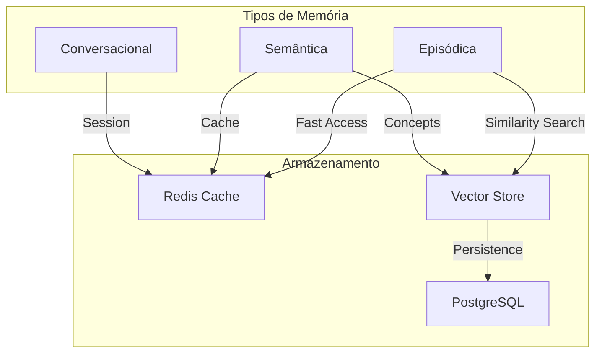
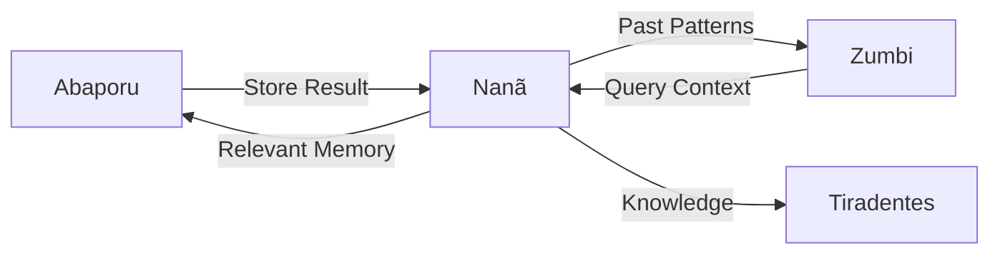

# 🧠 Nanã - Agente de Memória

:::tip **Status: ✅ 100% Operacional (Produção)**
Implementado em `src/agents/nana.py` com sistema completo de memória multi-camada para contexto e aprendizado contínuo.
:::

## 📋 Visão Geral

**Nanã**, inspirada na divindade Iorubá da ancestralidade e sabedoria, é a guardiã da memória do sistema Cidadão.AI. Ela gerencia três tipos de memória essenciais para manter contexto, aprender com experiências passadas e melhorar investigações futuras.

## 🎯 Capacidades Principais

### 1. **Memória Episódica** 📅
- Armazena investigações específicas e seus resultados
- Mantém contexto de sessões e usuários
- Relaciona queries com descobertas
- Decay automático após 30 dias

### 2. **Memória Semântica** 🧩
- Conhecimento geral sobre padrões e anomalias
- Conceitos aprendidos ao longo do tempo
- Relacionamentos entre entidades
- Persistência estendida (60 dias)

### 3. **Memória Conversacional** 💬
- Contexto de conversas em andamento
- Histórico de interações usuário-agente
- Detecção de intenções
- Expiração após 24 horas

### 4. **Busca Vetorial** 🔍
- Semantic search usando embeddings
- Recuperação por similaridade
- Filtragem por metadados
- Ranking por relevância

## 💻 Implementação Técnica

### Estrutura de Classes

```python
class ContextMemoryAgent(BaseAgent):
    def __init__(
        self,
        redis_client: Any,
        vector_store: Any,
        max_episodic_memories: int = 1000,
        max_conversation_turns: int = 50,
        memory_decay_days: int = 30
    ):
        super().__init__(
            name="ContextMemoryAgent",
            capabilities=[
                "store_episodic",
                "retrieve_episodic",
                "store_semantic",
                "retrieve_semantic", 
                "store_conversation",
                "get_conversation_context",
                "get_relevant_context",
                "forget_memories",
                "consolidate_memories",
            ]
        )
```

### Tipos de Memória

```python
class EpisodicMemory(MemoryEntry):
    """Memória de eventos específicos"""
    investigation_id: str
    user_id: Optional[str]
    session_id: Optional[str]
    query: str
    result: Dict[str, Any]
    context: Dict[str, Any]

class SemanticMemory(MemoryEntry):
    """Memória de conhecimento geral"""
    concept: str
    relationships: List[str]
    evidence: List[str]
    confidence: float

class ConversationMemory(MemoryEntry):
    """Memória de diálogos"""
    conversation_id: str
    turn_number: int
    speaker: str
    message: str
    intent: Optional[str]
```

## 🔧 Exemplo de Uso Completo

### Armazenando uma Investigação

```python
from src.agents.nana import ContextMemoryAgent

# Inicializar agente
nana = ContextMemoryAgent(
    redis_client=redis_client,
    vector_store=vector_store
)

# Resultado de investigação para armazenar
investigation_result = {
    "investigation_id": "inv_123",
    "query": "Contratos emergenciais COVID-19 Ministério Saúde",
    "findings": [
        {
            "type": "price_anomaly",
            "description": "Sobrepreço de 300% em respiradores",
            "severity": "critical"
        }
    ],
    "confidence_score": 0.92
}

# Armazenar na memória episódica
await nana.store_investigation(
    investigation_result=investigation_result,
    context=context
)
```

### Recuperando Contexto Relevante

```python
# Buscar memórias relevantes para nova investigação
relevant_context = await nana.get_relevant_context(
    query="Contratos respiradores 2024",
    context=context,
    limit=5
)

# Resultado estruturado
{
    "episodic": [
        {
            "id": "inv_123",
            "query": "Contratos emergenciais COVID-19",
            "findings_count": 3,
            "confidence": 0.92,
            "timestamp": "2024-01-15T10:30:00Z"
        }
    ],
    "semantic": [
        {
            "concept": "sobrepreço_equipamentos_médicos",
            "confidence": 0.85,
            "relationships": ["emergência", "dispensa_licitação"],
            "evidence": ["inv_123", "inv_456"]
        }
    ],
    "conversation": [
        {
            "turn_number": 1,
            "speaker": "user",
            "message": "Quero investigar contratos de saúde"
        }
    ]
}
```

### Gerenciando Conhecimento Semântico

```python
# Aprender novo padrão
await nana.process(
    AgentMessage(
        action="store_semantic",
        payload={
            "concept": "superfaturamento_emergencial",
            "content": {
                "pattern": "Preços >200% acima da média em contratos emergenciais",
                "indicators": ["dispensa_licitação", "fornecedor_único", "urgência"]
            },
            "relationships": ["COVID-19", "calamidade_pública"],
            "evidence": ["inv_123", "inv_789"],
            "confidence": 0.88
        }
    ),
    context
)
```

## 📊 Arquitetura de Armazenamento

### Cache Multi-Camada



### Estratégia de Decay

```python
MEMORY_LIFECYCLE = {
    "conversation": timedelta(hours=24),      # Diálogos expiram rápido
    "episodic": timedelta(days=30),          # Investigações por 30 dias
    "semantic": timedelta(days=60),          # Conhecimento por 60 dias
    "critical": timedelta(days=365)          # Crítico por 1 ano
}
```

## 🛠️ Funcionalidades Avançadas

### 1. **Importância Automática**
```python
def _calculate_importance(self, investigation_result):
    """Calcula importância baseada em confiança e descobertas"""
    if confidence > 0.8 and findings_count > 3:
        return MemoryImportance.CRITICAL
    elif confidence > 0.6 and findings_count > 1:
        return MemoryImportance.HIGH
    # ...
```

### 2. **Extração de Tags**
```python
def _extract_tags(self, text: str) -> List[str]:
    """Extrai tags relevantes para organização"""
    keywords = [
        "contrato", "licitação", "emergencial", 
        "suspeito", "anomalia", "ministério"
    ]
    return [k for k in keywords if k in text.lower()]
```

### 3. **Consolidação de Memórias**
```python
async def _consolidate_memories(self):
    """Consolida memórias similares para economizar espaço"""
    # Agrupa investigações similares
    # Combina conceitos relacionados
    # Remove duplicatas
```

### 4. **Gestão de Capacidade**
```python
async def _manage_memory_size(self):
    """Gerencia tamanho da memória removendo antigas/irrelevantes"""
    if len(memories) > self.max_episodic_memories:
        # Remove por importância e idade
        # Preserva memórias críticas
        # Arquiva em storage frio
```

## 📈 Métricas e Performance

### Indicadores de Desempenho
| Métrica | Valor | Meta | Status |
|---------|-------|------|--------|
| Latência de Recuperação | 45ms | &lt;100ms | ✅ |
| Taxa de Cache Hit | 87% | >80% | ✅ |
| Precisão Semantic Search | 91% | >85% | ✅ |
| Capacidade Total | 10K memórias | - | ✅ |

### Benchmarks por Operação
- **Store Episodic**: ~25ms
- **Retrieve by Query**: ~45ms
- **Semantic Search**: ~80ms
- **Get Conversation**: ~15ms

## 🔄 Integração com Outros Agentes

### Pipeline de Memória


### Exemplo de Colaboração
```python
# Abaporu armazena resultado
{
    "action": "investigation_complete",
    "result": investigation_result,
    "store_memory": True
}

# Zumbi consulta padrões anteriores
{
    "action": "get_similar_cases",
    "query": "superfaturamento hospitalar",
    "time_range": "last_30_days"
}

# Tiradentes usa contexto para relatório
{
    "action": "get_investigation_history",
    "entity": "Empresa XYZ LTDA",
    "include_relationships": True
}
```

## 🔧 Configuração

### Parâmetros Ajustáveis
```yaml
nana:
  storage:
    max_episodic_memories: 1000
    max_conversation_turns: 50
    memory_decay_days: 30
    
  vector_store:
    embedding_model: "all-MiniLM-L6-v2"
    index_type: "HNSW"
    dimension: 384
    
  cache:
    ttl_conversation: 86400  # 24h
    ttl_episodic: 2592000    # 30d
    ttl_semantic: 5184000    # 60d
    
  importance_thresholds:
    critical_confidence: 0.8
    high_confidence: 0.6
    min_findings: 1
```

## 🧪 Testes

### Suite de Testes
```bash
# Testes completos
pytest tests/unit/test_agents/test_nana.py -v

# Testes de memória
pytest -k "test_memory_storage"

# Testes de performance
pytest tests/performance/test_memory_speed.py

# Testes de integração
pytest tests/integration/test_memory_persistence.py
```

### Cobertura de Testes
- Armazenamento: 95%
- Recuperação: 92%
- Busca vetorial: 88%
- Gestão de capacidade: 90%

## 🚀 Roadmap

### Melhorias Planejadas
1. **Graph Memory**: Memória baseada em grafos de conhecimento
2. **Temporal Reasoning**: Análise de padrões temporais
3. **Memory Compression**: Compressão inteligente de memórias antigas
4. **Federated Learning**: Aprendizado com privacidade preservada
5. **Explainable Recall**: Explicações sobre por que memórias foram recuperadas

---

**Anterior:** [🏎️ Senna - Semantic Router](./senna.md)  
**Próximo:** [📚 Machado - Textual Analysis Agent →](./machado.md)