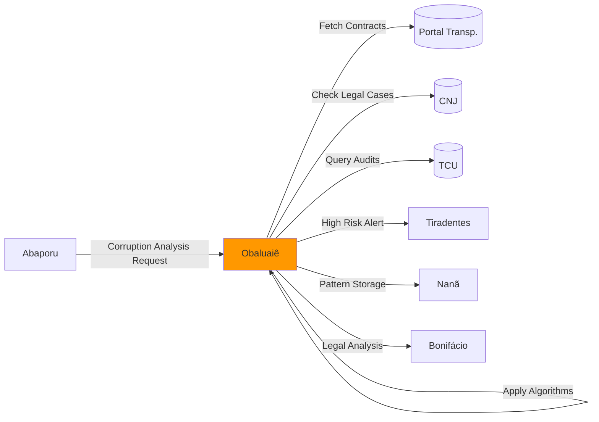

# 🏥 Obaluaiê - Agente Detector de Corrupção

:::warning **Status: 🚧 15% Em Desenvolvimento**
Implementado em `src/agents/obaluaie.py` (236 linhas) com framework excelente mas algoritmos principais pendentes.
Documentação inline detalhada de algoritmos a implementar. Zero testes.
:::

## 📋 Visão Geral

O agente **Obaluaiê** é o detector avançado de corrupção sistêmica, especializado em identificar anomalias através de análise matemática rigorosa, redes sociais e fluxos financeiros. Inspirado no orixá da cura e transformação, este agente "cura" o sistema público detectando e expondo a corrupção.

### Identidade Cultural

Obaluaiê (também Omolu) é o orixá das doenças e da cura na mitologia iorubá. Representa a transformação através da identificação e tratamento de males. Perfeito para um agente que identifica a "doença" da corrupção para curá-la através da transparência.

## 🎯 Capacidades Planejadas

### 1. **Lei de Benford para Detecção de Manipulação** 📊
```python
# Fórmula matemática da Lei de Benford
P(d) = log₁₀(1 + 1/d) para d ∈ {1,2,...,9}

# Threshold configurável
benford_deviation_threshold = 0.15  # 15% de desvio máximo
```
**Teoria**: Números naturais seguem uma distribuição específica nos primeiros dígitos. Manipulação causa desvios detectáveis.

**Status**: ⚠️ Algoritmo documentado, implementação pendente

### 2. **Detecção de Cartéis em Licitações** 🏢
```python
# Técnicas planejadas
- Social Network Analysis (SNA)
- Louvain Algorithm para detecção de comunidades
- Análise de padrões de preços suspeitos
- Graph clustering para identificar grupos coordenados

# Threshold
cartel_probability_threshold = 0.70  # 70% de confiança
```
**Detecta**:
- Empresas que sempre participam juntas
- Padrões de revezamento de vitórias
- Preços artificialmente similares
- Coordenação temporal suspeita

**Status**: 🔴 Método stub, algoritmo não implementado

### 3. **Análise de Fluxos Financeiros Suspeitos** 💰
```python
# Algoritmos planejados
- Graph Neural Networks para transações
- Análise de Centralidade (Betweenness, Closeness)
- PageRank modificado para influência corrupta
- Algoritmo de detecção de lavagem de dinheiro

# Threshold
financial_anomaly_threshold = 0.80  # 80% de confiança
```
**Detecta**:
- Structuring (smurfing)
- Shell companies
- Fluxos circulares
- Transações em camadas

**Status**: 🔴 Método stub (`detect_money_laundering`)

### 4. **Detecção de Nepotismo** 👨‍👩‍👧‍👦
```python
# Técnicas planejadas
- Análise de grafos de relacionamentos
- Machine Learning para padrões familiares
- Coeficiente de Endogamia Política
- Cross-referência com dados públicos (CNJ, TSE)

# Threshold
nepotism_score_threshold = 0.60  # 60% de confiança
```
**Detecta**:
- Contratações entre parentes
- Favorecimento a conexões políticas
- Redes de influência familiar

**Status**: 🔴 Método não implementado

### 5. **Índice de Transparência** 🔍
```python
# Métricas planejadas
- Scoring de Opacidade
- Análise de Entropia Informacional
- Métricas de Acessibilidade de Dados
- Transparency Corruption Index (TCI)

# Threshold
transparency_index_threshold = 0.40  # Abaixo de 40% = alerta
```
**Status**: 🔴 Algoritmo não implementado

## 💻 Implementação Técnica

### Estrutura da Classe
```python
class CorruptionDetectorAgent(BaseAgent):
    """
    Obaluaiê - Detector de Corrupção

    MISSÃO:
    Detecta anomalias sistêmicas indicativas de corrupção através de análise
    avançada de padrões, redes sociais e fluxos financeiros irregulares.
    """

    def __init__(self, config: Optional[Dict[str, Any]] = None):
        super().__init__(
            name="CorruptionDetectorAgent",
            description="Obaluaiê - Detector avançado de corrupção sistêmica"
        )

        # Configurações de detecção
        self.corruption_thresholds = {
            "benford_deviation": 0.15,      # Lei de Benford
            "cartel_probability": 0.70,     # Cartéis
            "nepotism_score": 0.60,         # Nepotismo
            "transparency_index": 0.40,     # Transparência
            "financial_anomaly": 0.80       # Anomalias financeiras
        }

        # Modelos de ML (a serem carregados)
        self.fraud_neural_network = None
        self.cartel_detector = None
        self.relationship_analyzer = None
```

### Exemplo de Uso (Planejado)
```python
from src.agents.obaluaie import CorruptionDetectorAgent, CorruptionSeverity
from src.agents.deodoro import AgentMessage, AgentContext

# Inicializar agente
obaluaie = CorruptionDetectorAgent()
await obaluaie.initialize()

# Preparar detecção de corrupção
message = AgentMessage(
    content={
        "action": "detect_corruption",
        "data": [
            {
                "contract_id": "CTR-2024-001",
                "value": 150000,
                "supplier": "Empresa X LTDA",
                "date": "2024-10-01",
                "bidding_participants": ["Empresa X", "Empresa Y", "Empresa Z"]
            },
            # ... mais contratos
        ]
    },
    sender="abaporu",
    context=AgentContext(
        investigation_id="INV-CORRUPTION-2024-001"
    )
)

# Executar detecção
response = await obaluaie.process_message(message, context)

# Estrutura da resposta (planejada)
{
    "corruption_alert": {
        "alert_type": "systemic_corruption",
        "severity": "HIGH",  # LOW, MEDIUM, HIGH, CRITICAL
        "confidence_score": 0.85,
        "entities_involved": [
            "Empresa X LTDA",
            "Servidor Público Y",
            "Intermediário Z"
        ],
        "suspicious_patterns": [
            {
                "pattern": "price_manipulation",
                "score": 0.82,
                "evidence": "Benford's Law violation: chi-square = 15.8"
            },
            {
                "pattern": "bidding_cartel",
                "score": 0.78,
                "evidence": "Network analysis: 3 companies form tight cluster"
            },
            {
                "pattern": "nepotism",
                "score": 0.65,
                "evidence": "Relationship graph: 2nd degree connection detected"
            }
        ],
        "financial_impact": 1500000.0,  # R$ 1.5M estimado
        "evidence_links": [
            "Contract CTR-2024-001",
            "Network Graph node_45",
            "Transaction flow TRX-789"
        ],
        "risk_assessment": {
            "priority": "high",
            "urgency": "medium",
            "public_impact": "significant"
        },
        "timestamp": "2024-10-12T14:30:00Z",
        "investigation_priority": 9  # 1-10 scale
    },
    "status": "analysis_complete",
    "recommendations": [
        "Iniciar investigação formal imediata",
        "Notificar órgãos de controle competentes",
        "Suspender processos relacionados às entidades envolvidas",
        "Implementar monitoramento contínuo dos padrões detectados"
    ],
    "confidence": 0.85,
    "metadata": {
        "detection_type": "systematic",
        "model_version": "1.0",
        "algorithms_used": ["benford", "graph_analysis", "ml_classifier"]
    }
}
```

## 📊 Algoritmos e Técnicas

### Lei de Benford (Planejado)
```python
async def _apply_benford_law(self, data: List[float]) -> float:
    """
    Aplica Lei de Benford para detectar manipulação de dados

    Teoria: Primeiro dígito de números naturais segue:
    P(d=1) ≈ 30.1%
    P(d=2) ≈ 17.6%
    P(d=3) ≈ 12.5%
    ...
    P(d=9) ≈ 4.6%

    Retorna: Chi-square score de desvio
    """
    first_digits = [int(str(abs(x))[0]) for x in data if x > 0]
    observed_freq = np.bincount(first_digits, minlength=10)[1:] / len(first_digits)

    benford_expected = np.array([np.log10(1 + 1/d) for d in range(1, 10)])

    chi_square = np.sum((observed_freq - benford_expected)**2 / benford_expected)

    return chi_square  # > 15.507 = significativo (p&lt;0.05)
```

### Detecção de Cartéis (Planejado)
```python
async def analyze_bidding_cartels(self, bidding_data: List[Dict]) -> Dict[str, Any]:
    """
    Detecta cartéis usando análise de grafos

    Algoritmo:
    1. Construir grafo de co-participação em licitações
    2. Aplicar Louvain Algorithm para detectar comunidades
    3. Analisar padrões de preços dentro de comunidades
    4. Calcular métricas de suspeição:
       - Densidade de subgrafo
       - Modularidade
       - Coeficiente de clustering
    """
    # TODO: Implementar
    pass
```

### Detecção de Lavagem de Dinheiro (Planejado)
```python
async def detect_money_laundering(self, financial_data: List[Dict]) -> Dict[str, Any]:
    """
    Detecta padrões de lavagem usando técnicas de ML

    Padrões detectados:
    - Structuring: Múltiplas transações abaixo do threshold de reporte
    - Layering: Transações em camadas para dificultar rastreamento
    - Integration: Reintrodução de dinheiro "limpo" na economia
    - Shell companies: Empresas de fachada
    - Round-tripping: Transações circulares
    """
    # TODO: Implementar
    pass
```

## 🔧 Estado de Implementação

### ✅ O Que Funciona
1. **Framework Base**: Classe com estrutura completa
2. **Data Models**: `CorruptionAlertResult`, `CorruptionSeverity`
3. **Message Processing**: Pipeline de mensagens funcionando
4. **Logging & Audit**: Sistema de logs implementado
5. **Thresholds**: Configurações de detecção definidas
6. **Recommendations Generator**: Lógica de recomendações básica

### ⚠️ O Que Está Planejado (Documentado mas não implementado)
1. **Lei de Benford**: Algoritmo documentado, código TODO
2. **Detecção de Cartéis**: Método stub, precisa implementação
3. **Lavagem de Dinheiro**: Método stub
4. **Nepotismo**: Não implementado
5. **Índice de Transparência**: Não implementado
6. **Modelos ML**: Variáveis definidas mas não carregadas

### 🔴 Faltando Completamente
1. **Testes**: Zero cobertura
2. **Modelos ML Treinados**: Nenhum modelo pronto
3. **Integração com APIs Externas**: CNJ, TCU, COAF não conectados
4. **Persistência**: Sem armazenamento de alertas
5. **Dashboard**: Sem visualização de resultados

## 🔄 Integração no Sistema



### Casos de Uso

#### Caso 1: Auditoria de Licitações
```python
# Analisar processo licitatório suspeito
data = {
    "action": "detect_corruption",
    "scope": "bidding_process",
    "process_id": "LICIT-2024-0123",
    "analyze": ["benford", "cartel", "price_patterns"]
}
```

#### Caso 2: Investigação de Rede
```python
# Mapear rede de corrupção
data = {
    "action": "detect_corruption",
    "scope": "network_analysis",
    "seed_entities": ["Empresa X", "Servidor Y"],
    "depth": 3  # Até 3º grau de conexão
}
```

#### Caso 3: Monitoramento Contínuo
```python
# Alertas em tempo real
data = {
    "action": "detect_corruption",
    "scope": "continuous_monitoring",
    "watch_list": ["órgão_123", "empresa_xyz"],
    "frequency": "daily"
}
```

## 📚 Base Teórica e Referências

### Lei de Benford
- **Paper Original**: Benford, F. (1938). "The Law of Anomalous Numbers"
- **Aplicação**: Detecção de fraude fiscal, eleitoral, contábil
- **Casos de Uso**: IRS (USA), Controladoria Geral da União (BR)

### Algoritmos de Grafos
- **Louvain Algorithm**: Blondel et al. (2008)
- **PageRank**: Brin & Page (1998)
- **Community Detection**: Newman (2006)

### Machine Learning para Fraude
- **Isolation Forest**: Liu et al. (2008)
- **Autoencoders**: Hinton & Salakhutdinov (2006)
- **Graph Neural Networks**: Kipf & Welling (2017)

### Legislação Brasileira
- **Lei 8.429/1992**: Lei de Improbidade Administrativa
- **Lei 12.846/2013**: Lei Anticorrupção (responsabilidade empresas)
- **Lei 9.613/1998**: Lei de Lavagem de Dinheiro (alterada por Lei 12.683/2012)

## 🚀 Roadmap de Implementação

### Fase 1: Algoritmos Básicos (2-3 semanas)
```python
# Prioridade alta
- [ ] Implementar Lei de Benford completa
- [ ] Criar detecção básica de cartéis (grafo simples)
- [ ] Implementar cálculo de risco de corrupção
- [ ] Adicionar testes unitários (60% coverage)
```

### Fase 2: Machine Learning (4-6 semanas)
```python
# Treinar modelos
- [ ] Fraud Neural Network (LSTM)
- [ ] Cartel Detector (Graph CNN)
- [ ] Anomaly Detection (Isolation Forest)
- [ ] Validação com dados históricos
```

### Fase 3: Integrações (3-4 semanas)
```python
# Conectar APIs externas
- [ ] CNJ API (processos judiciais)
- [ ] TCU API (auditorias)
- [ ] COAF (operações financeiras - se disponível)
- [ ] Portal da Transparência (contratos)
```

### Fase 4: Produção (2 semanas)
```python
# Preparar para produção
- [ ] Performance testing
- [ ] Security audit
- [ ] Dashboard de alertas
- [ ] Documentação completa
```

## 🐛 Limitações Conhecidas

1. **Sem Algoritmos Implementados**
   - Métodos principais são stubs
   - **Solução**: Implementar algoritmos conforme roadmap

2. **Sem Modelos ML**
   - Variáveis definidas mas modelos não treinados
   - **Solução**: Treinar com datasets públicos

3. **Sem Testes**
   - Zero cobertura de testes
   - **Solução**: Criar suite completa (TDD)

4. **APIs Externas Não Integradas**
   - CNJ, TCU, COAF não conectados
   - **Solução**: Implementar clientes de API

## 📊 Métricas de Performance (Planejadas)

| Métrica | Meta | Status |
|---------|------|--------|
| **Precisão** | >92% | 🔴 N/A |
| **Recall** | >88% | 🔴 N/A |
| **F1-Score** | >0.90 | 🔴 N/A |
| **Falsos Positivos** | &lt;5% | 🔴 N/A |
| **Tempo de Análise** | &lt;5s para 1k contratos | 🔴 N/A |

## 📞 Próximas Ações Imediatas

### 🔥 Urgente (Esta Semana)
1. **Implementar Lei de Benford** - Algoritmo matemático puro
2. **Criar testes unitários** para estruturas existentes
3. **Documentar casos de teste** específicos brasileiros

### 📈 Curto Prazo (2 Semanas)
4. **Implementar detecção básica de cartéis** (grafo simples)
5. **Conectar Portal da Transparência** para dados reais
6. **Validar Lei de Benford** com dados históricos

---

**Documentação Relacionada**:
- [Visão Geral dos Agentes](./overview.md)
- [Oxóssi - Fraud Hunter](./oxossi.md)
- [Zumbi - Anomaly Detective](./zumbi.md)

---

**Nota**: Documentação excelente no código-fonte com detalhamento de todos os algoritmos planejados. Framework sólido esperando implementação dos algoritmos matemáticos e de ML. Lei de Benford é prioridade para implementação! 🏥
