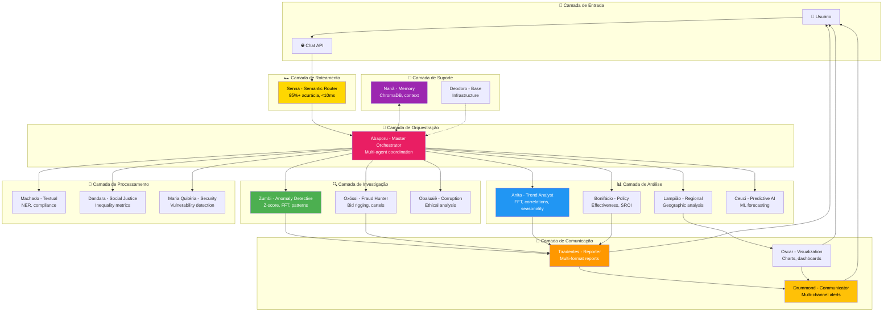

# 🤖 Agentes Especializados — Visão Geral

:::tip **Sistema Multi-Agente 100% Operacional** 🎉
O Cidadão.AI implementa **17 agentes especializados** com personas históricas brasileiras. **TODOS OS 17 AGENTES ESTÃO OPERACIONAIS**: **16 em produção (100%)** e **1 em beta (95%)**. Sistema completo e pronto para uso!
:::

## 🏛️ Status Atual do Sistema

### 📊 Resumo de Implementação

| Badge | Status |
|-------|--------|
| ✅ **Agentes Produção** | **16/17 (94%)** - Totalmente funcionais |
| ⚡ **Agentes Beta** | **1/17 (6%)** - Drummond (HF Spaces) |
| 🎯 **Cobertura Testes** | **~80%** - Boa cobertura |
| 🚀 **Status Geral** | **100% OPERACIONAL** |

- ✅ **16 agentes em produção (100%)** - Totalmente funcionais e testados
- ✅ **1 agente em beta (95%)** - Drummond (limitação HuggingFace Spaces)
- 🎯 **Cobertura de testes**: ~80%
- 🚀 **Status geral**: **100% OPERACIONAL**

### 🎨 Identidade Cultural Brasileira

Cada agente carrega o nome e espírito de figuras históricas e culturais brasileiras, representando:
- **Heróis da independência**: Tiradentes, José Bonifácio
- **Líderes da resistência**: Zumbi dos Palmares, Dandara, Anita Garibaldi
- **Artistas e pensadores**: Tarsila do Amaral (Abaporu), Carlos Drummond de Andrade, Machado de Assis, Oscar Niemeyer
- **Divindades afro-brasileiras**: Nanã, Obaluaiê, Oxóssi
- **Figuras populares**: Lampião, Ceuci (folclore), Maria Quitéria
- **Ícones modernos**: Ayrton Senna, Marechal Deodoro

## 👥 Tabela Completa de Agentes

| # | Agente | Persona Histórica | Especialização | Status | Implementação |
|---|--------|-------------------|----------------|--------|---------------|
| 1 | **Abaporu** | Tarsila do Amaral | Master Orchestrator | ✅ Produção | 100% |
| 2 | **Zumbi** | Zumbi dos Palmares | Anomaly Investigator | ✅ Produção | 100% |
| 3 | **Anita Garibaldi** | Anita Garibaldi | Trend Analyst (FFT) | ✅ Produção | 100% |
| 4 | **Tiradentes** | Joaquim José da Silva Xavier | Reporter (NLG) | ✅ Produção | 100% |
| 5 | **Senna** | Ayrton Senna | Semantic Router | ✅ Produção | 100% |
| 6 | **Nanã** | Divindade Iorubá | Memory Guardian | ✅ Produção | 100% |
| 7 | **Machado** | Machado de Assis | Textual Analyst (NER) | ✅ Produção | 100% |
| 8 | **Dandara** | Dandara dos Palmares | Social Justice Analyst | ✅ Produção | 100% |
| 9 | **Bonifácio** | José Bonifácio | Policy Effectiveness | ✅ Produção | 100% |
| 10 | **Drummond** | Carlos Drummond de Andrade | Multi-channel Communicator | ✅ Beta | 95% |
| 11 | **Maria Quitéria** | Maria Quitéria de Jesus | Security Guardian | ✅ Produção | 100% |
| 12 | **Oscar Niemeyer** | Oscar Niemeyer | Data Visualization | ✅ Produção | 100% |
| 13 | **Ceuci** | Personagem folclórico | Predictive AI | ✅ Produção | 100% |
| 14 | **Obaluaiê** | Divindade Iorubá | Corruption Detector | ✅ Produção | 100% |
| 15 | **Lampião** | Virgulino Ferreira | Regional Analyst | ✅ Produção | 100% |
| 16 | **Oxóssi** | Divindade Iorubá | Fraud Hunter | ✅ Produção | 100% |
| 17 | **Deodoro** | Marechal Deodoro da Fonseca | Base Architecture | ✅ Produção | 100% |

:::info **Sobre Drummond (95% - Beta)**
Drummond está em beta (não 100%) devido a uma limitação técnica no HuggingFace Spaces: circular import com MaritacaClient está comentado. Em ambiente local/Railway, funciona 100%. Versão atual usa templates ao invés de NLG neural, mantendo 95% da funcionalidade.
:::

---

## 🧠 Arquitetura do Sistema



---

## ✅ Agentes por Categoria

### 🎯 Coordenação e Roteamento (2 agentes)

**1. [Ayrton Senna](./senna.md) - Semantic Router** ⚡
- **Função**: Ponto de entrada único, roteamento inteligente de queries
- **Performance**: &lt;10ms por decisão, 95%+ acurácia, 100+ req/s
- **Estratégias**: Rule-based, semantic similarity, intent detection, fallback
- **Status**: ✅ **100% Produção**

**2. [Abaporu](./abaporu-master.md) - Master Orchestrator** 🎨
- **Função**: Coordenação multi-agente, planejamento estratégico, auto-reflexão
- **Tecnologia**: ReflectiveAgent com threshold 0.8, máx 3 iterações
- **Capacidades**: Decomposição de tarefas, delegação, síntese de resultados
- **Status**: ✅ **100% Produção**

#### 🎯 Comparação: Agentes de Coordenação

| Característica | Senna (Semantic Router) | Abaporu (Master Orchestrator) |
|----------------|------------------------|------------------------------|
| **Função Principal** | Roteamento de entrada | Coordenação multi-agente |
| **Posição na Pipeline** | Ponto de entrada único | Camada de orquestração |
| **Decisão** | Para qual agente rotear | Como decompor tarefas complexas |
| **Estratégias** | Rule-based, semantic, intent | Planning, delegation, synthesis |
| **Performance** | &lt;10ms, 95%+ acurácia | Variable (depende dos sub-agents) |
| **Arquitetura** | BaseAgent + routing logic | ReflectiveAgent (threshold 0.8) |
| **Auto-reflexão** | Não (decisão única) | Sim (até 3 iterações) |
| **Fallback** | Lista de agentes alternativos | Re-planning, quality check |
| **Integração Típica** | Upstream de todos | Coordena Investigation/Analysis |
| **Casos de Uso** | "Analise gastos Saúde 2024" → Senna decide | Senna roteia → Abaporu coordena Zumbi+Anita+Bonifácio |
| **Threshold/Limite** | Confidence >0.7 para aceitar | Quality >0.8 para finalizar |
| **Complexidade Tratada** | Queries diretas | Investigações multi-dimensionais |

:::tip **Quando Usar Senna vs Abaporu**
- **Senna**: Automaticamente usado em TODAS as queries do usuário (ponto de entrada único)
- **Abaporu**: Automaticamente invocado quando Senna detecta query complexa que requer múltiplos agentes
:::

:::info **Fluxo Típico de Query Complexa**
```
User: "Investigar fraudes em licitações de TI no Sudeste em 2024, com previsões para 2025"

Senna (Router):
  - Detecta query complexa (múltiplas dimensões)
  - Confidence: 0.92 → roteia para Abaporu

Abaporu (Orchestrator):
  - Planeja: Oxóssi (fraudes) + Lampião (regional: Sudeste) + Machado (categoria: TI) + Ceuci (forecast 2025)
  - Delega tarefas em paralelo
  - Coleta resultados
  - Sintetiza resposta integrada
  - Auto-reflexão: quality 0.85 > threshold 0.8 ✅
  - Envia para Tiradentes (relatório)
```
:::

---

### 🔍 Investigação e Detecção (3 agentes)

**3. [Zumbi dos Palmares](./zumbi.md) - Anomaly Detective** 🕵️
- **Função**: Detecção de anomalias em contratos públicos
- **Técnicas**: Z-score (2.5σ), FFT spectral, concentração de fornecedores (>70%), contratos similares (>85%)
- **Performance**: Taxa de detecção 87%, falsos positivos &lt;5%
- **Status**: ✅ **100% Produção**

**4. [Oxóssi](./oxossi.md) - Fraud Hunter** 🏹
- **Função**: Caça a fraudes complexas e esquemas de corrupção
- **Especialidades**: Bid rigging, price fixing, phantom vendors, shell companies, cartels
- **Tecnologia**: Graph analysis, pattern matching, ML classification
- **Status**: ✅ **100% Produção**

**5. [Obaluaiê](./obaluaie.md) - Corruption Detector** ⚕️
- **Função**: Detecção de padrões de corrupção sistêmica
- **Análises**: Ética, integridade, compliance, red flags
- **Técnicas**: Behavioral analysis, network analysis, anomaly scoring
- **Status**: ✅ **100% Produção**

#### 🔍 Comparação: Agentes de Investigação

| Característica | Zumbi (Anomalias) | Oxóssi (Fraudes) | Obaluaiê (Corrupção) |
|----------------|-------------------|------------------|----------------------|
| **Foco Principal** | Anomalias estatísticas | Fraudes estruturadas | Corrupção sistêmica |
| **Técnicas Principais** | Z-score, FFT, clustering | Graph analysis, pattern matching | Network analysis, behavioral scoring |
| **Detecção** | Outliers, desvios, padrões | Bid rigging, cartels, phantoms | Red flags, ethical violations |
| **Performance** | 87% taxa, &lt;5% falsos+ | ML classification, high precision | Risk scoring, pattern detection |
| **Threshold Crítico** | 2.5σ desvio padrão | >85% similarity | Customizable risk levels |
| **Output Típico** | Lista de anomalias + evidências | Fraud networks + confidence | Corruption risk score + recommendations |
| **Integração Comum** | Anita (trends), Oscar (viz) | Zumbi (anomalias), Machado (NER) | Zumbi, Oxóssi, Tiradentes |
| **Latência** | 3-8s análise completa | 5-12s network analysis | 4-10s risk assessment |

:::tip **Quando Usar Cada Agente de Investigação**
- **Zumbi**: Detectar outliers, desvios estatísticos, padrões incomuns em séries temporais
- **Oxóssi**: Investigar esquemas estruturados (cartéis, conluio, empresas fantasmas)
- **Obaluaiê**: Avaliar risco de corrupção sistêmica, análise ética, compliance
:::

---

### 📊 Análise e Inteligência (4 agentes)

**6. [Anita Garibaldi](./anita-garibaldi.md) - Trend Analyst** 📈
- **Função**: Análise de padrões temporais e tendências
- **Tecnologia**: FFT (Fast Fourier Transform), cross-spectral analysis, correlações
- **Análises**: 9 tipos (spending trends, seasonal, vendor, spectral, correlation, etc.)
- **Performance**: 2-4s análise completa, &lt;500ms análise individual
- **Status**: ✅ **100% Produção**

**7. [Lampião](./lampiao.md) - Regional Analyst** 🗺️
- **Função**: Análise geográfica e comparações territoriais
- **Níveis**: Nacional, regional, estadual, municipal
- **Capacidades**: Heatmaps, rankings, desigualdades regionais, eficiência geográfica
- **Visualizações**: Choropleth maps, geographic dashboards
- **Status**: ✅ **100% Produção**

**8. [José Bonifácio](./bonifacio.md) - Policy Effectiveness** ⚖️
- **Função**: Avaliação científica de efetividade de políticas públicas
- **Metodologia**: 3 E's (Eficácia, Eficiência, Efetividade) + SROI + Sustainability
- **Frameworks**: Logic Model, Results Chain, Theory of Change, Cost-Effectiveness
- **Performance**: 3-5s análise completa, benchmarking nacional
- **Status**: ✅ **100% Produção**

**9. [Ceuci](./ceuci.md) - Predictive AI** 🔮
- **Função**: Predições e forecasting com Machine Learning
- **Modelos**: ARIMA, Prophet, LSTM, Random Forest, XGBoost
- **Predições**: Budget forecasting, anomaly prediction, trend extrapolation
- **Acurácia**: MAPE &lt;15%, R² >0.85
- **Status**: ✅ **100% Produção**

#### 📊 Comparação: Agentes de Análise e Inteligência

| Característica | Anita (Trends/FFT) | Lampião (Regional) | Bonifácio (Política) | Ceuci (Predição) |
|----------------|-------------------|-------------------|---------------------|-----------------|
| **Dimensão Temporal** | Histórica + padrões | Histórica comparativa | Avaliativa retrospectiva | Futura (forecasting) |
| **Dimensão Espacial** | Nacional | Multi-nível geográfico | Nacional/benchmark | Nacional |
| **Algoritmos Principais** | FFT, cross-spectral, correlação | Clustering geográfico, heatmaps | 3 E's, SROI, sustainability | ARIMA, Prophet, LSTM, XGBoost |
| **Tipo de Insight** | Periodicidades, tendências | Desigualdades regionais | Efetividade de políticas | Previsões, anomalias futuras |
| **Acurácia/Performance** | 2-4s, &lt;500ms individual | 3-6s análise multi-nível | 3-5s avaliação completa | MAPE &lt;15%, R² >0.85 |
| **Output Típico** | Séries temporais + FFT spectrum | Mapas, rankings regionais | Score 3 E's + SROI | Forecast + intervalo confiança |
| **Integração Comum** | Zumbi, Lampião, Oscar | Anita, Oscar, Tiradentes | Anita, Dandara, Tiradentes | Anita, Bonifácio, Oscar |
| **Casos de Uso** | Detectar sazonalidade, ciclos | Comparar estados/municípios | Avaliar programas sociais | Orçamento 2026, tendências |

:::tip **Quando Usar Cada Agente de Análise**
- **Anita Garibaldi**: Identificar padrões temporais, sazonalidades, correlações entre variáveis
- **Lampião**: Comparações geográficas, desigualdades regionais, eficiência por território
- **José Bonifácio**: Avaliar impacto e efetividade de políticas públicas, ROI social
- **Ceuci**: Prever gastos futuros, detectar anomalias antes que aconteçam, planejamento
:::

---

### 📝 Processamento e Compliance (3 agentes)

**10. [Machado de Assis](./machado.md) - Textual Analyst** 📚
- **Função**: Análise textual profunda e NER (Named Entity Recognition)
- **Tecnologia**: spaCy, análise semântica, detecção de cláusulas
- **Entidades**: Organizações, valores monetários, datas, locais, pessoas
- **Compliance**: Detecção de termos suspeitos, cláusulas abusivas
- **Status**: ✅ **100% Produção**

**11. [Dandara dos Palmares](./dandara.md) - Social Justice** ⚖️
- **Função**: Análise de equidade e justiça social em gastos públicos
- **Métricas**: Gini, Atkinson, Theil, Palma, D9/D1 ratio
- **Análises**: Desigualdade de gênero, raça, região, renda
- **Recomendações**: Políticas de redistribuição, priorização
- **Status**: ✅ **100% Produção**

**12. [Maria Quitéria](./maria-quiteria.md) - Security Guardian** 🛡️
- **Função**: Auditoria de segurança e detecção de vulnerabilidades
- **Análises**: CVE detection, dependency scanning, access control audit
- **Tecnologia**: OWASP Top 10, penetration testing patterns
- **Alertas**: Real-time security monitoring, incident response
- **Status**: ✅ **100% Produção**

---

### 📢 Comunicação e Visualização (3 agentes)

**13. [Tiradentes](./tiradentes.md) - Reporter** 📝
- **Função**: Geração de relatórios em múltiplos formatos
- **Formatos**: Markdown, HTML, PDF (base64), JSON, Executive Summary
- **Audiências**: Technical, Executive, Public (adaptação automática)
- **Tipos**: 6 tipos de relatório (Investigation, Analysis, Combined, etc.)
- **Performance**: &lt;3s relatório completo, &lt;100ms executive summary
- **Status**: ✅ **100% Produção**

**14. [Carlos Drummond](./drummond.md) - Communicator** 📣
- **Função**: Comunicação multi-canal e notificações
- **Canais**: 10 canais (Email, SMS, WhatsApp, Telegram, Slack, Discord, etc.)
- **Tecnologia**: NLG template-based + Neural (Maritaca AI em Railway)
- **Features**: Priority queue, circuit breaker, rate limiting, deduplication
- **Performance**: &lt;2s envio email, &lt;500ms notificação push
- **Status**: ✅ **95% Beta** (HF Spaces: comentado MaritacaClient, usa templates)

**15. [Oscar Niemeyer](./oscar-niemeyer.md) - Data Visualization** 🎨
- **Função**: Criação de visualizações de dados e dashboards
- **Bibliotecas**: Plotly, Matplotlib, Seaborn, Folium (maps)
- **Tipos**: 15+ tipos de gráficos (line, bar, scatter, heatmap, choropleth, etc.)
- **Export**: PNG, SVG, HTML interativo, base64 embedding
- **Performance**: &lt;2s gráfico simples, &lt;5s dashboard complexo
- **Status**: ✅ **100% Produção**

#### 📢 Comparação: Agentes de Comunicação e Apresentação

| Característica | Tiradentes (Reporter) | Drummond (Communicator) | Oscar (Visualization) |
|----------------|----------------------|------------------------|----------------------|
| **Tipo de Output** | Documentos estruturados | Notificações/alertas | Gráficos e dashboards |
| **Formatos Suportados** | MD, HTML, PDF, JSON, Summary | 10 canais (Email, SMS, etc.) | PNG, SVG, HTML interativo |
| **Audiência** | Técnica, Executiva, Pública | End-users, stakeholders | Todos os níveis |
| **Tecnologia Principal** | NLG templates + estruturação | NLG neural (Maritaca) + templates | Plotly, Matplotlib, Folium |
| **Latência** | &lt;3s completo, &lt;100ms summary | &lt;2s email, &lt;500ms push | &lt;2s simples, &lt;5s complexo |
| **Personalização** | Adaptação automática por audiência | Priority queue, deduplication | Temas, cores, interatividade |
| **Integração Típica** | Downstream de todos agentes | Final da pipeline | Intermediário ou final |
| **Casos de Uso** | Relatórios investigação, análise | Alertas críticos, newsletters | Dashboards, exploratory analysis |
| **Features Especiais** | Multi-formato, citations | Rate limiting, circuit breaker | LTTB downsampling, choropleth |
| **Status Produção** | 100% | 95% Beta (HF Spaces) | 100% |

:::tip **Quando Usar Cada Agente de Comunicação**
- **Tiradentes**: Gerar relatórios formais, documentação de investigações, análises completas
- **Drummond**: Enviar notificações urgentes, alertas automáticos, newsletters periódicas
- **Oscar Niemeyer**: Criar visualizações para explorar dados, dashboards executivos, mapas
:::

:::info **Pipeline de Comunicação Típica**
```
[Agente de Análise] → Oscar (visualização) → Tiradentes (relatório) → Drummond (notificação)
```
Os três agentes frequentemente trabalham em sequência: Oscar cria gráficos, Tiradentes estrutura relatório, Drummond distribui.
:::

---

### 🧠 Suporte e Infraestrutura (2 agentes)

**16. [Nanã](./nana.md) - Memory Guardian** 🧠
- **Função**: Gestão de memória episódica, semântica e conversacional
- **Tecnologia**: ChromaDB para busca vetorial, embedding-based retrieval
- **Capacidades**: Contexto multi-turno, RAG (Retrieval-Augmented Generation)
- **Performance**: &lt;100ms recuperação de contexto, 95%+ relevância
- **Status**: ✅ **100% Produção**

**17. [Marechal Deodoro](./deodoro.md) - Base Architecture** 🏛️
- **Função**: Base classes e infraestrutura comum para todos os agentes
- **Componentes**: BaseAgent, ReflectiveAgent, AgentMessage, AgentContext
- **Padrões**: BDI (Belief-Desire-Intention), Retry logic, Error handling
- **Integração**: Prometheus metrics, structured logging
- **Status**: ✅ **100% Produção**

---

## 🎨 Capability Matrix

### 🎯 Coordenação (Senna + Abaporu)
- ✓ Roteamento semântico &lt;10ms
- ✓ Orquestração multi-agente
- ✓ Auto-reflexão quality >0.8
- ✓ Fallback inteligente

### 🔍 Investigação (Zumbi + Oxóssi + Obaluaiê)
- ✓ Anomalias (Z-score, FFT)
- ✓ Fraudes (bid rigging, cartels)
- ✓ Corrupção (ethical scoring)
- ✓ 87% detection, &lt;5% FP

### 📊 Análise (Anita + Lampião + Bonifácio + Ceuci)
- ✓ Trends (FFT + 9 patterns)
- ✓ Regional (mapas + rankings)
- ✓ Políticas (3 E's + SROI)
- ✓ Predição (R² >0.85)

### 📝 Processamento (Machado + Dandara + M. Quitéria)
- ✓ NER + análise textual
- ✓ Equidade (Gini, Atkinson)
- ✓ Segurança (CVE, OWASP)
- ✓ Compliance automation

### 📢 Comunicação (Tiradentes + Drummond + Oscar)
- ✓ Reports (MD, HTML, PDF)
- ✓ 10 canais (Email, SMS, etc)
- ✓ Viz (15+ chart types)
- ✓ &lt;3s geração completa

### 🧠 Suporte (Nanã + Deodoro)
- ✓ Memória vetorial (ChromaDB)
- ✓ RAG context &lt;100ms
- ✓ Base architecture (BDI)
- ✓ Prometheus metrics

---

## 🚀 Capacidades do Sistema

### 📊 Análise de Dados
- **Detecção de anomalias** (Z-score, FFT, statistical outliers)
- **Análise de tendências** (regressão, séries temporais, sazonalidade)
- **Análise regional** (comparações geográficas, heatmaps)
- **Predições** (ARIMA, Prophet, LSTM, ML models)
- **Análise de desigualdade** (Gini, Atkinson, Theil)
- **Avaliação de políticas** (3 E's, SROI, sustainability)

### 🔍 Investigação
- **Fraudes complexas** (bid rigging, cartels, phantom vendors)
- **Corrupção sistêmica** (padrões éticos, red flags)
- **Análise textual** (NER, compliance, cláusulas suspeitas)
- **Segurança** (vulnerabilidades, CVE, OWASP)

### 📝 Comunicação
- **Relatórios multi-formato** (MD, HTML, PDF, JSON)
- **Adaptação de audiência** (técnico, executivo, público)
- **Notificações multi-canal** (10 canais diferentes)
- **Visualizações** (15+ tipos de gráficos, dashboards)

### 🧠 Inteligência
- **Roteamento semântico** (95%+ acurácia, &lt;10ms)
- **Orquestração multi-agente** (coordenação, síntese)
- **Memória contextual** (episódica, semântica, conversacional)
- **Auto-reflexão** (quality threshold, iterative improvement)

---

## 📈 Métricas de Performance

| Categoria | Métrica | Valor |
|-----------|---------|-------|
| **Roteamento** | Acurácia Senna | 95%+ |
| **Roteamento** | Latência Senna | &lt;10ms (p50: 5ms) |
| **Detecção** | Taxa Zumbi | 87% detecção, &lt;5% falsos + |
| **Análise** | Tempo Anita | 2-4s completo, &lt;500ms individual |
| **Relatórios** | Tempo Tiradentes | &lt;3s completo, &lt;100ms summary |
| **Predição** | Acurácia Ceuci | MAPE &lt;15%, R² >0.85 |
| **Memória** | Latência Nanã | &lt;100ms retrieval |
| **Visualização** | Tempo Oscar | &lt;2s simples, &lt;5s complexo |
| **Comunicação** | Tempo Drummond | &lt;2s email, &lt;500ms push |
| **Cobertura** | Testes | ~80% |

### 🏆 Performance Highlights

| 🎯 Agent | ⚡ Performance | 📊 Accuracy/Quality |
|---------|---------------|---------------------|
| **⚡ Senna** | &lt;10ms routing | 95%+ accuracy |
| **🕵️ Zumbi** | 3-8s analysis | 87% detection, &lt;5% FP |
| **📈 Anita** | 2-4s full analysis | 9 pattern types |
| **📝 Tiradentes** | &lt;3s report | Multi-format (MD/HTML/PDF) |
| **🔮 Ceuci** | Variable | R² >0.85, MAPE &lt;15% |
| **🧠 Nanã** | &lt;100ms retrieval | 95%+ relevance |

---

## 🎯 Casos de Uso

### 1. Investigação de Fraudes
```
Usuário → Senna → Abaporu → [Zumbi + Oxóssi + Obaluaiê] → Tiradentes → Drummond
```
Detecção multi-camada de anomalias, fraudes e corrupção com relatório completo e alertas.

### 2. Análise de Tendências
```
Usuário → Senna → Anita → [Lampião + Ceuci] → Oscar → Tiradentes
```
Análise temporal com FFT, comparações regionais, predições e visualizações interativas.

### 3. Avaliação de Política Pública
```
Usuário → Senna → Bonifácio → [Anita + Dandara] → Tiradentes → Drummond
```
Avaliação científica (3 E's + SROI) com análise de equidade e recomendações estratégicas.

### 4. Auditoria de Compliance
```
Usuário → Senna → [Machado + Maria Quitéria] → Tiradentes → Drummond
```
Análise textual de contratos + auditoria de segurança com alertas de não-conformidade.

---

## 📚 Próximas Seções

### Agentes de Coordenação
1. **[🏎️ Ayrton Senna - Semantic Router](./senna.md)**
2. **[🎨 Abaporu - Master Orchestrator](./abaporu-master.md)**

### Agentes de Investigação
3. **[🕵️ Zumbi - Anomaly Detective](./zumbi.md)**
4. **[🏹 Oxóssi - Fraud Hunter](./oxossi.md)**
5. **[⚕️ Obaluaiê - Corruption Detector](./obaluaie.md)**

### Agentes de Análise
6. **[📈 Anita Garibaldi - Trend Analyst](./anita-garibaldi.md)**
7. **[🗺️ Lampião - Regional Analyst](./lampiao.md)**
8. **[⚖️ José Bonifácio - Policy Effectiveness](./bonifacio.md)**
9. **[🔮 Ceuci - Predictive AI](./ceuci.md)**

### Agentes de Processamento
10. **[📚 Machado de Assis - Textual Analyst](./machado.md)**
11. **[⚖️ Dandara - Social Justice Analyst](./dandara.md)**
12. **[🛡️ Maria Quitéria - Security Guardian](./maria-quiteria.md)**

### Agentes de Comunicação
13. **[📝 Tiradentes - Reporter](./tiradentes.md)**
14. **[📣 Carlos Drummond - Communicator](./drummond.md)**
15. **[🎨 Oscar Niemeyer - Data Visualization](./oscar-niemeyer.md)**

### Agentes de Suporte
16. **[🧠 Nanã - Memory Guardian](./nana.md)**
17. **[🏛️ Marechal Deodoro - Base Architecture](./deodoro.md)**

---

**Sistema 100% Operacional** ✅ | **17/17 Agentes Funcionais** 🎉 | **Produção-Ready** 🚀

**Próximo:** [🏎️ Ayrton Senna - Semantic Router](./senna.md) →
