# 🤖 Agentes Especializados — Visão Geral

:::info **Sistema Multi-Agente com Identidade Brasileira**
O Cidadão.AI implementa **17 agentes especializados** com personas históricas brasileiras. Atualmente, **8 agentes estão totalmente funcionais** (47%), **7 em desenvolvimento** e **1 planejado**.
:::

## 🏛️ Status Atual do Sistema

### 📊 Resumo de Implementação
- ✅ **8 agentes totalmente funcionais** (47%)
- ⚠️ **7 agentes parcialmente implementados** 
- ❌ **1 agente ainda não iniciado**
- 🎯 **Cobertura de testes**: ~80%

## 👥 Tabela de Agentes

| Agente | Persona Histórica | Especialização | Status | Implementação |
|--------|-------------------|----------------|--------|---------------|
| **Abaporu** | Tarsila do Amaral | Orquestração e coordenação | ✅ Funcional | 100% |
| **Zumbi** | Zumbi dos Palmares | Detecção de anomalias | ✅ Funcional | 100% |
| **Anita** | Anita Garibaldi | Análise de padrões | ✅ Funcional | 100% |
| **Tiradentes** | Joaquim José da Silva Xavier | Geração de relatórios | ✅ Funcional | 100% |
| **Senna** | Ayrton Senna | Roteamento semântico | ✅ Funcional | 100% |
| **Nanã** | Divindade Iorubá | Gestão de memória | ✅ Funcional | 100% |
| **Machado** | Machado de Assis | Análise textual e NER | ✅ Funcional | 100% |
| **Dandara** | Dandara dos Palmares | Justiça social e equidade | ✅ Funcional | 100% |
| **Bonifácio** | José Bonifácio | Análise de políticas | ⚠️ Parcial | ~40% |
| **Drummond** | Carlos Drummond de Andrade | Comunicação multicanal | ⚠️ Parcial | ~30% |
| **Quitéria** | Maria Quitéria | Auditoria de segurança | ⚠️ Parcial | ~20% |
| **Niemeyer** | Oscar Niemeyer | Visualização de dados | ⚠️ Parcial | ~20% |
| **Ceuci** | Personagem folclórico | ETL e processamento | ⚠️ Parcial | ~20% |
| **Obaluaiê** | Divindade Iorubá | Monitor de saúde | ⚠️ Parcial | ~20% |
| **Lampião** | Virgulino Ferreira | Análise regional | ⚠️ Parcial | ~20% |
| **[A definir]** | - | - | ❌ Planejado | 0% |

## 🧠 Arquitetura Atual

```mermaid
graph TB
    subgraph "✅ Camada Operacional"
        MA[Abaporu - Orquestrador]
        ZU[Zumbi - Investigador]
        AN[Anita - Analista]
        TI[Tiradentes - Relator]
        SE[Senna - Roteador]
        NA[Nanã - Memória]
        MAC[Machado - Textual]
        DA[Dandara - Social]
    end
    
    subgraph "⚠️ Em Desenvolvimento"
        BO[Bonifácio - Políticas]
        DR[Drummond - Comunicação]
        QU[Quitéria - Segurança]
        NI[Niemeyer - Visualização]
        CE[Ceuci - ETL]
        OB[Obaluaiê - Saúde]
        LA[Lampião - Regional]
    end
    
    MA --> ZU
    MA --> AN
    MA --> TI
    SE --> MA
    NA <--> MA
    MAC --> AN
    DA --> AN
    
    style MA fill:#4CAF50
    style ZU fill:#4CAF50
    style AN fill:#4CAF50
    style TI fill:#4CAF50
    style SE fill:#4CAF50
    style NA fill:#4CAF50
    style MAC fill:#4CAF50
    style DA fill:#4CAF50
    
    style BO fill:#FFC107
    style DR fill:#FFC107
    style QU fill:#FFC107
    style NI fill:#FFC107
    style CE fill:#FFC107
    style OB fill:#FFC107
    style LA fill:#FFC107
```

## ✅ Agentes Funcionais

### 1. **Abaporu** - Master Orchestrator
- **Capacidades**: Planejamento estratégico, coordenação multi-agente, auto-reflexão
- **Tecnologia**: ReflectiveAgent com threshold de qualidade 0.8
- **[Ver documentação completa →](./abaporu.md)**

### 2. **Zumbi dos Palmares** - Anomaly Detective  
- **Capacidades**: Detecção estatística (Z-score), análise espectral (FFT), padrões temporais
- **Métricas**: Taxa de detecção 87%, falsos positivos <5%
- **[Ver documentação completa →](./zumbi.md)**

### 3. **Anita Garibaldi** - Pattern Analyst
- **Capacidades**: Análise de tendências, comportamento organizacional, eficiência
- **Tecnologia**: Regressão linear, análise sazonal
- **[Ver documentação completa →](./anita.md)**

### 4. **Tiradentes** - Report Generator
- **Capacidades**: Geração multi-formato (MD/HTML/PDF/JSON), adaptação por audiência
- **Idiomas**: PT-BR, EN-US
- **[Ver documentação completa →](./tiradentes.md)**

### 5. **Ayrton Senna** - Semantic Router
- **Capacidades**: Roteamento inteligente, detecção de intenção, fallback strategies
- **Tecnologia**: Regex + similaridade semântica
- **[Ver documentação completa →](./senna.md)**

### 6. **Nanã** - Memory Guardian
- **Capacidades**: Memória episódica, semântica e conversacional
- **Tecnologia**: ChromaDB para busca vetorial
- **[Ver documentação completa →](./nana.md)**

### 7. **Machado de Assis** - Textual Master
- **Capacidades**: NER, análise de conformidade, detecção de cláusulas suspeitas
- **Tecnologia**: spaCy, análise semântica
- **[Ver documentação completa →](./machado.md)**

### 8. **Dandara** - Social Justice Warrior
- **Capacidades**: Coeficientes de desigualdade (Gini, Atkinson, Theil, Palma)
- **Foco**: Equidade e inclusão social
- **[Ver documentação completa →](./dandara.md)**

## ⚠️ Agentes em Desenvolvimento

### Prioridade Alta
1. **José Bonifácio** - Estrutura completa, falta implementação da lógica
2. **Carlos Drummond** - Design pronto, precisa integração com canais

### Prioridade Média  
3. **Maria Quitéria** - Estrutura básica criada
4. **Oscar Niemeyer** - Estrutura básica criada
5. **Ceuci** - Estrutura básica criada
6. **Obaluaiê** - Estrutura básica criada
7. **Lampião** - Estrutura básica criada

## 🚀 Roadmap de Implementação

### Q1 2025
- [ ] Completar José Bonifácio (análise de políticas)
- [ ] Finalizar Carlos Drummond (comunicação)
- [ ] Implementar Maria Quitéria (segurança)

### Q2 2025
- [ ] Oscar Niemeyer (visualizações)
- [ ] Ceuci (ETL avançado)
- [ ] Definir e implementar 17º agente

### Q3 2025
- [ ] Obaluaiê (monitoramento)
- [ ] Lampião (análise regional)
- [ ] Sistema completo com 17 agentes

## 📋 Como Contribuir

Veja o [Guia de Contribuição](https://github.com/anderson-ufrj/cidadao.ai-backend/blob/main/CONTRIBUTING.md) para implementar novos agentes.

## 📚 Próximas Seções

1. **[🎨 Abaporu - Master Agent](./abaporu.md)** - Orquestração central
2. **[🔍 Zumbi - Investigator Agent](./zumbi.md)** - Detecção de anomalias
3. **[📊 Anita - Analyst Agent](./anita.md)** - Análise de padrões
4. **[📝 Tiradentes - Reporter Agent](./tiradentes.md)** - Geração de relatórios
5. **[🏎️ Senna - Semantic Router](./senna.md)** - Roteamento inteligente
6. **[🧠 Nanã - Memory Agent](./nana.md)** - Sistema de memória
7. **[📚 Machado - Textual Agent](./machado.md)** - Análise textual
8. **[⚖️ Dandara - Social Justice Agent](./dandara.md)** - Equidade social

---

**Próximo:** [🎨 Abaporu - Master Agent](./abaporu.md) →