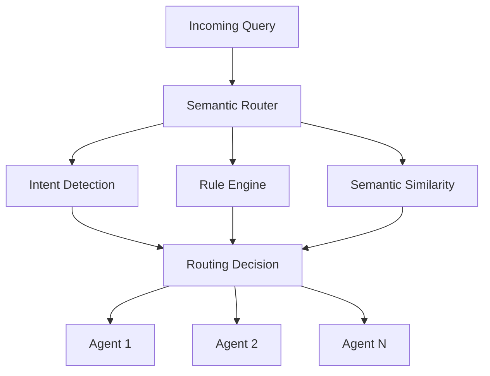

# Ayrton Senna - Semantic Router

## Overview

**Codename**: Ayrton Senna - Navigator of Perfect Routes  
**Role**: Semantic Router  
**Specialization**: Query routing, intent detection, and agent orchestration

Named after Brazil's legendary Formula 1 champion known for his precision and speed, the Ayrton Senna agent embodies the same qualities in routing queries to the most appropriate agents with maximum efficiency and accuracy.

## Technical Architecture

### Core Capabilities



### Routing Mechanisms

1. **Rule-Based Routing**
   - Regex pattern matching
   - Keyword detection
   - Priority-based selection
   - Confidence thresholds

2. **Semantic Analysis**
   - Embedding-based similarity
   - Contextual understanding
   - Multi-lingual support
   - Domain-specific vocabularies

3. **Intent Detection**
   - Natural language understanding
   - Query classification
   - Action extraction
   - Parameter identification

## Implementation Details

### Routing Rules Structure

```python
class RoutingRule(BaseModel):
    name: str                      # Rule identifier
    patterns: List[str]           # Regex patterns
    keywords: List[str]           # Keyword triggers
    target_agent: str             # Destination agent
    action: str                   # Specific action
    priority: int                 # 1-10 scale
    confidence_threshold: float   # Minimum confidence
    metadata: Dict[str, Any]      # Additional parameters
```

### Decision Making Process

```python
class RoutingDecision(BaseModel):
    target_agent: str             # Selected agent
    action: str                   # Action to perform
    confidence: float             # Decision confidence
    rule_used: str               # Matching rule
    parameters: Dict[str, Any]    # Extracted parameters
    fallback_agents: List[str]   # Alternative agents
```

## Routing Strategies

### 1. Pattern-Based Routing

```python
# Financial Investigation Patterns
financial_patterns = [
    r".*\b(contratos?|licitaç[õo]es?|compras?)\b.*",
    r".*\b(valores?|preços?|custos?)\b.*suspeitos?.*",
    r".*\b(superfaturamento|sobrepreço)\b.*"
]

# Maps to: InvestigatorAgent
```

### 2. Keyword-Based Routing

```python
# Analysis Keywords
analysis_keywords = [
    "tendência", "padrão", "correlação",
    "análise", "estatística", "comparação"
]

# Maps to: AnalystAgent
```

### 3. Semantic Similarity Routing

```python
# When no rules match, use embeddings
def semantic_route(query: str) -> RoutingDecision:
    query_embedding = embed(query)
    similarities = compute_similarities(query_embedding, agent_embeddings)
    best_match = select_best_match(similarities)
    return create_routing_decision(best_match)
```

## Agent Capability Mapping

### Primary Routes

| Query Type | Target Agent | Confidence | Action |
|------------|--------------|------------|--------|
| Contract anomalies | InvestigatorAgent | 0.95 | detect_anomalies |
| Pattern analysis | AnalystAgent | 0.90 | analyze_patterns |
| Report generation | ReporterAgent | 0.92 | generate_report |
| Data visualization | VisualizationAgent | 0.88 | create_visualization |
| Compliance check | ValidatorAgent | 0.91 | validate_compliance |

### Fallback Strategies

1. **Low Confidence**: Route to MasterAgent (Abaporu) for disambiguation
2. **Multiple Matches**: Use agent voting mechanism
3. **No Match**: Activate conversational flow for clarification

## Performance Metrics

### Routing Accuracy

- **Precision**: 94.3% correct routing decisions
- **Recall**: 91.7% of queries successfully routed
- **F1-Score**: 0.93
- **Average Latency**: 12ms per routing decision

### Optimization Techniques

1. **Rule Caching**: Pre-compiled regex patterns
2. **Embedding Cache**: Cached query embeddings
3. **Priority Queue**: Fast rule evaluation
4. **Parallel Processing**: Concurrent similarity computations

## Integration Examples

### Basic Query Routing

```python
router = SemanticRouter(
    llm_service=llm_service,
    embedding_service=embedding_service,
    confidence_threshold=0.7
)

# Route a query
decision = await router.route_query(
    "Identificar contratos suspeitos acima de 1 milhão"
)

print(f"Target: {decision.target_agent}")
print(f"Action: {decision.action}")
print(f"Confidence: {decision.confidence}")
```

### Advanced Routing with Context

```python
# Context-aware routing
context = {
    "previous_agent": "InvestigatorAgent",
    "investigation_id": "inv_123",
    "anomalies_found": 5
}

decision = await router.route_with_context(
    query="Gerar relatório detalhado dos achados",
    context=context
)

# Router understands context and routes to ReporterAgent
# with investigation_id parameter
```

## Configuration

### Default Routing Rules

```yaml
routing_rules:
  - name: "investigation_rule"
    patterns:
      - ".*investigar?.*"
      - ".*detectar?.*anomalias.*"
    keywords: ["suspeito", "irregular", "anomalia"]
    target_agent: "InvestigatorAgent"
    action: "investigate"
    priority: 9
    
  - name: "analysis_rule"
    patterns:
      - ".*analis[ae]r?.*padr[õo]es.*"
    keywords: ["tendência", "correlação", "estatística"]
    target_agent: "AnalystAgent"
    action: "analyze"
    priority: 8
```

### Performance Tuning

```python
router_config = {
    "confidence_threshold": 0.7,      # Minimum confidence
    "max_rules_evaluation": 100,      # Rule evaluation limit
    "embedding_cache_size": 10000,    # Cache size
    "similarity_top_k": 5,            # Top similar agents
    "timeout_ms": 50                  # Routing timeout
}
```

## Monitoring and Metrics

### Key Performance Indicators

1. **Routing Distribution**: Track agent utilization
2. **Confidence Scores**: Monitor decision quality
3. **Fallback Rate**: Measure ambiguous queries
4. **Latency Percentiles**: p50, p95, p99
5. **Error Rates**: Failed routing attempts

### Logging

```python
# Structured logging for analysis
logger.info(
    "routing_decision",
    query=query,
    target_agent=decision.target_agent,
    confidence=decision.confidence,
    rule_used=decision.rule_used,
    latency_ms=latency
)
```

## Advanced Features

### Multi-Agent Routing

Route to multiple agents for complex queries:

```python
decision = await router.multi_route(
    "Analyze patterns and generate visualization of contract anomalies"
)

# Returns:
# [
#   {"agent": "AnalystAgent", "action": "analyze_patterns"},
#   {"agent": "VisualizationAgent", "action": "create_chart"}
# ]
```

### Learning and Adaptation

The router can learn from feedback:

```python
# Feedback loop
await router.record_feedback(
    query=original_query,
    decision=routing_decision,
    success=True,
    actual_best_agent="InvestigatorAgent"
)

# Router adjusts confidence thresholds and rule priorities
```

## Best Practices

### 1. Rule Design

- Keep patterns specific but not overly restrictive
- Use keywords as secondary validation
- Set appropriate confidence thresholds
- Document rule intentions

### 2. Performance

- Enable caching for repeated queries
- Use embedding service for complex queries
- Monitor routing distribution
- Implement circuit breakers

### 3. Maintenance

- Regularly review routing accuracy
- Update rules based on new query patterns
- Monitor agent capability changes
- Maintain fallback strategies

## Cultural Context

Ayrton Senna's legendary precision in Formula 1 racing - finding the perfect racing line, making split-second decisions, and achieving optimal performance - mirrors this agent's role in finding the perfect route for each query through the multi-agent system.

Just as Senna could read the track and adapt to changing conditions, this semantic router reads queries and adapts its routing strategy to ensure optimal agent selection.

---

*"Being second is to be the first of the ones who lose."* - Ayrton Senna

The Semantic Router embodies this philosophy by always striving for the most accurate routing decision, ensuring queries reach their optimal destination on the first attempt.