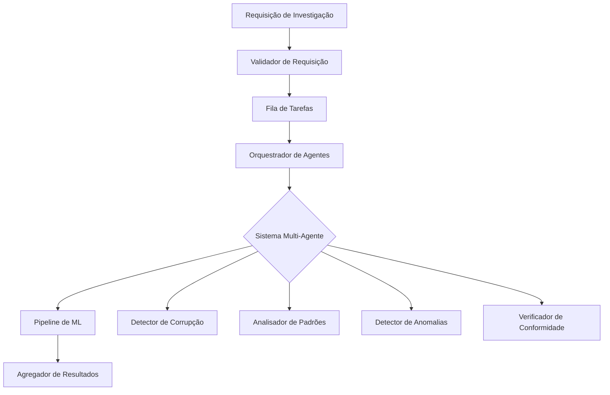

# API de Investigações

## Visão Geral

O módulo de Investigações fornece capacidades sofisticadas de detecção de anomalias para análise de dados governamentais. Utiliza um sistema multi-agente para identificar irregularidades, padrões suspeitos e potenciais violações de conformidade em dados do setor público.

## Arquitetura Técnica



## Endpoints

### Iniciar Investigação

Inicia uma nova investigação com parâmetros configuráveis para detecção de anomalias.

```http
POST /api/v1/investigacoes/iniciar
Content-Type: application/json
Authorization: Bearer {token}
```

#### Esquema de Requisição

```typescript
interface RequisicaoInvestigacao {
  // Parâmetros principais
  consulta: string;                    // Consulta em linguagem natural
  fonte_dados: FonteDados;             // Fonte de dados alvo
  
  // Opções de filtragem
  filtros?: {
    intervalo_data?: {
      inicio: string;              // Data ISO 8601
      fim: string;                 // Data ISO 8601
    };
    organizacoes?: string[];     // IDs de organizações
    tipos_contrato?: string[];   // Filtros de tipo de contrato
    valor_minimo?: number;       // Valor mínimo da transação
    valor_maximo?: number;       // Valor máximo da transação
    regioes?: string[];          // Regiões geográficas
  };
  
  // Configuração de detecção
  tipos_anomalia?: TipoAnomalia[];  // Tipos a detectar
  sensibilidade?: number;           // 0.0-1.0 (padrão: 0.7)
  limite_confianca?: number;        // 0.0-1.0 (padrão: 0.8)
  
  // Opções de processamento
  incluir_explicacoes?: boolean; // Explicações XAI
  transmitir_resultados?: boolean; // Streaming em tempo real
  max_resultados?: number;       // Limite de resultados
  
  // Opções avançadas
  configuracao_agente?: {
    max_iteracoes?: number;      // Iterações de agentes
    reflexao_ativada?: boolean;  // Auto-reflexão
    agentes_paralelos?: number;  // Agentes concorrentes
  };
}

enum FonteDados {
  PORTAL_TRANSPARENCIA = "portal_transparencia",
  TCU = "tcu",
  CGU = "cgu",
  COMPRAS_GOV = "compras_gov"
}

enum TipoAnomalia {
  ANOMALIA_PRECO = "anomalia_preco",
  ANOMALIA_PADRAO = "anomalia_padrao",
  ANOMALIA_TEMPORAL = "anomalia_temporal",
  ANOMALIA_RELACIONAMENTO = "anomalia_relacionamento",
  VIOLACAO_CONFORMIDADE = "violacao_conformidade"
}
```

#### Resposta

```json
{
  "id_investigacao": "550e8400-e29b-41d4-a716-446655440000",
  "status": "processando",
  "conclusao_estimada": "2025-01-30T10:20:30Z",
  "url_stream": "/api/v1/investigacoes/stream/550e8400-e29b-41d4-a716-446655440000"
}
```

#### Exemplo: Investigação Complexa

```bash
curl -X POST https://api.cidadao.ai/api/v1/investigacoes/iniciar \
  -H "Authorization: Bearer $TOKEN" \
  -H "Content-Type: application/json" \
  -d '{
    "consulta": "Identificar padrões suspeitos em contratos de TI acima de 1M em 2024",
    "fonte_dados": "portal_transparencia",
    "filtros": {
      "intervalo_data": {
        "inicio": "2024-01-01",
        "fim": "2024-12-31"
      },
      "tipos_contrato": ["SERVICOS_TI", "LICENCA_SOFTWARE"],
      "valor_minimo": 1000000
    },
    "tipos_anomalia": ["anomalia_preco", "anomalia_padrao"],
    "sensibilidade": 0.8,
    "incluir_explicacoes": true,
    "configuracao_agente": {
      "reflexao_ativada": true,
      "agentes_paralelos": 4
    }
  }'
```

### Transmitir Resultados

Streaming em tempo real de resultados de investigação via Server-Sent Events (SSE).

```http
GET /api/v1/investigacoes/stream/{id_investigacao}
Authorization: Bearer {token}
Accept: text/event-stream
```

#### Tipos de Eventos

```typescript
// Atualização de Progresso
event: progresso
data: {
  "porcentagem": 45,
  "fase_atual": "analisando_padroes",
  "agentes_ativos": 3
}

// Anomalia Detectada
event: anomalia
data: {
  "id": "anomalia_123",
  "tipo": "anomalia_preco",
  "severidade": "alta",
  "confianca": 0.92,
  "descricao": "Valor do contrato 340% acima da média de mercado",
  "registro_afetado": {
    "id_contrato": "CT-2024-0001",
    "fornecedor": "ACME Corp",
    "valor": 4500000
  }
}

// Insight do Agente
event: insight
data: {
  "agente": "DetectorCorrupcao",
  "mensagem": "Identificados padrões de pagamento incomuns",
  "confianca": 0.85
}

// Conclusão
event: completo
data: {
  "total_anomalias": 12,
  "tempo_processamento": 4523,
  "agentes_utilizados": 5
}
```

#### Exemplo Cliente

```javascript
const eventSource = new EventSource(
  `${API_URL}/investigacoes/stream/${idInvestigacao}`,
  { headers: { 'Authorization': `Bearer ${token}` } }
);

eventSource.addEventListener('anomalia', (event) => {
  const anomalia = JSON.parse(event.data);
  console.log(`Encontrada anomalia ${anomalia.severidade}: ${anomalia.descricao}`);
});

eventSource.addEventListener('completo', (event) => {
  const resumo = JSON.parse(event.data);
  console.log(`Investigação concluída: ${resumo.total_anomalias} anomalias encontradas`);
  eventSource.close();
});
```

### Obter Status da Investigação

Recuperar status atual e metadados de uma investigação.

```http
GET /api/v1/investigacoes/{id_investigacao}/status
Authorization: Bearer {token}
```

#### Esquema de Resposta

```typescript
interface StatusInvestigacao {
  id_investigacao: string;
  status: EstadoInvestigacao;
  progresso: {
    porcentagem: number;
    fase_atual: FaseProcessamento;
    fases_concluidas: FaseProcessamento[];
  };
  estatisticas: {
    registros_processados: number;
    anomalias_encontradas: number;
    agentes_invocados: number;
    tempo_processamento_ms: number;
  };
  criado_em: string;
  iniciado_em?: string;
  concluido_em?: string;
  erro?: {
    codigo: string;
    mensagem: string;
    recuperavel: boolean;
  };
}

enum EstadoInvestigacao {
  PENDENTE = "pendente",
  PROCESSANDO = "processando",
  CONCLUIDA = "concluida",
  FALHADA = "falhada",
  CANCELADA = "cancelada"
}

enum FaseProcessamento {
  INICIALIZACAO = "inicializacao",
  COLETA_DADOS = "coleta_dados",
  PREPROCESSAMENTO = "preprocessamento",
  ANALISE_AGENTE = "analise_agente",
  DETECCAO_PADROES = "deteccao_padroes",
  AGREGACAO_RESULTADOS = "agregacao_resultados",
  GERACAO_RELATORIO = "geracao_relatorio"
}
```

### Obter Resultados da Investigação

Recuperar resultados completos de uma investigação finalizada.

```http
GET /api/v1/investigacoes/{id_investigacao}/resultados
Authorization: Bearer {token}
```

#### Esquema de Resposta

```typescript
interface RespostaInvestigacao {
  id_investigacao: string;
  metadados: {
    consulta: string;
    fonte_dados: string;
    tempo_execucao_ms: number;
    total_registros_analisados: number;
  };
  
  anomalias: ResultadoAnomalia[];
  
  resumo: {
    total_anomalias: number;
    por_tipo: Record<TipoAnomalia, number>;
    por_severidade: {
      critica: number;
      alta: number;
      media: number;
      baixa: number;
    };
    pontuacao_risco: number;  // 0-100
  };
  
  insights: InsightAgente[];
  
  recomendacoes: string[];
  
  explicacoes?: {
    metodologia: string;
    intervalos_confianca: Record<string, [number, number]>;
    importancia_caracteristicas: Record<string, number>;
  };
}

interface ResultadoAnomalia {
  id: string;
  tipo: TipoAnomalia;
  severidade: Severidade;
  confianca: number;
  
  descricao: string;
  detalhes_tecnicos: Record<string, any>;
  
  entidades_afetadas: {
    primaria: ReferenciaEntidade;
    relacionadas: ReferenciaEntidade[];
  };
  
  evidencia: {
    pontos_dados: PontoDados[];
    padroes: Padrao[];
    analise_estatistica?: EvidenciaEstatistica;
  };
  
  contexto: {
    comparacao_historica?: ContextoHistorico;
    comparacao_pares?: ContextoPares;
    contexto_regulatorio?: ContextoRegulatorio;
  };
  
  explicacao?: {
    legivel_humano: string;
    tecnico: string;
    fatores_contribuintes: Fator[];
  };
}
```

#### Exemplo de Resposta

```json
{
  "id_investigacao": "550e8400-e29b-41d4-a716-446655440000",
  "metadados": {
    "consulta": "Padrões suspeitos em contratos de TI",
    "fonte_dados": "portal_transparencia",
    "tempo_execucao_ms": 4523,
    "total_registros_analisados": 15420
  },
  "anomalias": [
    {
      "id": "anom_001",
      "tipo": "anomalia_preco",
      "severidade": "alta",
      "confianca": 0.92,
      "descricao": "Contrato CT-2024-0001 apresenta precificação 340% acima da média de mercado",
      "detalhes_tecnicos": {
        "valor_contrato": 4500000,
        "media_mercado": 1323529,
        "desvio_padrao": 425000,
        "z_score": 7.47
      },
      "entidades_afetadas": {
        "primaria": {
          "tipo": "contrato",
          "id": "CT-2024-0001",
          "nome": "Serviços de Desenvolvimento de Software"
        },
        "relacionadas": [
          {
            "tipo": "fornecedor",
            "id": "FOR-123",
            "nome": "ACME Corp"
          }
        ]
      },
      "evidencia": {
        "pontos_dados": [
          {
            "metrica": "valor_contrato",
            "valor": 4500000,
            "timestamp": "2024-03-15T10:00:00Z"
          }
        ],
        "analise_estatistica": {
          "metodo": "isolation_forest",
          "pontuacao_anomalia": 0.92,
          "contaminacao": 0.1
        }
      },
      "explicacao": {
        "legivel_humano": "Este contrato tem valor excepcionalmente alto comparado a contratos similares de serviços de TI em 2024",
        "fatores_contribuintes": [
          {
            "fator": "inflacao_preco",
            "impacto": 0.75,
            "descricao": "Padrão incomum de aumento de preços"
          }
        ]
      }
    }
  ],
  "resumo": {
    "total_anomalias": 12,
    "por_tipo": {
      "anomalia_preco": 8,
      "anomalia_padrao": 4
    },
    "por_severidade": {
      "critica": 2,
      "alta": 5,
      "media": 4,
      "baixa": 1
    },
    "pontuacao_risco": 78
  },
  "insights": [
    {
      "agente": "DetectorCorrupcao",
      "insight": "Detectado sobrepreço sistemático em contratos de 3 fornecedores específicos",
      "confianca": 0.85,
      "evidencia_suporte": ["anom_001", "anom_002", "anom_003"]
    }
  ],
  "recomendacoes": [
    "Iniciar auditoria detalhada dos contratos CT-2024-0001, CT-2024-0045, CT-2024-0089",
    "Revisar processo de compras para categoria de serviços de TI",
    "Implementar benchmarking automático de preços para contratos acima de 1M"
  ]
}
```

### Listar Investigações

Recuperar lista paginada de investigações do usuário atual.

```http
GET /api/v1/investigacoes
Authorization: Bearer {token}
```

#### Parâmetros de Consulta

| Parâmetro | Tipo | Descrição | Exemplo |
|-----------|------|-------------|---------|
| `status` | string | Filtrar por status | `concluida` |
| `fonte_dados` | string | Filtrar por fonte de dados | `portal_transparencia` |
| `data_de` | string | Data de início (ISO 8601) | `2024-01-01` |
| `data_ate` | string | Data de fim (ISO 8601) | `2024-12-31` |
| `min_anomalias` | integer | Mínimo de anomalias encontradas | `5` |
| `ordenacao` | string | Campo e ordem de ordenação | `-criado_em` |
| `pagina` | integer | Número da página | `1` |
| `limite` | integer | Resultados por página (máx 100) | `20` |

#### Resposta

```json
{
  "dados": [
    {
      "id_investigacao": "550e8400-e29b-41d4-a716-446655440000",
      "consulta": "Contratos suspeitos de TI",
      "status": "concluida",
      "anomalias_encontradas": 12,
      "pontuacao_risco": 78,
      "fonte_dados": "portal_transparencia",
      "criado_em": "2025-01-30T09:00:00Z",
      "concluido_em": "2025-01-30T09:04:32Z"
    }
  ],
  "meta": {
    "total": 156,
    "pagina": 1,
    "limite": 20,
    "paginas": 8
  }
}
```

### Cancelar Investigação

Cancelar uma investigação em andamento.

```http
DELETE /api/v1/investigacoes/{id_investigacao}
Authorization: Bearer {token}
```

#### Resposta

```json
{
  "mensagem": "Investigação cancelada com sucesso",
  "id_investigacao": "550e8400-e29b-41d4-a716-446655440000",
  "status": "cancelada",
  "resultados_parciais_disponiveis": true
}
```

## Tratamento de Erros

### Erros Específicos de Investigação

| Código de Erro | Descrição | Ação de Recuperação |
|----------------|-----------|---------------------|
| `INVESTIGACAO_NAO_ENCONTRADA` | ID da investigação não existe | Verificar ID |
| `INVESTIGACAO_EM_ANDAMENTO` | Resultados ainda não disponíveis | Aguardar ou usar streaming |
| `DADOS_INSUFICIENTES` | Dados insuficientes para análise | Ajustar filtros |
| `LIMITE_TAXA_EXCEDIDO` | Muitas investigações concorrentes | Tentar mais tarde |
| `FONTE_DADOS_INVALIDA` | Fonte de dados não disponível | Verificar disponibilidade |

### Exemplo de Resposta de Erro

```json
{
  "erro": {
    "codigo": "DADOS_INSUFICIENTES",
    "mensagem": "Pontos de dados insuficientes para análise significativa",
    "detalhes": {
      "registros_encontrados": 3,
      "minimo_requerido": 10,
      "sugestao": "Tente ampliar seu intervalo de datas ou filtros"
    },
    "id_requisicao": "req_123"
  }
}
```

## Melhores Práticas

### Otimizar Consultas

```python
# Bom: Consulta específica e focada
investigacao = cliente.investigacoes.criar(
    consulta="Contratos de serviços de TI acima de 1M com lance único",
    filtros={
        "tipos_contrato": ["SERVICOS_TI"],
        "valor_minimo": 1000000,
        "contagem_lances": 1
    }
)

# Evitar: Muito amplo
investigacao = cliente.investigacoes.criar(
    consulta="Encontrar todos os contratos suspeitos"  # Muito vago
)
```

### Tratar Streaming Adequadamente

```javascript
// Implementar lógica de reconexão
let tentativas = 0;
const maxTentativas = 3;

function conectarStream(idInvestigacao) {
  const eventSource = new EventSource(urlStream);
  
  eventSource.onerror = (erro) => {
    if (tentativas < maxTentativas) {
      tentativas++;
      setTimeout(() => conectarStream(idInvestigacao), 1000 * tentativas);
    }
  };
  
  eventSource.onopen = () => {
    tentativas = 0;  // Resetar em conexão bem-sucedida
  };
}
```

### Processar Resultados Eficientemente

```python
# Processar anomalias por severidade
resultados = cliente.investigacoes.obter_resultados(id_investigacao)

anomalias_criticas = [
    a for a in resultados.anomalias 
    if a.severidade == "critica"
]

# Gerar alertas para achados críticos
for anomalia in anomalias_criticas:
    sistema_alerta.criar_alerta(
        titulo=f"Anomalia crítica: {anomalia.tipo}",
        descricao=anomalia.descricao,
        evidencia=anomalia.evidencia
    )
```

## Considerações de Performance

### Uso de Recursos

| Tipo de Investigação | Duração Média | Uso de CPU | Uso de Memória |
|----------------------|---------------|------------|----------------|
| Consulta simples | 5-10s | Baixo | &lt;100MB |
| Filtros complexos | 30-60s | Médio | &lt;500MB |
| Análise histórica | 2-5min | Alto | &lt;2GB |
| Varredura completa | 10-30min | Muito Alto | &lt;5GB |

### Dicas de Otimização

- **Use filtros específicos** para reduzir tamanho do dataset
- **Ative streaming** para investigações de longa duração
- **Defina sensibilidade apropriada** para equilibrar precisão vs performance
- **Limite investigações concorrentes** por usuário
- **Cache resultados de investigação** para acesso repetido

---

Próximo: [API de Análises →](./analises.md)