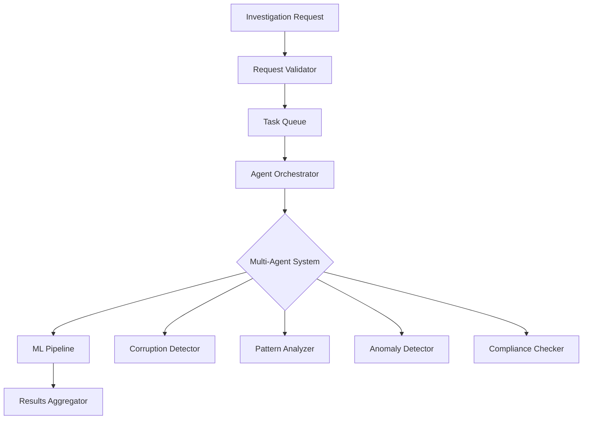

# Investigations API

## Overview

The Investigations module provides sophisticated anomaly detection capabilities for government data analysis. It leverages a multi-agent system to identify irregularities, suspicious patterns, and potential compliance violations in public sector data.

## Technical Architecture



## Endpoints

### Start Investigation

Initiates a new investigation with configurable parameters for anomaly detection.

```http
POST /api/v1/investigations/start
Content-Type: application/json
Authorization: Bearer {token}
```

#### Request Schema

```typescript
interface InvestigationRequest {
  // Core parameters
  query: string;                    // Natural language query
  data_source: DataSource;          // Target data source
  
  // Filtering options
  filters?: {
    date_range?: {
      start: string;              // ISO 8601 date
      end: string;                // ISO 8601 date
    };
    organizations?: string[];     // Organization IDs
    contract_types?: string[];    // Contract type filters
    min_value?: number;          // Minimum transaction value
    max_value?: number;          // Maximum transaction value
    regions?: string[];          // Geographic regions
  };
  
  // Detection configuration
  anomaly_types?: AnomalyType[];  // Types to detect
  sensitivity?: number;           // 0.0-1.0 (default: 0.7)
  confidence_threshold?: number;  // 0.0-1.0 (default: 0.8)
  
  // Processing options
  include_explanations?: boolean; // XAI explanations
  stream_results?: boolean;       // Real-time streaming
  max_results?: number;          // Result limit
  
  // Advanced options
  agent_configuration?: {
    max_iterations?: number;      // Agent iterations
    reflection_enabled?: boolean; // Self-reflection
    parallel_agents?: number;     // Concurrent agents
  };
}

enum DataSource {
  PORTAL_TRANSPARENCIA = "portal_transparencia",
  TCU = "tcu",
  CGU = "cgu",
  COMPRAS_GOV = "compras_gov"
}

enum AnomalyType {
  PRICE_ANOMALY = "price_anomaly",
  PATTERN_ANOMALY = "pattern_anomaly",
  TEMPORAL_ANOMALY = "temporal_anomaly",
  RELATIONSHIP_ANOMALY = "relationship_anomaly",
  COMPLIANCE_VIOLATION = "compliance_violation"
}
```

#### Response

```json
{
  "investigation_id": "550e8400-e29b-41d4-a716-446655440000",
  "status": "processing",
  "estimated_completion": "2025-01-30T10:20:30Z",
  "stream_url": "/api/v1/investigations/stream/550e8400-e29b-41d4-a716-446655440000"
}
```

#### Example: Complex Investigation

```bash
curl -X POST https://api.cidadao.ai/api/v1/investigations/start \
  -H "Authorization: Bearer $TOKEN" \
  -H "Content-Type: application/json" \
  -d '{
    "query": "Identify suspicious patterns in IT contracts above 1M in 2024",
    "data_source": "portal_transparencia",
    "filters": {
      "date_range": {
        "start": "2024-01-01",
        "end": "2024-12-31"
      },
      "contract_types": ["IT_SERVICES", "SOFTWARE_LICENSE"],
      "min_value": 1000000
    },
    "anomaly_types": ["price_anomaly", "pattern_anomaly"],
    "sensitivity": 0.8,
    "include_explanations": true,
    "agent_configuration": {
      "reflection_enabled": true,
      "parallel_agents": 4
    }
  }'
```

### Stream Results

Real-time streaming of investigation results via Server-Sent Events (SSE).

```http
GET /api/v1/investigations/stream/{investigation_id}
Authorization: Bearer {token}
Accept: text/event-stream
```

#### Event Types

```typescript
// Progress Update
event: progress
data: {
  "percentage": 45,
  "current_phase": "analyzing_patterns",
  "agents_active": 3
}

// Anomaly Detected
event: anomaly
data: {
  "id": "anomaly_123",
  "type": "price_anomaly",
  "severity": "high",
  "confidence": 0.92,
  "description": "Contract value 340% above market average",
  "affected_record": {
    "contract_id": "CT-2024-0001",
    "supplier": "ACME Corp",
    "value": 4500000
  }
}

// Agent Insight
event: insight
data: {
  "agent": "CorruptionDetector",
  "message": "Identified unusual payment patterns",
  "confidence": 0.85
}

// Completion
event: complete
data: {
  "total_anomalies": 12,
  "processing_time": 4523,
  "agents_used": 5
}
```

#### Client Example

```javascript
const eventSource = new EventSource(
  `${API_URL}/investigations/stream/${investigationId}`,
  { headers: { 'Authorization': `Bearer ${token}` } }
);

eventSource.addEventListener('anomaly', (event) => {
  const anomaly = JSON.parse(event.data);
  console.log(`Found ${anomaly.severity} anomaly: ${anomaly.description}`);
});

eventSource.addEventListener('complete', (event) => {
  const summary = JSON.parse(event.data);
  console.log(`Investigation complete: ${summary.total_anomalies} anomalies found`);
  eventSource.close();
});
```

### Get Investigation Status

Retrieve current status and metadata of an investigation.

```http
GET /api/v1/investigations/{investigation_id}/status
Authorization: Bearer {token}
```

#### Response Schema

```typescript
interface InvestigationStatus {
  investigation_id: string;
  status: InvestigationState;
  progress: {
    percentage: number;
    current_phase: ProcessingPhase;
    phases_completed: ProcessingPhase[];
  };
  statistics: {
    records_processed: number;
    anomalies_found: number;
    agents_invoked: number;
    processing_time_ms: number;
  };
  created_at: string;
  started_at?: string;
  completed_at?: string;
  error?: {
    code: string;
    message: string;
    recoverable: boolean;
  };
}

enum InvestigationState {
  PENDING = "pending",
  PROCESSING = "processing",
  COMPLETED = "completed",
  FAILED = "failed",
  CANCELLED = "cancelled"
}

enum ProcessingPhase {
  INITIALIZATION = "initialization",
  DATA_COLLECTION = "data_collection",
  PREPROCESSING = "preprocessing",
  AGENT_ANALYSIS = "agent_analysis",
  PATTERN_DETECTION = "pattern_detection",
  RESULT_AGGREGATION = "result_aggregation",
  REPORT_GENERATION = "report_generation"
}
```

### Get Investigation Results

Retrieve complete results of a finished investigation.

```http
GET /api/v1/investigations/{investigation_id}/results
Authorization: Bearer {token}
```

#### Response Schema

```typescript
interface InvestigationResponse {
  investigation_id: string;
  metadata: {
    query: string;
    data_source: string;
    execution_time_ms: number;
    total_records_analyzed: number;
  };
  
  anomalies: AnomalyResult[];
  
  summary: {
    total_anomalies: number;
    by_type: Record<AnomalyType, number>;
    by_severity: {
      critical: number;
      high: number;
      medium: number;
      low: number;
    };
    risk_score: number;  // 0-100
  };
  
  insights: AgentInsight[];
  
  recommendations: string[];
  
  explanations?: {
    methodology: string;
    confidence_intervals: Record<string, [number, number]>;
    feature_importance: Record<string, number>;
  };
}

interface AnomalyResult {
  id: string;
  type: AnomalyType;
  severity: Severity;
  confidence: number;
  
  description: string;
  technical_details: Record<string, any>;
  
  affected_entities: {
    primary: EntityReference;
    related: EntityReference[];
  };
  
  evidence: {
    data_points: DataPoint[];
    patterns: Pattern[];
    statistical_analysis?: StatisticalEvidence;
  };
  
  context: {
    historical_comparison?: HistoricalContext;
    peer_comparison?: PeerContext;
    regulatory_context?: RegulatoryContext;
  };
  
  explanation?: {
    human_readable: string;
    technical: string;
    contributing_factors: Factor[];
  };
}
```

#### Example Response

```json
{
  "investigation_id": "550e8400-e29b-41d4-a716-446655440000",
  "metadata": {
    "query": "Suspicious patterns in IT contracts",
    "data_source": "portal_transparencia",
    "execution_time_ms": 4523,
    "total_records_analyzed": 15420
  },
  "anomalies": [
    {
      "id": "anom_001",
      "type": "price_anomaly",
      "severity": "high",
      "confidence": 0.92,
      "description": "Contract CT-2024-0001 shows pricing 340% above market average",
      "technical_details": {
        "contract_value": 4500000,
        "market_average": 1323529,
        "standard_deviation": 425000,
        "z_score": 7.47
      },
      "affected_entities": {
        "primary": {
          "type": "contract",
          "id": "CT-2024-0001",
          "name": "Software Development Services"
        },
        "related": [
          {
            "type": "supplier",
            "id": "SUP-123",
            "name": "ACME Corp"
          }
        ]
      },
      "evidence": {
        "data_points": [
          {
            "metric": "contract_value",
            "value": 4500000,
            "timestamp": "2024-03-15T10:00:00Z"
          }
        ],
        "statistical_analysis": {
          "method": "isolation_forest",
          "anomaly_score": 0.92,
          "contamination": 0.1
        }
      },
      "explanation": {
        "human_readable": "This contract's value is exceptionally high compared to similar IT service contracts in 2024",
        "contributing_factors": [
          {
            "factor": "price_inflation",
            "impact": 0.75,
            "description": "Unusual price increase pattern"
          }
        ]
      }
    }
  ],
  "summary": {
    "total_anomalies": 12,
    "by_type": {
      "price_anomaly": 8,
      "pattern_anomaly": 4
    },
    "by_severity": {
      "critical": 2,
      "high": 5,
      "medium": 4,
      "low": 1
    },
    "risk_score": 78
  },
  "insights": [
    {
      "agent": "CorruptionDetector",
      "insight": "Detected systematic overpricing in contracts from 3 specific suppliers",
      "confidence": 0.85,
      "supporting_evidence": ["anom_001", "anom_002", "anom_003"]
    }
  ],
  "recommendations": [
    "Initiate detailed audit of contracts CT-2024-0001, CT-2024-0045, CT-2024-0089",
    "Review procurement process for IT services category",
    "Implement automated price benchmarking for contracts above 1M"
  ]
}
```

### List Investigations

Retrieve paginated list of investigations for the current user.

```http
GET /api/v1/investigations
Authorization: Bearer {token}
```

#### Query Parameters

| Parameter | Type | Description | Example |
|-----------|------|-------------|---------|
| `status` | string | Filter by status | `completed` |
| `data_source` | string | Filter by data source | `portal_transparencia` |
| `date_from` | string | Start date (ISO 8601) | `2024-01-01` |
| `date_to` | string | End date (ISO 8601) | `2024-12-31` |
| `min_anomalies` | integer | Minimum anomalies found | `5` |
| `sort` | string | Sort field and order | `-created_at` |
| `page` | integer | Page number | `1` |
| `limit` | integer | Results per page (max 100) | `20` |

#### Response

```json
{
  "data": [
    {
      "investigation_id": "550e8400-e29b-41d4-a716-446655440000",
      "query": "Suspicious IT contracts",
      "status": "completed",
      "anomalies_found": 12,
      "risk_score": 78,
      "data_source": "portal_transparencia",
      "created_at": "2025-01-30T09:00:00Z",
      "completed_at": "2025-01-30T09:04:32Z"
    }
  ],
  "meta": {
    "total": 156,
    "page": 1,
    "limit": 20,
    "pages": 8
  }
}
```

### Cancel Investigation

Cancel an ongoing investigation.

```http
DELETE /api/v1/investigations/{investigation_id}
Authorization: Bearer {token}
```

#### Response

```json
{
  "message": "Investigation cancelled successfully",
  "investigation_id": "550e8400-e29b-41d4-a716-446655440000",
  "status": "cancelled",
  "partial_results_available": true
}
```

## Error Handling

### Investigation-Specific Errors

| Error Code | Description | Recovery Action |
|------------|-------------|-----------------|
| `INVESTIGATION_NOT_FOUND` | Investigation ID doesn't exist | Verify ID |
| `INVESTIGATION_IN_PROGRESS` | Results not yet available | Wait or stream |
| `INSUFFICIENT_DATA` | Not enough data for analysis | Adjust filters |
| `RATE_LIMIT_EXCEEDED` | Too many concurrent investigations | Retry later |
| `INVALID_DATA_SOURCE` | Data source not available | Check availability |

### Example Error Response

```json
{
  "error": {
    "code": "INSUFFICIENT_DATA",
    "message": "Not enough data points for meaningful analysis",
    "details": {
      "records_found": 3,
      "minimum_required": 10,
      "suggestion": "Try broadening your date range or filters"
    },
    "request_id": "req_123"
  }
}
```

## Best Practices

### Optimize Queries

```python
# Good: Specific, focused query
investigation = client.investigations.create(
    query="IT service contracts above 1M with single-bid",
    filters={
        "contract_types": ["IT_SERVICES"],
        "min_value": 1000000,
        "bid_count": 1
    }
)

# Avoid: Too broad
investigation = client.investigations.create(
    query="Find all suspicious contracts"  # Too vague
)
```

### Handle Streaming Properly

```javascript
// Implement reconnection logic
let retries = 0;
const maxRetries = 3;

function connectStream(investigationId) {
  const eventSource = new EventSource(streamUrl);
  
  eventSource.onerror = (error) => {
    if (retries < maxRetries) {
      retries++;
      setTimeout(() => connectStream(investigationId), 1000 * retries);
    }
  };
  
  eventSource.onopen = () => {
    retries = 0;  // Reset on successful connection
  };
}
```

### Process Results Efficiently

```python
# Process anomalies by severity
results = client.investigations.get_results(investigation_id)

critical_anomalies = [
    a for a in results.anomalies 
    if a.severity == "critical"
]

# Generate alerts for critical findings
for anomaly in critical_anomalies:
    alert_system.create_alert(
        title=f"Critical anomaly: {anomaly.type}",
        description=anomaly.description,
        evidence=anomaly.evidence
    )
```

## Performance Considerations

### Resource Usage

| Investigation Type | Avg Duration | CPU Usage | Memory Usage |
|-------------------|--------------|-----------|--------------|
| Simple query | 5-10s | Low | &lt;100MB |
| Complex filters | 30-60s | Medium | &lt;500MB |
| Historical analysis | 2-5min | High | &lt;2GB |
| Full dataset scan | 10-30min | Very High | &lt;5GB |

### Optimization Tips

- **Use specific filters** to reduce dataset size
- **Enable streaming** for long-running investigations
- **Set appropriate sensitivity** to balance accuracy vs performance
- **Limit concurrent investigations** per user
- **Cache investigation results** for repeated access

---

Next: [Analysis API →](./analysis.md)