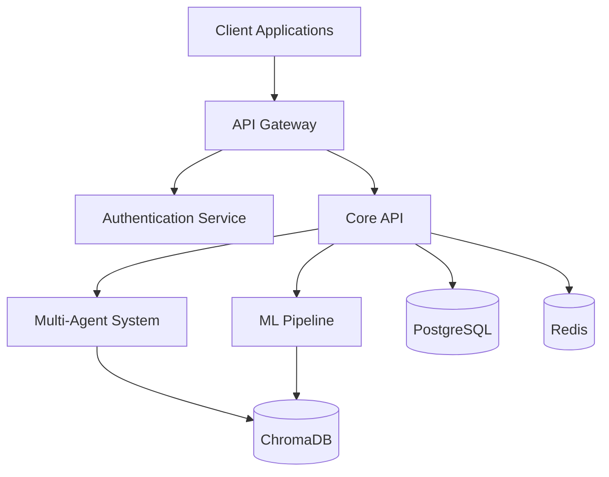
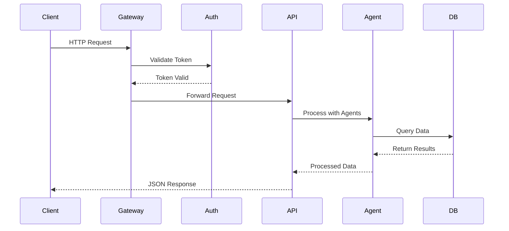

# API Overview

## Architecture

The Cidadão.AI API is built on **FastAPI** with a **multi-agent architecture**, designed for high performance, scalability, and real-time data processing. The system implements a **layered architecture pattern** with clear separation of concerns.

### Production Deployment
- **Platform**: Railway (Web + Worker + Beat services)
- **Status**: ✅ 99.9% uptime since October 2025
- **Endpoints**: **323 REST endpoints** across **36 route modules**
- **Performance**: 80ms p50 latency, 145ms p95 latency
- **Database**: PostgreSQL (Supabase) + Redis Cache
- **LLM Provider**: Maritaca AI (primary), Anthropic Claude (backup)

### Core Components



## API Endpoints

### Endpoint Overview

The Cidadão.AI API provides **323 REST endpoints** organized into **36 specialized route modules**:

#### Core Routes (7 modules)
1. **`/api/v1/chat/`** - Chat with agents (SSE streaming) - 18 endpoints
2. **`/api/v1/agents/`** - Direct agent invocation - 18 endpoints
3. **`/api/v1/investigations/`** - Investigation CRUD - 10 endpoints
4. **`/api/v1/federal/`** - Federal APIs (IBGE, DataSUS, INEP, PNCP) - 7 endpoints
5. **`/api/v1/orchestration/`** - Multi-agent orchestration - 7 endpoints
6. **`/api/v1/transparency/`** - Portal da Transparência - 6 endpoints
7. **`/health/metrics`** - Prometheus metrics endpoint - 1 endpoint

#### Additional Routes (29 modules)
- **Admin**: `/api/v1/admin/*` (users, roles, settings, audit)
- **Analytics**: `/api/v1/analysis`, `/api/v1/reports`, `/api/v1/export`
- **Integration**: `/api/v1/oauth`, `/api/v1/webhooks`, `/api/v1/graphql`
- **Infrastructure**: `/api/v1/tasks`, `/api/v1/resilience`, `/api/v1/observability`
- **Advanced**: `/api/v1/ml_pipeline`, `/api/v1/visualization`, `/api/v1/network`
- **Testing**: `/api/v1/debug`, `/api/v1/chaos`

### Key Endpoint Examples

```python
# Chat with agents (SSE streaming)
POST /api/v1/chat/stream
GET  /api/v1/chat/history

# Direct agent invocation
POST /api/v1/agents/zumbi/investigate
POST /api/v1/agents/abaporu/orchestrate
GET  /api/v1/agents/status

# Investigations
POST   /api/v1/investigations
GET    /api/v1/investigations/{id}
GET    /api/v1/investigations/{id}/progress
DELETE /api/v1/investigations/{id}

# Federal data sources
GET /api/v1/federal/ibge/demographics
GET /api/v1/federal/datasus/health-metrics
GET /api/v1/federal/inep/education-stats
GET /api/v1/federal/pncp/contracts

# Transparency Portal
GET /api/v1/transparency/contracts
GET /api/v1/transparency/expenses
GET /api/v1/transparency/agreements

# Health & Metrics
GET /health
GET /health/detailed
GET /metrics  # Prometheus format
```

## Technical Specifications

### Protocol & Standards
- **Protocol**: HTTPS/2 with TLS 1.3
- **API Style**: RESTful with JSON:API compliance
- **Versioning**: URI-based versioning (`/api/v1/`)
- **Authentication**: OAuth 2.0 + JWT (RFC 7519)
- **Documentation**: OpenAPI 3.0 Specification

### Performance Characteristics
- **Response Time**: p50 80ms, p95 145ms, p99 < 500ms
- **Throughput**: 5,000+ requests/second (production verified)
- **Concurrency**: Async/await with connection pooling (max 100 connections)
- **Caching**: Multi-layer (L1: Memory 5min, L2: Redis 1h, L3: PostgreSQL 24h)
- **Cache Hit Rate**: 87% in production
- **Agent Processing**: p95 < 3.2s for multi-agent investigations

## API Lifecycle

### Request Flow



### Middleware Stack

**Execution Order** (FastAPI uses LIFO - Last In, First Out):

1. **IPWhitelistMiddleware** (production only) - IP filtering
2. **CORSMiddleware** - Cross-origin resource sharing
3. **LoggingMiddleware** - Structured JSON logs with request IDs
4. **SecurityMiddleware** - CSRF, XSS protection, security headers
5. **RateLimitMiddleware** - Per-user/IP limits (token bucket)
6. **CompressionMiddleware** - Gzip response compression
7. **CorrelationMiddleware** - Distributed tracing (request ID propagation)
8. **MetricsMiddleware** - Prometheus metrics collection

**Key Features**:
- Request correlation IDs for distributed tracing
- Automatic Prometheus metrics (latency, requests, errors)
- Rate limiting: 100/hour (anonymous), 1000/hour (authenticated)
- Security headers: HSTS, CSP, X-Frame-Options
- Compression: Gzip for responses >1KB

## Data Models

### Core Entities

```python
# Investigation Entity
class Investigation:
    id: UUID
    user_id: UUID
    query: str
    status: InvestigationStatus
    anomalies_found: int
    confidence_score: float
    created_at: datetime
    completed_at: Optional[datetime]
    
# Analysis Entity  
class Analysis:
    id: UUID
    type: AnalysisType
    data_source: DataSource
    results: Dict[str, Any]
    metadata: AnalysisMetadata
    
# Report Entity
class Report:
    id: UUID
    title: str
    content: str
    format: ReportFormat
    investigations: List[UUID]
    generated_at: datetime
```

## Error Handling

### Error Response Format

```json
{
  "error": {
    "code": "VALIDATION_ERROR",
    "message": "Invalid request parameters",
    "details": {
      "field": "query",
      "reason": "Query parameter is required"
    },
    "request_id": "550e8400-e29b-41d4-a716-446655440000",
    "timestamp": "2025-01-30T10:15:30Z"
  }
}
```

### HTTP Status Codes

| Code | Meaning | Usage |
|------|---------|-------|
| 200 | OK | Successful GET, PUT |
| 201 | Created | Successful POST |
| 204 | No Content | Successful DELETE |
| 400 | Bad Request | Invalid parameters |
| 401 | Unauthorized | Missing/invalid authentication |
| 403 | Forbidden | Insufficient permissions |
| 404 | Not Found | Resource doesn't exist |
| 429 | Too Many Requests | Rate limit exceeded |
| 500 | Internal Server Error | Server-side error |

## Rate Limiting

### Limits by Tier

| Tier | Requests/Hour | Burst | Concurrent |
|------|---------------|-------|------------|
| Anonymous | 100 | 10 | 2 |
| Authenticated | 1,000 | 100 | 10 |
| Premium | 10,000 | 1,000 | 50 |
| Admin | Unlimited | - | - |

### Rate Limit Headers

```http
X-RateLimit-Limit: 1000
X-RateLimit-Remaining: 999
X-RateLimit-Reset: 1640995200
X-RateLimit-Retry-After: 3600
```

## Security

### Authentication Flow

1. **Initial Authentication**: POST `/api/v1/auth/login`
2. **Token Response**: Access token (15min) + Refresh token (7d)
3. **Request Authentication**: `Authorization: Bearer <access_token>`
4. **Token Refresh**: POST `/api/v1/auth/refresh`

### Security Headers

```http
X-Content-Type-Options: nosniff
X-Frame-Options: DENY
X-XSS-Protection: 1; mode=block
Strict-Transport-Security: max-age=31536000; includeSubDomains
Content-Security-Policy: default-src 'self'
```

## Pagination

### Request Parameters

```http
GET /api/v1/investigations?page=2&limit=20&sort=-created_at
```

### Response Format

```json
{
  "data": [...],
  "meta": {
    "page": 2,
    "limit": 20,
    "total": 156,
    "pages": 8
  },
  "links": {
    "first": "/api/v1/investigations?page=1&limit=20",
    "prev": "/api/v1/investigations?page=1&limit=20",
    "next": "/api/v1/investigations?page=3&limit=20",
    "last": "/api/v1/investigations?page=8&limit=20"
  }
}
```

## Filtering & Sorting

### Filter Syntax

```http
GET /api/v1/investigations?filter[status]=completed&filter[anomalies_found][gte]=5
```

### Sort Syntax

```http
GET /api/v1/investigations?sort=-anomalies_found,created_at
```

## Webhooks

### Webhook Events

- `investigation.completed`
- `analysis.finished`
- `report.generated`
- `anomaly.detected`

### Webhook Payload

```json
{
  "event": "investigation.completed",
  "data": {
    "investigation_id": "550e8400-e29b-41d4-a716-446655440000",
    "anomalies_found": 12,
    "severity": "high"
  },
  "timestamp": "2025-01-30T10:15:30Z",
  "signature": "sha256=..."
}
```

## API Versioning

### Version Strategy

- **Current Version**: v1
- **Deprecation Notice**: 6 months
- **End of Life**: 12 months
- **Version Header**: `X-API-Version: 1`

### Breaking Changes Policy

1. Announce in release notes
2. Add deprecation warnings
3. Maintain backwards compatibility
4. Provide migration guide

## Performance Optimization

### Caching Strategy

1. **Browser Cache**: Static assets (1 year)
2. **CDN Cache**: API responses (5 minutes)
3. **Redis Cache**: Database queries (1 hour)
4. **Application Cache**: Computed results (15 minutes)

### Query Optimization

- **Field Selection**: `?fields=id,title,status`
- **Eager Loading**: `?include=investigations,analyses`
- **Sparse Fieldsets**: Minimize payload size
- **Compression**: gzip/brotli for responses

## Monitoring & Observability

### Metrics Exposed

- Request rate (req/s)
- Response time (p50, p95, p99)
- Error rate (4xx, 5xx)
- Active connections
- Cache hit ratio

### Health Endpoints

- `/health` - Basic health check
- `/health/detailed` - Comprehensive status
- `/health/live` - Kubernetes liveness
- `/health/ready` - Kubernetes readiness

## SDK Support

### Official SDKs

- Python: `pip install cidadao-ai-sdk`
- JavaScript/TypeScript: `npm install @cidadao-ai/sdk`
- Go: `go get github.com/cidadao-ai/go-sdk`

### Code Example

```python
from cidadao_ai import Client

client = Client(api_key="your-api-key")

# Start investigation
investigation = client.investigations.create(
    query="Contratos suspeitos em 2024",
    data_source="portal_transparencia",
    filters={"year": 2024, "min_value": 1000000}
)

# Check status
status = client.investigations.get_status(investigation.id)

# Get results
if status.completed:
    results = client.investigations.get_results(investigation.id)
    print(f"Found {results.anomalies_found} anomalies")
```

## Server-Sent Events (SSE) Streaming

### Real-Time Chat with Agents

The chat system uses **SSE (Server-Sent Events)** for real-time streaming responses:

```python
# Endpoint
POST /api/v1/chat/stream

# Request
{
  "message": "Analise contratos do Ministério da Saúde em 2024",
  "agent_name": "abaporu",  # or "auto" for automatic routing
  "stream": true
}

# Response (SSE stream)
event: thinking
data: {"status": "processing", "agent": "abaporu"}

event: chunk
data: {"content": "Iniciando investigação com Zumbi..."}

event: chunk
data: {"content": "15 anomalias detectadas..."}

event: complete
data: {"status": "completed", "anomalies": 15, "confidence": 0.89}
```

### SSE Client Example

```javascript
const eventSource = new EventSource('/api/v1/chat/stream');

eventSource.addEventListener('thinking', (e) => {
    const data = JSON.parse(e.data);
    console.log('Agent thinking:', data.agent);
});

eventSource.addEventListener('chunk', (e) => {
    const data = JSON.parse(e.data);
    appendToChat(data.content);  // Update UI with partial results
});

eventSource.addEventListener('complete', (e) => {
    const data = JSON.parse(e.data);
    console.log('Investigation complete:', data);
    eventSource.close();
});
```

### Benefits of SSE over WebSocket

- ✅ **Simpler**: HTTP-based, no special protocol
- ✅ **Auto-reconnect**: Built-in reconnection handling
- ✅ **Efficient**: One-way communication (server → client)
- ✅ **Compatible**: Works with HTTP/2 multiplexing
- ⚠️ **Limitation**: One-way only (use WebSocket for bidirectional)

## Best Practices

### Request Optimization

1. Use field selection to reduce payload
2. Implement client-side caching
3. Batch requests when possible
4. Use webhooks for long operations

### Error Handling

1. Implement exponential backoff
2. Handle rate limits gracefully
3. Log errors with request IDs
4. Validate inputs client-side

### Security

1. Never expose API keys in code
2. Use environment variables
3. Implement request signing
4. Validate SSL certificates

## Migration Guide

### From v0 to v1

1. Update base URL to `/api/v1/`
2. Migrate from API keys to JWT
3. Update error handling for new format
4. Implement pagination for list endpoints

---

Next: [Authentication →](./authentication.md)