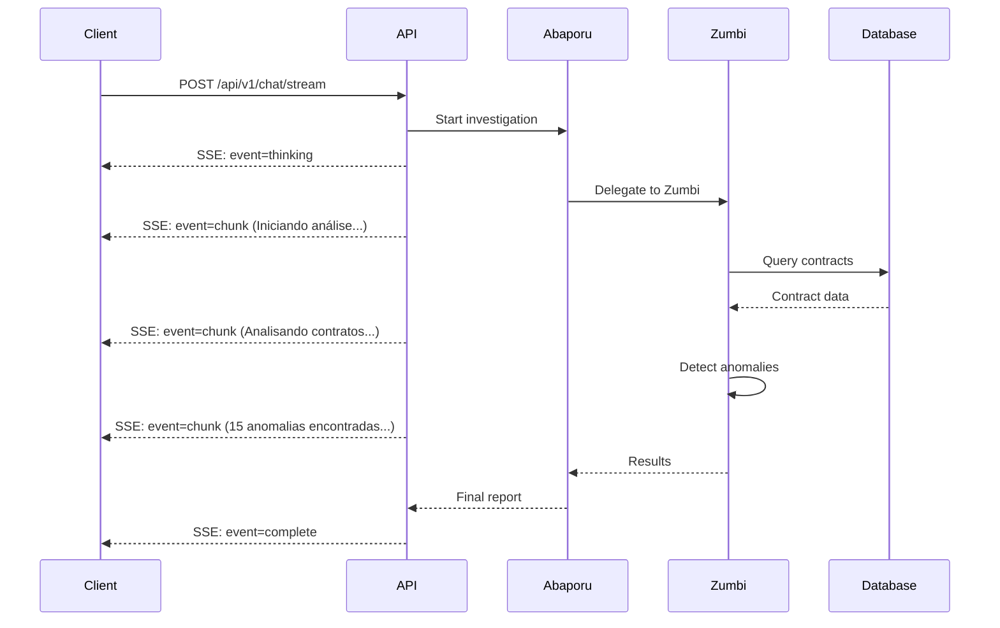

# 🌊 Real-Time Streaming

## 📋 Visão Geral

O Cidadão.AI implementa **streaming em tempo real** para comunicação com agentes usando **Server-Sent Events (SSE)** como tecnologia principal e **WebSocket** como alternativa experimental.

### Por Que Streaming?

- ⚡ **Feedback imediato**: Usuário vê o progresso da investigação
- 🧠 **Transparência**: Acompanha o "pensamento" do agente em tempo real
- 📊 **Resultados parciais**: Não precisa esperar investigação completa
- 🎯 **Melhor UX**: Interface responsiva e interativa

---

## 🚀 Server-Sent Events (SSE)

### Arquitetura

**SSE** é a tecnologia principal para streaming por ser:
- ✅ Mais simples que WebSocket (HTTP-based)
- ✅ Auto-reconnect automático
- ✅ Compatível com HTTP/2 multiplexing
- ✅ Ideal para comunicação unidirecional (servidor → cliente)

### Fluxo de Comunicação



---

## 📡 Endpoints SSE

### POST /api/v1/chat/stream

**Chat com streaming em tempo real**

**Request**:
```json
{
  "message": "Analise contratos do Ministério da Saúde em 2024",
  "agent_name": "abaporu",  // ou "auto" para roteamento automático
  "stream": true,
  "filters": {
    "year": 2024,
    "min_value": 100000
  }
}
```

**Response (SSE Stream)**:

```http
HTTP/1.1 200 OK
Content-Type: text/event-stream
Cache-Control: no-cache
Connection: keep-alive

event: thinking
data: {"status": "processing", "agent": "abaporu", "timestamp": "2025-01-22T10:00:00Z"}

event: agent_selected
data: {"agent": "zumbi", "reason": "anomaly_detection_specialist"}

event: chunk
data: {"content": "Iniciando análise de contratos...", "progress": 10}

event: chunk
data: {"content": "Analisando 1.234 contratos...", "progress": 30}

event: chunk
data: {"content": "15 anomalias detectadas via FFT analysis...", "progress": 60}

event: chunk
data: {"content": "Confiança: 89%...", "progress": 90}

event: complete
data: {"status": "completed", "anomalies": 15, "confidence": 0.89, "investigation_id": "INV-123"}
```

### Tipos de Eventos

| Evento | Descrição | Payload |
|--------|-----------|---------|
| `thinking` | Agente iniciando processamento | `{status, agent, timestamp}` |
| `agent_selected` | Agente selecionado pelo router | `{agent, reason}` |
| `chunk` | Resultado parcial | `{content, progress}` |
| `error` | Erro durante processamento | `{error, message, code}` |
| `complete` | Investigação concluída | `{status, anomalies, confidence, id}` |

---

## 💻 Implementação Cliente

### JavaScript (Browser)

```javascript
// Criar conexão SSE
const eventSource = new EventSource('/api/v1/chat/stream', {
    method: 'POST',
    headers: {
        'Authorization': `Bearer ${token}`,
        'Content-Type': 'application/json'
    },
    body: JSON.stringify({
        message: 'Analise contratos do Ministério da Saúde em 2024',
        agent_name: 'auto',
        stream: true
    })
});

// Event listeners
eventSource.addEventListener('thinking', (e) => {
    const data = JSON.parse(e.data);
    console.log('🧠 Agent thinking:', data.agent);
    updateUI({ status: 'processing', agent: data.agent });
});

eventSource.addEventListener('agent_selected', (e) => {
    const data = JSON.parse(e.data);
    console.log('🎯 Selected agent:', data.agent, 'reason:', data.reason);
    showAgentSelection(data);
});

eventSource.addEventListener('chunk', (e) => {
    const data = JSON.parse(e.data);
    console.log('📦 Chunk:', data.content);
    appendToChat(data.content);
    updateProgress(data.progress);
});

eventSource.addEventListener('error', (e) => {
    const data = JSON.parse(e.data);
    console.error('❌ Error:', data.message);
    showError(data);
    eventSource.close();
});

eventSource.addEventListener('complete', (e) => {
    const data = JSON.parse(e.data);
    console.log('✅ Complete:', data);
    showResults(data);
    eventSource.close();
});

// Error handling (connection issues)
eventSource.onerror = (error) => {
    console.error('Connection error:', error);
    eventSource.close();
};
```

### React Hook

```typescript
import { useEffect, useState } from 'react';

interface StreamMessage {
    type: string;
    content: string;
    progress?: number;
}

function useChatStream(message: string, agentName: string) {
    const [messages, setMessages] = useState<StreamMessage[]>([]);
    const [isStreaming, setIsStreaming] = useState(false);
    const [error, setError] = useState<string | null>(null);

    useEffect(() => {
        if (!message) return;

        const eventSource = new EventSource('/api/v1/chat/stream');
        setIsStreaming(true);

        eventSource.addEventListener('chunk', (e) => {
            const data = JSON.parse(e.data);
            setMessages(prev => [...prev, {
                type: 'chunk',
                content: data.content,
                progress: data.progress
            }]);
        });

        eventSource.addEventListener('complete', (e) => {
            const data = JSON.parse(e.data);
            setMessages(prev => [...prev, {
                type: 'complete',
                content: JSON.stringify(data),
            }]);
            setIsStreaming(false);
            eventSource.close();
        });

        eventSource.addEventListener('error', (e) => {
            const data = JSON.parse(e.data);
            setError(data.message);
            setIsStreaming(false);
            eventSource.close();
        });

        return () => {
            eventSource.close();
            setIsStreaming(false);
        };
    }, [message, agentName]);

    return { messages, isStreaming, error };
}

// Uso no componente
function ChatComponent() {
    const { messages, isStreaming, error } = useChatStream(
        'Analise contratos de 2024',
        'abaporu'
    );

    return (
        <div>
            {messages.map((msg, i) => (
                <ChatMessage key={i} content={msg.content} />
            ))}
            {isStreaming && <LoadingIndicator />}
            {error && <ErrorMessage message={error} />}
        </div>
    );
}
```

### Python Cliente

```python
import requests
import json

def stream_chat(message: str, agent_name: str = "auto"):
    """Stream chat with agents"""

    url = "https://cidadao-api-production.up.railway.app/api/v1/chat/stream"

    payload = {
        "message": message,
        "agent_name": agent_name,
        "stream": True
    }

    headers = {
        "Authorization": f"Bearer {api_token}",
        "Content-Type": "application/json"
    }

    with requests.post(url, json=payload, headers=headers, stream=True) as r:
        for line in r.iter_lines():
            if line:
                # Parse SSE format
                decoded = line.decode('utf-8')

                if decoded.startswith('event:'):
                    event_type = decoded.split(':')[1].strip()

                elif decoded.startswith('data:'):
                    data = json.loads(decoded.split('data:')[1])

                    if event_type == 'chunk':
                        print(f"📦 {data['content']}")

                    elif event_type == 'complete':
                        print(f"✅ Investigation complete!")
                        print(f"   Anomalies: {data['anomalies']}")
                        print(f"   Confidence: {data['confidence']}")
                        break

# Uso
stream_chat("Analise contratos do Ministério da Saúde em 2024", "abaporu")
```

---

## 🔌 WebSocket (Experimental)

### Endpoint

```
WS /api/v1/chat/ws
```

**Conexão WebSocket para comunicação bidirecional**

### Cliente WebSocket

```javascript
const ws = new WebSocket('wss://cidadao-api-production.up.railway.app/api/v1/chat/ws');

ws.onopen = () => {
    console.log('Connected to WebSocket');

    // Enviar mensagem
    ws.send(JSON.stringify({
        type: 'chat',
        message: 'Analise contratos de 2024',
        agent_name: 'abaporu'
    }));
};

ws.onmessage = (event) => {
    const data = JSON.parse(event.data);

    switch(data.type) {
        case 'thinking':
            console.log('🧠 Agent thinking...');
            break;
        case 'chunk':
            console.log('📦', data.content);
            break;
        case 'complete':
            console.log('✅ Complete:', data);
            ws.close();
            break;
    }
};

ws.onerror = (error) => {
    console.error('WebSocket error:', error);
};

ws.onclose = () => {
    console.log('WebSocket closed');
};
```

---

## 🎯 Comparação: SSE vs WebSocket

| Característica | SSE | WebSocket |
|----------------|-----|-----------|
| **Direção** | Unidirecional (server → client) | Bidirecional |
| **Protocolo** | HTTP | TCP |
| **Complexidade** | ✅ Simples | ⚠️ Complexo |
| **Auto-reconnect** | ✅ Built-in | ❌ Manual |
| **HTTP/2** | ✅ Suporta multiplexing | ❌ Não suporta |
| **Firewall** | ✅ Compatível | ⚠️ Pode bloquear |
| **Use case** | Notificações, updates, streams | Chat, jogos, real-time collaboration |
| **Status no Cidadão.AI** | ✅ **Produção** | ⚠️ **Experimental** |

### Quando usar cada um?

**Use SSE quando**:
- ✅ Comunicação é principalmente server → client
- ✅ Precisa de simplicidade e confiabilidade
- ✅ Precisa de auto-reconnect
- ✅ Trabalha com HTTP/2

**Use WebSocket quando**:
- ✅ Precisa de comunicação bidirecional constante
- ✅ Baixa latência é crítica
- ✅ Envia muitos dados do cliente para servidor
- ✅ Building chat em tempo real ou jogos

---

## 🛡️ Tratamento de Erros

### Erros Comuns

```typescript
// Timeout
eventSource.addEventListener('error', (e) => {
    if (e.type === 'timeout') {
        console.error('Stream timeout');
        // Retry with exponential backoff
        setTimeout(() => retryConnection(), 2000);
    }
});

// Authentication error
eventSource.addEventListener('error', (e) => {
    const data = JSON.parse(e.data);
    if (data.code === 'UNAUTHORIZED') {
        // Refresh token and retry
        refreshToken().then(() => retryConnection());
    }
});

// Rate limit
eventSource.addEventListener('error', (e) => {
    const data = JSON.parse(e.data);
    if (data.code === 'RATE_LIMIT_EXCEEDED') {
        const retryAfter = data.retry_after;
        setTimeout(() => retryConnection(), retryAfter * 1000);
    }
});
```

### Retry Strategy

```javascript
class SSEClient {
    constructor(url, options = {}) {
        this.url = url;
        this.maxRetries = options.maxRetries || 5;
        this.retryCount = 0;
        this.retryDelay = options.retryDelay || 1000;
    }

    connect() {
        this.eventSource = new EventSource(this.url);

        this.eventSource.onerror = () => {
            if (this.retryCount < this.maxRetries) {
                const delay = this.retryDelay * Math.pow(2, this.retryCount);
                console.log(`Retry ${this.retryCount + 1}/${this.maxRetries} in ${delay}ms`);

                setTimeout(() => {
                    this.retryCount++;
                    this.connect();
                }, delay);
            } else {
                console.error('Max retries reached');
                this.eventSource.close();
            }
        };
    }
}

// Uso
const client = new SSEClient('/api/v1/chat/stream', {
    maxRetries: 5,
    retryDelay: 1000
});
client.connect();
```

---

## 📊 Métricas de Performance

### Latência

| Métrica | Valor | Descrição |
|---------|-------|-----------|
| **First Chunk** | ~200ms | Tempo até primeiro chunk |
| **Chunk Interval** | ~100-500ms | Intervalo entre chunks |
| **Total Investigation** | ~3-8s | Investigação completa (média) |
| **Concurrent Streams** | 100+ | Streams simultâneos suportados |

### Otimizações Aplicadas

- ⚡ **Buffering**: Chunks agregados antes de envio
- 💾 **Compression**: Gzip para payloads >1KB
- 🔄 **Connection pooling**: Reutilização de conexões HTTP/2
- 📊 **Back-pressure**: Control flow quando cliente lento

---

## 📚 Referências

### Documentação Relacionada
- [API Overview](./overview.md) - Visão geral da API
- [Authentication](./authentication.md) - Autenticação JWT
- [WebSocket Spec](./websocket.md) - Especificação completa WebSocket

### Especificações Técnicas
- **SSE Spec**: [W3C Server-Sent Events](https://html.spec.whatwg.org/multipage/server-sent-events.html)
- **EventSource API**: [MDN Web Docs](https://developer.mozilla.org/en-US/docs/Web/API/EventSource)
- **WebSocket Protocol**: [RFC 6455](https://tools.ietf.org/html/rfc6455)

### Bibliotecas Recomendadas
- **JavaScript**: Native `EventSource` API
- **React**: `react-use` hooks para SSE
- **Python**: `requests` com `stream=True`
- **Go**: `github.com/r3labs/sse`

---

**Última Atualização**: 2025-01-22
**Status**: ✅ SSE em Produção, WebSocket Experimental
**Autor**: Anderson Henrique da Silva

> **💡 Recomendação**: Use SSE para 99% dos casos. WebSocket apenas se realmente precisar de comunicação bidirecional constante! 🌊
