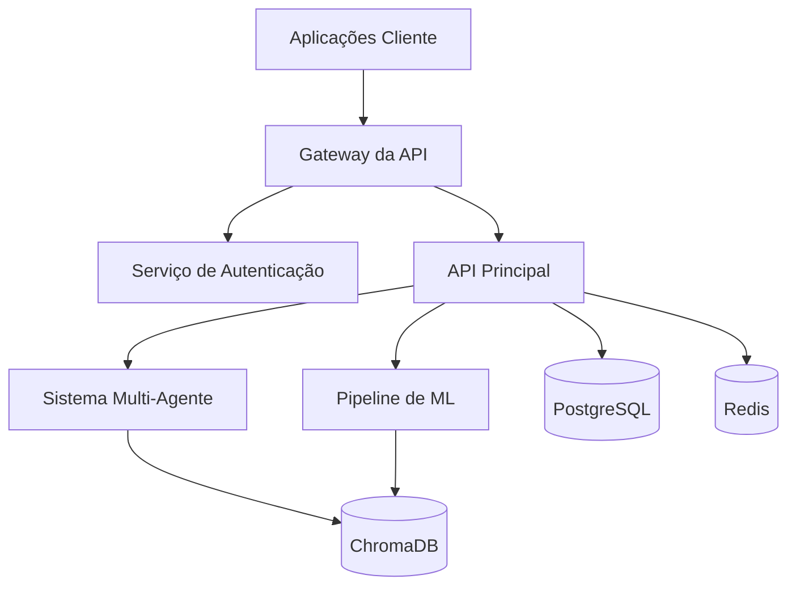
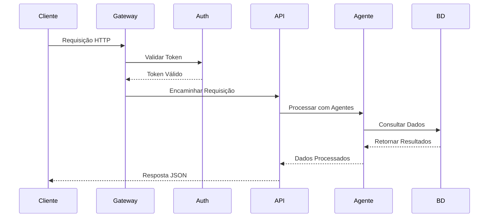

# Visão Geral da API

## Arquitetura

A API do Cidadão.AI é construída em uma **arquitetura orientada a microsserviços** usando FastAPI, projetada para alta performance, escalabilidade e processamento de dados em tempo real. O sistema implementa um **padrão de arquitetura em camadas** com separação clara de responsabilidades.

### Componentes Principais



## Especificações Técnicas

### Protocolo e Padrões
- **Protocolo**: HTTPS/2 com TLS 1.3
- **Estilo de API**: RESTful com conformidade JSON:API
- **Versionamento**: Baseado em URI (`/api/v1/`)
- **Autenticação**: OAuth 2.0 + JWT (RFC 7519)
- **Documentação**: Especificação OpenAPI 3.0

### Características de Performance
- **Tempo de Resposta**: p95 < 100ms, p99 < 500ms
- **Throughput**: 10.000+ requisições/segundo
- **Concorrência**: Async/await com pool de conexões
- **Cache**: Multi-camada (Redis + In-memory)

## Ciclo de Vida da API

### Fluxo de Requisição



### Stack de Middleware

1. **Middleware CORS**: Compartilhamento de recursos entre origens
2. **Middleware de Segurança**: Headers, proteção XSS
3. **Middleware de Autenticação**: Validação JWT
4. **Middleware de Rate Limiting**: Algoritmo token bucket
5. **Middleware de Logging**: Logs estruturados JSON
6. **Middleware de Tratamento de Erros**: Respostas de erro consistentes

## Modelos de Dados

### Entidades Principais

```python
# Entidade Investigação
class Investigacao:
    id: UUID
    usuario_id: UUID
    consulta: str
    status: StatusInvestigacao
    anomalias_encontradas: int
    pontuacao_confianca: float
    criado_em: datetime
    concluido_em: Optional[datetime]
    
# Entidade Análise  
class Analise:
    id: UUID
    tipo: TipoAnalise
    fonte_dados: FonteDados
    resultados: Dict[str, Any]
    metadados: MetadadosAnalise
    
# Entidade Relatório
class Relatorio:
    id: UUID
    titulo: str
    conteudo: str
    formato: FormatoRelatorio
    investigacoes: List[UUID]
    gerado_em: datetime
```

## Tratamento de Erros

### Formato de Resposta de Erro

```json
{
  "erro": {
    "codigo": "ERRO_VALIDACAO",
    "mensagem": "Parâmetros de requisição inválidos",
    "detalhes": {
      "campo": "consulta",
      "motivo": "Parâmetro consulta é obrigatório"
    },
    "id_requisicao": "550e8400-e29b-41d4-a716-446655440000",
    "timestamp": "2025-01-30T10:15:30Z"
  }
}
```

### Códigos de Status HTTP

| Código | Significado | Uso |
|--------|-------------|-----|
| 200 | OK | GET, PUT bem-sucedidos |
| 201 | Criado | POST bem-sucedido |
| 204 | Sem Conteúdo | DELETE bem-sucedido |
| 400 | Requisição Inválida | Parâmetros inválidos |
| 401 | Não Autorizado | Autenticação ausente/inválida |
| 403 | Proibido | Permissões insuficientes |
| 404 | Não Encontrado | Recurso não existe |
| 429 | Muitas Requisições | Limite de taxa excedido |
| 500 | Erro Interno do Servidor | Erro do lado do servidor |

## Limitação de Taxa

### Limites por Nível

| Nível | Requisições/Hora | Rajada | Concorrente |
|-------|------------------|--------|-------------|
| Anônimo | 100 | 10 | 2 |
| Autenticado | 1.000 | 100 | 10 |
| Premium | 10.000 | 1.000 | 50 |
| Admin | Ilimitado | - | - |

### Headers de Limite de Taxa

```http
X-RateLimit-Limit: 1000
X-RateLimit-Remaining: 999
X-RateLimit-Reset: 1640995200
X-RateLimit-Retry-After: 3600
```

## Segurança

### Fluxo de Autenticação

1. **Autenticação Inicial**: POST `/api/v1/auth/login`
2. **Resposta de Token**: Access token (15min) + Refresh token (7d)
3. **Autenticação de Requisição**: `Authorization: Bearer <access_token>`
4. **Renovação de Token**: POST `/api/v1/auth/refresh`

### Headers de Segurança

```http
X-Content-Type-Options: nosniff
X-Frame-Options: DENY
X-XSS-Protection: 1; mode=block
Strict-Transport-Security: max-age=31536000; includeSubDomains
Content-Security-Policy: default-src 'self'
```

## Paginação

### Parâmetros de Requisição

```http
GET /api/v1/investigacoes?pagina=2&limite=20&ordenacao=-criado_em
```

### Formato de Resposta

```json
{
  "dados": [...],
  "meta": {
    "pagina": 2,
    "limite": 20,
    "total": 156,
    "paginas": 8
  },
  "links": {
    "primeira": "/api/v1/investigacoes?pagina=1&limite=20",
    "anterior": "/api/v1/investigacoes?pagina=1&limite=20",
    "proxima": "/api/v1/investigacoes?pagina=3&limite=20",
    "ultima": "/api/v1/investigacoes?pagina=8&limite=20"
  }
}
```

## Filtragem e Ordenação

### Sintaxe de Filtro

```http
GET /api/v1/investigacoes?filtro[status]=concluida&filtro[anomalias_encontradas][gte]=5
```

### Sintaxe de Ordenação

```http
GET /api/v1/investigacoes?ordenacao=-anomalias_encontradas,criado_em
```

## Webhooks

### Eventos de Webhook

- `investigacao.concluida`
- `analise.finalizada`
- `relatorio.gerado`
- `anomalia.detectada`

### Payload do Webhook

```json
{
  "evento": "investigacao.concluida",
  "dados": {
    "id_investigacao": "550e8400-e29b-41d4-a716-446655440000",
    "anomalias_encontradas": 12,
    "severidade": "alta"
  },
  "timestamp": "2025-01-30T10:15:30Z",
  "assinatura": "sha256=..."
}
```

## Versionamento da API

### Estratégia de Versão

- **Versão Atual**: v1
- **Aviso de Descontinuação**: 6 meses
- **Fim da Vida**: 12 meses
- **Header de Versão**: `X-API-Version: 1`

### Política de Mudanças Críticas

1. Anunciar nas notas de lançamento
2. Adicionar avisos de descontinuação
3. Manter compatibilidade regressiva
4. Fornecer guia de migração

## Otimização de Performance

### Estratégia de Cache

1. **Cache do Navegador**: Assets estáticos (1 ano)
2. **Cache CDN**: Respostas da API (5 minutos)
3. **Cache Redis**: Consultas de banco (1 hora)
4. **Cache da Aplicação**: Resultados computados (15 minutos)

### Otimização de Consulta

- **Seleção de Campos**: `?campos=id,titulo,status`
- **Carregamento Eager**: `?incluir=investigacoes,analises`
- **Fieldsets Esparsos**: Minimizar tamanho do payload
- **Compressão**: gzip/brotli para respostas

## Monitoramento e Observabilidade

### Métricas Expostas

- Taxa de requisições (req/s)
- Tempo de resposta (p50, p95, p99)
- Taxa de erro (4xx, 5xx)
- Conexões ativas
- Taxa de acerto do cache

### Endpoints de Saúde

- `/health` - Verificação básica de saúde
- `/health/detailed` - Status abrangente
- `/health/live` - Liveness do Kubernetes
- `/health/ready` - Readiness do Kubernetes

## Suporte SDK

### SDKs Oficiais

- Python: `pip install cidadao-ai-sdk`
- JavaScript/TypeScript: `npm install @cidadao-ai/sdk`
- Go: `go get github.com/cidadao-ai/go-sdk`

### Exemplo de Código

```python
from cidadao_ai import Cliente

cliente = Cliente(api_key="sua-api-key")

# Iniciar investigação
investigacao = cliente.investigacoes.criar(
    consulta="Contratos suspeitos em 2024",
    fonte_dados="portal_transparencia",
    filtros={"ano": 2024, "valor_min": 1000000}
)

# Verificar status
status = cliente.investigacoes.obter_status(investigacao.id)

# Obter resultados
if status.concluida:
    resultados = cliente.investigacoes.obter_resultados(investigacao.id)
    print(f"Encontradas {resultados.anomalias_encontradas} anomalias")
```

## Melhores Práticas

### Otimização de Requisições

1. Use seleção de campos para reduzir payload
2. Implemente cache no lado do cliente
3. Agrupe requisições quando possível
4. Use webhooks para operações longas

### Tratamento de Erros

1. Implemente backoff exponencial
2. Trate limites de taxa graciosamente
3. Registre erros com IDs de requisição
4. Valide entradas no lado do cliente

### Segurança

1. Nunca exponha chaves de API no código
2. Use variáveis de ambiente
3. Implemente assinatura de requisições
4. Valide certificados SSL

## Guia de Migração

### De v0 para v1

1. Atualize URL base para `/api/v1/`
2. Migre de chaves de API para JWT
3. Atualize tratamento de erros para novo formato
4. Implemente paginação para endpoints de lista

---

Próximo: [Autenticação →](./autenticacao.md)