# 🤖 Sistema Multi-Agente - Cidadão.AI

**Última Atualização**: 22 de Janeiro de 2025
**Total de Agentes**: 17 (16 operacionais + 1 base framework)
**Status**: ✅ 94.1% Operacional (16/17 agentes em produção)

---

## 📊 Visão Geral Executiva

O Cidadão.AI implementa uma arquitetura **multi-agente distribuída** com 17 agentes especializados, cada um baseado em uma figura histórica brasileira. Todos os agentes herdam do framework `ReflectiveAgent` (definido em `deodoro.py`) que implementa auto-reflexão com threshold de qualidade 0.8.

### Estatísticas do Sistema

| Métrica | Valor Atual |
|---------|-------------|
| **Total de Agentes** | 17 (16 operacionais + 1 framework base) |
| **Lazy Loading** | 367x mais rápido (3.81ms vs 1460ms) |
| **Quality Threshold** | 0.8 (80% confidence minimum) |
| **Max Iterations** | 3 (self-reflection retries) |
| **Tempo Médio de Resposta** | ~3.2s (investigação completa) |
| **Test Coverage (Agents)** | 76.29% (target: 80%) |

---

## 🎯 Hierarquia e Organização

Os 17 agentes estão organizados em **6 camadas funcionais**:

### 🎯 Camada 1: Coordenação (2 agentes)

| Agente | Responsabilidade | Capacidades Principais |
|--------|------------------|------------------------|
| **👑 Abaporu** | Master Orchestrator | Coordenação multi-agente, planejamento de investigações, consolidação de resultados |
| **🏎️ Senna** | Agent Router | Detecção de intenção, roteamento semântico, load balancing, priority queues |

### 🔍 Camada 2: Investigação (3 agentes)

| Agente | Especialidade | Algoritmos/Técnicas |
|--------|---------------|---------------------|
| **⚔️ Zumbi dos Palmares** | Anomaly Detection | FFT Spectral Analysis, Z-score > 2.5, pattern recognition |
| **🏹 Oxóssi** | Fraud Hunter | Bid rigging detection, price fixing, phantom vendor identification |
| **🕵️ Obaluaiê** | Corruption Detector | Benford's Law, cartel detection, money laundering patterns |

### 📊 Camada 3: Análise (4 agentes)

| Agente | Especialidade | Capacidades |
|--------|---------------|-------------|
| **📊 Anita Garibaldi** | Data Analyst | pandas/numpy integration, statistical analysis, trend identification |
| **🗺️ Lampião** | Regional Analyst | Spatial analysis, geographic patterns, regional disparities |
| **⚖️ José Bonifácio** | Legal Expert | Lei 8.666/93, Lei 14.133/21, legal validation |
| **🔮 Céuci** | Predictive AI | ARIMA/SARIMA, LSTM, Prophet time series forecasting |

### 📝 Camada 4: Processamento (3 agentes)

| Agente | Responsabilidade | Foco |
|--------|------------------|------|
| **✍️ Machado de Assis** | Narrative Analyst | Story extraction, sentiment analysis, context building |
| **⚖️ Dandara** | Social Equity | Gini Coefficient, equity analysis, inclusion monitoring |
| **🛡️ Maria Quitéria** | Security Guardian | IDS/IPS, LGPD compliance, threat detection |

### 📢 Camada 5: Comunicação (3 agentes)

| Agente | Especialidade | Outputs |
|--------|---------------|---------|
| **📝 Tiradentes** | Report Generator | PDF/HTML/MD reports (ReportLab), executive summaries |
| **📢 Carlos Drummond de Andrade** | Communicator | NLG multi-channel, Portuguese poetry-style communication |
| **🎨 Oscar Niemeyer** | Data Visualizer | matplotlib/D3.js charts, interactive dashboards |

### 🧠 Camada 6: Suporte (2 agentes)

| Agente | Função | Descrição |
|--------|--------|-----------|
| **🧠 Nanã** | Memory Manager | Context management, knowledge base, historical data storage |
| **🏗️ Deodoro da Fonseca** | Base Framework | `BaseAgent` + `ReflectiveAgent` classes (all agents inherit) |

---

## 🏗️ Arquitetura de Agentes

### Diagrama de Hierarquia Completa

```mermaid
graph TD
    subgraph "🎯 Camada de Coordenação"
        MASTER[👑 Abaporu<br/>Master Orchestrator<br/>━━━━━━━━━━<br/>Investigation planning<br/>Multi-agent coordination<br/>Result consolidation]
        ROUTER[🏎️ Senna<br/>Agent Router<br/>━━━━━━━━━━<br/>Intent detection<br/>Semantic routing<br/>Load balancing]
    end

    subgraph "🔍 Camada de Investigação"
        ZUMBI[⚔️ Zumbi<br/>Anomaly Detective<br/>━━━━━━━━━━<br/>FFT Spectral Analysis<br/>Z-score > 2.5<br/>Pattern recognition]

        OXOSSI[🏹 Oxóssi<br/>Fraud Hunter<br/>━━━━━━━━━━<br/>Bid rigging<br/>Price fixing<br/>Phantom vendors]

        OBALUAIE[🕵️ Obaluaiê<br/>Corruption Detector<br/>━━━━━━━━━━<br/>Benford's Law<br/>Cartel detection<br/>Money laundering]
    end

    subgraph "📊 Camada de Análise"
        ANITA[📊 Anita<br/>Data Analyst<br/>━━━━━━━━━━<br/>pandas/numpy<br/>Statistics<br/>Trends]

        LAMPIAO[🗺️ Lampião<br/>Regional Analyst<br/>━━━━━━━━━━<br/>Spatial analysis<br/>Geography<br/>Regional patterns]

        BONIFACIO[⚖️ Bonifácio<br/>Legal Expert<br/>━━━━━━━━━━<br/>Lei 8.666/93<br/>Lei 14.133/21<br/>Validation]

        CEUCI[🔮 Céuci<br/>Predictive AI<br/>━━━━━━━━━━<br/>ARIMA/LSTM<br/>Prophet<br/>Forecasting]
    end

    subgraph "📝 Camada de Processamento"
        MACHADO[✍️ Machado<br/>Narrative Analyst<br/>━━━━━━━━━━<br/>Story extraction<br/>Sentiment analysis<br/>Context]

        DANDARA[⚖️ Dandara<br/>Social Equity<br/>━━━━━━━━━━<br/>Gini Coefficient<br/>Equity analysis<br/>Inclusion]

        MARIA[🛡️ Maria Quitéria<br/>Security<br/>━━━━━━━━━━<br/>IDS/IPS<br/>LGPD<br/>Threats]
    end

    subgraph "📢 Camada de Comunicação"
        TIRADENTES[📝 Tiradentes<br/>Reporter<br/>━━━━━━━━━━<br/>PDF/HTML/MD<br/>ReportLab<br/>Summaries]

        DRUMMOND[📢 Drummond<br/>Communicator<br/>━━━━━━━━━━<br/>NLG<br/>Portuguese<br/>Multi-channel]

        NIEMEYER[🎨 Niemeyer<br/>Visualizer<br/>━━━━━━━━━━<br/>matplotlib<br/>D3.js<br/>Dashboards]
    end

    subgraph "🧠 Camada de Suporte"
        NANA[🧠 Nanã<br/>Memory Manager<br/>━━━━━━━━━━<br/>Context<br/>Knowledge base<br/>History]

        DEODORO[🏗️ Deodoro<br/>Base Framework<br/>━━━━━━━━━━<br/>BaseAgent<br/>ReflectiveAgent<br/>Quality 0.8]
    end

    %% Routing
    ROUTER --> MASTER
    ROUTER --> ZUMBI
    ROUTER --> ANITA

    %% Master Orchestration
    MASTER --> ZUMBI
    MASTER --> ANITA
    MASTER --> OXOSSI
    MASTER --> LAMPIAO
    MASTER --> TIRADENTES

    %% Investigation Chain
    ZUMBI --> OXOSSI
    OXOSSI --> OBALUAIE

    %% Analysis Chain
    ANITA --> LAMPIAO
    ANITA --> CEUCI
    LAMPIAO --> DANDARA

    %% Communication Chain
    CEUCI --> TIRADENTES
    OBALUAIE --> TIRADENTES
    DANDARA --> TIRADENTES
    TIRADENTES --> DRUMMOND
    TIRADENTES --> NIEMEYER

    %% Security Oversight
    MARIA -.-> MASTER
    MARIA -.-> ZUMBI
    BONIFACIO -.-> TIRADENTES

    %% Support Infrastructure
    NANA --> MASTER
    MACHADO --> TIRADENTES
    DEODORO -.-> ZUMBI
    DEODORO -.-> ANITA
    DEODORO -.-> OXOSSI

    classDef coordination fill:#ff6b6b,stroke:#333,stroke-width:3px,color:#fff
    classDef investigation fill:#ffd93d,stroke:#333,stroke-width:2px,color:#000
    classDef analysis fill:#a8dadc,stroke:#333,stroke-width:2px,color:#000
    classDef processing fill:#e76f51,stroke:#333,stroke-width:2px,color:#fff
    classDef communication fill:#61dafb,stroke:#333,stroke-width:2px,color:#000
    classDef support fill:#ddd,stroke:#333,stroke-width:2px,color:#000

    class MASTER,ROUTER coordination
    class ZUMBI,OXOSSI,OBALUAIE investigation
    class ANITA,LAMPIAO,BONIFACIO,CEUCI analysis
    class MACHADO,DANDARA,MARIA processing
    class TIRADENTES,DRUMMOND,NIEMEYER communication
    class NANA,DEODORO support
```



---

## 🔄 Pattern: ReflectiveAgent

### Implementação Base (Deodoro Framework)

Todos os 16 agentes operacionais herdam de `ReflectiveAgent` (definido em `src/agents/deodoro.py`):

```python
class ReflectiveAgent(BaseAgent):
    """
    Base agent with self-reflection capabilities.

    Features:
    - Quality threshold: 0.8 (80% minimum confidence)
    - Max iterations: 3 (up to 3 improvement attempts)
    - Automatic retry with reflection on low quality results
    """

    def __init__(
        self,
        name: str,
        description: str,
        capabilities: List[str],
        quality_threshold: float = 0.8,  # 80% confidence
        max_iterations: int = 3           # Up to 3 retries
    ):
        super().__init__(name, description, capabilities)
        self.quality_threshold = quality_threshold
        self.max_iterations = max_iterations
        self.retry_count = 0

    async def process(
        self,
        message: AgentMessage,
        context: AgentContext
    ) -> AgentResponse:
        """
        Main processing with automatic reflection.
        """
        result = await self._execute(message, context)

        # Self-reflection loop
        while (
            result.quality < self.quality_threshold and
            self.retry_count < self.max_iterations
        ):
            reflection = await self.reflect(result, context)
            result = await self._execute_with_improvements(
                message, context, reflection
            )
            self.retry_count += 1

        return result

    async def reflect(
        self,
        result: AgentResponse,
        context: AgentContext
    ) -> ReflectionResult:
        """
        Analyze what went wrong and plan improvements.

        Returns:
            - What was wrong
            - Why it failed quality check
            - How to improve
            - Revised approach
        """
        quality_score = await self.evaluate_quality(result)

        if quality_score < self.quality_threshold:
            problems = await self.identify_problems(result)
            improvement_plan = await self.plan_improvements(problems)
            return improvement_plan

        return None
```

### Estados dos Agentes

```python
class AgentState(Enum):
    """Agent lifecycle states"""
    IDLE = "idle"          # Ready to accept tasks
    THINKING = "thinking"  # Processing request (LLM call)
    ACTING = "acting"      # Executing action (API call, computation)
    WAITING = "waiting"    # Waiting for external response
    ERROR = "error"        # Error during execution
    COMPLETED = "completed" # Task successfully completed
```

---

## 🔁 Fluxo de Investigação Completo

### Caso de Uso: Investigação de Contratos de Saúde > R$ 1M


---

## 🧠 Comunicação Entre Agentes

### Protocol: Agent Message Passing

```python
class AgentMessage:
    """Standard message format for inter-agent communication"""
    sender: str              # Agent name (e.g., "abaporu")
    recipient: str           # Target agent (e.g., "zumbi")
    action: str              # Action to perform (e.g., "detect_anomalies")
    payload: Dict[str, Any]  # Data and parameters
    correlation_id: str      # For distributed tracing
    priority: int            # 1-5 (5 = critical)
    timestamp: datetime

class AgentResponse:
    """Standard response format"""
    agent_name: str
    status: str              # success, error, partial
    result: Dict[str, Any]
    quality: float           # 0.0-1.0 confidence score
    metadata: Dict[str, Any]
    processing_time: float   # milliseconds
```

### Padrões de Comunicação

**1. Direct Invocation** (mais comum):
```python
# Senna → Abaporu
message = AgentMessage(
    sender="senna",
    recipient="abaporu",
    action="investigate",
    payload={"query": user_query}
)
result = await abaporu.process(message, context)
```

**2. Master-Delegate Pattern**:
```python
# Abaporu → Zumbi, Anita (parallel)
tasks = [
    zumbi.process(detect_message, context),
    anita.process(analyze_message, context)
]
results = await asyncio.gather(*tasks)
```

**3. Chain Pattern**:
```python
# Zumbi → Oxóssi → Obaluaiê (sequential)
zumbi_result = await zumbi.process(message, context)
oxossi_result = await oxossi.process(
    AgentMessage(payload=zumbi_result),
    context
)
obaluaie_result = await obaluaie.process(
    AgentMessage(payload=oxossi_result),
    context
)
```

---

## ⚡ Performance: Lazy Loading

### Implementação (src/agents/__init__lazy.py)

```python
# AGENT_MAPPING: Maps agent names to module paths
AGENT_MAPPING = {
    "ZumbiAgent": "src.agents.zumbi:ZumbiAgent",
    "AnitaAgent": "src.agents.anita:AnitaAgent",
    "TiradentesAgent": "src.agents.tiradentes:TiradentesAgent",
    "SennaAgent": "src.agents.ayrton_senna:SennaAgent",
    # ... 12 more agents
}

def __getattr__(name: str):
    """
    Magic method for lazy loading.
    Only imports agent when first accessed.
    """
    if name in AGENT_MAPPING:
        module_path, class_name = AGENT_MAPPING[name].rsplit(":", 1)
        module = importlib.import_module(module_path)
        agent_class = getattr(module, class_name)
        globals()[name] = agent_class  # Cache for future use
        return agent_class

    raise AttributeError(f"module 'agents' has no attribute '{name}'")
```

### Benchmark Results

| Metric | Before (Eager) | After (Lazy) | Improvement |
|--------|----------------|--------------|-------------|
| **Module Import Time** | 1460.41 ms | 3.81 ms | **367x faster** ✨ |
| **First Agent Access** | Included in above | +0.17 ms | Negligible overhead |
| **Memory (Initial)** | 250 MB | 45 MB | 82% reduction |
| **Cold Start (API)** | 2.1s | 0.3s | 7x faster |

---

## 📊 Métricas de Performance por Agente

### Coverage de Testes

**Tier 1 - Excellent (>75% coverage)**: 10 agentes
1. ⚔️ Zumbi - 96.32%
2. 📊 Anita - 94.87%
3. 🏹 Oxóssi - 94.44%
4. 🗺️ Lampião - 93.75%
5. 🏎️ Senna - 92.31%
6. 📝 Tiradentes - 91.67%
7. 🎨 Niemeyer - 89.47%
8. ✍️ Machado - 88.24%
9. ⚖️ Bonifácio - 87.50%
10. 🛡️ Maria Quitéria - 86.96%

**Tier 2 - Near-Complete (81-86%)**: 5 agentes
11. 👑 Abaporu - 85.71%
12. 🧠 Nanã - 84.62%
13. 📢 Drummond - 83.33%
14. 🔮 Céuci - 82.76%
15. 🕵️ Obaluaiê - 81.25%

**Tier 3 - Framework Complete**: 1 agente
16. ⚖️ Dandara - 86.32% (framework pronto, integração API pending)

**Base Framework**:
17. 🏗️ Deodoro - 96.45% (BaseAgent + ReflectiveAgent)

### Tempo Médio de Processamento

| Agente | Tempo Médio | Complexidade |
|--------|-------------|--------------|
| Senna (Router) | ~50ms | O(1) - intent matching |
| Zumbi (Anomaly) | ~800ms | O(n log n) - FFT |
| Anita (Analysis) | ~600ms | O(n) - statistics |
| Tiradentes (Report) | ~1200ms | O(n) - PDF generation |
| Abaporu (Orchestrator) | ~3200ms | O(k*n) - k agents, n items |

---

## 🔐 Segurança e Governance

### Agente de Segurança: Maria Quitéria 🛡️

**Responsabilidades**:
1. **IDS/IPS** - Intrusion Detection/Prevention
2. **LGPD Compliance** - Data protection automation
3. **Threat Detection** - Real-time security monitoring
4. **Incident Response** - Automated response workflows
5. **Security Audits** - Continuous vulnerability scanning

**Implementação**:
```python
class MariaQuiteriaAgent(ReflectiveAgent):
    async def monitor_investigation(self, investigation_id: str):
        """Monitors investigation for security issues"""
        # Check for PII exposure
        pii_detected = await self.detect_pii(investigation_id)
        if pii_detected:
            await self.anonymize_data(investigation_id)

        # Check for unauthorized access attempts
        suspicious_activity = await self.analyze_audit_logs()
        if suspicious_activity:
            await self.trigger_incident_response()

        # LGPD compliance check
        compliance_status = await self.check_lgpd_compliance()
        return SecurityReport(
            pii_protected=True,
            lgpd_compliant=compliance_status,
            threats_detected=len(suspicious_activity)
        )
```

### Agente Legal: José Bonifácio ⚖️

**Expertise**:
- Lei 8.666/93 (antiga lei de licitações)
- Lei 14.133/21 (nova lei de licitações)
- Validação legal de contratos
- Conformidade com marco legal

---

## 📚 Próximos Passos

Para saber mais sobre os agentes:

1. [**Deodoro (Base Framework)**](../agents/deodoro.md) - Framework ReflectiveAgent
2. [**Zumbi (Anomaly Detection)**](../agents/zumbi.md) - Detecção de anomalias com FFT
3. [**Abaporu (Master Orchestrator)**](../agents/abaporu.md) - Coordenação multi-agente
4. [**Senna (Router)**](../agents/senna.md) - Roteamento inteligente
5. [**Overview de Todos os Agentes**](../agents/overview.md) - Documentação completa

---

## 🔗 Recursos Técnicos

### Código-Fonte
- **Base Framework**: `src/agents/deodoro.py` (647 linhas)
- **Lazy Loading**: `src/agents/__init__lazy.py` (implementação __getattr__)
- **Agent Pool**: `src/agents/simple_agent_pool.py` (singleton manager)
- **Todos os Agentes**: `src/agents/*.py` (24 arquivos, 25,247 linhas)

### Registros
- **Agent Registry**: `src/agents/__init__.py` (AGENT_MAPPING com 16 agentes)
- **Test Files**: `tests/unit/agents/test_*.py` (31 arquivos de teste)

---

:::tip Sistema em Produção

O sistema multi-agente está **100% operacional** em produção desde 07/10/2025. Todos os 16 agentes passam por lazy loading automático e implementam self-reflection com quality threshold 0.8.

**Performance**: 367x mais rápido no import (3.81ms vs 1460ms)
:::

---

**Última Atualização**: 22 de Janeiro de 2025
**Versão**: 3.0.0
**Status**: ✅ 16/17 Agentes Operacionais (94.1%)
