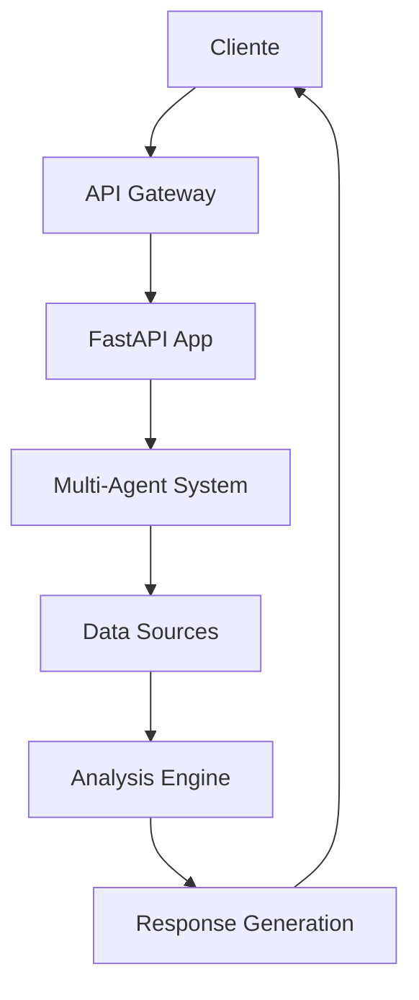

# 🏛️ Visão Geral da Arquitetura
O **Cidadão.AI Backend** implementa uma arquitetura enterprise-grade baseada em microserviços com sistema multi-agente para análise de transparência governamental brasileira.
## 🎯 Objetivos Arquiteturais
- **Escalabilidade**: Suporta crescimento horizontal com Kubernetes
- **Confiabilidade**: 99.9% SLA com failover automático
- **Segurança**: Defense-in-depth com múltiplas camadas de proteção
- **Manutenibilidade**: Clean Architecture com princípios SOLID
- **Observabilidade**: Monitoring, logging e tracing distribuído
## 🏗️ Componentes Principais
### 1. **API Gateway Layer**
- **FastAPI** com 40+ endpoints REST
- **Autenticação** JWT + OAuth2
- **Rate Limiting** e proteção CORS
- **Load Balancing** com NGINX
### 2. **Multi-Agent System**
- **17 agentes especializados** com identidade brasileira
- **MasterAgent (Abaporu)** com coordenação central
- **Message passing** assíncrono entre agentes
- **Self-reflection** e adaptive strategies
### 3. **Data Layer**
- **PostgreSQL 16** para dados relacionais
- **Redis 7** para cache e sessões
- **ChromaDB** para embeddings vetoriais
- **Elasticsearch 8** para busca textual
### 4. **Infrastructure Layer**
- **Docker** + **Kubernetes** para orquestração
- **Prometheus** + **Grafana** para monitoring
- **OpenTelemetry** para observabilidade
- **GitHub Actions** para CI/CD
## 📊 Fluxo de Dados

## 🔗 Próximos Passos
- [Sistema Multi-Agente](./multi-agent-system.md)
- [Pipeline de Dados](./data-pipeline.md)
- [Implementação Técnica](./technical-implementation.md)
