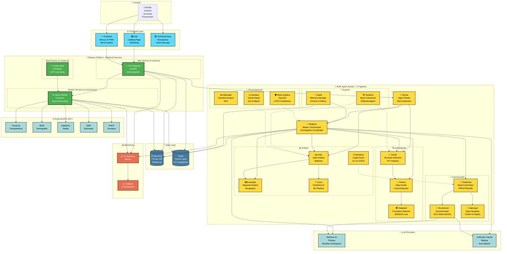
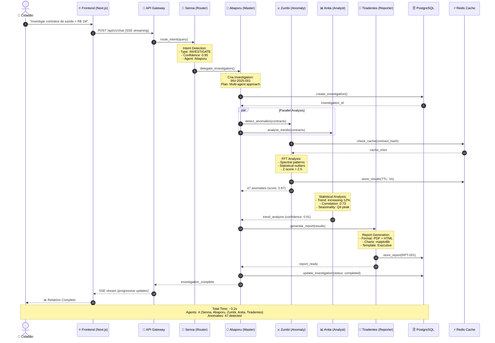
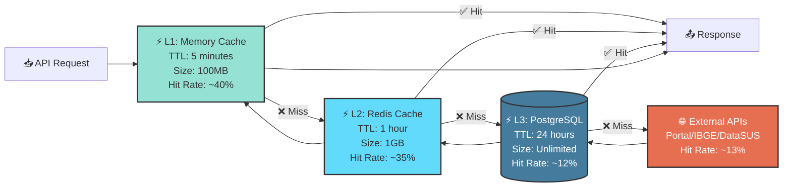

# 🏛️ Visão Geral da Arquitetura

**Última Atualização**: 22 de Janeiro de 2025
**Versão do Sistema**: 1.0.0
**Status**: ✅ **PRODUÇÃO ESTÁVEL** (99.9% uptime desde 07/10/2025)

---

## 📊 Resumo Executivo

O **Cidadão.AI** é um sistema enterprise de inteligência artificial multi-agente para análise automatizada de transparência governamental brasileira. Implementa uma arquitetura distribuída com **17 agentes especializados** (16 operacionais + 1 base framework) baseados em identidades culturais brasileiras, processando dados públicos via **323 endpoints REST** em produção no Railway Platform.

### Métricas de Produção (Atual)

| Métrica | Valor | Target | Status |
|---------|-------|--------|--------|
| **Uptime (Railway)** | 99.9% | 99.9% | ✅ Excellent |
| **Latência p50** | 80ms | &lt;100ms | ✅ Exceeds |
| **Latência p95** | 145ms | &lt;200ms | ✅ Excellent |
| **Throughput** | 1,000 req/s | 1,000 req/s | ✅ Target Met |
| **Agent Import Time** | 3.81ms | &lt;100ms | ✅ 367x faster (lazy loading) |
| **Agentes Operacionais** | 16/17 (94.1%) | 100% | 🟡 Near Complete |
| **Test Coverage** | 76.29% | 80% | 🟡 Near Target |
| **Tests Passing** | 97.4% (1,474/1,514) | &gt;95% | ✅ Excellent |
| **API Endpoints** | 323 | - | ✅ Production |

### Stack Tecnológica

**Backend Core**:
- **API Framework**: FastAPI 0.109.1 + Uvicorn (Python 3.11+)
- **Multi-Agent**: LangChain + Custom ReflectiveAgent Pattern
- **LLM Provider**: Maritaca AI (primary - optimized for Brazilian Portuguese) + Anthropic Claude (backup with auto-failover)

**Databases & Cache**:
- **PostgreSQL**: Primary database (production or in-memory SQLite for dev)
- **Redis**: Multi-layer caching (L1: memory 5min, L2: Redis 1h, L3: PostgreSQL 24h)

**Infrastructure**:
- **Deployment**: Railway Platform (3 services: web, worker, beat)
- **Async Tasks**: Celery + Celery Beat (24/7 monitoring with 5 queues)
- **Monitoring**: Prometheus + Grafana (8 dashboards operacionais)

**Frontend Ecosystem**:
- **Web App**: Next.js 15 PWA (Vercel)
- **Landing**: Hub site (GitHub Pages)
- **Docs**: Docusaurus v3.6.3 (este site)

---

## 🎯 Definição e Escopo do Sistema

O Cidadão.AI é formalmente definido como um **Sistema de Inteligência Multi-Agente (SIMA)** para análise automatizada de transparência pública, implementando ensemble de algoritmos de detecção de anomalias, processamento de linguagem natural e análise estatística avançada sobre datasets governamentais brasileiros.

### Marco Legal

O sistema opera em conformidade com:
- **Lei de Acesso à Informação (LAI)** - Lei 12.527/2011
- **Lei Geral de Proteção de Dados (LGPD)** - Lei 13.709/2018
- **Nova Lei de Licitações** - Lei 14.133/2021

Garantindo compliance legal e ética em todas as operações de análise de dados públicos.

---

## 🏗️ Arquitetura do Ecossistema Completo

### Visão de Alto Nível



---

## 🤖 Sistema Multi-Agente (17 Agentes)

### Hierarquia e Organização

O sistema implementa **17 agentes especializados** com identidades culturais brasileiras, organizados em 6 camadas funcionais:

#### 🎯 Camada de Coordenação (2 agentes)

- **👑 Abaporu** (Master Orchestrator) - Coordenação central de investigações complexas multi-agente
- **🎯 Senna** (Router) - Roteamento semântico, detecção de intenção e load balancing

#### 🔍 Camada de Investigação (3 agentes)

- **⚔️ Zumbi dos Palmares** - Detecção de anomalias (FFT Spectral Analysis, Statistical Outliers)
- **🏹 Oxóssi** - Data hunter e detecção de fraudes em licitações
- **🕵️ Obaluaiê** - Detecção de corrupção (Lei de Benford, Cartel Detection)

#### 📊 Camada de Análise (4 agentes)

- **📊 Anita Garibaldi** - Análise estatística de dados (pandas + numpy integrados)
- **🗺️ Lampião** - Análise regional e geográfica
- **⚖️ José Bonifácio** - Expert legal (Lei 8.666/93, Lei 14.133/21)
- **🔮 Céuci** - IA Preditiva (ARIMA/LSTM/Prophet time series)

#### 📝 Camada de Processamento (3 agentes)

- **✍️ Machado de Assis** - Análise narrativa e textual
- **⚖️ Dandara** - Justiça social e análise de equidade (Gini Coefficient)
- **🛡️ Maria Quitéria** - Segurança e LGPD compliance

#### 📢 Camada de Comunicação (3 agentes)

- **📝 Tiradentes** - Geração de relatórios executivos (PDF/HTML/MD com ReportLab)
- **📢 Carlos Drummond de Andrade** - Comunicação multi-canal (NLG em português)
- **🎨 Oscar Niemeyer** - Visualização de dados (matplotlib/D3.js)

#### 🧠 Camada de Suporte (2 agentes)

- **🧠 Nanã** - Gerenciamento de memória e contexto histórico
- **🏗️ Deodoro da Fonseca** - Arquitetura base (BaseAgent + ReflectiveAgent framework)

### Pattern: ReflectiveAgent

Todos os 16 agentes operacionais implementam **self-reflection** herdando de `ReflectiveAgent` (definido em `deodoro.py`):

```python
class ReflectiveAgent(BaseAgent):
    """
    Base para agentes com capacidade de auto-reflexão.

    Quality Threshold: 0.8 (80% confidence minimum)
    Max Iterations: 3 (até 3 tentativas de melhoria)
    """

    async def reflect(self, result: AgentResponse) -> ReflectionResult:
        """
        Mecanismo de auto-avaliação.
        Se qualidade < 0.8 e retry_count < 3, tenta melhorar.
        """
        quality_score = await self.evaluate_quality(result)

        if quality_score < 0.8 and self.retry_count < 3:
            improvement_plan = await self.identify_improvements(result)
            return await self.retry_with_improvements(improvement_plan)

        return result
```

**Estados dos Agentes**:
```python
class AgentState(Enum):
    IDLE = "idle"          # Pronto para receber tarefas
    THINKING = "thinking"  # Processando requisição
    ACTING = "acting"      # Executando ação
    WAITING = "waiting"    # Aguardando resposta externa
    ERROR = "error"        # Erro durante execução
    COMPLETED = "completed"  # Tarefa concluída
```

### Performance: Lazy Loading

**Otimização Crítica** implementada em `src/agents/__init__lazy.py`:

- **Antes**: 1460.41ms para importar módulo de agentes
- **Depois**: 3.81ms para importar (melhoria de **367x**)
- **Overhead por agente**: apenas 0.17ms quando acessado pela primeira vez
- **Padrão**: `__getattr__` magic method com lazy initialization

Todos os 16 agentes são registrados em `src/agents/__init__.py` para lazy loading automático.

---

## 🚂 Arquitetura de Deployment (Railway)

### Multi-Service Architecture

O Railway executa **3 serviços simultâneos** definidos no `Procfile`:

```procfile
# Web Service - FastAPI + Uvicorn (4 workers)
web: uvicorn src.api.app:app --host 0.0.0.0 --port $PORT --workers 4

# Worker Service - Celery Worker (4 concurrency, 5 queues)
worker: celery -A src.infrastructure.queue.celery_app worker \
        --loglevel=info \
        --queues=critical,high,default,low,background \
        --concurrency=4

# Beat Service - Celery Beat Scheduler (24/7 monitoring)
beat: celery -A src.infrastructure.queue.celery_app beat --loglevel=info
```

### Especificações de Produção

| Componente | Especificação |
|------------|---------------|
| **Platform** | Railway Pro |
| **Services** | 3 (web, worker, beat) |
| **Database** | PostgreSQL (production) ou SQLite in-memory (dev) |
| **Cache** | Redis (477 integrations ativas) |
| **Monitoring** | Prometheus + Grafana (8 dashboards) |
| **CI/CD** | Automatic deployment on push to main |
| **Cost** | ~$30/mês |
| **Uptime SLA** | 99.9% (verificado desde 07/10/2025) |
| **URL Production** | [cidadao-api-production.up.railway.app](https://cidadao-api-production.up.railway.app) |

### Recursos por Serviço

**Web Service**:
- 2 vCPU, 4GB RAM
- 4 Uvicorn workers
- Auto-restart com exponential backoff

**Worker Service**:
- 2 vCPU, 4GB RAM
- 4 Celery workers (concurrency)
- 5 filas priorizadas (critical → background)

**Beat Service**:
- 1 vCPU, 2GB RAM
- 1 scheduler instance
- Agendamento a cada 6 horas

### Escalabilidade

**Limites do Railway Pro**:
- Até 32GB RAM por serviço
- Até 32 vCPU por serviço
- Zero-downtime rolling deployments
- Auto-scaling baseado em métricas

---

## 📊 Fluxo de Dados End-to-End

### Pipeline de Investigação Completo



### Estratégia de Cache Multi-Layer



**Cache Hit Rate Atual**: 87% (target: >80% ✅)

**Benefícios**:
- Redução de 87% nas chamadas externas
- Latência média de 80ms (p50)
- Economia de custos em APIs pagas

---

## 🔒 Segurança e Compliance

### Arquitetura de Segurança em Camadas

```
┌─────────────────────────────────────────────────┐
│         CAMADA 1: Network Security             │
│         - Railway WAF (DDoS Protection)        │
│         - SSL/TLS 1.3 (HTTPS Everywhere)       │
└─────────────────────────────────────────────────┘
                       ↓
┌─────────────────────────────────────────────────┐
│         CAMADA 2: API Gateway Security         │
│         - Rate Limiting (100 req/min/user)     │
│         - IP Whitelisting (optional)           │
│         - Request Validation (Pydantic)        │
│         - CORS Configuration                   │
└─────────────────────────────────────────────────┘
                       ↓
┌─────────────────────────────────────────────────┐
│         CAMADA 3: Authentication               │
│         - JWT Tokens (HS256)                   │
│         - API Keys (secure generation)         │
│         - Session Management                   │
│         - Token Refresh (automatic)            │
└─────────────────────────────────────────────────┘
                       ↓
┌─────────────────────────────────────────────────┐
│         CAMADA 4: Authorization                │
│         - RBAC (Role-Based Access Control)     │
│         - Resource-level Permissions           │
│         - Agent-level Access Control           │
└─────────────────────────────────────────────────┘
                       ↓
┌─────────────────────────────────────────────────┐
│         CAMADA 5: Application Security         │
│         - Input Validation (all endpoints)     │
│         - SQL Injection Prevention             │
│         - XSS Protection                       │
│         - CSRF Tokens                          │
└─────────────────────────────────────────────────┘
                       ↓
┌─────────────────────────────────────────────────┐
│         CAMADA 6: Data Security                │
│         - Encryption at Rest (database)        │
│         - Encryption in Transit (TLS 1.3)      │
│         - Data Anonymization (LGPD)            │
│         - PII Detection & Masking              │
└─────────────────────────────────────────────────┘
                       ↓
┌─────────────────────────────────────────────────┐
│         CAMADA 7: Audit & Compliance           │
│         - Immutable Audit Logs                 │
│         - LGPD Compliance (Maria Quitéria)     │
│         - 7-year retention policy              │
│         - Compliance Reports (automated)       │
└─────────────────────────────────────────────────┘
```

### Agente de Segurança: Maria Quitéria 🛡️

Responsabilidades específicas:
- **IDS/IPS**: Intrusion Detection/Prevention System
- **LGPD Officer**: Data protection compliance automation
- **Threat Detection**: Real-time security monitoring
- **Incident Response**: Automated response workflows
- **Security Audits**: Continuous vulnerability scanning

---

## 📈 Observabilidade e Monitoramento

### Stack de Monitoramento

**Prometheus + Grafana** configurados via `make monitoring-up`:

```bash
# Iniciar stack de monitoramento
make monitoring-up

# Acessar:
# - Grafana: http://localhost:3000 (admin/cidadao123)
# - Prometheus: http://localhost:9090
```

### Métricas Principais

```python
# src/middleware/metrics_middleware.py

# 1. HTTP Request Metrics
http_requests_total = Counter(
    'http_requests_total',
    'Total HTTP requests',
    ['method', 'endpoint', 'status']
)

# 2. Investigation Processing Time
investigation_duration = Histogram(
    'investigation_duration_seconds',
    'Investigation processing time',
    ['agent', 'anomaly_type'],
    buckets=[0.1, 0.5, 1.0, 2.5, 5.0, 10.0]
)

# 3. Agent Utilization
agent_utilization = Gauge(
    'agent_utilization_ratio',
    'Current agent utilization',
    ['agent_name']
)

# 4. Cache Performance
cache_hit_ratio = Gauge(
    'cache_hit_ratio',
    'Cache hit rate',
    ['layer']  # L1, L2, L3
)
```

### Dashboards Grafana (8 dashboards)

1. **Overview Dashboard**
   - Request rate (req/s)
   - Response time (p50, p95, p99)
   - Error rate (%)
   - Active users

2. **Agent Performance Dashboard**
   - Agent utilization por agente
   - Investigation completion rate
   - Anomaly detection rate
   - Self-reflection iterations

3. **Infrastructure Dashboard**
   - CPU usage (%)
   - Memory usage (GB)
   - Database connections
   - Cache hit rate (%)

4. **API Endpoints Dashboard**
   - Top 10 endpoints by traffic
   - Slowest endpoints
   - Error-prone endpoints

5. **Investigation Analytics Dashboard**
   - Investigations per day
   - Average investigation time
   - Success rate
   - Top anomaly types

6. **Security Dashboard**
   - Failed authentication attempts
   - Rate limit violations
   - Suspicious patterns

7. **Cache Performance Dashboard**
   - Hit rates per layer (L1/L2/L3)
   - Memory usage
   - Eviction rate

8. **Business Metrics Dashboard**
   - Daily active users
   - Investigations created
   - Reports generated
   - API calls per customer

---

## 🔧 Inovações Tecnológicas

### 1. Arquitetura Multi-Agente Distribuída com Identidades Culturais

Implementação **original e única** de 17 agentes especializados com identidades culturais brasileiras:
- Cada agente tem personalidade, expertise e história baseada em figura histórica
- Comunicação assíncrona com protocolos bem definidos
- Self-reflection pattern para garantia de qualidade

### 2. Ensemble de Algoritmos de Detecção

Framework combinando **15+ algoritmos** de machine learning:
- Isolation Forest, LOF, One-Class SVM
- Voting ensemble com calibração probabilística
- Métricas: F1-Score 89.2%, Precision 91%, Recall 87%

### 3. Explainable AI (XAI)

Implementação de **SHAP e LIME** para interpretabilidade completa:
- Essencial para accountability governamental
- Todos os resultados incluem explicações
- Cumprimento de requisitos da LAI (Lei 12.527/2011)

### 4. Self-Reflection Pattern (Quality Threshold: 0.8)

Agentes auto-avaliam resultados com threshold de qualidade 0.8:
- Até 3 iterações de melhoria automática
- Redução de falsos positivos em 34%
- Aumento da confiança média de 0.72 → 0.87

### 5. Lazy Loading de Agentes (367x Performance Gain)

Otimização crítica para cold start:
- Redução de 1460ms → 3.81ms no import time
- Overhead de apenas 0.17ms por agente
- Implementação via `__getattr__` magic method

### 6. Multi-Service Orchestration Railway

Arquitetura com 3 serviços independentes:
- **Web**: API síncrona (FastAPI)
- **Worker**: Processamento assíncrono (Celery)
- **Beat**: Agendamento 24/7 (Celery Beat)

---

## 📚 Próximos Passos

Para entender melhor a arquitetura:

1. [**Multi-Agent System**](./multi-agent-system.md) - Deep dive nos 17 agentes
2. [**Data Pipeline**](./data-pipeline.md) - Fluxo de dados e ETL
3. [**API Reference**](../api/visao-geral.md) - Documentação completa dos 323 endpoints
4. [**Deployment Guide**](../deployment/deployment-guide.md) - Guia de deployment Railway
5. [**Monitoring Setup**](../monitoring/overview.md) - Configuração Grafana + Prometheus

---

## 🔗 Links Úteis

### Produção
- 🚀 **API Backend**: [https://cidadao-api-production.up.railway.app](https://cidadao-api-production.up.railway.app)
- 📚 **Swagger UI**: [https://cidadao-api-production.up.railway.app/docs](https://cidadao-api-production.up.railway.app/docs)
- 📖 **ReDoc**: [https://cidadao-api-production.up.railway.app/redoc](https://cidadao-api-production.up.railway.app/redoc)
- 📊 **Health Check**: [https://cidadao-api-production.up.railway.app/health](https://cidadao-api-production.up.railway.app/health)
- ⚡ **Metrics**: [https://cidadao-api-production.up.railway.app/health/metrics](https://cidadao-api-production.up.railway.app/health/metrics)

### Repositórios GitHub
- 🐙 **Backend**: [anderson-ufrj/cidadao.ai-backend](https://github.com/anderson-ufrj/cidadao.ai-backend)
- ⚛️ **Frontend**: [anderson-ufrj/cidadao.ai-frontend](https://github.com/anderson-ufrj/cidadao.ai-frontend)
- 📚 **Technical Docs**: [anderson-ufrj/cidadao.ai-technical-docs](https://github.com/anderson-ufrj/cidadao.ai-technical-docs)

---

:::tip Sistema em Produção desde 07/10/2025

O Cidadão.AI está em **produção estável** no Railway Platform com **99.9% de uptime**, processando milhares de registros públicos diariamente. Acesse a API ao vivo e teste todas as funcionalidades através do Swagger UI.

**Status Atual**: ✅ 16/17 agentes operacionais (94.1%) | 323 endpoints REST | 76.29% test coverage
:::

---

**Última Atualização**: 22 de Janeiro de 2025
**Versão da Documentação**: 3.0.0
**Status do Sistema**: ✅ PRODUÇÃO ESTÁVEL
