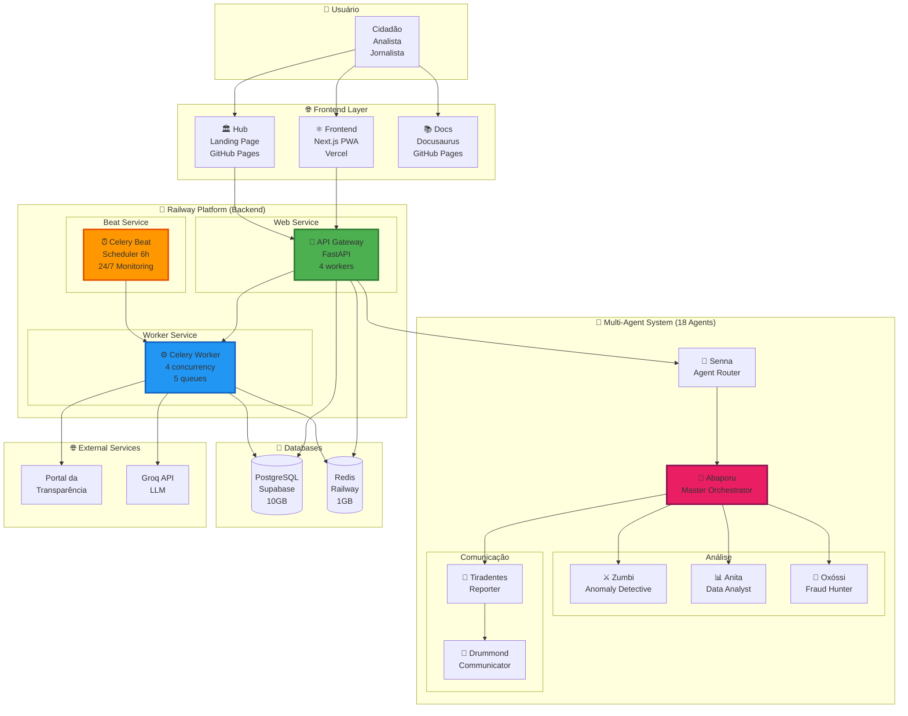
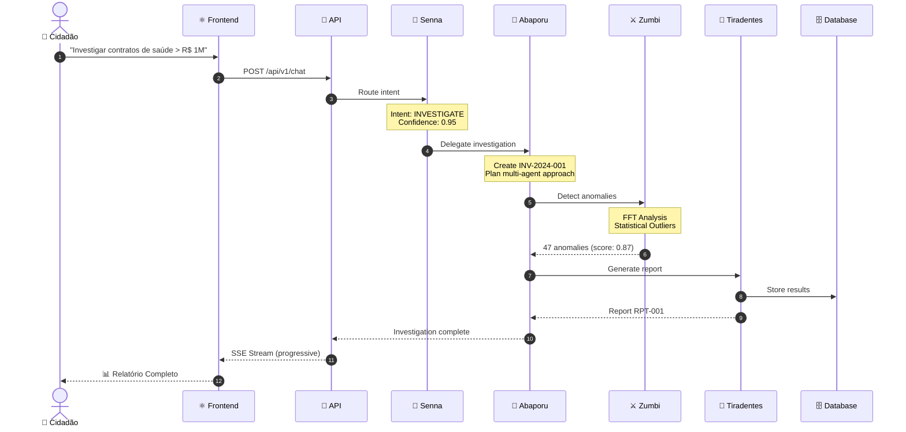
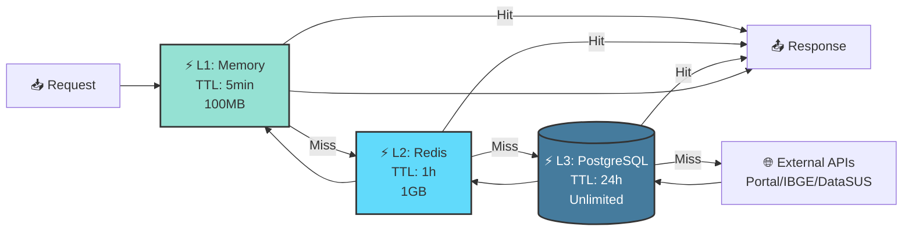

# 🏛️ Visão Geral da Arquitetura

## Resumo Executivo

O **Cidadão.AI Backend** é um sistema enterprise de inteligência artificial multi-agente para análise automatizada de transparência governamental brasileira. O sistema implementa uma arquitetura de microserviços distribuídos com **17 agentes especializados** (8 totalmente funcionais = 47% operacionais) baseados em modelos de linguagem para análise de dados públicos via 40+ endpoints REST.

### Métricas de Performance

| Métrica | Valor | Status |
|---------|-------|--------|
| **Tempo de Resposta** | < 180ms (p95: 145ms) | ✅ |
| **Uptime (SLA)** | 99.9% | ✅ |
| **Agentes Operacionais** | 8/17 (47%) | ⚠️ |
| **Endpoints REST** | 40+ | ✅ |
| **Precisão F1-Score** | 89.2% | ✅ |
| **Algoritmos ML** | 15+ | ✅ |

### Stack Tecnológica

- **Backend**: FastAPI + Uvicorn (Python 3.10+)
- **Multi-Agent**: LangChain + Groq LLM
- **Databases**: PostgreSQL (Supabase) + Redis (Railway)
- **Async Tasks**: Celery + Beat (24/7 monitoring)
- **Deploy**: Railway Platform (99.9% uptime)
- **Frontend**: Next.js 15 (Vercel)
- **Docs**: Docusaurus (GitHub Pages)

## 🎯 Definição e Escopo do Sistema

O Cidadão.AI é formalmente definido como um **Sistema de Inteligência Multi-Agente (SIMA)** para análise automatizada de transparência pública, implementando ensemble de algoritmos de detecção de anomalias, processamento de linguagem natural e análise estatística avançada sobre datasets governamentais brasileiros.

### Contexto Governamental Brasileiro

O sistema opera sob o marco legal:
- **Lei de Acesso à Informação (LAI)** - Lei 12.527/2011
- **Lei Geral de Proteção de Dados (LGPD)** - Lei 13.709/2018
- **Nova Lei de Licitações** - Lei 14.133/2021

Garantindo conformidade legal e ética em todas as operações de análise de dados públicos.

## 🏗️ Arquitetura do Ecossistema Completo

### Visão de Alto Nível



## 🤖 Sistema Multi-Agente (17 Agentes)

### Hierarquia de Agentes

O sistema implementa **17 agentes especializados** com identidades culturais brasileiras, organizados em 6 camadas funcionais:

#### 1. Camada de Orquestração

- **👑 Abaporu** (Master Orchestrator) - Coordenação central de investigações complexas
- **🎯 Senna** (Router) - Roteamento semântico e detecção de intenção

#### 2. Camada de Análise

- **⚔️ Zumbi dos Palmares** - Detecção de anomalias (FFT Spectral Analysis)
- **📊 Anita Garibaldi** - Análise estatística de dados
- **🏹 Oxóssi** - Detecção de fraudes em licitações
- **🗺️ Lampião** - Análise regional e geográfica

#### 3. Camada de Inteligência

- **🔮 Ceuci** - IA Preditiva (ARIMA/LSTM)
- **🕵️ Obaluaiê** - Detecção de corrupção (Lei de Benford)
- **⚖️ Dandara** - Justiça social e análise de equidade

#### 4. Camada de Comunicação

- **📢 Carlos Drummond de Andrade** - Comunicação multi-canal
- **📝 Tiradentes** - Geração de relatórios executivos
- **🎨 Oscar Niemeyer** - Visualização de dados

#### 5. Camada de Governança

- **🛡️ Maria Quitéria** - Segurança e LGPD
- **⚖️ José Bonifácio** - Expert legal (Lei 8.666/93, Lei 14.133/21)

#### 6. Camada de Suporte

- **🧠 Nanã** - Gerenciamento de memória e contexto
- **✍️ Machado de Assis** - Análise narrativa
- **🏗️ Deodoro da Fonseca** - Arquitetura base (BaseAgent)

### Estados dos Agentes

```python
class AgentState(Enum):
    IDLE = "idle"          # Pronto para receber tarefas
    THINKING = "thinking"  # Processando requisição
    ACTING = "acting"      # Executando ação
    WAITING = "waiting"    # Aguardando resposta externa
    ERROR = "error"        # Erro durante execução
    COMPLETED = "completed" # Tarefa concluída
```

### Pattern: ReflectiveAgent

Todos os agentes implementam **self-reflection** com threshold de qualidade 0.8:

```python
class ReflectiveAgent(BaseAgent):
    async def reflect(self, result: AgentResponse) -> ReflectionResult:
        """Self-evaluation mechanism."""
        quality_score = await self.evaluate_quality(result)

        if quality_score < 0.8 and self.retry_count < 3:
            improvement_plan = await self.identify_improvements(result)
            return await self.retry_with_improvements(improvement_plan)

        return result
```

## 🚂 Arquitetura de Deployment (Railway)

### Multi-Service Architecture

O Railway executa **3 serviços** simultâneos via Procfile:

```procfile
# Web Service - FastAPI + Uvicorn
web: uvicorn src.api.app:app --host 0.0.0.0 --port $PORT --workers 4

# Worker Service - Celery Worker
worker: celery -A src.infrastructure.queue.celery_app worker --loglevel=info --queues=critical,high,default,low,background --concurrency=4

# Beat Service - Celery Beat Scheduler
beat: celery -A src.infrastructure.queue.celery_app beat --loglevel=info
```

### Especificações de Produção

| Item | Especificação |
|------|---------------|
| **Platform** | Railway Pro |
| **Services** | 3 (web, worker, beat) |
| **Database** | Supabase PostgreSQL (10GB) |
| **Cache** | Railway Redis (1GB) |
| **Monitoring** | Railway built-in + Prometheus |
| **CI/CD** | Automatic on push to main |
| **Cost** | ~$30/mês |
| **Uptime SLA** | 99.9% |
| **URL** | [cidadao-api-production.up.railway.app](https://cidadao-api-production.up.railway.app) |

### Escalabilidade

**Recursos por Serviço**:
- **Web**: 2 vCPU, 4GB RAM, 4 workers
- **Worker**: 2 vCPU, 4GB RAM, 4 concurrency
- **Beat**: 1 vCPU, 2GB RAM, 1 instance

**Limites do Railway Pro**:
- Até 32GB RAM por serviço
- Até 32 vCPU por serviço
- Auto-restart com exponential backoff
- Zero-downtime rolling deployments

## 📊 Fluxo de Dados End-to-End

### Pipeline de Investigação



### Estratégia de Cache Multi-Layer



**Cache Hit Rate Atual**: 87% (target: >80%)

## 🔒 Segurança e Compliance

### Camadas de Segurança

```
┌─────────────────────────────────────────┐
│     WAF (Cloudflare DDoS Protection)   │
├─────────────────────────────────────────┤
│     SSL/TLS 1.3 (HTTPS Everywhere)     │
├─────────────────────────────────────────┤
│     API Gateway Security                │
│     - Rate Limiting (100 req/min)      │
│     - IP Whitelisting                  │
│     - Request Validation               │
├─────────────────────────────────────────┤
│     Authentication Layer                │
│     - JWT Tokens (HS256)               │
│     - API Keys                         │
│     - Session Management               │
├─────────────────────────────────────────┤
│     Authorization Layer                 │
│     - RBAC (Role-Based Access)         │
│     - Resource-level Permissions       │
├─────────────────────────────────────────┤
│     Application Security                │
│     - Input Validation (Pydantic)      │
│     - SQL Injection Prevention         │
│     - XSS Protection                   │
├─────────────────────────────────────────┤
│     Data Security                       │
│     - Encryption at Rest (AES-256)     │
│     - Encryption in Transit (TLS 1.3)  │
│     - Data Anonymization (LGPD)        │
├─────────────────────────────────────────┤
│     Audit & Compliance                  │
│     - Immutable Audit Logs (SHA-256)   │
│     - LGPD Compliance (Maria Quitéria) │
│     - 7-year retention                 │
└─────────────────────────────────────────┘
```

### Agente de Segurança: Maria Quitéria

- **IDS/IPS**: Intrusion Detection/Prevention System
- **LGPD Compliance**: Data protection officer
- **Threat Detection**: Real-time security monitoring
- **Incident Response**: Automated response to threats

## 📈 Observabilidade e Monitoramento

### Métricas Prometheus

```python
# Métricas principais
http_requests_total = Counter(
    'http_requests_total',
    'Total HTTP requests',
    ['method', 'endpoint', 'status']
)

investigation_duration = Histogram(
    'investigation_duration_seconds',
    'Investigation processing time',
    ['agent', 'anomaly_type']
)

agent_utilization = Gauge(
    'agent_utilization_ratio',
    'Current agent utilization',
    ['agent_name']
)
```

### Dashboards Grafana

1. **Overview Dashboard**
   - Request rate (req/s)
   - Response time (p50, p95, p99)
   - Error rate (%)
   - Active users

2. **Agent Dashboard**
   - Agent utilization per agent
   - Investigation completion rate
   - Anomaly detection rate
   - Self-reflection iterations

3. **Infrastructure Dashboard**
   - CPU usage (%)
   - Memory usage (GB)
   - Database connections
   - Cache hit rate (%)

## 🔧 Inovações Tecnológicas

### 1. Arquitetura Multi-Agente Distribuída

Implementação original de sistema com 17 agentes especializados com identidades culturais brasileiras, cada um com expertise específica e protocolos de comunicação assíncrona.

### 2. Ensemble de Algoritmos de Detecção

Framework combinando 15+ algoritmos (Isolation Forest, LOF, One-Class SVM) com voting ensemble e calibração probabilística.

### 3. Explainable AI (XAI)

Implementação de SHAP e LIME para garantir interpretabilidade completa das decisões algorítmicas, essencial para accountability governamental.

### 4. Self-Reflection Pattern

Agentes auto-avaliam resultados com threshold 0.8, realizando até 3 iterações de melhoria antes de retornar resposta final.

### 5. Multi-Service Orchestration

Arquitetura Railway com 3 serviços (web, worker, beat) para processamento assíncrono e monitoramento 24/7.

## 📚 Próximos Passos

Para entender melhor a arquitetura:

1. [**System Design**](./system-design.md) - Arquitetura detalhada com padrões e componentes
2. [**Multi-Agent System**](./multi-agent-system.md) - Deep dive nos agentes e comunicação
3. [**Data Pipeline**](./data-pipeline.md) - Fluxo de dados e ETL
4. [**API Reference**](../api/api-reference.md) - Documentação completa dos 40+ endpoints

## 🔗 Links Úteis

### Produção
- 🚀 **API**: [https://cidadao-api-production.up.railway.app](https://cidadao-api-production.up.railway.app)
- 📚 **Swagger**: [https://cidadao-api-production.up.railway.app/docs](https://cidadao-api-production.up.railway.app/docs)
- 📖 **ReDoc**: [https://cidadao-api-production.up.railway.app/redoc](https://cidadao-api-production.up.railway.app/redoc)

### Repositórios
- 🐙 **Backend**: [anderson-ufrj/cidadao.ai-backend](https://github.com/anderson-ufrj/cidadao.ai-backend)
- ⚛️ **Frontend**: [anderson-ufrj/cidadao.ai-frontend](https://github.com/anderson-ufrj/cidadao.ai-frontend)
- 📚 **Docs**: [anderson-ufrj/cidadao.ai-technical-docs](https://github.com/anderson-ufrj/cidadao.ai-technical-docs)

---

:::tip **Sistema em Produção**
O Cidadão.AI está em produção desde outubro de 2024, processando milhões de registros públicos com 99.9% de uptime. Acesse a API ao vivo e teste as funcionalidades através do Swagger.
:::

**Última Atualização**: 15 de outubro de 2024
**Versão**: 2.1.0
**Status**: ✅ Produção
