# Docker Configuration

## Visão Geral

O Cidadão.AI oferece múltiplas configurações Docker para diferentes cenários: desenvolvimento local, produção auto-hospedada, e monitoramento.

:::info Railway Deployment
Em produção, o Cidadão.AI usa **Railway** (não Docker). Docker é usado para:
- Development local com PostgreSQL + Redis
- Produção self-hosted
- Stack de monitoramento (Grafana + Prometheus)
:::

## Arquiteturas Disponíveis

### 1. Production Stack (Full)

**Arquivo**: `config/docker/docker-compose.production.yml`


**Serviços**:
- **api**: FastAPI application (port 8000)
- **postgres**: PostgreSQL 15 database
- **redis**: Redis 7 cache/queue
- **nginx**: Reverse proxy + SSL termination
- **certbot**: SSL certificate auto-renewal

**Uso**:
```bash
cd /path/to/cidadao.ai-backend

# Configurar variáveis
cp .env.example .env
# Editar .env com DB_PASSWORD, REDIS_PASSWORD, etc.

# Iniciar stack
docker-compose -f config/docker/docker-compose.production.yml up -d

# Verificar status
docker-compose -f config/docker/docker-compose.production.yml ps

# Logs
docker-compose -f config/docker/docker-compose.production.yml logs -f api

# Parar
docker-compose -f config/docker/docker-compose.production.yml down
```

### 2. Monitoring Stack

**Arquivo**: `config/docker/docker-compose.monitoring.yml`

```mermaid
graph TB
    API[Cidadão.AI API<br/>:7860] --> Prometheus[Prometheus<br/>:9090]
    Prometheus --> Grafana[Grafana<br/>:3000]
    NodeExporter[Node Exporter<br/>:9100] --> Prometheus
    cAdvisor[cAdvisor<br/>:8080] --> Prometheus

    style API fill:#2196F3
    style Prometheus fill:#E6522C
    style Grafana fill:#F46800
```



**Serviços**:
- **cidadao-ai**: Backend application (port 7860)
- **prometheus**: Metrics collection (port 9090)
- **grafana**: Visualization dashboards (port 3000)
- **node_exporter**: System metrics (port 9100)
- **cadvisor**: Container metrics (port 8080)

**Uso**:
```bash
# Iniciar monitoramento
docker-compose -f config/docker/docker-compose.monitoring.yml up -d

# Acessar dashboards
# Grafana: http://localhost:3000 (admin/cidadao123)
# Prometheus: http://localhost:9090
# cAdvisor: http://localhost:8080

# Parar
docker-compose -f config/docker/docker-compose.monitoring.yml down -v
```

### 3. Workers Only (Celery)

**Arquivo**: `config/deployment/workers/docker-compose.workers-only.yml`

**Uso**: Para escalar workers Celery independentemente do web service.

```bash
docker-compose -f config/deployment/workers/docker-compose.workers-only.yml up -d
```

## Dockerfile Principal

**Location**: `config/docker/Dockerfile`

### Multi-stage Build (Otimizado)

```dockerfile
# Stage 1: Builder
FROM python:3.11-slim as builder
ENV PYTHONUNBUFFERED=1
ENV PYTHONDONTWRITEBYTECODE=1

# Install system dependencies
RUN apt-get update && apt-get install -y \
    curl \
    postgresql-client \
    && rm -rf /var/lib/apt/lists/*

# Install Python dependencies
COPY requirements.txt ./
RUN pip install --no-cache-dir --upgrade pip && \
    pip install --no-cache-dir -r requirements.txt

# Stage 2: Runtime
FROM python:3.11-slim
ENV PYTHONUNBUFFERED=1
ENV PYTHONDONTWRITEBYTECODE=1
ENV ENVIRONMENT=production

# Copy only necessary files from builder
COPY --from=builder /usr/local/lib/python3.11/site-packages /usr/local/lib/python3.11/site-packages
COPY --from=builder /usr/local/bin /usr/local/bin

# Create app user (security)
RUN useradd --create-home --shell /bin/bash app

# Set work directory
WORKDIR /app

# Copy application code
COPY src/ ./src/
COPY *.py ./

# Create necessary directories
RUN mkdir -p logs models data && \
    chown -R app:app /app

USER app

# Health check
HEALTHCHECK --interval=30s --timeout=10s --start-period=40s --retries=3 \
    CMD curl -f http://localhost:${PORT:-8000}/health || exit 1

# Run application
CMD uvicorn src.api.app:app --host 0.0.0.0 --port ${PORT:-8000}
```

### Features

- ✅ **Multi-stage build**: Reduz imagem final em ~40%
- ✅ **Non-root user**: Segurança (user `app`)
- ✅ **Health check**: Kubernetes/Docker Swarm ready
- ✅ **Dynamic PORT**: Railway/Render compatible
- ✅ **Production-ready**: Otimizado para deploy

## Development com Docker

### Quick Start

```bash
# 1. Clonar repositório
git clone https://github.com/anderson-ufrj/cidadao.ai-backend.git
cd cidadao.ai-backend

# 2. Configurar ambiente
cp .env.example .env
# Editar .env com suas API keys

# 3. Build imagem
docker build -f config/docker/Dockerfile -t cidadao-ai:dev .

# 4. Executar
docker run -d \
  --name cidadao-api \
  -p 8000:8000 \
  --env-file .env \
  cidadao-ai:dev

# 5. Verificar logs
docker logs -f cidadao-api

# 6. Testar
curl http://localhost:8000/health
curl http://localhost:8000/docs
```

### Docker Compose (Development)

```yaml
# docker-compose.dev.yml (criar na raiz)
version: '3.8'

services:
  api:
    build:
      context: .
      dockerfile: config/docker/Dockerfile
    ports:
      - "8000:8000"
    env_file:
      - .env
    volumes:
      - ./src:/app/src  # Hot reload
      - ./logs:/app/logs
    command: uvicorn src.api.app:app --reload --host 0.0.0.0 --port 8000
```

```bash
# Executar
docker-compose -f docker-compose.dev.yml up
```

## Production Deployment (Self-hosted)

### Prerequisites

```bash
# 1. Servidor Linux (Ubuntu 22.04 LTS recomendado)
# 2. Docker Engine 24+ e Docker Compose v2+
# 3. Domínio configurado apontando para servidor
# 4. Portas 80/443 abertas no firewall
```

### Setup

**1. Install Docker**:
```bash
# Ubuntu/Debian
curl -fsSL https://get.docker.com -o get-docker.sh
sudo sh get-docker.sh

# Adicionar usuário ao grupo docker
sudo usermod -aG docker $USER
newgrp docker

# Verificar instalação
docker --version
docker-compose --version
```

**2. Configure Environment**:
```bash
# Clonar repositório
git clone https://github.com/anderson-ufrj/cidadao.ai-backend.git
cd cidadao.ai-backend

# Criar .env
cat > .env << EOF
DB_PASSWORD=$(openssl rand -base64 32)
REDIS_PASSWORD=$(openssl rand -base64 32)
JWT_SECRET_KEY=$(python3 -c "import secrets; print(secrets.token_urlsafe(64))")
SECRET_KEY=$(python3 -c "import secrets; print(secrets.token_urlsafe(64))")
MARITACA_API_KEY=<your-key>
TRANSPARENCY_API_KEY=<your-key>
APP_ENV=production
DEBUG=false
EOF

chmod 600 .env  # Proteger secrets
```

**3. Configure Nginx**:
```nginx
# nginx.conf (criar na raiz)
events {
    worker_connections 1024;
}

http {
    upstream api {
        server api:8000;
    }

    server {
        listen 80;
        server_name seu-dominio.com.br;

        location /.well-known/acme-challenge/ {
            root /var/www/certbot;
        }

        location / {
            return 301 https://$host$request_uri;
        }
    }

    server {
        listen 443 ssl;
        server_name seu-dominio.com.br;

        ssl_certificate /etc/letsencrypt/live/seu-dominio.com.br/fullchain.pem;
        ssl_certificate_key /etc/letsencrypt/live/seu-dominio.com.br/privkey.pem;

        location / {
            proxy_pass http://api;
            proxy_set_header Host $host;
            proxy_set_header X-Real-IP $remote_addr;
            proxy_set_header X-Forwarded-For $proxy_add_x_forwarded_for;
            proxy_set_header X-Forwarded-Proto $scheme;
        }
    }
}
```

**4. Start Services**:
```bash
# Iniciar stack completa
docker-compose -f config/docker/docker-compose.production.yml up -d

# Gerar certificado SSL (primeira vez)
docker-compose -f config/docker/docker-compose.production.yml run --rm certbot \
  certonly --webroot --webroot-path=/var/www/certbot \
  -d seu-dominio.com.br \
  --email seu-email@example.com \
  --agree-tos \
  --no-eff-email

# Reiniciar nginx para carregar certificado
docker-compose -f config/docker/docker-compose.production.yml restart nginx
```

**5. Verify Deployment**:
```bash
# Check services
docker-compose -f config/docker/docker-compose.production.yml ps

# Expected output:
# NAME            STATUS    PORTS
# api             Up        0.0.0.0:8000->8000/tcp
# postgres        Up        5432/tcp
# redis           Up        6379/tcp
# nginx           Up        0.0.0.0:80->80/tcp, 0.0.0.0:443->443/tcp
# certbot         Up

# Test endpoints
curl https://seu-dominio.com.br/health
curl https://seu-dominio.com.br/docs
```

## Monitoring Stack

### Grafana Setup

```bash
# 1. Iniciar stack de monitoramento
docker-compose -f config/docker/docker-compose.monitoring.yml up -d

# 2. Acessar Grafana
open http://localhost:3000
# Login: admin / cidadao123

# 3. Configurar data source
# Dashboards → Data Sources → Add data source → Prometheus
# URL: http://prometheus:9090
# Save & Test

# 4. Importar dashboards
# Dashboards → Import → Upload JSON
# Usar arquivos em: monitoring/grafana/dashboards/
```

### Dashboards Disponíveis

**8 Dashboards Pré-configurados**:
1. **Overview** - Sistema geral
2. **API Performance** - Endpoints, latência, throughput
3. **Agents** - Performance dos 17 agentes
4. **Investigations** - Status e métricas de investigações
5. **Database** - PostgreSQL queries, connections
6. **Redis** - Cache hit rate, memory usage
7. **System** - CPU, Memory, Disk, Network
8. **Alerts** - Status de alertas ativos

**Métricas Principais**:
- Request rate (req/s)
- Response time (p50, p95, p99)
- Error rate (4xx, 5xx)
- Cache hit rate (target: >85%)
- Agent processing time
- Database connection pool

## Troubleshooting

### Problema 1: Container Não Inicia

**Sintoma**:
```log
Error response from daemon: Cannot start container
```

**Diagnóstico**:
```bash
# Verificar logs
docker logs <container-id>

# Verificar porta em uso
sudo lsof -i :8000

# Verificar recursos
docker system df
docker stats
```

**Solução**:
```bash
# Limpar containers antigos
docker container prune

# Limpar volumes não usados
docker volume prune

# Rebuild imagem
docker-compose build --no-cache
```

### Problema 2: Database Connection Failed

**Sintoma**:
```log
sqlalchemy.exc.OperationalError: could not connect to server
```

**Solução**:
```bash
# Verificar se PostgreSQL está rodando
docker-compose ps postgres

# Verificar health check
docker inspect <postgres-container-id> | grep Health

# Conectar manualmente
docker exec -it <postgres-container> psql -U cidadao -d cidadao

# Verificar DATABASE_URL no .env
docker-compose config | grep DATABASE_URL
```

### Problema 3: Out of Memory

**Sintoma**:
```log
docker: Error response from daemon: OCI runtime create failed
```

**Solução**:
```bash
# Limitar memória do container
docker run -m 512m cidadao-ai:latest

# No docker-compose.yml:
services:
  api:
    mem_limit: 512m
    memswap_limit: 512m
```

### Problema 4: SSL Certificate Renewal Failed

**Sintoma**:
```log
certbot: Error: The following errors were reported by the server
```

**Solução**:
```bash
# Verificar domínio apontando corretamente
dig seu-dominio.com.br

# Testar renewal manualmente
docker-compose -f config/docker/docker-compose.production.yml run --rm certbot \
  renew --dry-run

# Forçar renewal
docker-compose -f config/docker/docker-compose.production.yml run --rm certbot renew --force-renewal
```

## Best Practices

### Security

```bash
# 1. Usar non-root user (já configurado no Dockerfile)
USER app

# 2. Scan vulnerabilidades
docker scan cidadao-ai:latest

# 3. Usar secrets do Docker
docker secret create jwt_secret ./jwt_secret.txt
# No docker-compose.yml:
secrets:
  jwt_secret:
    external: true

# 4. Limitar recursos
docker run --cpus=1 --memory=512m cidadao-ai:latest

# 5. Read-only filesystem (onde possível)
docker run --read-only --tmpfs /tmp cidadao-ai:latest
```

### Performance

```bash
# 1. Multi-stage build (reduz imagem em 40%)
FROM python:3.11-slim as builder
# ... build steps ...
FROM python:3.11-slim
COPY --from=builder ...

# 2. Layer caching (ordem de COPY otimizada)
COPY requirements.txt .   # Muda raramente
RUN pip install -r requirements.txt
COPY src/ ./src/          # Muda frequentemente

# 3. .dockerignore (evitar copiar arquivos desnecessários)
# .dockerignore:
__pycache__/
*.pyc
.git/
.env
tests/
docs/

# 4. Usar imagem slim (economia de 200-300MB)
FROM python:3.11-slim  # ao invés de python:3.11
```

### Monitoring

```yaml
# docker-compose.yml com healthchecks
services:
  api:
    healthcheck:
      test: ["CMD", "curl", "-f", "http://localhost:8000/health"]
      interval: 30s
      timeout: 10s
      retries: 3
      start_period: 40s
```

## CI/CD Integration

### GitHub Actions

```yaml
# .github/workflows/docker-build.yml
name: Docker Build

on:
  push:
    branches: [main]

jobs:
  build:
    runs-on: ubuntu-latest
    steps:
      - uses: actions/checkout@v3

      - name: Build Docker image
        run: |
          docker build -f config/docker/Dockerfile \
            -t cidadao-ai:${{ github.sha }} .

      - name: Run tests
        run: |
          docker run --rm \
            -e JWT_SECRET_KEY=test \
            -e SECRET_KEY=test \
            cidadao-ai:${{ github.sha }} \
            pytest tests/ -v

      - name: Push to registry
        run: |
          echo ${{ secrets.DOCKER_PASSWORD }} | \
            docker login -u ${{ secrets.DOCKER_USERNAME }} --password-stdin
          docker tag cidadao-ai:${{ github.sha }} cidadao-ai:latest
          docker push cidadao-ai:latest
```

## Comandos Úteis

### Container Management

```bash
# Listar containers
docker ps                              # Rodando
docker ps -a                           # Todos

# Logs
docker logs -f <container>             # Follow logs
docker logs --tail 100 <container>     # Últimas 100 linhas
docker logs --since 10m <container>    # Últimos 10min

# Executar comandos
docker exec -it <container> bash       # Shell interativo
docker exec <container> python -c "import src; print('OK')"

# Recursos
docker stats                           # CPU, Memory em tempo real
docker top <container>                 # Processos
docker port <container>                # Portas mapeadas
```

### Image Management

```bash
# Build
docker build -t cidadao-ai:v1.0 .      # Com tag
docker build --no-cache .              # Sem cache
docker buildx build --platform linux/amd64,linux/arm64 -t cidadao-ai:multi .

# Listar
docker images                          # Todas
docker images cidadao-ai               # Filtrar

# Remover
docker rmi cidadao-ai:old              # Remover tag específica
docker image prune -a                  # Remover não usadas
```

### Cleanup

```bash
# Limpar tudo (CUIDADO!)
docker system prune -a --volumes

# Selectivo
docker container prune                 # Containers parados
docker image prune                     # Imagens dangling
docker volume prune                    # Volumes não usados
docker network prune                   # Networks não usadas
```

## Recursos Adicionais

### Documentação Relacionada
- [Railway Deployment](./railway.md) - Deploy em produção (recomendado)
- [Environment Variables](./variaveis-ambiente.md) - Configuração completa
- [Monitoring](../monitoring/grafana.md) - Dashboards e métricas

### Docker Resources
- [Docker Best Practices](https://docs.docker.com/develop/dev-best-practices/)
- [Docker Security](https://docs.docker.com/engine/security/)
- [Docker Compose](https://docs.docker.com/compose/)

---

## Resumo - Quick Reference

### Development
```bash
docker build -f config/docker/Dockerfile -t cidadao-ai:dev .
docker run -d -p 8000:8000 --env-file .env cidadao-ai:dev
```

### Production Stack
```bash
docker-compose -f config/docker/docker-compose.production.yml up -d
```

### Monitoring Stack
```bash
docker-compose -f config/docker/docker-compose.monitoring.yml up -d
# Grafana: http://localhost:3000 (admin/cidadao123)
```

### Essential Commands
```bash
docker ps                              # Status
docker logs -f <container>             # Logs
docker exec -it <container> bash       # Shell
docker-compose down -v                 # Parar e remover volumes
```

---

**🇧🇷 Made with ❤️ in Minas Gerais, Brasil**

**Última Atualização**: 2025-11-22
**Autor**: Anderson Henrique da Silva
**Nota**: Para produção, recomendamos **Railway** (mais simples, melhor uptime)
