# 🤖 Agentes Especializados — Visão Geral
:::info **Sistema Multi-Agente com Identidade Brasileira**
O Cidadão.AI implementa **17 agentes especializados** com personas históricas brasileiras, cada um dedicado a aspectos específicos da análise de transparência pública.
:::
## 🏛️ Filosofia dos Agentes
### **Identidade Cultural Brasileira**
Cada agente possui uma **persona histórica brasileira**, promovendo **conexão cultural** e **engajamento cívico**:
| Agente | Persona Histórica | Especialização | Status |
|--------|-------------------|----------------|--------|
|  **Abaporu** | Tarsila do Amaral | MasterAgent + Auto-reflexão | ✅ Ativo |
|  **Zumbi** | Zumbi dos Palmares | Investigação de anomalias | ✅ Ativo |
|  **Anita** | Anita Garibaldi | Análise de dados | ✅ Ativo |
|  **Tiradentes** | Joaquim José da Silva Xavier | Geração de relatórios | ✅ Ativo |
|  **Senna** | Ayrton Senna | Roteamento semântico | ✅ Ativo |
|  **Nanã** | Divindade Iorubá | Gestão de memória | ✅ Ativo |
|  **Bonifácio** | José Bonifácio | Políticas públicas | ✅ Ativo |
|  **Dandara** | Dandara dos Palmares | Justiça social | ✅ Ativo |
|  **Machado** | Machado de Assis | Processamento de linguagem | ✅ Ativo |
|  **Obaluaiê** | Divindade Iorubá | Detecção de corrupção | ✅ Ativo |
|  **Niemeyer** | Oscar Niemeyer | Visualização de dados | ✅ Ativo |
|  **Lampião** | Virgulino Ferreira da Silva | Executor ETL | ✅ Ativo |
|  **Ceuci** | Personagem do Saci | Análise preditiva | ✅ Ativo |
|  **Drummond** | Carlos Drummond de Andrade | Comunicação cidadã | ✅ Ativo |
|  **Quitéria** | Maria Quitéria | Auditoria de segurança | ✅ Ativo |
## 🧠 Arquitetura Cognitiva

```mermaid
graph TB
subgraph "🎨 MasterAgent Layer"
MA[Abaporu - Master Controller]
MA --> SR[Self-Reflection Engine]
MA --> QA[Quality Assessment]
MA --> AP[Adaptive Planning]
end
subgraph "🔍 Investigation Layer"
IA[Zumbi - Investigator]
AA[Anita - Analyst]
RA[Tiradentes - Reporter]
end
subgraph "🧠 Cognitive Layer"
SRA[Senna - Semantic Router]
MMA[Nanã - Memory Manager]
NLP[Machado - NLP Processor]
end
subgraph "🏛️ Domain Layer"
PA[Bonifácio - Policy Analyst]
JA[Dandara - Justice Advocate]
CD[Obaluaiê - Corruption Detector]
end
subgraph "🔧 Technical Layer"
DV[Niemeyer - Data Visualizer]
ETL[Lampião - ETL Executor]
PRED[Ceuci - Predictive Analyst]
COMM[Drummond - Communicator]
SEC[Quitéria - Security Auditor]
end
MA --> IA
MA --> AA
MA --> RA
SRA --> PA
SRA --> JA
SRA --> CD
MMA --> DV
MMA --> ETL
MMA --> PRED
NLP --> COMM
NLP --> SEC
```

## 📋 Próximas Seções
1. **[🎨 MasterAgent (Abaporu)](./master-agent.md)** - Orquestração e auto-reflexão
2. **[⚔️ InvestigatorAgent (Zumbi)](./investigator-agent.md)** - Detecção de anomalias
3. **[🏃‍♀️ AnalystAgent (Anita)](./analyst-agent.md)** - Análise de dados
4. **[🗡️ ReporterAgent (Tiradentes)](./reporter-agent.md)** - Geração de relatórios
5. **[🏁 SemanticRouter (Senna)](./semantic-router.md)** - Roteamento inteligente
6. **[👵 MemoryAgent (Nanã)](./memory-agent.md)** - Gestão de memória
7. **[🔧 Agentes Especializados](./specialized-agents.md)** - Demais agentes
8. **[💬 Sistema de Comunicação](./communication.md)** - Protocolos inter-agente
9. **[🪞 Sistema de Reflexão](./reflection-system.md)** - Auto-otimização
---
**Próximo:** [🎨 MasterAgent (Abaporu)](./master-agent.md) →
