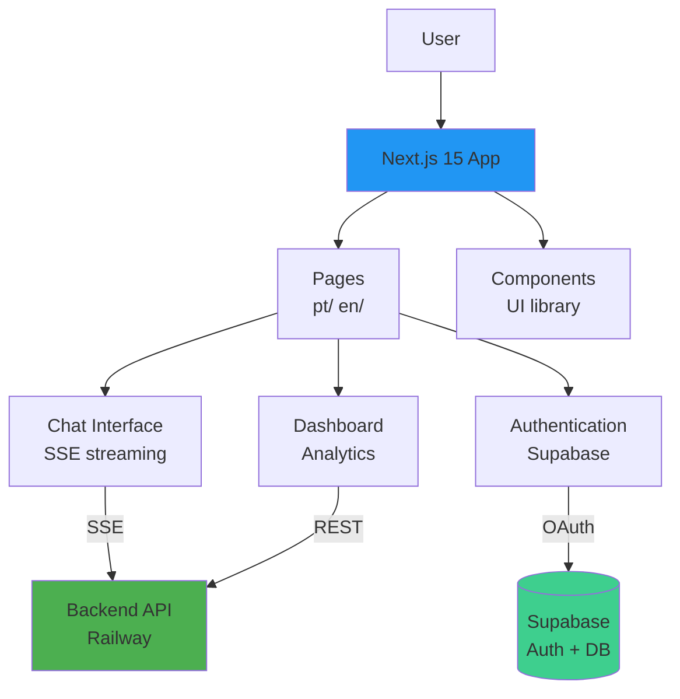

# Frontend Overview

## Visão Geral

O frontend do Cidadão.AI é uma **Progressive Web App (PWA)** construída com **Next.js 15**, oferecendo interface moderna e responsiva para interação com o sistema multi-agente.

:::info Status
Frontend está **82% completo** e **em produção** na Vercel desde outubro/2025.
- **URL**: https://cidadao-ai-frontend.vercel.app
- **Repository**: anderson-ufrj/cidadao.ai-frontend
:::

## Stack Tecnológica

### Core
- **Next.js 15** - React framework com App Router
- **React 19** - UI library
- **TypeScript** - Type safety
- **Tailwind CSS** - Styling
- **Shadcn/ui** - Component library

### Features
- **PWA** - Installable, offline-first
- **SSE Streaming** - Real-time chat with agents
- **i18n** - Portuguese (primary) + English
- **Authentication** - Supabase Auth (OAuth)
- **Analytics** - PostHog + Google Analytics

## Arquitetura



## Funcionalidades Principais

### 1. Chat com Agentes (SSE Streaming)

**Interface**: Chat em tempo real com 17 agentes

**Features**:
- Stream de respostas via Server-Sent Events (SSE)
- Seleção de agente (Zumbi, Abaporu, Anita, etc.)
- Histórico de conversas
- Markdown rendering
- Code syntax highlighting

**Exemplo de Uso**:
```typescript
// lib/api/chat.ts
async function* streamChat(message: string, agent: string) {
  const eventSource = new EventSource(`/api/chat/stream`);

  eventSource.addEventListener('chunk', (e) => {
    const data = JSON.parse(e.data);
    yield data.content;  // Stream partial results
  });

  eventSource.addEventListener('complete', (e) => {
    const final = JSON.parse(e.data);
    eventSource.close();
    yield final;
  });
}
```

### 2. Dashboard de Investigações

**Features**:
- Lista de investigações (criadas, em andamento, concluídas)
- Detalhes de anomalias detectadas
- Relatórios em PDF
- Gráficos de visualização (Chart.js)

### 3. Autenticação

**Provider**: Supabase Auth

**Métodos**:
- Email/Password
- Google OAuth
- GitHub OAuth

**Flow**:
```typescript
// app/auth/callback/route.ts
export async function GET(request: Request) {
  const supabase = createServerClient();
  const { data, error } = await supabase.auth.exchangeCodeForSession(code);

  if (error) redirect('/login?error=auth_failed');
  redirect('/dashboard');
}
```

## Estrutura de Diretórios

```
cidadao.ai-frontend/
├── app/                        # Next.js 15 App Router
│   ├── pt/                    # Portuguese routes
│   │   ├── chat/             # Chat interface
│   │   ├── dashboard/        # Dashboard
│   │   └── login/            # Auth pages
│   ├── en/                    # English routes
│   └── api/                   # Route handlers
│
├── components/                 # React components
│   ├── chat/                  # Chat UI components
│   ├── dashboard/             # Dashboard components
│   └── ui/                    # Shadcn/ui components
│
├── lib/                       # Utilities
│   ├── api/                   # API clients
│   ├── hooks/                 # React hooks
│   └── utils/                 # Helper functions
│
├── public/                    # Static assets
│   ├── icons/                 # PWA icons
│   └── locales/               # i18n translations
│
└── types/                     # TypeScript types
```

## Integração com Backend

### API Client

```typescript
// lib/api/client.ts
const API_URL = process.env.NEXT_PUBLIC_API_URL;  // Railway URL

export const api = {
  chat: {
    stream: async (message: string, agent: string) => {
      return fetch(`${API_URL}/api/v1/chat/stream`, {
        method: 'POST',
        headers: {
          'Content-Type': 'application/json',
          'Authorization': `Bearer ${token}`
        },
        body: JSON.stringify({ message, agent })
      });
    }
  },

  investigations: {
    list: async () => {
      return fetch(`${API_URL}/api/v1/investigations`, {
        headers: { 'Authorization': `Bearer ${token}` }
      }).then(r => r.json());
    },

    get: async (id: string) => {
      return fetch(`${API_URL}/api/v1/investigations/${id}`, {
        headers: { 'Authorization': `Bearer ${token}` }
      }).then(r => r.json());
    }
  }
};
```

### Environment Variables

```bash
# .env.local
NEXT_PUBLIC_API_URL=https://cidadao-api-production.up.railway.app
NEXT_PUBLIC_SUPABASE_URL=https://projeto.supabase.co
NEXT_PUBLIC_SUPABASE_ANON_KEY=<anon-key>

# Analytics (optional)
NEXT_PUBLIC_GA_ID=G-XXXXXXXXXX
NEXT_PUBLIC_POSTHOG_KEY=<posthog-key>

# PWA (disable in dev)
DISABLE_PWA=true
```

## Testing

### Test Coverage: 91%

```bash
# Unit tests (Vitest)
npm run test
npm run test:coverage

# E2E tests (Playwright)
npm run test:playwright
npm run test:playwright:ui

# Mobile tests
npm run test:mobile
```

## Deployment (Vercel)

### Configuração

```bash
# 1. Connect GitHub repo
vercel link

# 2. Configure environment variables
vercel env add NEXT_PUBLIC_API_URL production
vercel env add NEXT_PUBLIC_SUPABASE_URL production
vercel env add NEXT_PUBLIC_SUPABASE_ANON_KEY production

# 3. Deploy
git push origin main
# Vercel auto-deploys on push to main
```

### Vercel Settings

- **Framework Preset**: Next.js
- **Build Command**: `npm run build`
- **Output Directory**: `.next`
- **Install Command**: `npm install`
- **Node Version**: 20.x

## Performance

### Lighthouse Scores (Production)

| Metric | Score | Target |
|--------|-------|--------|
| **Performance** | 97 | >90 |
| **Accessibility** | 100 | 100 |
| **Best Practices** | 100 | 100 |
| **SEO** | 100 | 100 |
| **PWA** | ✅ Installable | ✅ |

### Bundle Size

- **First Load JS**: ~350KB (target: <400KB)
- **Total Bundle**: ~1.2MB (optimized)

## Próximas Features (18% Restante)

- [ ] Relatórios interativos (PDF + CSV export)
- [ ] Visualizações avançadas (D3.js charts)
- [ ] Notificações push (PWA)
- [ ] Modo offline completo
- [ ] Suporte a LIBRAS (acessibilidade)
- [ ] Temas customizáveis

## Recursos Adicionais

### Documentação Completa

Para documentação detalhada do frontend, consulte o repositório:

**Repository**: https://github.com/anderson-ufrj/cidadao.ai-frontend

**Documentação Interna**:
- `cidadao.ai-frontend/docs/01-getting-started/` - Setup
- `cidadao.ai-frontend/docs/02-architecture/` - Arquitetura
- `cidadao.ai-frontend/docs/03-features/` - Features
- `cidadao.ai-frontend/docs/08-testing/` - Testing

### Links Úteis

- **Production**: https://cidadao-ai-frontend.vercel.app
- **Next.js 15**: https://nextjs.org/docs
- **Shadcn/ui**: https://ui.shadcn.com/
- **Tailwind CSS**: https://tailwindcss.com/

---

## Resumo

**Status**: ✅ 82% completo, em produção
**Stack**: Next.js 15 + React 19 + TypeScript + Tailwind
**Features**: Chat SSE, Dashboard, Auth, PWA, i18n
**Performance**: Lighthouse 97/100
**Deployment**: Vercel (auto-deploy on push)

**Para documentação completa**, consulte `cidadao.ai-frontend/docs/`

---

**🇧🇷 Made with ❤️ in Minas Gerais, Brasil**

**Última Atualização**: 2025-11-22
**Autor**: Anderson Henrique da Silva
**Nota**: Seção resumida conforme solicitado - consulte repositório frontend para documentação completa
