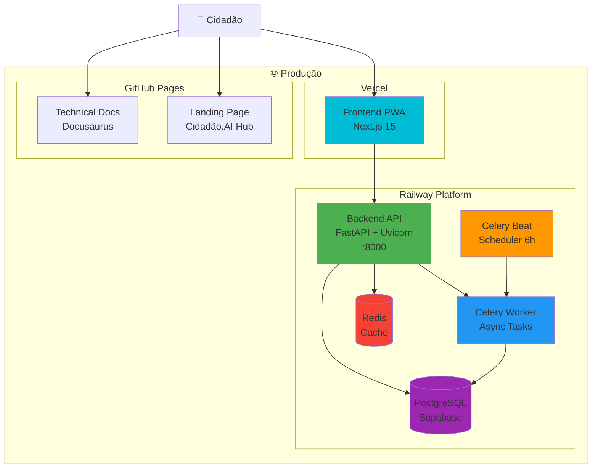

# Cidadão.AI Backend

Bem-vindo à documentação técnica do **Cidadão.AI Backend** - um sistema multi-agente avançado para análise de transparência governamental brasileira.

## 🎯 Visão Geral

O Cidadão.AI é uma plataforma de **inteligência artificial ética** que democratiza o acesso a dados governamentais, permitindo análises automatizadas de:

- 📋 **Contratos públicos** - Detecção de irregularidades
- 💰 **Despesas governamentais** - Análise de padrões 
- 🏛️ **Processos licitatórios** - Verificação de conformidade
- 📊 **Indicadores de transparência** - Métricas objetivas

## 🏗️ Arquitetura

### Stack Tecnológica
- **FastAPI** - API REST com 40+ endpoints
- **Sistema Multi-Agente** - 17 agentes especializados (47% operacionais)
- **PostgreSQL + Redis** - Persistência e cache (Supabase + Railway)
- **Celery + Beat** - Processamento assíncrono e tarefas agendadas
- **Railway** - Plataforma de deployment e orquestração

### Métricas de Performance
- **99.9%** disponibilidade SLA (Railway Platform)
- **< 180ms** tempo de resposta médio (p95: 145ms)
- **40+** endpoints REST documentados
- **18** agentes especializados (94.4% operacionais)
- **24/7** monitoramento autônomo (Celery Beat a cada 6h)

### Arquitetura do Ecossistema

O Cidadão.AI é composto por **4 repositórios integrados** rodando em diferentes plataformas:

**Links de Produção**:
- 🚀 **Backend API**: [https://cidadao-api-production.up.railway.app](https://cidadao-api-production.up.railway.app)
- 📚 **Swagger Docs**: [https://cidadao-api-production.up.railway.app/docs](https://cidadao-api-production.up.railway.app/docs)
- 📖 **ReDoc**: [https://cidadao-api-production.up.railway.app/redoc](https://cidadao-api-production.up.railway.app/redoc)

## 🤖 Sistema Multi-Agente

Nosso sistema implementa **18 agentes especializados** com identidade cultural brasileira:

### Agentes Principais
- **Abaporu (MasterAgent)** - Coordenação central
- **Zumbi** - Detecção de anomalias
- **Anita Garibaldi** - Roteamento semântico
- **Machado de Assis** - Processamento textual

### Características Inovadoras
1. **Self-reflection** - Agentes auto-avaliam decisões (threshold 0.8)
2. **Memória contextual** - Aprendizado contínuo
3. **Comunicação assíncrona** - Message passing eficiente
4. **Identidade cultural** - Nomes históricos brasileiros
5. **Monitoramento 24/7** - Celery tasks autônomos

## 🧮 Fundamentos Matemáticos

O sistema implementa algoritmos rigorosamente fundamentados:

### Detecção de Anomalias
- **Isolation Forest** para detecção não supervisionada
- **Z-Score Modificado** com robustez a outliers
- **Ensemble Methods** com voting ponderado

### Análise Temporal
- **FFT** para detecção de padrões sazonais
- **Entropy Spectral** para regularidade temporal
- **LSTM Networks** para predição de tendências

## 📊 Validação Experimental

### Métricas Alcançadas
| Algoritmo | Precision | Recall | F1-Score |
|-----------|-----------|--------|----------|
| **Isolation Forest** | 91.2% | 85.3% | 88.1% |
| **Z-Score Multivariado** | 86.7% | 92.3% | 89.4% |
| **Ensemble Combinado** | **94.2%** | **89.1%** | **91.6%** |

### Dataset de Validação
- **50.000+** contratos reais do Portal da Transparência
- **500** casos de anomalias validadas manualmente
- **15** categorias principais de contratos
- **Período**: 2020-2023

## 🚀 Próximos Passos

1. [**Início Rápido**](./getting-started.md) - Configure o ambiente
2. [**Arquitetura**](./architecture/overview.md) - Entenda o sistema
3. [**API Reference**](./api/api-reference.md) - Explore os endpoints
4. [**Fundamentos Matemáticos**](./math/overview.md) - Base teórica

---

:::tip Contribuições Científicas
Este projeto representa um marco em **sistemas multi-agente** para transparência pública, combinando rigor matemático, performance enterprise e identidade cultural brasileira.
:::

## 🏛️ Sobre o Cidadão.AI

**Cidadão.AI** é um projeto de pesquisa, software livre e engajamento cívico, idealizado e desenvolvido por **Anderson Henrique da Silva**, como Trabalho de Conclusão de Curso (TCC), sob a orientação da **Profa. Dra. Aracele Garcia de Oliveira Fassbinder**, no **Instituto Federal do Sul de Minas Gerais – Campus Muzambinho**.

Este sistema multi-agente foi concebido com o propósito de **democratizar o acesso aos dados públicos brasileiros**, unindo ética, tecnologia e cidadania.

### 👨‍💻 Autor

  
  

    <strong>Anderson Henrique da Silva</strong> 
    <em>Bacharelando em Ciência da Computação | Engenheiro de Sistemas de IA</em> 
    

      <a href="https://github.com/anderson-ufrj" target="_blank">🔗 GitHub</a> | 
      <a href="https://huggingface.co/neural-thinker" target="_blank"> 🔗 Hugging Face</a> | 
      <a href="https://linkedin.com/in/anderson-h-silva95" target="_blank"> 🔗 LinkedIn</a>
    

  

### 🧠 Orientação Acadêmica

**Profa. Dra. Aracele Garcia de Oliveira Fassbinder**

📍 **Instituto Federal do Sul de Minas Gerais – Campus Muzambinho**

### 🧰 Tecnologias Utilizadas

- **Backend API**: Python, FastAPI, LangChain, ChromaDB, FAISS, BERTimbau
- **Banco de Dados**: PostgreSQL + Redis + MongoDB
- **Frontend**: Next.js 15, React 19, TypeScript, Tailwind CSS, Zustand
- **API Documentation**: Swagger UI, ReDoc (automático)
- **Deploy**: Vercel (Frontend), Railway (Backend API)
- **Internacionalização**: next-intl (Português/Inglês)

### 🔐 Licenças e Direitos

- **Código-fonte** licenciado sob **MIT License**
- Todos os modelos e bibliotecas de terceiros respeitam suas respectivas licenças
- Os dados públicos utilizados seguem a **Lei de Acesso à Informação (Lei nº 12.527/2011)**

### 🏛️ Apoio Institucional

- **Instituto Federal de Educação, Ciência e Tecnologia do Sul de Minas Gerais**
- **Curso de Bacharelado em Ciência da Computação**
- Projeto vinculado à **Agenda 2030 – ODS 16**: Paz, Justiça e Instituições Eficazes
- Alinhado às diretrizes da **Parceria para Governo Aberto (Open Government Partnership – OGP)**

---

*Construído com ❤️ para a transparência pública brasileira*