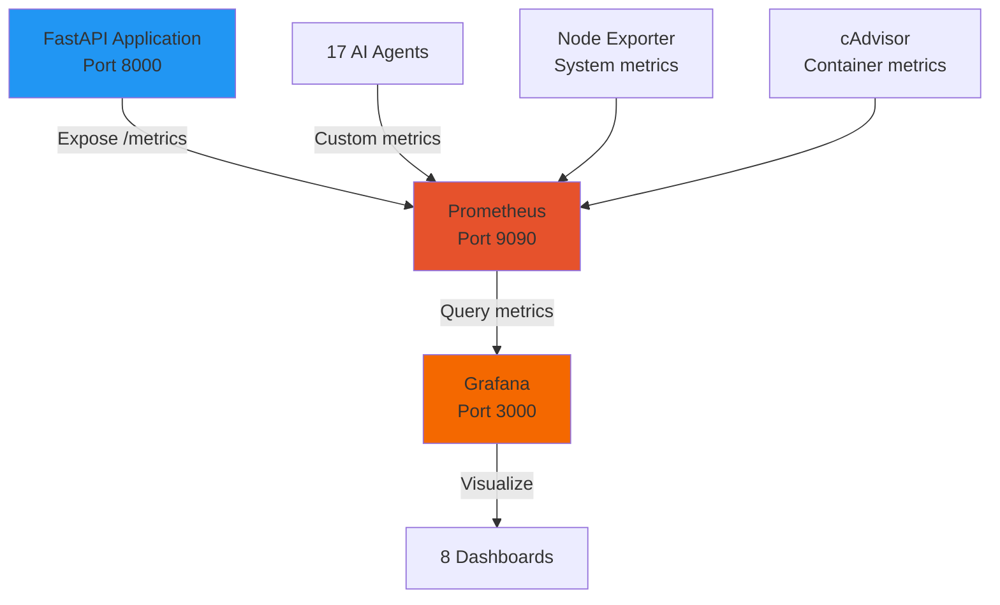

# Grafana & Prometheus Monitoring

## Visão Geral

O Cidadão.AI implementa observabilidade completa com **Grafana** + **Prometheus**, oferecendo **8 dashboards pré-configurados** para monitoramento em tempo real do sistema multi-agente.

### Stack de Monitoramento



## Quick Start

### Docker Compose (Recomendado)

```bash
# 1. Iniciar stack de monitoramento
cd /path/to/cidadao.ai-backend
docker-compose -f config/docker/docker-compose.monitoring.yml up -d

# 2. Verificar serviços
docker-compose -f config/docker/docker-compose.monitoring.yml ps

# Expected output:
# NAME                  STATUS    PORTS
# cidadao-grafana       Up        0.0.0.0:3000->3000/tcp
# cidadao-prometheus    Up        0.0.0.0:9090->9090/tcp
# cidadao-node-exporter Up        0.0.0.0:9100->9100/tcp
# cidadao-cadvisor      Up        0.0.0.0:8080->8080/tcp
# cidadao-ai            Up        0.0.0.0:7860->7860/tcp

# 3. Acessar interfaces
# Grafana: http://localhost:3000 (admin/cidadao123)
# Prometheus: http://localhost:9090
# cAdvisor: http://localhost:8080
```

### Makefile (Alternativa)

```bash
# Start monitoring
make monitoring-up

# Stop monitoring
make monitoring-down

# View logs
make monitoring-logs
```

## Dashboards Disponíveis

### 1. Overview Dashboard

**Nome**: Cidadão.AI - System Overview

**Painéis**:
- **Request Rate**: Requests/segundo (target: >100 req/s)
- **Response Time**: p50, p95, p99 latency
- **Error Rate**: 4xx/5xx errors (target: &lt;1%)
- **Active Investigations**: Count em tempo real
- **Agent Status**: 17/17 operational
- **Cache Hit Rate**: L1, L2, L3 (target: >85%)

**Query Examples**:
```promql
# Request rate (5min window)
rate(http_requests_total[5m])

# Response time (p95)
histogram_quantile(0.95, http_request_duration_seconds_bucket)

# Error rate
rate(http_requests_total{status=~"5.."}[5m]) / rate(http_requests_total[5m])

# Cache hit rate
rate(cache_hits_total[5m]) / rate(cache_requests_total[5m])
```

### 2. API Performance Dashboard

**Nome**: Cidadão.AI - API Endpoints

**Métricas**:
- **Endpoint Breakdown**: Requests por endpoint (top 10)
- **Slowest Endpoints**: p99 latency ranking
- **Throughput**: Requests/s por endpoint
- **Status Codes**: 2xx, 4xx, 5xx distribution

**Key Metrics**:
| Metric | Target | Alert Threshold |
|--------|--------|-----------------|
| p50 Latency | &lt;80ms | &gt;150ms |
| p95 Latency | &lt;145ms | &gt;300ms |
| p99 Latency | &lt;500ms | &gt;1000ms |
| Error Rate | &lt;1% | &gt;5% |

### 3. Agents Dashboard

**Nome**: Cidadão.AI - Multi-Agent System

**Painéis**:
- **Agent Invocations**: Calls por agente (17 agents)
- **Processing Time**: Average duration por agente
- **Success Rate**: Success/failure por agente (target: >95%)
- **Reflection Loops**: ReflectiveAgent iterations
- **Quality Scores**: Average confidence scores

**Agents Monitorados** (17 total):
- **Tier 1** (10): Zumbi, Anita, Oxóssi, Lampião, Senna, Tiradentes, Niemeyer, Machado, Bonifácio, Maria Quitéria
- **Tier 2** (5): Abaporu, Nanã, Drummond, Céuci, Obaluaiê
- **Tier 3** (1): Dandara
- **Base** (1): Deodoro (framework, não chamado diretamente)

**Queries**:
```promql
# Agent invocations (last hour)
increase(agent_invocations_total[1h])

# Agent processing time (p95)
histogram_quantile(0.95, agent_processing_duration_seconds_bucket)

# Agent success rate
rate(agent_invocations_total{status="success"}[5m]) /
rate(agent_invocations_total[5m])

# Reflection loops (ReflectiveAgent pattern)
avg(agent_reflection_count) by (agent_name)
```

### 4. Investigations Dashboard

**Nome**: Cidadão.AI - Investigations

**Métricas**:
- **Total Investigations**: Created vs Completed
- **Investigation Status**: pending, processing, completed, failed
- **Anomalies Detected**: Total count per investigation
- **Confidence Scores**: Distribution (target: >0.8)
- **Processing Duration**: Time to completion

### 5. Database Dashboard

**Nome**: Cidadão.AI - PostgreSQL

**Painéis**:
- **Connection Pool**: Active vs idle connections
- **Query Duration**: Slow query detection (>100ms)
- **Transaction Rate**: Commits/rollbacks per second
- **Table Size**: Growth over time

### 6. Redis Dashboard

**Nome**: Cidadão.AI - Cache Performance

**Métricas**:
- **Hit Rate**: L1 (Memory), L2 (Redis), L3 (PostgreSQL)
- **Memory Usage**: Redis memory consumption
- **Eviction Rate**: Keys evicted due to memory pressure
- **Connected Clients**: Active connections

**Target Metrics**:
- Cache Hit Rate (total): **>87%** (production: 87%)
- L1 (Memory): >95%
- L2 (Redis): >85%
- L3 (PostgreSQL): >70%

### 7. System Dashboard

**Nome**: Cidadão.AI - Infrastructure

**Métricas** (via Node Exporter):
- **CPU Usage**: Per core + average
- **Memory Usage**: Used vs available
- **Disk I/O**: Read/write throughput
- **Network**: Traffic in/out

**Alerts**:
- CPU >80% for 5min
- Memory >90% for 2min
- Disk >95% full

### 8. Alerts Dashboard

**Nome**: Cidadão.AI - Active Alerts

**Categorias**:
- **Critical**: Requires immediate action
- **Warning**: Degraded performance
- **Info**: FYI notifications

**Alert Rules** (examples):
```yaml
# prometheus/rules/alerts.yml
groups:
  - name: api_alerts
    rules:
      - alert: HighErrorRate
        expr: rate(http_requests_total{status=~"5.."}[5m]) > 0.05
        for: 5m
        labels:
          severity: critical
        annotations:
          summary: "High error rate detected"
          description: "Error rate is {{ $value }} (>5%)"

      - alert: SlowResponseTime
        expr: histogram_quantile(0.95, http_request_duration_seconds_bucket) > 1.0
        for: 10m
        labels:
          severity: warning
        annotations:
          summary: "Slow API response time"
          description: "p95 latency is {{ $value }}s (>1s)"

  - name: agent_alerts
    rules:
      - alert: AgentFailureRate
        expr: rate(agent_invocations_total{status="failed"}[5m]) / rate(agent_invocations_total[5m]) > 0.1
        for: 10m
        labels:
          severity: warning
        annotations:
          summary: "High agent failure rate"
          description: "Agent {{ $labels.agent_name }} failure rate: {{ $value }}"
```

## Prometheus Configuration

### prometheus.yml

**Location**: `config/dock../monitoramento/prometheus/prometheus.yml`

```yaml
global:
  scrape_interval: 15s          # How often to scrape targets
  evaluation_interval: 15s      # How often to evaluate rules
  scrape_timeout: 10s

# Alert manager (optional)
alerting:
  alertmanagers:
    - static_configs:
        - targets: ['alertmanager:9093']

# Load alert rules
rule_files:
  - '/etc/prometheus/rules/*.yml'

# Scrape configurations
scrape_configs:
  # 1. Cidadão.AI Application
  - job_name: 'cidadao-api'
    static_configs:
      - targets: ['cidadao-ai:7860']
    metrics_path: '/metrics'

  # 2. Prometheus itself
  - job_name: 'prometheus'
    static_configs:
      - targets: ['localhost:9090']

  # 3. Node Exporter (system metrics)
  - job_name: 'node'
    static_configs:
      - targets: ['node_exporter:9100']

  # 4. cAdvisor (container metrics)
  - job_name: 'cadvisor'
    static_configs:
      - targets: ['cadvisor:8080']
```

### Métricas Expostas pela Aplicação

**Endpoint**: `http://localhost:8000/metrics`

**Formato**: Prometheus exposition format

**Exemplo de Métricas**:
```prometheus
# HELP http_requests_total Total HTTP requests
# TYPE http_requests_total counter
http_requests_total{method="GET",endpoint="/health",status="200"} 1247

# HELP http_request_duration_seconds HTTP request latency
# TYPE http_request_duration_seconds histogram
http_request_duration_seconds_bucket{method="POST",endpoint="/api/v1/chat/stream",le="0.1"} 850
http_request_duration_seconds_bucket{method="POST",endpoint="/api/v1/chat/stream",le="0.5"} 1180
http_request_duration_seconds_bucket{method="POST",endpoint="/api/v1/chat/stream",le="1.0"} 1235
http_request_duration_seconds_sum{method="POST",endpoint="/api/v1/chat/stream"} 87.45
http_request_duration_seconds_count{method="POST",endpoint="/api/v1/chat/stream"} 1247

# HELP agent_invocations_total Total agent invocations
# TYPE agent_invocations_total counter
agent_invocations_total{agent_name="zumbi",status="success"} 342
agent_invocations_total{agent_name="abaporu",status="success"} 156

# HELP agent_processing_duration_seconds Agent processing time
# TYPE agent_processing_duration_seconds histogram
agent_processing_duration_seconds_bucket{agent_name="zumbi",le="1.0"} 300
agent_processing_duration_seconds_bucket{agent_name="zumbi",le="5.0"} 340

# HELP cache_hit_rate Cache hit rate (0-1)
# TYPE cache_hit_rate gauge
cache_hit_rate{layer="L1"} 0.95
cache_hit_rate{layer="L2"} 0.87
cache_hit_rate{layer="L3"} 0.73

# HELP investigation_status_total Investigation counts by status
# TYPE investigation_status_total counter
investigation_status_total{status="completed"} 234
investigation_status_total{status="failed"} 12
investigation_status_total{status="processing"} 8
```

## Grafana Setup

### Primeira Configuração

```bash
# 1. Acessar Grafana
open http://localhost:3000

# 2. Login
# Username: admin
# Password: cidadao123

# 3. Adicionar Data Source
# Configuration → Data Sources → Add data source → Prometheus
# URL: http://prometheus:9090
# Access: Server (default)
# Scrape interval: 15s
# Save & Test

# 4. Importar Dashboards
# Dashboards → Import → Upload JSON file
# Usar arquivos em: config/dock../monitoramento/grafana/dashboards/
```

### Dashboard JSON (Exemplo)

```json
{
  "dashboard": {
    "title": "Cidadão.AI - API Performance",
    "panels": [
      {
        "title": "Request Rate",
        "targets": [
          {
            "expr": "rate(http_requests_total[5m])",
            "legendFormat": "{{method}} {{endpoint}}"
          }
        ],
        "type": "graph"
      },
      {
        "title": "Response Time (p95)",
        "targets": [
          {
            "expr": "histogram_quantile(0.95, http_request_duration_seconds_bucket)",
            "legendFormat": "p95"
          }
        ],
        "type": "graph"
      }
    ]
  }
}
```

## Grafana Cloud Integration (Produção)

### Setup

```bash
# 1. Create Grafana Cloud account
# https://grafana.com/auth/sign-up/create-user

# 2. Get Push URL and credentials
# Grafana Cloud → Connections → Prometheus → View details

# 3. Configure environment variables (Railway)
GRAFANA_CLOUD_ENABLED=true
GRAFANA_CLOUD_URL=https://prometheus-prod-XX-prod-sa-east-1.grafana.net/api/prom/push
GRAFANA_CLOUD_USER=<instance-id>       # 6 digits
GRAFANA_CLOUD_KEY=glc_<your-api-key>

# 4. Restart application
railway service restart
```

### Prometheus Remote Write

```yaml
# prometheus.yml (with remote write)
remote_write:
  - url: ${GRAFANA_CLOUD_URL}
    basic_auth:
      username: ${GRAFANA_CLOUD_USER}
      password: ${GRAFANA_CLOUD_KEY}
```

## Alerting

### Alert Manager Configuration

```yaml
# alertmanager.yml
global:
  resolve_timeout: 5m

route:
  group_by: ['alertname', 'severity']
  group_wait: 10s
  group_interval: 10s
  repeat_interval: 12h
  receiver: 'default'

  routes:
    - match:
        severity: critical
      receiver: 'critical'

    - match:
        severity: warning
      receiver: 'warning'

receivers:
  - name: 'default'
    email_configs:
      - to: 'alerts@cidadao.ai'
        from: 'monitoring@cidadao.ai'
        smarthost: 'smtp.gmail.com:587'

  - name: 'critical'
    slack_configs:
      - api_url: 'https://hooks.slack.com/services/XXX/YYY/ZZZ'
        channel: '#critical-alerts'
        title: 'Cidadão.AI Critical Alert'

  - name: 'warning'
    email_configs:
      - to: 'warnings@cidadao.ai'
```

## Métricas Customizadas

### Implementação no Código

```python
# src/infrastructu../monitoramento/metrics.py
from prometheus_client import Counter, Histogram, Gauge

# Counters
http_requests_total = Counter(
    'http_requests_total',
    'Total HTTP requests',
    ['method', 'endpoint', 'status']
)

agent_invocations_total = Counter(
    'agent_invocations_total',
    'Total agent invocations',
    ['agent_name', 'status']
)

# Histograms (for latency)
http_request_duration = Histogram(
    'http_request_duration_seconds',
    'HTTP request latency',
    ['method', 'endpoint'],
    buckets=[0.01, 0.05, 0.1, 0.5, 1.0, 2.0, 5.0]
)

agent_processing_duration = Histogram(
    'agent_processing_duration_seconds',
    'Agent processing time',
    ['agent_name'],
    buckets=[0.1, 0.5, 1.0, 2.0, 5.0, 10.0]
)

# Gauges (for current values)
cache_hit_rate = Gauge(
    'cache_hit_rate',
    'Cache hit rate (0-1)',
    ['layer']
)

active_investigations = Gauge(
    'active_investigations',
    'Number of investigations in progress'
)
```

### Uso no Middleware

```python
# src/api/middleware/metrics.py
from src.infrastructure.monitoring.metrics import (
    http_requests_total,
    http_request_duration
)

async def metrics_middleware(request: Request, call_next):
    method = request.method
    endpoint = request.url.path

    # Measure duration
    with http_request_duration.labels(method=method, endpoint=endpoint).time():
        response = await call_next(request)

    # Increment counter
    http_requests_total.labels(
        method=method,
        endpoint=endpoint,
        status=response.status_code
    ).inc()

    return response
```

## Troubleshooting

### Problema 1: Prometheus Not Scraping

**Sintoma**:
```
Targets down in Prometheus UI
```

**Solução**:
```bash
# 1. Verificar se /metrics está acessível
curl http://localhost:8000/metrics

# 2. Verificar configuração Prometheus
docker exec cidadao-prometheus cat /etc/prometheus/prometheus.yml

# 3. Reload Prometheus
curl -X POST http://localhost:9090/-/reload

# 4. Check logs
docker logs cidadao-prometheus
```

### Problema 2: Grafana Can't Query Prometheus

**Sintoma**:
```
HTTP Error Bad Gateway
```

**Solução**:
```bash
# 1. Test Prometheus URL from Grafana container
docker exec cidadao-grafana curl http://prometheus:9090/api/v1/query?query=up

# 2. Verificar network
docker network inspect monitoring

# 3. Reconfigure data source
# Grafana → Configuration → Data Sources → Prometheus → Test
```

### Problema 3: High Memory Usage

**Sintoma**:
```
Prometheus using >2GB RAM
```

**Solução**:
```yaml
# prometheus.yml - Reduce retention
global:
  storage.tsdb.retention.time: 15d      # Default: 30d
  storage.tsdb.retention.size: 5GB      # Limit size
```

## Recursos Adicionais

### Documentação Relacionada
- [Docker Setup](../implantacao/docker.md) - Monitoring stack
- [Architecture](../architecture/overview.md) - Sistema completo
- [API](../api/overview.md) - Endpoints monitorados

### External Resources
- [Prometheus Docs](https://prometheus.io/docs/)
- [Grafana Docs](https://grafana.com/docs/)
- [Grafana Cloud](https://grafana.com/products/cloud/)

---

## Resumo - Quick Reference

### Start Monitoring
```bash
docker-compose -f config/docker/docker-compose.monitoring.yml up -d
# Grafana: http://localhost:3000 (admin/cidadao123)
# Prometheus: http://localhost:9090
```

### Key Metrics
- **Request Rate**: `rate(http_requests_total[5m])`
- **Response Time**: `histogram_quantile(0.95, http_request_duration_seconds_bucket)`
- **Error Rate**: `rate(http_requests_total{status=~"5.."}[5m])`
- **Cache Hit Rate**: 87% (production target)

### Dashboards (8 total)
1. System Overview
2. API Performance
3. Multi-Agent System
4. Investigations
5. PostgreSQL
6. Redis Cache
7. Infrastructure
8. Active Alerts

---

**🇧🇷 Made with ❤️ in Minas Gerais, Brasil**

**Última Atualização**: 2025-11-22
**Autor**: Anderson Henrique da Silva
**Projeto**: Cidadão.AI - 8 dashboards, 99.9% uptime monitoring
