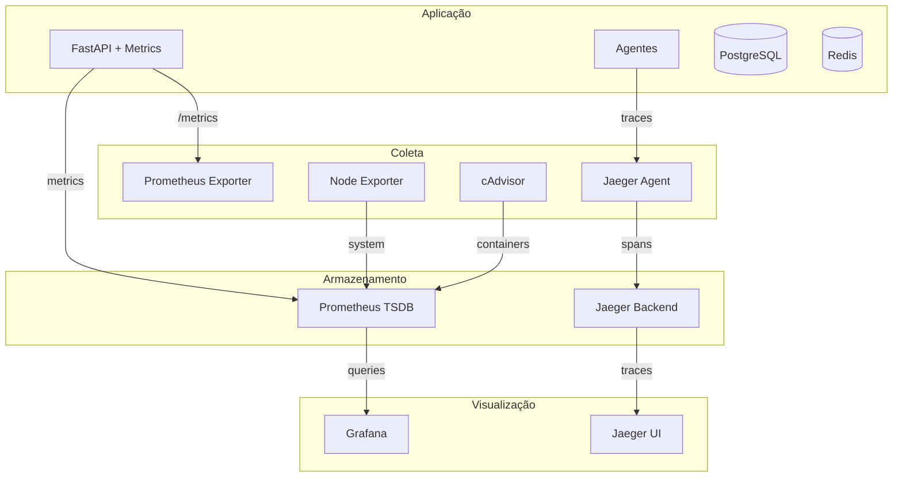

# 📊 Monitoramento e Observabilidade

:::info **Stack de Observabilidade Enterprise**
O Cidadão.AI implementa uma stack completa de observabilidade com Prometheus para métricas, Grafana para visualização, Jaeger para distributed tracing e alertas automatizados.
:::

## 🎯 Visão Geral

O sistema de monitoramento do Cidadão.AI fornece visibilidade completa sobre:
- Performance de agentes e investigações
- Métricas de sistema e infraestrutura
- Rastreamento distribuído de requisições
- Alertas proativos e dashboards em tempo real

## 🏗️ Arquitetura de Monitoramento



## 🚀 Quick Start

### 1. Iniciar Stack de Monitoramento
```bash
# Iniciar todos os serviços
make monitoring-up

# Ou usar docker-compose diretamente
docker-compose -f docker-compose.monitoring.yml up -d
```

### 2. Acessar Dashboards
- **Grafana**: http://localhost:3000 (admin/cidadao123)
- **Prometheus**: http://localhost:9090
- **Jaeger**: http://localhost:16686
- **cAdvisor**: http://localhost:8080

## 📈 Métricas Implementadas

### 1. **Métricas de Requisições**
```python
# Total de requisições
cidadao_ai_requests_total{method="GET", endpoint="/api/v1/investigations", status_code="200"}

# Duração de requisições (histograma)
cidadao_ai_request_duration_seconds{method="POST", endpoint="/api/v1/investigations"}
```

### 2. **Métricas de Agentes**
```python
# Tarefas executadas por agente
cidadao_ai_agent_tasks_total{agent_type="zumbi", task_type="anomaly_detection", status="success"}

# Tempo de execução de tarefas
cidadao_ai_agent_task_duration_seconds{agent_type="anita", task_type="pattern_analysis"}
```

### 3. **Métricas de Banco de Dados**
```python
# Queries executadas
cidadao_ai_database_queries_total{operation="SELECT", table="investigations"}

# Latência de queries
cidadao_ai_database_query_duration_seconds{operation="INSERT", table="findings"}
```

### 4. **Métricas de Sistema**
```python
# CPU e Memória
cidadao_ai_system_cpu_percent
cidadao_ai_system_memory_percent

# Conexões ativas
cidadao_ai_active_connections{connection_type="websocket"}
```

## 🎨 Dashboards Grafana

### 1. **Dashboard Principal**
- Visão geral do sistema
- Taxa de requisições e erros
- Latência P50/P95/P99
- Status de agentes

### 2. **Dashboard de Agentes**
- Performance individual por agente
- Taxa de sucesso de investigações
- Distribuição de anomalias detectadas
- Tempo médio de processamento

### 3. **Dashboard de Infraestrutura**
- CPU, memória, disco, rede
- Performance do PostgreSQL
- Hit rate do Redis
- Container metrics via cAdvisor

## 🔔 Sistema de Alertas

### Alertas Configurados

```yaml
# prometheus/rules/alerts.yml
groups:
  - name: cidadao_alerts
    rules:
      # Alta taxa de erros
      - alert: HighErrorRate
        expr: rate(cidadao_ai_requests_total{status_code=~"5.."}[5m]) > 0.1
        for: 5m
        annotations:
          summary: "Alta taxa de erros: {{ $value }}"
          
      # Latência elevada
      - alert: HighLatency
        expr: histogram_quantile(0.95, cidadao_ai_request_duration_seconds) > 2
        for: 10m
        annotations:
          summary: "P95 latency > 2s"
          
      # Agent down
      - alert: AgentDown
        expr: up{job="cidadao-agents"} == 0
        for: 1m
        annotations:
          summary: "Agent {{ $labels.agent_type }} está offline"
          
      # Memória alta
      - alert: HighMemoryUsage
        expr: cidadao_ai_system_memory_percent > 90
        for: 5m
        annotations:
          summary: "Uso de memória > 90%"
```

## 🔍 Distributed Tracing com Jaeger

### Configuração
```python
# src/core/monitoring.py
from opentelemetry import trace
from opentelemetry.exporter.jaeger.thrift import JaegerExporter

# Inicializar tracer
tracer = trace.get_tracer("cidadao.ai")

# Instrumentação automática
FastAPIInstrumentor.instrument_app(app)
SQLAlchemyInstrumentor().instrument(engine=engine)
RedisInstrumentor().instrument(redis_client=redis)
```

### Exemplo de Trace Customizado
```python
@tracer.start_as_current_span("investigate_contract")
async def investigate_contract(contract_id: str):
    span = trace.get_current_span()
    span.set_attribute("contract.id", contract_id)
    
    # Sub-span para análise
    with tracer.start_as_current_span("analyze_anomalies"):
        anomalies = await detect_anomalies(contract_id)
        span.set_attribute("anomalies.count", len(anomalies))
    
    return anomalies
```

## 📊 Queries Prometheus Úteis

### Performance Geral
```promql
# Taxa de requisições por segundo
rate(cidadao_ai_requests_total[5m])

# Latência P95
histogram_quantile(0.95, 
  rate(cidadao_ai_request_duration_seconds_bucket[5m])
)

# Taxa de erro
rate(cidadao_ai_requests_total{status_code=~"5.."}[5m])
/ rate(cidadao_ai_requests_total[5m]) * 100
```

### Performance de Agentes
```promql
# Taxa de sucesso por agente
rate(cidadao_ai_agent_tasks_total{status="success"}[5m])
/ rate(cidadao_ai_agent_tasks_total[5m]) * 100

# Top 5 agentes mais lentos
topk(5, 
  histogram_quantile(0.95,
    rate(cidadao_ai_agent_task_duration_seconds_bucket[5m])
  )
)
```

## 🛠️ Configuração Avançada

### Variáveis de Ambiente
```bash
# Prometheus
PROMETHEUS_RETENTION_TIME=30d
PROMETHEUS_RETENTION_SIZE=5GB

# Grafana
GRAFANA_ADMIN_USER=admin
GRAFANA_ADMIN_PASSWORD=your_secure_password

# Jaeger
JAEGER_AGENT_HOST=localhost
JAEGER_AGENT_PORT=6831
JAEGER_SAMPLING_RATE=0.1  # 10% sampling
```

### Otimização de Performance
```yaml
# prometheus.yml
global:
  scrape_interval: 15s
  evaluation_interval: 15s
  
scrape_configs:
  - job_name: 'cidadao-backend'
    static_configs:
      - targets: ['cidadao-ai:7860']
    
  - job_name: 'node-exporter'
    static_configs:
      - targets: ['node_exporter:9100']
```

## 🔧 Troubleshooting

### Problemas Comuns

1. **Grafana não conecta ao Prometheus**
   ```bash
   # Verificar conectividade
   docker exec cidadao-grafana curl http://prometheus:9090/api/v1/query
   ```

2. **Métricas não aparecem**
   ```bash
   # Verificar endpoint de métricas
   curl http://localhost:7860/metrics
   ```

3. **Alto uso de memória do Prometheus**
   ```bash
   # Ajustar retenção
   --storage.tsdb.retention.time=15d
   --storage.tsdb.retention.size=2GB
   ```

## 📈 Métricas Customizadas

### Adicionar Nova Métrica
```python
from prometheus_client import Counter, Histogram

# Definir métrica
CUSTOM_METRIC = Counter(
    'cidadao_ai_custom_total',
    'Description of custom metric',
    ['label1', 'label2']
)

# Usar métrica
CUSTOM_METRIC.labels(label1='value1', label2='value2').inc()
```

### Exemplo: Métrica de Investigação
```python
INVESTIGATION_DURATION = Histogram(
    'cidadao_ai_investigation_duration_seconds',
    'Time to complete investigation',
    ['investigation_type', 'complexity'],
    buckets=(0.5, 1, 2, 5, 10, 30, 60, 120)
)

# No código
start_time = time.time()
# ... processar investigação ...
duration = time.time() - start_time
INVESTIGATION_DURATION.labels(
    investigation_type='contract',
    complexity='high'
).observe(duration)
```

## 🚀 Roadmap de Monitoramento

### Implementado ✅
- Métricas Prometheus básicas
- Dashboards Grafana
- Distributed tracing com Jaeger
- Alertas básicos
- Container monitoring

### Em Desenvolvimento 🚧
- SLI/SLO dashboards
- Anomaly detection com ML
- Log aggregation com Loki
- Custom metrics por agente
- Performance profiling

### Planejado 📋
- APM completo
- Synthetic monitoring
- Chaos engineering metrics
- Cost monitoring
- Security monitoring

---

**Próximo:** [Dashboards Grafana →](./grafana-dashboards.md)