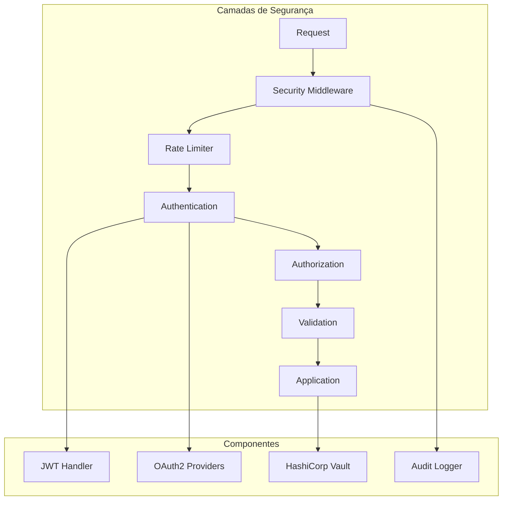
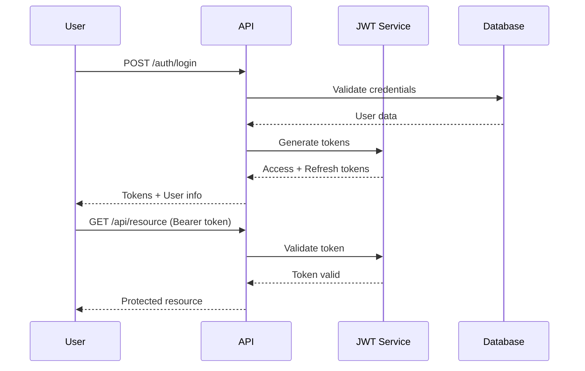

# 🔐 Segurança e Autenticação

:::warning **Segurança em Primeiro Lugar**
O Cidadão.AI implementa múltiplas camadas de segurança seguindo as melhores práticas da indústria, incluindo autenticação JWT, OAuth2, rate limiting, proteção contra ataques e auditoria completa.
:::

## 🎯 Visão Geral

O sistema de segurança do Cidadão.AI fornece:
- **Autenticação Multi-Fator**: JWT + OAuth2 providers
- **Autorização Granular**: RBAC (Role-Based Access Control)
- **Rate Limiting**: Por IP, usuário e endpoint
- **Proteção contra Ataques**: XSS, SQL Injection, CSRF
- **Auditoria Completa**: Logs de segurança e compliance

## 🏗️ Arquitetura de Segurança



## 🔑 Autenticação JWT

### Configuração

```python
# Variáveis de ambiente necessárias
JWT_SECRET_KEY="your-secret-key-min-32-chars"
JWT_ALGORITHM="HS256"
ACCESS_TOKEN_EXPIRE_MINUTES=30
REFRESH_TOKEN_EXPIRE_DAYS=7
```

### Fluxo de Autenticação



### Implementação

```python
from src.api.auth import AuthManager

# Login endpoint
@app.post("/auth/login")
async def login(credentials: LoginRequest):
    auth_manager = AuthManager()
    
    # Validar credenciais
    user = auth_manager.authenticate_user(
        credentials.email,
        credentials.password
    )
    
    if not user:
        raise HTTPException(
            status_code=401,
            detail="Invalid credentials"
        )
    
    # Gerar tokens
    access_token = auth_manager.create_access_token(
        data={"sub": user.email, "role": user.role}
    )
    
    refresh_token = auth_manager.create_refresh_token(
        data={"sub": user.email}
    )
    
    return {
        "access_token": access_token,
        "refresh_token": refresh_token,
        "token_type": "bearer"
    }
```

### Token Structure

```json
{
  "sub": "user@example.com",
  "role": "analyst",
  "exp": 1706789456,
  "iat": 1706787656,
  "jti": "unique-token-id",
  "iss": "cidadao.ai"
}
```

## 🌐 OAuth2 Integration

### Providers Suportados

```python
OAUTH_PROVIDERS = {
    "google": {
        "client_id": GOOGLE_CLIENT_ID,
        "client_secret": GOOGLE_CLIENT_SECRET,
        "authorize_url": "https://accounts.google.com/o/oauth2/auth",
        "token_url": "https://oauth2.googleapis.com/token",
        "userinfo_url": "https://www.googleapis.com/oauth2/v1/userinfo",
        "scopes": ["openid", "email", "profile"]
    },
    "github": {
        "client_id": GITHUB_CLIENT_ID,
        "client_secret": GITHUB_CLIENT_SECRET,
        "authorize_url": "https://github.com/login/oauth/authorize",
        "token_url": "https://github.com/login/oauth/access_token",
        "userinfo_url": "https://api.github.com/user",
        "scopes": ["user:email"]
    },
    "microsoft": {
        "client_id": MICROSOFT_CLIENT_ID,
        "client_secret": MICROSOFT_CLIENT_SECRET,
        "authorize_url": "https://login.microsoftonline.com/common/oauth2/v2.0/authorize",
        "token_url": "https://login.microsoftonline.com/common/oauth2/v2.0/token",
        "userinfo_url": "https://graph.microsoft.com/v1.0/me",
        "scopes": ["openid", "email", "profile"]
    },
    "govbr": {
        "client_id": GOVBR_CLIENT_ID,
        "client_secret": GOVBR_CLIENT_SECRET,
        "authorize_url": "https://sso.acesso.gov.br/authorize",
        "token_url": "https://sso.acesso.gov.br/token",
        "userinfo_url": "https://sso.acesso.gov.br/userinfo",
        "scopes": ["openid", "email", "profile", "govbr_confiabilidade"]
    }
}
```

### OAuth2 Flow

```python
# Iniciar OAuth2
@app.get("/auth/oauth/{provider}")
async def oauth_login(provider: str):
    oauth_client = OAuth2Client(provider)
    authorization_url = oauth_client.get_authorization_url(
        redirect_uri=f"{API_URL}/auth/callback/{provider}"
    )
    return {"authorization_url": authorization_url}

# Callback OAuth2
@app.get("/auth/callback/{provider}")
async def oauth_callback(provider: str, code: str):
    oauth_client = OAuth2Client(provider)
    
    # Trocar código por token
    token = await oauth_client.get_token(code)
    
    # Obter informações do usuário
    user_info = await oauth_client.get_user_info(token)
    
    # Criar ou atualizar usuário
    user = await create_or_update_oauth_user(user_info, provider)
    
    # Gerar JWT
    access_token = auth_manager.create_access_token(
        data={"sub": user.email, "role": user.role}
    )
    
    return {"access_token": access_token}
```

## 🚦 Rate Limiting

### Configuração

```python
class RateLimitConfig:
    # Limites globais
    REQUESTS_PER_MINUTE = 60
    REQUESTS_PER_HOUR = 1000
    BURST_SIZE = 10
    
    # Limites por endpoint
    ENDPOINT_LIMITS = {
        "/api/v1/investigations": {"rpm": 30, "rph": 500},
        "/api/v1/agents/*": {"rpm": 100, "rph": 2000},
        "/api/v1/reports": {"rpm": 10, "rph": 100},
        "/auth/*": {"rpm": 20, "rph": 200}
    }
    
    # Limites por role
    ROLE_MULTIPLIERS = {
        "admin": 10.0,
        "analyst": 2.0,
        "user": 1.0,
        "guest": 0.5
    }
```

### Implementação

```python
class RateLimiter:
    def __init__(self):
        self.requests = defaultdict(lambda: deque(maxlen=1000))
        self.blocked_ips = {}
    
    async def check_rate_limit(
        self,
        request: Request,
        user: Optional[User] = None
    ) -> bool:
        ip = request.client.host
        endpoint = request.url.path
        
        # Verificar IP bloqueado
        if ip in self.blocked_ips:
            if datetime.utcnow() < self.blocked_ips[ip]:
                raise HTTPException(
                    status_code=429,
                    detail="IP temporarily blocked"
                )
            else:
                del self.blocked_ips[ip]
        
        # Calcular limite baseado no usuário
        limit = self._calculate_limit(endpoint, user)
        
        # Verificar janela de tempo
        now = time.time()
        window_start = now - 60  # 1 minute window
        
        # Limpar requests antigas
        self.requests[ip] = deque(
            [t for t in self.requests[ip] if t > window_start],
            maxlen=1000
        )
        
        # Verificar limite
        if len(self.requests[ip]) >= limit:
            # Bloquear IP temporariamente
            self.blocked_ips[ip] = datetime.utcnow() + timedelta(minutes=5)
            raise HTTPException(
                status_code=429,
                detail="Rate limit exceeded"
            )
        
        # Registrar request
        self.requests[ip].append(now)
        return True
```

## 🛡️ Proteção contra Ataques

### XSS Protection

```python
# Headers de segurança
SECURITY_HEADERS = {
    "X-Content-Type-Options": "nosniff",
    "X-Frame-Options": "DENY",
    "X-XSS-Protection": "1; mode=block",
    "Content-Security-Policy": "default-src 'self'",
    "Referrer-Policy": "strict-origin-when-cross-origin"
}

# Validação de entrada
def sanitize_input(value: str) -> str:
    """Remove caracteres perigosos"""
    # Remove tags HTML
    value = re.sub(r'<[^>]*>', '', value)
    # Escape caracteres especiais
    value = html.escape(value)
    # Remove padrões suspeitos
    for pattern in SUSPICIOUS_PATTERNS:
        value = re.sub(pattern, '', value, flags=re.IGNORECASE)
    return value
```

### SQL Injection Prevention

```python
# Sempre use parâmetros preparados
async def get_investigation(investigation_id: str):
    # CORRETO - Parâmetros preparados
    query = """
        SELECT * FROM investigations 
        WHERE id = :investigation_id
    """
    result = await database.fetch_one(
        query=query,
        values={"investigation_id": investigation_id}
    )
    
    # ERRADO - Concatenação de strings
    # query = f"SELECT * FROM investigations WHERE id = '{investigation_id}'"
```

### CSRF Protection

```python
# Token CSRF
class CSRFProtection:
    def generate_token(self, session_id: str) -> str:
        """Gera token CSRF único"""
        secret = settings.SECRET_KEY
        message = f"{session_id}:{datetime.utcnow().isoformat()}"
        return hmac.new(
            secret.encode(),
            message.encode(),
            hashlib.sha256
        ).hexdigest()
    
    def validate_token(
        self,
        token: str,
        session_id: str,
        max_age: int = 3600
    ) -> bool:
        """Valida token CSRF"""
        expected = self.generate_token(session_id)
        return hmac.compare_digest(token, expected)
```

## 🔒 Autorização (RBAC)

### Roles e Permissões

```python
class Role(Enum):
    ADMIN = "admin"
    ANALYST = "analyst"
    USER = "user"
    GUEST = "guest"

ROLE_PERMISSIONS = {
    Role.ADMIN: [
        "investigation:create",
        "investigation:read",
        "investigation:update",
        "investigation:delete",
        "agent:manage",
        "user:manage",
        "system:configure"
    ],
    Role.ANALYST: [
        "investigation:create",
        "investigation:read",
        "investigation:update",
        "agent:use",
        "report:generate"
    ],
    Role.USER: [
        "investigation:create",
        "investigation:read",
        "report:view"
    ],
    Role.GUEST: [
        "investigation:read",
        "report:view"
    ]
}
```

### Decorator de Permissão

```python
def require_permission(permission: str):
    def decorator(func):
        async def wrapper(*args, **kwargs):
            # Obter usuário atual
            user = kwargs.get("current_user")
            if not user:
                raise HTTPException(
                    status_code=401,
                    detail="Authentication required"
                )
            
            # Verificar permissão
            user_permissions = ROLE_PERMISSIONS.get(user.role, [])
            if permission not in user_permissions:
                raise HTTPException(
                    status_code=403,
                    detail="Insufficient permissions"
                )
            
            return await func(*args, **kwargs)
        return wrapper
    return decorator

# Uso
@app.post("/api/v1/investigations")
@require_permission("investigation:create")
async def create_investigation(
    request: InvestigationRequest,
    current_user: User = Depends(get_current_user)
):
    # Apenas usuários com permissão podem criar
    pass
```

## 🗝️ Vault Integration

### HashiCorp Vault

```python
class VaultClient:
    def __init__(self):
        self.client = hvac.Client(
            url=settings.VAULT_URL,
            token=settings.VAULT_TOKEN
        )
    
    async def get_secret(self, path: str) -> Optional[Dict]:
        """Obter secret do Vault"""
        try:
            response = self.client.secrets.kv.v2.read_secret_version(
                path=path,
                mount_point="secret"
            )
            return response["data"]["data"]
        except Exception as e:
            logger.error(f"Vault error: {e}")
            return None
    
    async def rotate_jwt_secret(self):
        """Rotacionar JWT secret"""
        new_secret = secrets.token_urlsafe(32)
        self.client.secrets.kv.v2.create_or_update_secret(
            path="jwt/secret_key",
            secret={"value": new_secret},
            mount_point="secret"
        )
        return new_secret
```

## 📝 Auditoria de Segurança

### Event Logging

```python
class SecurityAudit:
    async def log_security_event(
        self,
        event_type: str,
        severity: str,
        user_id: Optional[str],
        ip_address: str,
        details: Dict[str, Any]
    ):
        event = {
            "timestamp": datetime.utcnow().isoformat(),
            "event_type": event_type,
            "severity": severity,
            "user_id": user_id,
            "ip_address": ip_address,
            "details": details,
            "hash": self._calculate_event_hash(details)
        }
        
        # Log para arquivo
        audit_logger.log(event)
        
        # Alertas críticos
        if severity == "CRITICAL":
            await self.send_security_alert(event)
```

### Eventos Monitorados

```python
SECURITY_EVENTS = {
    "login_success": "INFO",
    "login_failure": "WARNING",
    "multiple_login_failures": "HIGH",
    "suspicious_activity": "HIGH",
    "unauthorized_access": "CRITICAL",
    "rate_limit_exceeded": "WARNING",
    "ip_blocked": "HIGH",
    "token_theft_attempt": "CRITICAL",
    "sql_injection_attempt": "CRITICAL",
    "xss_attempt": "HIGH"
}
```

## 🚀 Best Practices

### 1. **Configuração Segura**
- Use variáveis de ambiente para secrets
- Rotacione secrets regularmente
- Use HTTPS sempre
- Configure CORS adequadamente

### 2. **Validação de Dados**
- Valide toda entrada do usuário
- Use schemas Pydantic
- Sanitize outputs
- Limite tamanhos de request

### 3. **Monitoramento**
- Monitore tentativas de login falhadas
- Detecte padrões suspeitos
- Alerte sobre atividades anormais
- Mantenha logs de auditoria

---

**Próximo:** [Configuração de OAuth2 →](./oauth-configuration.md)