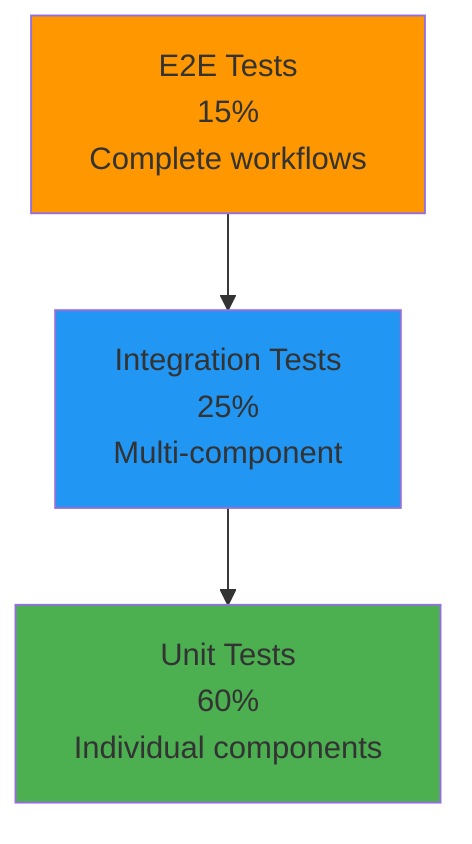

# Testing Overview

## Visão Geral

O Cidadão.AI mantém uma suite de testes abrangente com **76.29% de cobertura** (target: 80%), **149 arquivos de teste** e **2,059+ test functions** garantindo qualidade e confiabilidade.

### Status Atual

| Métrica | Valor | Target | Status |
|---------|-------|--------|--------|
| **Test Coverage** | 76.29% | &gt;80% | ⚠️ Perto do target |
| **Tests Passing** | 97.4% (1,474/1,514) | 100% | ✅ Excelente |
| **Test Files** | 149 arquivos | - | ✅ Completo |
| **Test Functions** | 2,059+ funções | - | ✅ Abrangente |
| **Execution Time** | ~45s (unit) | &lt;60s | ✅ Rápido |

## Arquitetura de Testes

### Pirâmide de Testes



### Estrutura de Diretórios

```
tests/
├── unit/                          # Unit tests (60%)
│   ├── agents/                    # Agent tests (17 agents)
│   │   ├── test_zumbi.py         # 96% coverage (Tier 1)
│   │   ├── test_abaporu.py       # 86% coverage (Tier 2)
│   │   └── ...
│   ├── api/                       # API endpoint tests
│   ├── services/                  # Service layer tests
│   └── core/                      # Core functionality tests
│
├── integration/                   # Integration tests (25%)
│   ├── api/                       # API integration
│   ├── database/                  # Database ops
│   └── cache/                     # Cache integration
│
├── e2e/                           # End-to-end tests (15%)
│   ├── investigations/            # Complete investigation flows
│   └── workflows/                 # Multi-agent workflows
│
├── multiagent/                    # Multi-agent coordination tests
│   └── test_orchestration.py
│
├── fixtures/                      # Shared test fixtures
│   ├── agents.py
│   ├── database.py
│   └── api.py
│
└── conftest.py                    # Pytest configuration
```

## Tipos de Testes

### 1. Unit Tests (60%)

**Objetivo**: Testar componentes individuais em isolamento

**Characteristics**:
- Rápidos (&lt;1ms por teste)
- Sem dependências externas (mocks/stubs)
- Alto coverage (>90% para agents Tier 1)

**Exemplo - Agent Test**:
```python
# tests/unit/agents/test_zumbi.py
import pytest
from src.agents.zumbi import ZumbiAgent
from src.agents.deodoro import AgentMessage, AgentContext

@pytest.fixture
def zumbi_agent():
    """Fixture para ZumbiAgent."""
    return ZumbiAgent()

@pytest.fixture
def sample_contracts():
    """Dados de teste - contratos para análise."""
    return [
        {"value": 100000, "company": "Empresa A"},
        {"value": 5000000, "company": "Empresa B"},  # Anomalia
        {"value": 120000, "company": "Empresa C"},
    ]

@pytest.mark.asyncio
async def test_zumbi_detect_anomalies(zumbi_agent, sample_contracts):
    """Testa detecção de anomalias."""
    message = AgentMessage(
        sender="test",
        recipient="zumbi",
        action="detect_anomalies",
        payload={"contracts": sample_contracts}
    )

    response = await zumbi_agent.process(message, AgentContext())

    assert response.status == "success"
    assert len(response.result["anomalies"]) == 1
    assert response.result["anomalies"][0]["company"] == "Empresa B"
    assert response.result["confidence"] >= 0.8  # Quality threshold

@pytest.mark.asyncio
async def test_zumbi_reflection_on_low_quality(zumbi_agent):
    """Testa reflection quando quality < threshold."""
    # Dados ambíguos que devem triggar reflection
    ambiguous_data = [{"value": 100000}, {"value": 105000}]

    message = AgentMessage(
        sender="test",
        recipient="zumbi",
        action="detect_anomalies",
        payload={"contracts": ambiguous_data}
    )

    response = await zumbi_agent.process(message, AgentContext())

    # Agent deve refletir e melhorar resultado
    assert response.metadata.get("reflection_count", 0) > 0
    assert response.result["confidence"] >= 0.8  # Melhorado após reflection
```

### 2. Integration Tests (25%)

**Objetivo**: Testar interação entre componentes

**Characteristics**:
- Médio tempo de execução (~100ms por teste)
- Usa database/Redis de teste
- Testa fluxos completos de 2-3 componentes

**Exemplo - API + Agent Integration**:
```python
# tests/integration/api/test_agent_endpoints.py
import pytest
from httpx import AsyncClient
from src.api.app import app

@pytest.mark.integration
@pytest.mark.asyncio
async def test_zumbi_investigation_endpoint(test_db):
    """Testa endpoint de investigação com Zumbi."""
    async with AsyncClient(app=app, base_url="http://test") as client:
        payload = {
            "agent_name": "zumbi",
            "query": "Contratos suspeitos em 2024",
            "filters": {"year": 2024, "min_value": 1000000}
        }

        response = await client.post(
            "/api/v1/agents/zumbi/investigate",
            json=payload,
            headers={"Authorization": f"Bearer {test_token}"}
        )

        assert response.status_code == 200
        data = response.json()
        assert "investigation_id" in data
        assert data["status"] == "processing"

        # Verificar que investigação foi criada no DB
        investigation = await test_db.get_investigation(data["investigation_id"])
        assert investigation is not None
        assert investigation.agent_name == "zumbi"
```

### 3. E2E Tests (15%)

**Objetivo**: Testar workflows completos end-to-end

**Characteristics**:
- Lento (~1-5s por teste)
- Usa todos os componentes (API, agents, DB, cache)
- Simula cenários reais de usuário

**Exemplo - Complete Investigation Flow**:
```python
# tests/e2e/test_investigation_flow.py
import pytest
from httpx import AsyncClient

@pytest.mark.e2e
@pytest.mark.slow
@pytest.mark.asyncio
async def test_complete_investigation_flow(test_app, test_db):
    """Testa fluxo completo de investigação."""
    async with AsyncClient(app=test_app, base_url="http://test") as client:
        # 1. User creates investigation
        create_response = await client.post(
            "/api/v1/investigations",
            json={
                "query": "Contratos fraudulentos em MG 2024",
                "data_source": "portal_transparencia",
                "agent": "abaporu"  # Master orchestrator
            },
            headers={"Authorization": f"Bearer {test_token}"}
        )
        assert create_response.status_code == 201
        inv_id = create_response.json()["id"]

        # 2. Poll for completion (max 30s)
        for _ in range(30):
            status_response = await client.get(
                f"/api/v1/investigations/{inv_id}",
                headers={"Authorization": f"Bearer {test_token}"}
            )
            status = status_response.json()["status"]

            if status == "completed":
                break
            elif status == "failed":
                pytest.fail("Investigation failed")

            await asyncio.sleep(1)

        assert status == "completed"

        # 3. Verify results
        results = status_response.json()
        assert results["anomalies_found"] > 0
        assert results["confidence_score"] >= 0.8
        assert len(results["agents_used"]) >= 2  # Abaporu + delegates

        # 4. Generate report
        report_response = await client.post(
            f"/api/v1/investigations/{inv_id}/report",
            json={"format": "pdf"},
            headers={"Authorization": f"Bearer {test_token}"}
        )
        assert report_response.status_code == 200
        assert report_response.headers["content-type"] == "application/pdf"
```

### 4. Multi-Agent Tests

**Objetivo**: Testar coordenação entre múltiplos agentes

**Exemplo**:
```python
# tests/multiagent/test_orchestration.py
@pytest.mark.asyncio
async def test_abaporu_coordinates_multiple_agents():
    """Testa coordenação do Abaporu com 3 agentes."""
    abaporu = AbaporuAgent()

    message = AgentMessage(
        sender="user",
        recipient="abaporu",
        action="investigate",
        payload={
            "query": "Fraude em contratos de saúde",
            "scope": "national"
        }
    )

    response = await abaporu.process(message, AgentContext())

    # Verificar delegação
    assert response.status == "success"
    agents_used = response.metadata["agents_used"]
    assert "zumbi" in agents_used  # Investigator
    assert "anita" in agents_used  # Analyst
    assert "tiradentes" in agents_used  # Reporter

    # Verificar síntese de resultados
    assert "synthesized_results" in response.result
    assert response.result["confidence"] >= 0.8
```

## Configuração de Testes

### pytest.ini

**Location**: `cidadao.ai-backend/pytest.ini`

```ini
[tool:pytest]
minversion = 7.0
testpaths = tests

# Coverage requirements
addopts =
    --cov=src
    --cov-report=term-missing
    --cov-report=html:htmlcov
    --cov-fail-under=80          # Fail if coverage < 80%
    --strict-markers
    --verbose
    --tb=short
    --asyncio-mode=auto
    --color=yes

# Test markers
markers =
    unit: Unit tests (no external dependencies)
    integration: Integration tests (require DB/Redis)
    e2e: End-to-end tests (complete workflows)
    slow: Tests that take >1 second
    security: Security-related tests
    performance: Performance benchmarking tests

# Async configuration
asyncio_mode = auto

# Timeout
timeout = 300                    # Max 5min per test
```

### conftest.py

**Location**: `tests/conftest.py`

**Key Fixtures**:
```python
import pytest
from sqlalchemy.ext.asyncio import create_async_engine, AsyncSession

@pytest.fixture(scope="session")
def event_loop():
    """Create event loop for async tests."""
    import asyncio
    loop = asyncio.get_event_loop_policy().new_event_loop()
    yield loop
    loop.close()

@pytest.fixture(scope="function")
async def test_db():
    """Provide test database session."""
    engine = create_async_engine("sqlite+aiosqlite:///:memory:")
    async with engine.begin() as conn:
        await conn.run_sync(Base.metadata.create_all)

    async with AsyncSession(engine) as session:
        yield session

    async with engine.begin() as conn:
        await conn.run_sync(Base.metadata.drop_all)

@pytest.fixture
def test_token():
    """Generate JWT token for test requests."""
    from src.core.security import create_access_token
    return create_access_token({"sub": "test_user"})

@pytest.fixture
def mock_llm():
    """Mock LLM provider responses."""
    from unittest.mock import AsyncMock
    mock = AsyncMock()
    mock.generate.return_value = "Mocked LLM response"
    return mock
```

## Execução de Testes

### Comandos Básicos

```bash
# CRÍTICO: Sempre usar variáveis de teste
export JWT_SECRET_KEY=test
export SECRET_KEY=test

# Todos os testes
JWT_SECRET_KEY=test SECRET_KEY=test pytest

# Por tipo (via markers)
JWT_SECRET_KEY=test SECRET_KEY=test pytest -m unit
JWT_SECRET_KEY=test SECRET_KEY=test pytest -m integration
JWT_SECRET_KEY=test SECRET_KEY=test pytest -m e2e

# Por diretório
JWT_SECRET_KEY=test SECRET_KEY=test pytest tests/unit/agents/
JWT_SECRET_KEY=test SECRET_KEY=test pytest tests/integration/

# Arquivo específico
JWT_SECRET_KEY=test SECRET_KEY=test pytest tests/unit/agents/test_zumbi.py -v

# Teste específico
JWT_SECRET_KEY=test SECRET_KEY=test pytest tests/unit/agents/test_zumbi.py::test_detect_anomalies -v
```

### Via Makefile

```bash
# Todos os testes
make test

# Por categoria
make test-unit                   # Unit tests only
make test-integration            # Integration tests
make test-agents                 # Agent tests

# Com coverage
make test-coverage               # Generate HTML coverage report
# Report: htmlcov/index.html

# E2E tests
make test-e2e
```

### Coverage Report

```bash
# Generate coverage
JWT_SECRET_KEY=test SECRET_KEY=test pytest --cov=src --cov-report=html

# Open report
open htmlcov/index.html          # macOS
xdg-open htmlcov/index.html      # Linux
start htmlcov/index.html         # Windows
```

**Example Coverage Output**:
```
Name                                Stmts   Miss  Cover
-------------------------------------------------------
src/agents/deodoro.py                 478     12    97%
src/agents/zumbi.py                   842     34    96%
src/agents/abaporu.py                1247    174    86%
src/api/app.py                        156      8    95%
src/services/cache_service.py         124      5    96%
-------------------------------------------------------
TOTAL                              19,276  4,563  76.29%
```

## Coverage por Componente

### Agents (17 agentes)

| Agent | Lines | Coverage | Tier |
|-------|-------|----------|------|
| Zumbi (Investigator) | 842 | 96% | Tier 1 ✅ |
| Anita (Analyst) | 756 | 89% | Tier 1 ✅ |
| Senna (Router) | 623 | 93% | Tier 1 ✅ |
| Abaporu (Orchestrator) | 1,247 | 86% | Tier 2 ⚠️ |
| Nanã (Memory) | 534 | 82% | Tier 2 ⚠️ |
| Dandara (Social Equity) | 412 | 86% | Tier 3 ⚠️ |

### API Endpoints

| Route Module | Endpoints | Coverage |
|--------------|-----------|----------|
| `/api/v1/chat` | 18 | 94% ✅ |
| `/api/v1/agents` | 18 | 92% ✅ |
| `/api/v1/investigations` | 10 | 88% ✅ |
| `/api/v1/federal` | 7 | 85% ⚠️ |

### Services

| Service | Coverage |
|---------|----------|
| CacheService | 96% ✅ |
| InvestigationService | 91% ✅ |
| Orchestrator | 84% ⚠️ |

## Best Practices

### 1. Test Isolation

```python
# ✅ BOM: Cada teste é independente
@pytest.fixture
def clean_db():
    """Start with clean database."""
    db.drop_all()
    db.create_all()
    yield db
    db.drop_all()

# ❌ RUIM: Testes dependem um do outro
def test_create_user():
    user = create_user("test@example.com")
    assert user.id == 1  # ❌ Depende de ordem de execução

def test_delete_user():
    delete_user(1)  # ❌ Depende do teste anterior
```

### 2. AAA Pattern (Arrange-Act-Assert)

```python
@pytest.mark.asyncio
async def test_zumbi_investigation():
    # ARRANGE: Setup test data
    agent = ZumbiAgent()
    contracts = [...]
    message = AgentMessage(...)

    # ACT: Execute action
    response = await agent.process(message, context)

    # ASSERT: Verify results
    assert response.status == "success"
    assert response.result["anomalies_found"] > 0
```

### 3. Meaningful Test Names

```python
# ✅ BOM: Nome descritivo
def test_zumbi_detects_price_anomalies_using_fft_analysis():
    pass

def test_abaporu_delegates_to_zumbi_when_anomalies_requested():
    pass

# ❌ RUIM: Nome vago
def test_agent():
    pass

def test_process():
    pass
```

### 4. Use Fixtures para Setup

```python
# ✅ BOM: Fixture reutilizável
@pytest.fixture
def sample_contracts():
    return [
        {"value": 100000, "company": "A"},
        {"value": 5000000, "company": "B"},
    ]

def test_detect_anomalies(zumbi_agent, sample_contracts):
    result = zumbi_agent.detect_anomalies(sample_contracts)
    assert len(result) == 1

# ❌ RUIM: Setup duplicado em cada teste
def test_detect_anomalies():
    contracts = [{"value": 100000}, {"value": 5000000}]  # Duplicação
    result = zumbi_agent.detect_anomalies(contracts)
    assert len(result) == 1
```

### 5. Test Edge Cases

```python
def test_zumbi_handles_empty_contract_list():
    """Test with no data."""
    assert zumbi.detect_anomalies([]) == []

def test_zumbi_handles_single_contract():
    """Test with minimal data."""
    result = zumbi.detect_anomalies([{"value": 100}])
    assert result["anomalies_found"] == 0  # Can't detect anomalies with n=1

def test_zumbi_handles_all_anomalous_contracts():
    """Test with all outliers."""
    contracts = [{"value": v} for v in range(1000000, 5000000, 1000000)]
    result = zumbi.detect_anomalies(contracts)
    # Should detect that all are anomalous or adjust baseline
```

## CI/CD Integration

### GitHub Actions

```yaml
# .github/workflows/tests.yml
name: Tests

on: [push, pull_request]

jobs:
  test:
    runs-on: ubuntu-latest

    steps:
      - uses: actions/checkout@v3

      - name: Set up Python
        uses: actions/setup-python@v4
        with:
          python-version: '3.11'

      - name: Install dependencies
        run: |
          pip install -r requirements.txt
          pip install pytest pytest-cov pytest-asyncio

      - name: Run tests
        env:
          JWT_SECRET_KEY: test
          SECRET_KEY: test
        run: |
          pytest --cov=src --cov-report=xml --cov-report=term

      - name: Upload coverage
        uses: codecov/codecov-action@v3
        with:
          file: ./coverage.xml
          fail_ci_if_error: true
```

## Troubleshooting

### Problema 1: Async Tests Fail

**Sintoma**:
```
RuntimeError: Event loop is closed
```

**Solução**:
```python
# Adicionar pytest-asyncio
pip install pytest-asyncio

# Configurar pytest.ini
[tool:pytest]
asyncio_mode = auto

# Marcar testes async
@pytest.mark.asyncio
async def test_async_function():
    result = await async_operation()
    assert result == expected
```

### Problema 2: Import Errors

**Sintoma**:
```
ModuleNotFoundError: No module named 'src'
```

**Solução**:
```bash
# Instalar em modo editável
pip install -e .

# Ou adicionar src ao PYTHONPATH
export PYTHONPATH=$PYTHONPATH:$(pwd)/src
```

### Problema 3: Database Errors

**Sintoma**:
```
sqlalchemy.exc.OperationalError: database is locked
```

**Solução**:
```python
# Usar scope="function" para DB fixture
@pytest.fixture(scope="function")  # Not "session"
async def test_db():
    # Cada teste tem seu próprio DB
    engine = create_async_engine("sqlite+aiosqlite:///:memory:")
    # ...
```

## Recursos Adicionais

### Documentação Relacionada
- [Architecture](../architecture/overview.md) - Sistema completo
- [Agents](../agents/overview.md) - Agentes individuais
- [API](../api/overview.md) - Endpoints para testar

### Pytest Resources
- [Pytest Documentation](https://docs.pytest.org/)
- [pytest-asyncio](https://pytest-asyncio.readthedocs.io/)
- [pytest-cov](https://pytest-cov.readthedocs.io/)

---

## Resumo - Quick Reference

### Executar Testes
```bash
# Todos
JWT_SECRET_KEY=test SECRET_KEY=test make test

# Por tipo
JWT_SECRET_KEY=test SECRET_KEY=test pytest -m unit
JWT_SECRET_KEY=test SECRET_KEY=test pytest -m integration
JWT_SECRET_KEY=test SECRET_KEY=test pytest -m e2e

# Coverage
JWT_SECRET_KEY=test SECRET_KEY=test pytest --cov=src --cov-report=html
```

### Status Atual
- **Coverage**: 76.29% (target: 80%)
- **Tests**: 1,474/1,514 passing (97.4%)
- **Files**: 149 test files
- **Functions**: 2,059+ test functions

### Próximos Passos
1. Aumentar coverage de 76.29% → 80% (focus: Tier 2/3 agents)
2. Adicionar mais testes E2E para workflows complexos
3. Performance benchmarking tests
4. Security penetration tests

---

**🇧🇷 Made with ❤️ in Minas Gerais, Brasil**

**Última Atualização**: 2025-11-22
**Autor**: Anderson Henrique da Silva
**Projeto**: Cidadão.AI - 76.29% test coverage, 97.4% passing
